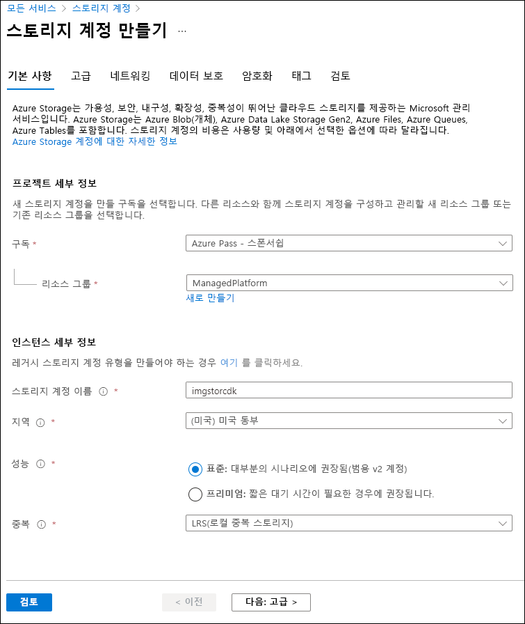
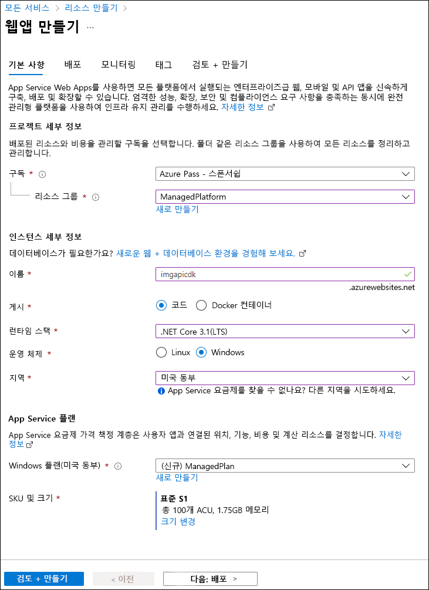
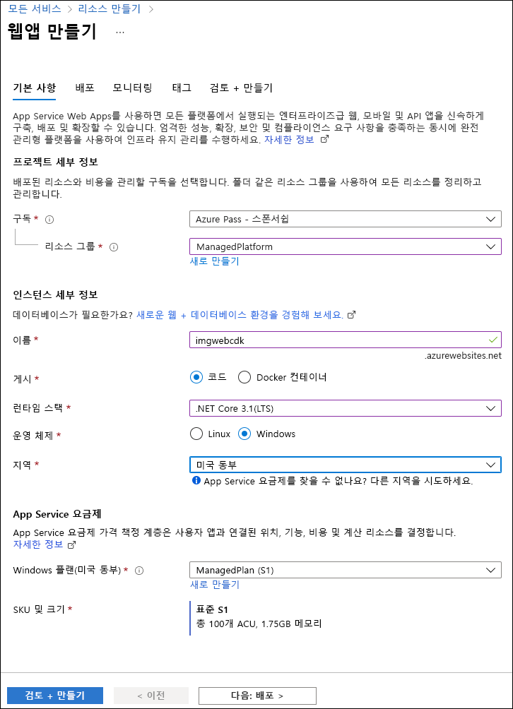

---
lab:
  az204Title: 'Lab 01: Build a web application on Azure platform as a service offerings'
  az204Module: 'Learning Path 01: Implement Azure App Service Web Apps'
---

# 랩 01: Azure Platform as a Service 제품에서 웹 애플리케이션 빌드

## Microsoft Azure 사용자 인터페이스

Microsoft 클라우드 도구의 동적 특성을 고려할 때 이 교육 콘텐츠를 개발한 후 발생하는 Azure UI 변경이 발생할 수 있습니다. 따라서 랩 지침 및 랩 단계가 올바르게 정렬되지 않을 수 있습니다.

Microsoft는 커뮤니티에서 변경해야 할 사항이 있음을 알려줄 때 이 학습 과정을 업데이트합니다. 그러나 클라우드 업데이트가 자주 이루어지기 때문에 이 학습 콘텐츠가 업데이트되기 전에 UI가 변경될 수 있습니다. **이 경우 변경 사항에 적응하고 필요에 따라 랩에서 작업합니다.**

## Instructions

### 시작하기 전에

#### 랩 환경에 로그인

다음 자격 증명을 사용하여 Windows 10 VM(가상 머신)에 로그인합니다.

- 사용자 이름: `Admin`
- 암호: `Pa55w.rd`

> **참고**: 강사가 가상 랩 환경 연결에 대한 지침을 제공합니다.

#### 설치된 애플리케이션 검토

Windows 10 데스크톱에서 작업 표시줄을 찾습니다. 작업 표시줄에는 다음을 포함하여 이 랩에서 사용할 애플리케이션에 대한 아이콘이 포함되어 있습니다.

- Microsoft Edge
- 파일 탐색기
- Windows 터미널
- Visual Studio Code

## 랩 시나리오

이 랩에서는 PaaS 모델을 사용하여 Azure에서 웹 애플리케이션을 만드는 방법을 살펴봅니다. 웹 애플리케이션을 만든 후에는 Apache Kudu zip 배포 옵션을 사용하여 기존 웹 애플리케이션 파일을 업로드하는 방법을 알아봅니다. 그런 다음 새로 배포된 웹 애플리케이션을 보고 테스트합니다.

이 **[비디오 링크](https://youtu.be/EiSEcU9qjfo)** 를 마우스 오른쪽 단추로 클릭하고 ‘새 탭/새 창에서 링크 열기’를 선택하여 이 비디오를 봅니다.


## 아키텍처 다이어그램


### 연습 1: Azure Storage 및 Azure App Service의 Web Apps 기능을 사용하여 백엔드 API 빌드

#### 작업 1: Azure Portal 열기

1. 작업 표시줄에서 **Microsoft Edge** 아이콘을 선택합니다.

1. 브라우저 창에서 Azure Portal(`https://portal.azure.com`)로 이동한 다음, 이 랩에 사용할 계정으로 로그인합니다.

   > **참고**: Azure Portal에 처음 로그인하는 경우 포털 둘러보기가 제공됩니다. 둘러보기를 건너뛰고 Portal 사용을 시작하려면 **나중에**를 선택합니다.

#### 작업 2: Storage 계정 만들기

1. Azure Portal에서 **리소스, 서비스, 문서 검색** 텍스트 상자를 사용하여 **스토리지 계정**을 검색한 다음, 결과 목록에서 **스토리지 계정**을 선택합니다.

1.  **스토리지 계정** 블레이드에서 **+ 만들기**를 선택합니다.

1.  **스토리지 계정 만들기** 블레이드의 **기본 사항** 탭에서 다음 작업을 수행하고 **검토**를 선택합니다.

   | 설정                           | 작업                                                                   |
   | --------------------------------- | ------------------------------------------------------------------------ |
   | **구독** 드롭다운 목록   | 기본값을 유지합니다.                                                 |
   | **리소스 그룹** 섹션        | **새로 만들기**를 선택하고 **ManagedPlatform**을 입력한 다음, **확인**을 선택합니다. |
   | **스토리지 계정 이름** 텍스트 상자 | **imgstor** _[사용자 이름]_ 을 입력합니다.                                            |
   | **지역** 드롭다운 목록         | **(미국) 미국 동부**를 선택합니다.                                                  |
   | **성능** 섹션           | **표준** 옵션을 선택합니다.                                           |
   | **중복도** 드롭다운 목록     | **LRS(로컬 중복 스토리지)** 를 선택합니다.                               |

   다음 스크린샷은 **스토리지 계정 만들기** 블레이드의 **기본 사항** 탭에 구성된 설정을 보여 줍니다.

   

1. **검토** 탭에서 이전 단계 중 선택한 옵션을 검토합니다.

1. 지정된 구성을 사용하여 스토리지 계정을 만들려면 **만들기**를 선택합니다.

   > **참고**: 이 랩을 계속 진행하기 전에 만들기 작업이 완료될 때까지 기다립니다.

1. **개요** 블레이드에서 **리소스로 이동** 단추를 선택하여 새로 만든 스토리지 계정의 블레이드로 이동합니다.

1.  **스토리지 계정** 블레이드의 **보안 + 네트워킹** 섹션에서**액세스 키**를 선택합니다.

1.  **액세스 키** 블레이드에서 **표시** 단추를 사용하여 키 중 하나를 검토한 다음  **연결 문자열**  상자 중 하나의 값을 클립보드에 복사합니다.

   > **참고**: 어떤 연결 문자열을 선택하든 상관없습니다. 서로 교환하여 사용할 수 있습니다.

1. 메모장을 연 다음, 복사한 연결 문자열 값을 메모장에 붙여넣습니다. 나중에 이 랩에서 이 값을 사용하게 됩니다.

#### 작업 3: 샘플 BLOB 업로드

1. **스토리지 계정** 블레이드의 **데이터 스토리지** 섹션에서 **컨테이너** 링크를 선택합니다.

1. **컨테이너** 블레이드에서 **+ 컨테이너**를 선택합니다.

1. **새 컨테이너** 창에서 다음 작업을 수행합니다.

   | 설정                      | 작업                                                               |
   | ---------------------------- | -------------------------------------------------------------------- |
   | **이름** 텍스트 상자            | **images**를 입력합니다.                                                     |
   | **퍼블릭 액세스 수준** 목록 | **프라이빗(익명 액세스 없음)** 를 선택한 다음 **만들기**를 선택합니다. |

1. **컨테이너** 블레이드에서 새로 만든 **이미지** 컨테이너를 선택합니다.

1. **이미지** 블레이드에서 **업로드**를 선택합니다.

1. **Blob 업로드** 창에서 다음 작업을 수행합니다.

   | 설정                                        | 작업                                                                                                                            |
   | ---------------------------------------------- | --------------------------------------------------------------------------------------------------------------------------------- |
   | **파일** 섹션                              | **파일 찾아보기**를 선택하거나 끌어서 놓기 기능을 사용합니다.                                                                      |
   | **파일 탐색기** 창                       | **Allfiles (F):\\Allfiles\\Labs\\01\\Starter\\Images**로 이동하여 **grilledcheese.jpg** 파일을 선택한 다음, **열기**를 선택합니다. |
   | **파일이 이미 있는 경우 덮어쓰기** 확인란 | 확인란이 선택되어 있는지 확인한 다음, **업로드**를 선택합니다.                                                                 |

   > **참고**: 이 랩을 계속하기 전에 Blob이 업로드될 때까지 기다립니다.

#### 작업 4: 웹앱 만들기

1. Azure Portal 탐색 창에서 **리소스 만들기**를 선택합니다.

1. **리소스 만들기** 창의 **검색 서비스 및 마켓플레이스** 텍스트 상자에 **웹앱**을 입력한 다음, Enter 키를 선택합니다.

1. **마켓플레이스** 검색 결과 블레이드에서 **웹앱** 결과를 선택합니다.

1. **웹앱** 블레이드에서 **만들기**를 선택합니다.

1. **웹앱 만들기** 블레이드의 **기본 사항** 탭에서 다음 작업을 수행하고 **모니터링** 탭을 선택합니다.

   | 설정                            | 작업                                                                                                  |
   | ---------------------------------- | ------------------------------------------------------------------------------------------------------- |
   | **구독** 드롭다운 목록    | 기본값을 유지합니다.                                                                                |
   | **리소스 그룹** 섹션         | **ManagedPlatform**을 선택합니다.                                                                              |
   | **이름** 텍스트 상자                  | **imgapi** _[사용자 이름]_ 을 입력합니다.                                                                            |
   | **게시** 섹션                | **코드** 선택                                                                                         |
   | **런타임 스택** 드롭다운 목록   | **.NET 8(LTS 미리 보기)** 을 선택합니다.                                                                                 |
   | **운영 체제** 섹션       | **Windows**를 선택합니다.                                                                                      |
   | **지역** 드롭다운 목록          | **미국 동부** 지역을 선택합니다.                                                                           |
   | **Windows 플랜(미국 동부)** 섹션 | **새로 만들기**를 선택하고, **이름** 텍스트 상자에 **ManagedPlan** 값을 입력한 다음, **확인**을 선택합니다. |
   | **가격 책정 플랜** 섹션           | **표준 S1**을 선택합니다.                                                                                  |

   다음 스크린샷은 **웹앱 만들기** 블레이드에 구성된 설정을 보여 줍니다.

   

1. **모니터링** 탭의 **애플리케이션 인사이트 사용** 섹션에서 **아니요**를 선택한 다음, **검토 + 만들기**를 선택합니다.

1. **검토 + 만들기** 탭에서 이전 단계에서 선택한 옵션을 검토합니다.

1. 지정된 구성을 사용하여 웹앱을 만들려면 **만들기**를 선택합니다.

   > **참고**: 이 랩을 계속 실행하기 전에 웹앱이 만들어질 때까지 기다립니다.

1. **개요** 블레이드에서 **리소스로 이동** 단추를 선택하여 새로 만든 웹앱의 블레이드로 이동합니다.

#### 작업 5: 웹앱 구성

1. **App Service** 블레이드의 **설정** 섹션에서 **구성** 링크를 선택합니다.

1. **구성** 섹션에서 다음 작업을 수행하고 **저장**을 선택한 다음, **계속**을 선택합니다.

   | 설정                                        | 작업                                                                                                                  |
   | ---------------------------------------------- | ----------------------------------------------------------------------------------------------------------------------- |
   | **애플리케이션 설정** 탭                   | **새 애플리케이션 설정** 선택                                                                                      |
   | **애플리케이션 설정 추가/편집** 팝업 대화 상자 | **이름** 텍스트 박스에서 **StorageConnectionString**을 입력합니다.                                                             |
   | **값** 텍스트 상자                             | 이전에 복사한 스토리지 연결 문자열을 메모장에 붙여넣습니다.                                               |
   | **배포 슬롯 설정** 확인란          | 기본값을 유지한 다음, **확인**을 선택하여 팝업 대화 상자를 닫고 **구성** 섹션으로 돌아갑니다. |
      | 최상위 메뉴에서 **저장**을 클릭합니다.           | 방금 입력한 구성 값이 저장됩니다. |

   랩을 계속하기 전에 애플리케이션 설정이 저장되기를 기다립니다.

1. 설정 섹션의 **App Service** 블레이드에서 **속성** 링크를 선택하여 App Services에 대한 자세한 정보를 봅니다.

1. App Service의 URL을 가져오려면 **개요** 링크로 이동하여 **기본 도메인** 섹션에서 값을 복사한 다음 메모장에 붙여넣습니다. 메모장의 도메인 이름 앞에 `https://`를 추가합니다. 이 값은 랩의 뒷부분에서 사용합니다.

   > **참고**: 이 시점에서 이 URL의 웹 서버는 자리 표시자 페이지를 반환합니다. 아직 웹앱에 코드를 배포하지 않았습니다. 이 랩의 뒷부분에서 웹앱에 코드를 배포합니다.

#### 작업 6: 웹앱에 `ASP.NET` 웹 애플리케이션 배포

1. 작업 표시줄에서 **Visual Studio Code** 아이콘을 선택합니다.

1. **파일** 메뉴에서 **폴더 열기**를 선택합니다.

1. **파일 탐색기** 창에서 **Allfiles (F):\\Allfiles\\Labs\\01\\Starter\\API**로 이동하여 **폴더 선택**을 선택합니다.

   > **참고**: 필요한 자산을 빌드 및 디버그에 추가하고 복원 명령을 실행하여 확인되지 않은 종속성을 해결하라는 프롬프트를 모두 무시합니다.

1. **Visual Studio Code** 창의 **탐색기** 창에서  **Controllers** 폴더를 확장하고 **ImagesController.cs** 파일을 선택하여 편집기에서 엽니다.

1. 편집기의 26줄에 있는 **ImagesController** 클래스에서 **GetCloudBlobContainer** 메서드, 그리고 컨테이너 검색에 사용되는 코드를 관찰합니다.

1. **ImagesController** 클래스 36줄에서 **Get** 메서드, 그리고 **images** 컨테이너에서 모든 Blob을 비동기적으로 검색하는데 사용한 코드를 관찰합니다.

1. **ImagesController** 클래스 68줄에서 **Post** 메서드, 그리고 업로드된 이미지를 스토리지에 보관하는 데 사용되는 코드를 관찰합니다.

1. 작업 표시줄에서 **Windows 터미널** 아이콘을 선택합니다.

1. 열린 명령 프롬프트에 다음 명령을 입력하고 Enter 키를 선택하여 Azure CLI(명령줄 인터페이스)에 로그인합니다.

   ```
   az login
   ```

1. **Microsoft Edge** 브라우저 창에서 Microsoft 계정의 메일 주소 및 암호를 입력한 후, **로그인**을 선택합니다.

1. 현재 열려 있는 Windows 터미널 **명령 프롬프트** 창으로 돌아갑니다. 로그인 프로세스가 완료될 때까지 기다립니다.

1. 명령 프롬프트에서 다음 명령을 입력하고 Enter 키를 눌러 **ManagedPlatform** 리소스 그룹의 모든 앱을 나열합니다.

   ```
   az webapp list --resource-group ManagedPlatform
   ```

1. 다음 명령을 입력하고 Enter 키를 눌러 접두사가 **imgapi\*** 인 앱을 찾습니다.

   ```
   az webapp list --resource-group ManagedPlatform --query "[?starts_with(name, 'imgapi')]"
   ```

1. 다음 명령을 입력한 후 Enter 키를 눌러 접두사가 **imgapi\*** 인 단일 앱의 이름만 렌더링합니다.

   ```
   az webapp list --resource-group ManagedPlatform --query "[?starts_with(name, 'imgapi')].{Name:name}" --output tsv
   ```

1. 다음 명령을 입력한 후 Enter 키를 눌러 현재 디렉터리를 랩 파일이 포함된 **Allfiles (F):\\Allfiles\\Labs\\01\\Starter\\API** 디렉터리로 변경합니다.

   ```
   cd F:\Allfiles\Labs\01\Starter\API\
   ```

1. 다음 명령을 입력하고 Enter 키를 눌러 이 랩의 앞부분에서 만든 웹앱에 **api.zip** 파일을 배포합니다.

   ```
   az webapp deployment source config-zip --resource-group ManagedPlatform --src api.zip --name <name-of-your-api-app>
   ```

   > **참고**: _\<name-of-your-api-app\>_ 자리 표시자를 이 랩의 앞부분에서 만든 웹앱의 이름으로 바꿉니다. 최근에 이전 단계에서 이 앱의 이름을 쿼리했습니다.

   이 랩을 계속 진행하기 전에 배포가 완료되기를 기다립니다.

1. Azure Portal의 **탐색** 창에서 **리소스 그룹** 링크를 선택합니다.

1. **리소스 그룹** 블레이드에서 이전에 랩에서 만든 **ManagedPlatform** 리소스 그룹을 선택합니다.

1. **ManagedPlatform** 블레이드에서 이 랩의 앞부분에서 만든 **imgapi** _[사용자 이름]_ 웹앱을 선택합니다.

1. **App Service** 블레이드에서 **찾아보기**를 선택합니다.

   > **참고**: **찾아보기** 명령은 JSON(JavaScript Object Notation) 배열을 반환하는 웹 사이트의 루트에 대한 GET 요청을 수행합니다. 이 배열에는 스토리지 계정에 업로드된 단일 이미지의 URL이 포함되어야 합니다.

1. Azure Portal이 포함된 브라우저 창으로 돌아갑니다.

1. 현재 실행 중인 Visual Studio Code 및 Windows Terminal 애플리케이션을 닫습니다.

#### 검토

이 연습에서는 Azure에서 웹앱을 만든 다음, Azure CLI 및 Apache Kudu zip 파일 배포 유틸리티를 사용하여 `ASP.NET` 웹 애플리케이션을 Web Apps에 배포했습니다.

### 연습 2: Azure Web Apps를 사용하여 프런트 엔드 웹 애플리케이션 빌드

#### 작업 1: 웹앱 만들기

1. Azure Portal **탐색** 창에서 **리소스 만들기**를 선택합니다.

1. **리소스 만들기** 창의 **검색 서비스 및 마켓플레이스** 텍스트 상자에 **웹앱**을 입력한 다음, Enter 키를 선택합니다.

1. **마켓플레이스** 검색 결과 블레이드에서 **Web App**을 선택합니다.

1. **웹앱** 블레이드에서 **만들기**를 선택합니다.

1. **웹앱 만들기** 블레이드의 **기본 사항** 탭에서 다음 작업을 수행하고 **모니터링** 탭을 선택합니다.

   | 설정                            | 작업                        |
   | ---------------------------------- | ----------------------------- |
   | **구독** 드롭다운 목록    | 기본값을 유지합니다.      |
   | **리소스 그룹** 섹션         | **ManagedPlatform**을 선택합니다.    |
   | **이름** 텍스트 상자                  | **imgweb** _[사용자 이름]_ 을 입력합니다.  |
   | **게시** 섹션                | **코드** 선택               |
   | **런타임 스택** 드롭다운 목록   | **.NET 8(LTS)(미리 보기)** 를 선택합니다.       |
   | **운영 체제** 섹션       | **Windows**를 선택합니다.            |
   | **지역** 드롭다운 목록          | **미국 동부** 지역을 선택합니다. |
   | **Windows 플랜(미국 동부)** 섹션 | **ManagedPlan (S1)** 을 선택합니다.   |

다음 스크린샷은 **웹앱 만들기** 블레이드에 구성된 설정을 보여 줍니다.



1. **모니터링** 탭의 **애플리케이션 인사이트 사용** 섹션에서 **아니요**를 선택한 다음, **검토 + 만들기**를 선택합니다.

1. **검토 + 만들기** 탭에서 이전 단계에서 선택한 옵션을 검토합니다.

1. 지정된 구성을 사용하여 웹앱을 만들려면 **만들기**를 선택합니다.

   > **참고**: 이 랩을 계속 진행하기 전에 만들기 작업이 완료될 때까지 기다립니다.

1. **개요** 블레이드에서 **리소스로 이동** 단추를 선택하여 새로 만든 웹앱의 블레이드로 이동합니다.

#### 작업 2: 웹앱 구성

1. **App Service** 블레이드의 **설정** 섹션에서 **구성** 링크를 선택합니다.

1. **구성** 섹션에서 다음 작업을 수행하고 **저장**을 선택한 다음, **계속**을 선택합니다.

   | 설정                                        | 작업                                                                                                                                                                                                     |
   | ---------------------------------------------- | ---------------------------------------------------------------------------------------------------------------------------------------------------------------------------------------------------------- |
   | **애플리케이션 설정** 탭                   | **새 애플리케이션 설정** 선택                                                                                                                                                                         |
   | **애플리케이션 설정 추가/편집** 팝업 대화 상자 | **이름** 텍스트 상자에 **ApiUrl**을 입력합니다.                                                                                                                                                                 |
   | **값** 텍스트 상자                             | 이 랩에서 이전에 복사한 웹앱 URL을 입력합니다. **참고**: 이 애플리케이션 설정의 **값** 텍스트 상자에 복사할 URL에는 **https://** 프로토콜을 포함해야 합니다. |
   | **배포 슬롯 설정** 확인란          | 기본값을 유지한 다음, **확인**을 선택합니다.                                                                                                                                                           |
    | 최상위 메뉴에서 **저장**을 클릭합니다.           | 방금 입력한 구성 값이 저장됩니다. |

   > **참고**: 랩을 계속하기 전에 애플리케이션 설정이 저장되기를 기다립니다.

#### 작업 3: 웹앱에 `ASP.NET` 웹 애플리케이션 배포

1. 작업 표시줄에서 **Visual Studio Code** 아이콘을 선택합니다.

1. **파일** 메뉴에서 **폴더 열기**를 선택합니다.

1. **파일 탐색기** 창에서 **Allfiles (F):\\Allfiles\\Labs\\01\\Starter\\Web**로 이동하여 **폴더 선택**을 선택합니다.

   > **참고**: 필요한 자산을 빌드 및 디버그에 추가하고 복원 명령을 실행하여 확인되지 않은 종속성을 해결하라는 프롬프트를 모두 무시합니다.

1. **Visual Studio Code** 창의 **탐색기** 창에서  **Pages** 폴더를 확장하고 **Index.cshtml.cs** 파일을 선택하여 편집기에서 엽니다.

1. 편집기의 **IndexModel** 클래스 30줄에서 **OnGetAsync** 메서드, 그리고 API에서 이미지 목록을 검색하는 데 사용하는 코드를 관찰합니다.

1. **IndexModel** 클래스의 41행에서 **OnPostAsync** 메서드 및 업로드된 이미지를 백엔드 API로 스트리밍하는 데 사용되는 코드를 관찰합니다.

1. 작업 표시줄에서 **Windows 터미널** 아이콘을 선택합니다.

1. 열린 명령 프롬프트에 다음 명령을 입력한 후 Enter 키를 눌러 Azure CLI에 로그인합니다.

   ```
   az login
   ```

1. **Microsoft Edge** 브라우저 창에서 Microsoft 계정의 메일 주소 및 암호를 입력한 후, **로그인**을 선택합니다.

1. 현재 열려 있는 Windows 터미널 **명령 프롬프트** 창으로 돌아갑니다. 로그인 프로세스가 완료될 때까지 기다립니다.

1. 다음 명령을 입력한 후 Enter 키를 눌러 **ManagedPlatform** 리소스 그룹의 모든 앱을 나열합니다.

   ```
   az webapp list --resource-group ManagedPlatform
   ```

1. 다음 명령을 입력하고 Enter 키를 눌러 접두사가 **imgweb\*** 인 앱을 찾습니다.

   ```
   az webapp list --resource-group ManagedPlatform --query "[?starts_with(name, 'imgweb')]"
   ```

1. 다음 명령을 입력한 후 Enter 키를 눌러 접두사가 **imgweb\*** 인 단일 앱의 이름만 렌더링합니다.

   ```
   az webapp list --resource-group ManagedPlatform --query "[?starts_with(name, 'imgweb')].{Name:name}" --output tsv
   ```

1. 다음 명령을 입력한 후 Enter 키를 눌러 현재 디렉터리를 랩 파일이 포함된 **Allfiles (F):\\Allfiles\\Labs\\01\\Starter\\Web** 디렉터리로 변경합니다.

   ```
   cd F:\Allfiles\Labs\01\Starter\Web\
   ```

1. 다음 명령을 입력하고 Enter 키를 눌러 이 랩의 앞부분에서 만든 웹앱에 **web.zip** 파일을 배포합니다.

   ```
   az webapp deployment source config-zip --resource-group ManagedPlatform --src web.zip --name <name-of-your-web-app>
   ```

   > **참고**: _\<name-of-your-web-app\>_ 자리 표시자를 이 랩의 앞부분에서 만든 웹앱의 이름으로 바꿉니다. 최근에 이전 단계에서 이 앱의 이름을 쿼리했습니다.

   이 랩을 계속 진행하기 전에 배포가 완료되기를 기다립니다.

1. Azure Portal의 **탐색** 창에서 **리소스 그룹**을 선택합니다.

1. **리소스 그룹** 블레이드에서 이전에 랩에서 만든 **ManagedPlatform** 리소스 그룹을 선택합니다.

1. **ManagedPlatform** 블레이드에서 이 랩의 앞부분에서 만든 **imgweb** _[사용자 이름]_ 웹앱을 선택합니다.

1. **웹 서비스** 블레이드에서 **찾아보기**를 선택합니다.

1. 갤러리의 이미지 목록을 관찰합니다. 갤러리에는 랩에서 이전에 스토리지에 업로드된 단일 이미지가 나열되어야 합니다.

1. **Contoso 포토 갤러리** 웹 페이지의 **새 이미지 업로드** 섹션에서 다음 작업을 수행합니다.

   a. **찾아보기**를 선택합니다.

   b. **파일 탐색기** 창에서 **Allfiles (F):\\Allfiles\\Labs\\01\\Starter\\Images**로 이동하여 **banhmi.jpg** 파일을 선택한 다음, **열기**를 선택합니다.

   c. **업로드**를 선택합니다.

1. 갤러리 이미지 목록이 새 이미지로 업데이트되었는지 확인합니다.

   > **참고**: 드문 경우지만 새 이미지를 검색하기 위해 브라우저 창을 새로 고쳐야 할 수 있습니다.

1. Azure Portal이 포함된 브라우저 창으로 돌아갑니다.

1. 현재 실행 중인 Visual Studio Code 및 Windows Terminal 애플리케이션을 닫습니다.

#### 검토

이 연습에서는 Azure 웹앱을 만들고 기존 웹 애플리케이션의 코드를 클라우드의 리소스에 배포했습니다.
