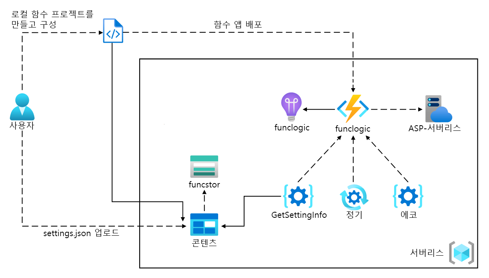
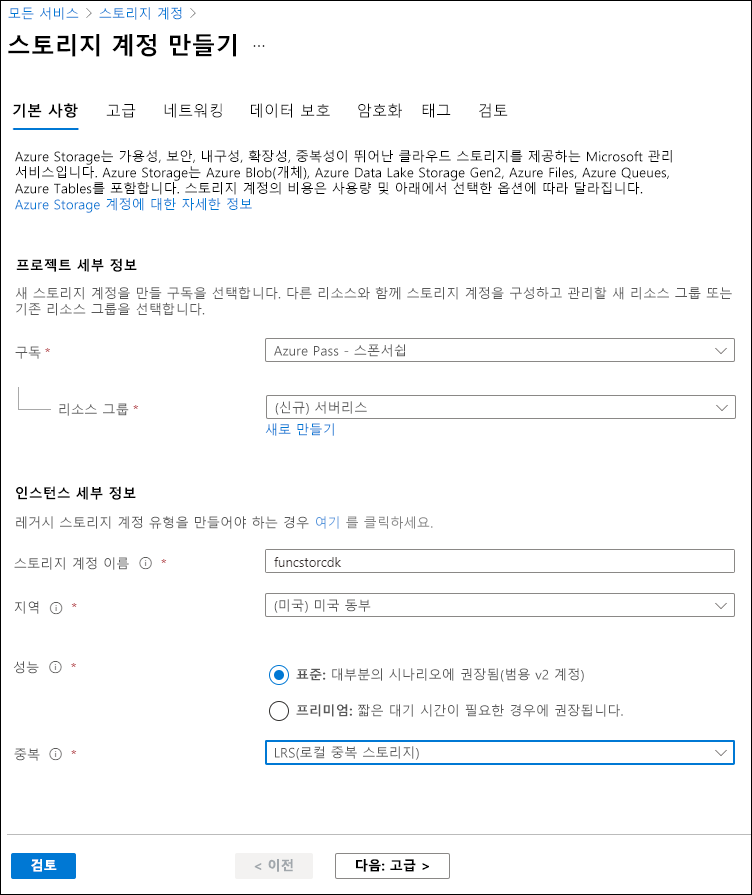

---
lab:
  az204Title: 'Lab 02: Implement task processing logic by using Azure Functions'
  az204Module: 'Learning Path 02: Implement Azure Functions'
---

# 랩 02: Azure Functions를 사용한 작업 처리 논리 구현

## Microsoft Azure 사용자 인터페이스

Microsoft 클라우드 도구의 동적 특성을 고려할 때 이 교육 콘텐츠를 개발한 후 발생하는 Azure UI 변경이 발생할 수 있습니다. 따라서 랩 지침 및 랩 단계가 올바르게 정렬되지 않을 수 있습니다.

Microsoft는 커뮤니티에서 변경해야 할 사항이 있음을 알려줄 때 이 학습 과정을 업데이트합니다. 그러나 클라우드 업데이트가 자주 이루어지기 때문에 이 학습 콘텐츠가 업데이트되기 전에 UI가 변경될 수 있습니다. **이 경우 변경 사항에 적응하고 필요에 따라 랩에서 작업합니다.**

## Instructions

### 시작하기 전에

#### 랩 환경에 로그인

다음 자격 증명을 사용하여 Windows 10 VM(가상 머신)에 로그인합니다.

- 사용자 이름: `Admin`
- 암호: `Pa55w.rd`

> **참고**: 강사가 가상 랩 환경 연결에 대한 지침을 제공합니다.

#### 설치된 애플리케이션 검토

Windows 10 데스크톱에서 작업 표시줄을 찾습니다. 작업 표시줄에는 다음을 포함하여 이 랩에서 사용할 애플리케이션에 대한 아이콘이 포함되어 있습니다.

- Microsoft Edge
- 파일 탐색기
- Windows 터미널
- Visual Studio Code

## 랩 시나리오

이 랩에서는 HTTP POST 명령을 사용하여 함수에 입력되고 전송되는 텍스트를 에코하는 간단한 Azure 함수를 만드는 기능을 보여 줍니다. 이것은 HTTP를 통해 함수를 트리거하는 방법을 보여 줍니다. 

또한 고정된 일정에 따라 실행되도록 설정하여 Azure 함수를 실행하는 방법을 보여 줍니다. 함수는 일정이 트리거될 때마다 로그에 메시지를 씁니다.

마지막으로 Azure 함수가 스토리지 계정과 같은 다른 Azure 리소스에 연결하는 방법을 보여 줍니다. 함수는 사용자가 만든 스토리지 계정에 연결하고 Azure Storage 계정에 저장된 파일의 내용을 반환합니다.

이 **[비디오 링크](https://youtu.be/-3tneDvkYDo)** 를 마우스 오른쪽 단추로 클릭하고 ‘새 탭/새 창에서 링크 열기’를 선택하여 이 비디오를 봅니다.

 

### 아키텍처 다이어그램



### 연습 1: Azure 리소스 만들기

#### 작업 1: Azure Portal 열기

1. 작업 표시줄에서 **Microsoft Edge** 아이콘을 선택합니다.
1. 브라우저 창에서 Azure Portal(`https://portal.azure.com`)로 이동한 다음, 이 랩에 사용할 계정으로 로그인합니다.

    > **참고**: Azure Portal에 처음 로그인하는 경우 포털 둘러보기가 제공됩니다. 둘러보기를 건너뛰고 Portal 사용을 시작하려면 **시작하기**를 선택합니다.

#### 작업 2: Azure Storage 계정 만들기

1. Azure Portal에서 **리소스, 서비스 및 문서 검색** 텍스트 상자를 사용하여 **스토리지 계정**을 검색한 다음, 결과 목록에서 **스토리지 계정**을 선택합니다.

1.  **스토리지 계정** 블레이드에서 **+ 만들기**를 선택합니다.

1. **스토리지 계정 만들기** 블레이드의 **기본 사항** 탭에서 다음 작업을 수행하고 **검토**를 선택합니다.

    | 설정 | 작업 |
    | -- | -- |
    | **구독** 드롭다운 목록 | 기본값을 유지합니다. |
    | **리소스 그룹** 섹션 | **새로 만들기**를 선택하고 **Serverless**를 입력한 다음, **확인**을 선택합니다. |
    | **스토리지 계정 이름** 텍스트 상자 | **funcstor** _[사용자 이름]_ 을 입력합니다. |
    | **지역** 드롭다운 목록 | **(미국) 미국 동부**를 선택합니다. |
    | **성능** 섹션 | **표준** 옵션을 선택합니다. |
    | **중복도** 드롭다운 목록 | **LRS(로컬 중복 스토리지)** 를 선택합니다. |

    다음 스크린샷은 **스토리지 계정 만들기** 창에 구성된 설정을 보여 줍니다.

    

1. **검토** 탭에서 이전 단계 중 선택한 옵션을 검토합니다.

1. 지정된 구성을 사용하여 스토리지 계정을 만들려면 **만들기**를 선택합니다.

    > **참고**: 이 랩을 계속 진행하기 전에 만들기 작업이 완료될 때까지 기다립니다.

1. **개요** 블레이드에서 **리소스로 이동** 단추를 선택하여 새로 만든 스토리지 계정의 블레이드로 이동합니다.

1.  **스토리지 계정** 블레이드의 **보안 + 네트워킹** 섹션에서**액세스 키**를 선택합니다.

1.  **액세스 키** 블레이드에서 **키 표시**를 선택합니다.

1. 키 중 하나를 검토한 다음, **연결 문자열** 상자 중 하나의 값을 클립보드에 복사합니다.

     > **참고**: 어떤 연결 문자열을 선택하든 상관없습니다. 서로 교환하여 사용할 수 있습니다.

1. 메모장을 연 다음, 복사한 연결 문자열 값을 메모장에 붙여넣습니다. 나중에 이 랩에서 이 값을 사용하게 됩니다.

#### 작업 3: 함수 앱 만들기

1. Azure Portal의 탐색 창에서 **리소스 만들기** 링크를 선택합니다.

1. **리소스 만들기** 창의 **검색 서비스 및 마켓플레이스** 텍스트 상자에 **함수**를 입력한 다음, Enter 키를 선택합니다.

1. **마켓플레이스** 검색 결과 창에서 **함수 앱** 결과를 선택합니다.

1. **함수 앱** 블레이드에서 **만들기**를 선택합니다.

1. **함수 앱 만들기** 창의 **기본 사항** 탭에서 다음 작업을 수행하고 **다음: 스토리지**를 선택합니다.

    | 설정 | 작업 |
    | -- | -- |
    | **구독** 드롭다운 목록 | 기본값을 유지합니다. |
    | **리소스 그룹** 섹션 | **서버리스**를 선택합니다. |
    | **함수 앱 이름** 텍스트 상자 | **funclogic** _[사용자 이름]_ 을 입력합니다. |
    | **게시** 섹션 | **코드** 선택 |
    | **런타임 스택** 드롭다운 목록 | **.NET**을 선택합니다. |
    | **버전** 드롭다운 목록 | **8(LTS) 격리됨(미리 보기)** 을 선택합니다. |
    | **지역** 드롭다운 목록 | **미국 동부** 지역을 선택합니다. |
    | **운영 체제** 옵션 | **Linux**를 선택합니다. |
    | **계획 유형** 드롭다운 목록 | **사용량(서버리스)** 을 선택합니다. |

    다음 스크린샷은 **함수 앱 만들기** 창에 구성된 설정을 보여 줍니다.

    

1. **스토리지** 탭에서 다음 작업을 수행하고 **검토 + 만들기**를 선택합니다.

    | 설정 | 작업 |
    | -- | -- |
    | **스토리지 계정** 드롭다운 목록 | **funcstor** _[사용자 이름]_ 스토리지 계정을 선택합니다. |

1. **검토 + 만들기** 탭에서 이전 단계에서 선택한 옵션을 검토합니다.

1. 지정된 구성을 사용하여 함수 앱을 만들려면 **만들기**를 선택합니다.

    > **참고**: 이 랩을 진행하기 전에 만들기 작업이 완료될 때까지 기다립니다.

#### 검토

이 연습에서는 이 랩에서 사용할 모든 리소스를 만들었습니다.

### 연습 2: 로컬 Azure Functions 프로젝트 구성

#### 작업 1: 함수 프로젝트 초기화

1. 작업 표시줄에서 **Windows 터미널** 아이콘을 선택합니다.

1. 다음 명령을 실행하여 현재 디렉터리를 **Allfiles (F):\\Allfiles\\Labs\\02\\Starter\\func** 빈 디렉터리로 변경합니다.

    ```powershell
    cd F:\Allfiles\Labs\02\Starter\func
    ```

    > **참고**: Windows 탐색기에서 **F:\\Allfiles\\Labs\\02\\Starter\\func\\.gitignore** 파일에서 **읽기 전용** 특성을 제거합니다.

1. 다음 명령을 실행하여 **Azure Functions Core Tools**를 사용하여 **dotnet 격리** 런타임을 통해 현재 디렉터리에 새 로컬 Azure Functions 프로젝트를 만듭니다.

    ```powershell
    func init --worker-runtime dotnet-isolated --target-framework net8.0 --force
    ```

    > **참고**: 설명서의 내용을 검토하여 **Azure Functions Core Tools**를 사용한 [새 프로젝트 만들기][azure-functions-core-tools-new-project] 방법을 파악할 수 있습니다.
    
1. **Windows 터미널** 애플리케이션을 엽니다.

#### 작업 2: 연결 문자열 구성

1. **시작** 화면에서 **Visual Studio Code** 타일을 선택합니다.
1. **파일** 메뉴에서 **폴더 열기**를 선택합니다.
1. 열리는 **파일 탐색기** 창에서 **Allfiles (F):\\Allfiles\\Labs\\02\\Starter\\func**을 찾아본 후, **폴더 선택**을 선택합니다.
1. **Visual Studio Code** 창의 **탐색기** 창에서 **local.settings.json** 파일을 엽니다.
1. **AzureWebJobsStorage** 설정의 현재 값을 살펴봅니다.

    ```json
    "AzureWebJobsStorage": "UseDevelopmentStorage=true",
    ```

1. **AzureWebJobsStorage** 요소의 값을 이 랩의 앞부분에서 기록한 스토리지 계정의  **연결 문자열**로 변경합니다.
1. **Local.settings.json** 파일을 저장합니다.

#### 작업 3: 프로젝트 빌드 및 유효성 검사

1. 작업 표시줄에서 **Windows 터미널** 아이콘을 선택합니다.
1. 다음 명령을 실행하여 현재 디렉터리를 **Allfiles (F):\\Allfiles\\Labs\\02\\Starter\\func** 디렉터리로 변경합니다.

    ```powershell
    cd F:\Allfiles\Labs\02\Starter\func
    ```

1. 다음 명령을 실행하여 .NET 프로젝트를 **빌드**합니다.

    ```powershell
    dotnet build
    ```

#### 검토

이 연습에서는 Azure Functions 개발에 사용할 로컬 프로젝트를 만들었습니다.

### 연습 3: HTTP 요청에 의해 트리거되는 함수 만들기

#### 작업 1: HTTP 트리거 함수 만들기

1. 작업 표시줄에서 **Windows 터미널** 아이콘을 선택합니다.
1. 다음 명령을 실행하여 현재 디렉터리를 **Allfiles (F):\\Allfiles\\Labs\\02\\Starter\\func** 디렉터리로 변경합니다.

    ```powershell
    cd F:\Allfiles\Labs\02\Starter\func
    ```

1. 다음 명령을 실행하여 **Azure Functions Core Tools**를 사용하여 **HTTP 트리거** 템플릿으로 **Echo**라는 새 함수를 만듭니다.

    ```powershell
    func new --template "HTTP trigger" --name "Echo"
    ```

    > **참고**: 설명서의 내용을 검토하여 **Azure Functions Core Tools**를 사용한 [새 함수 만들기][azure-functions-core-tools-new-function] 방법을 파악할 수 있습니다.

1. 현재 실행 중인 **Windows 터미널** 애플리케이션을 닫습니다.

#### 작업 2: HTTP 트리거 함수 코드 작성

1. **시작** 화면에서 **Visual Studio Code** 타일을 선택합니다.
1. **파일** 메뉴에서 **폴더 열기**를 선택합니다.
1. 열리는 **파일 탐색기** 창에서 **Allfiles (F):\\Allfiles\\Labs\\02\\Starter\\func**을 찾아본 후, **폴더 선택**을 선택합니다.
1. **Visual Studio Code** 창의 **탐색기** 창에서 **Echo.cs** 파일을 엽니다.

1. **Echo.cs** 파일 내의 모든 내용을 삭제하고 다음 코드를 추가합니다. POST 요청을 받아 요청 본문을 반환하는 "Echo"라는 HTTP 트리거 함수를 정의합니다. ILogger 인터페이스는 정보 로깅에도 사용됩니다. 이 함수는 HTTP 요청 및 응답을 테스트하는 데 사용할 수 있습니다.

    ```csharp
    using System.Net;
    using Microsoft.Azure.Functions.Worker;
    using Microsoft.Azure.Functions.Worker.Http;
    using Microsoft.Extensions.Logging;
    
    namespace func
    {
        public class Echo
        {
            private readonly ILogger _logger;

            public Echo(ILoggerFactory loggerFactory)
            {
                _logger = loggerFactory.CreateLogger<Echo>();
            }

            [Function("Echo")]
            public HttpResponseData Run([HttpTrigger(AuthorizationLevel.Function, "get", "post")] HttpRequestData req)
            {
                _logger.LogInformation("C# HTTP trigger function processed a request.");

                var response = req.CreateResponse(HttpStatusCode.OK);
                response.Headers.Add("Content-Type", "text/plain; charset=utf-8");

                StreamReader reader = new StreamReader(req.Body);
                string requestBody = reader.ReadToEnd();
                response.WriteString(requestBody);

                return response;
            }
        }
    }
    ```

1. **저장**을 선택하여 **Echo.cs** 파일의 변경 내용을 저장합니다.

#### 작업 3: httprepl을 사용하여 HTTP 트리거 함수 테스트

1. 작업 표시줄에서 **Windows 터미널** 아이콘을 선택합니다.
1. 다음 명령을 실행하여 현재 디렉터리를 **Allfiles (F):\\Allfiles\\Labs\\02\\Starter\\func** 디렉터리로 변경합니다.

    ```powershell
    cd F:\Allfiles\Labs\02\Starter\func
    ```

1. 다음 명령을 실행하여 함수 앱 프로젝트를 실행합니다.

    ```powershell
    func start --build
    ```

    > **참고**: 설명서의 내용을 검토하여 **Azure Functions Core Tools**를 사용한 [로컬에서 함수 앱 프로젝트 시작](https://docs.microsoft.com/azure/azure-functions/functions-develop-local) 방법을 파악할 수 있습니다.
    
1. 작업 표시줄에서 **Windows 터미널** 아이콘을 다시 선택하여 **Windows 터미널** 애플리케이션의 새 인스턴스를 엽니다. 

1. 다음 명령을 실행하여 숫자 값 **3**으로 설정된 HTTP 요청 본문을 사용하여 `http://localhost:7071/api/echo`에 대해 **POST** REST API 호출 테스트를 실행합니다.

   ```powershell
   curl -X POST -i http://localhost:7071/api/echo -d 3
   ```

1. 다음 명령을 실행하여 숫자 값 **5**로 설정된 HTTP 요청 본문을 사용하여 `http://localhost:7071/api/echo`에 대해 **POST** REST API 호출을 테스트합니다.

   ```powershell
   curl -X POST -i http://localhost:7071/api/echo -d 5
   ```

1. 다음 명령을 실행하여 HTTP 요청 본문이 문자열 값 **Hello**로 설정된 `http://localhost:7071/api/echo`에 대해 **POST** REST API 호출을 테스트합니다.

   ```powershell
   curl -X POST -i http://localhost:7071/api/echo -d "Hello"
   ```

1. 다음 명령을 실행하여 HTTP 요청 본문이 JSON(JavaScript Object Notation) 값으로 설정된 `http://localhost:7071/api/echo`에 대해 **POST** REST API 호출을 테스트합니다(값: **{"msg": "Successful"}**).

   ```powershell
   curl -X POST -i http://localhost:7071/api/echo -d "{"msg": "Successful"}"
   ```

1. 현재 실행 중인 **Windows 터미널** 애플리케이션의 모든 인스턴스를 닫습니다.

#### 검토

이 연습에서는 HTTP POST 요청을 통해 전송된 콘텐츠를 에코하는 기본 함수를 만들었습니다.

### 연습 4: 일정에 따라 트리거하는 함수 만들기

#### 작업 1: 일정에 따라 트리거되는 함수 만들기

1. 작업 표시줄에서 **Windows 터미널** 아이콘을 선택합니다.
1. 다음 명령을 실행하여 현재 디렉터리를 **Allfiles (F):\\Allfiles\\Labs\\02\\Starter\\func** 디렉터리로 변경합니다.

    ```powershell
    cd F:\Allfiles\Labs\02\Starter\func
    ```

1. 명령 프롬프트에서 다음 명령을 실행하여 **Azure Functions Core Tools**를 사용하여 **타이머 트리거** 템플릿을 통해 **Recurring**이라는 새 함수를 만듭니다.

    ```powershell
    func new --template "Timer trigger" --name "Recurring"
    ```

    > **참고**: 설명서의 내용을 검토하여 **Azure Functions Core Tools**를 사용한 [새 함수 만들기][azure-functions-core-tools-new-function] 방법을 파악할 수 있습니다.
    
1. 현재 실행 중인 **Windows 터미널** 애플리케이션을 닫습니다.

#### 작업 2: 함수 코드 관찰

1. **시작** 화면에서 **Visual Studio Code** 타일을 선택합니다.
1. **파일** 메뉴에서 **폴더 열기**를 선택합니다.
1. 열리는 **파일 탐색기** 창에서 **Allfiles (F):\\Allfiles\\Labs\\02\\Starter\\func**을 찾아본 후, **폴더 선택**을 선택합니다.
1. **Visual Studio Code** 창의 **탐색기** 창에서 **Recurring.cs** 파일을 엽니다.
1. 코드 편집기에서 코드의 구현을 살펴봅니다.

    ```csharp
    using System;
    using Microsoft.Azure.Functions.Worker;
    using Microsoft.Extensions.Logging;

    namespace func
    {
        public class Recurring
        {
            private readonly ILogger _logger;

            public Recurring(ILoggerFactory loggerFactory)
            {
                _logger = loggerFactory.CreateLogger<Recurring>();
            }

            [Function("Recurring")]
            public void Run([TimerTrigger("0 */5 * * * *")] MyInfo myTimer)
            {
                _logger.LogInformation($"C# Timer trigger function executed at: {DateTime.Now}");
                _logger.LogInformation($"Next timer schedule at: {myTimer.ScheduleStatus.Next}");
            }
        }

        public class MyInfo
        {
            public MyScheduleStatus ScheduleStatus { get; set; }
            public bool IsPastDue { get; set; }
        }

        public class MyScheduleStatus
        {
            public DateTime Last { get; set; }
            public DateTime Next { get; set; }
            public DateTime LastUpdated { get; set; }
        }
    }
    ```

1. 17행에서 `"0 */5 * * * *"`를 `"0 */2 * * * *"``로 바꿔 되풀이 빈도 간격을 5분이 아닌 2분으로 설정하고 변경 내용을 저장합니다.

#### 작업 3: 함수 실행 관찰

1. 작업 표시줄에서 **Windows 터미널** 아이콘을 선택합니다.
1. 다음 명령을 실행하여 현재 디렉터리를 **Allfiles (F):\\Allfiles\\Labs\\02\\Starter\\func** 디렉터리로 변경합니다.

    ```powershell
    cd F:\Allfiles\Labs\02\Starter\func
    ```

1. 명령 프롬프트에서 다음 명령을 실행하여 함수 앱 프로젝트를 실행합니다.

    ```powershell
    func start --build
    ```

    > **참고**: 설명서의 내용을 검토하여 **Azure Functions Core Tools**를 사용한 [로컬에서 함수 앱 프로젝트 시작][azure-functions-core-tools-start-function] 방법을 파악할 수 있습니다.
    
1. 2분마다 발생하는 함수 실행을 관찰합니다. 각 함수 실행은 로그에 간단한 메시지를 렌더링해야 합니다.
1. 현재 실행 중인 **Windows 터미널** 애플리케이션을 닫습니다.
1. Visual Studio Code 창을 닫습니다.

#### 검토

이 연습에서는 고정된 일정에 따라 자동으로 실행되는 함수를 만들었습니다.

### 연습5: 다른 서비스와 통합되는 함수 만들기

#### 작업 1: Azure Blob Storage에 샘플 콘텐츠 업로드

1. Azure Portal의 **탐색** 창에서 **리소스 그룹** 링크를 선택합니다.
1. **리소스 그룹** 창에서 이 랩의 앞부분에서 만든 **Serverless** 리소스 그룹을 선택합니다.
1. **Serverless** 창에서 이 랩의 앞부분에서 만든 **funcstor** _[사용자 이름]_ 스토리지 계정을 선택합니다.
1. **스토리지 계정** 블레이드에서 **데이터 스토리지** 섹션에 있는 **컨테이너** 링크를 선택합니다.
1. **컨테이너** 섹션에서 **+ 컨테이너**를 선택합니다.
1. **새 컨테이너** 팝업 창에서 다음 작업을 수행하고 **만들기**를 선택합니다.

    | 설정 | 작업 |
    | -- | -- |
    | **이름** 텍스트 상자  | **content**를 입력합니다. |
    | **공용 액세스 수준** 드롭다운 목록  | **프라이빗(익명 액세스 없음)** 을 선택합니다. |

1. **컨테이너** 섹션으로 돌아가서 최근에 만든 **content** 컨테이너를 선택합니다.
1. **컨테이너** 블레이드에서 **업로드**를 선택합니다.
1. **Blob 업로드** 창에서 다음 작업을 수행한 다음, **업로드**를 선택합니다.

    | 설정 | 작업 |
    | -- | -- |
    | **파일** 섹션  | **파일 찾아보기**를 선택하거나 끌어서 놓기 기능을 사용합니다. |
    | **파일 탐색기** 창  | **Allfiles (F):\\Allfiles\\Labs\\02\\Starter**를 찾아보고 **settings.json** 파일을 선택한 다음 **열기**를 선택합니다. |
    | **파일이 이미 있는 경우 덮어쓰기** 확인란 | 이 확인란이 선택되어 있는지 확인합니다. |

      > **참고**: 이 랩을 계속하기 전에 Blob이 업로드될 때까지 기다립니다.

#### 작업 2: HTTP 트리거 함수 만들기

1. 작업 표시줄에서 **Windows 터미널** 아이콘을 선택합니다.
1. 다음 명령을 실행하여 현재 디렉터리를 **Allfiles (F):\\Allfiles\\Labs\\02\\Starter\\func** 디렉터리로 변경합니다.

    ```powershell
    cd F:\Allfiles\Labs\02\Starter\func
    ```

1. 명령 프롬프트에서 다음 명령을 실행하여 **Azure Functions Core Tools**를 사용하여 **HTTP 트리거** 템플릿을 통해 **GetSettingInfo**라는 새 함수를 만듭니다.

    ```powershell
    func new --template "HTTP trigger" --name "GetSettingInfo"
    ```

    > **참고**: 설명서의 내용을 검토하여 **Azure Functions Core Tools**를 사용한 [새 함수 만들기][azure-functions-core-tools-new-function] 방법을 파악할 수 있습니다.
1. 현재 실행 중인 **Windows 터미널** 애플리케이션을 닫습니다.

#### 작업 3: Blob 입력으로 HTTP 트리거 함수 코드 작성

1. **시작** 화면에서 **Visual Studio Code** 타일을 선택합니다.
1. **파일** 메뉴에서 **폴더 열기**를 선택합니다.
1. 열리는 **파일 탐색기** 창에서 **Allfiles (F):\\Allfiles\\Labs\\02\\Starter\\func**을 찾아본 후, **폴더 선택**을 선택합니다.
1. **Visual Studio Code** 창의 **탐색기** 창에서 **GetSettingInfo.cs** 파일을 엽니다.
1. 17행으로 시작하는 **GetSettingInfo** 함수의 자동 생성 코드 콘텐츠를 다음 코드로 바꿉니다.

    ```csharp
            [Function("GetSettingInfo")]
            public HttpResponseData Run([HttpTrigger(AuthorizationLevel.Function, "get", "post")] HttpRequestData req, 
                [BlobInput("content/settings.json", Connection = "AzureWebJobsStorage")] string blobContent
                )
            {
                _logger.LogInformation("C# HTTP trigger function processed a request.");
                _logger.LogInformation($"{blobContent}");

                var response = req.CreateResponse(HttpStatusCode.OK);
                response.Headers.Add("Content-Type", "text/plain; charset=utf-8");
                response.WriteString($"{blobContent}");

                return response;
            }
    ```

1. 다음 콘텐츠로 구성되어야 하는 결과 코드를 검토합니다(이 코드는 HTTP GET 요청에 대한 응답으로 Azure Blob Storage 컨테이너의 JSON 파일 콘텐츠를 반환함):

    ```csharp
    using System.Net;
    using Microsoft.Azure.Functions.Worker;
    using Microsoft.Azure.Functions.Worker.Http;
    using Microsoft.Extensions.Logging;

    namespace func
    {
        public class GetSettingInfo
        {
            private readonly ILogger _logger;

            public GetSettingInfo(ILoggerFactory loggerFactory)
            {
                _logger = loggerFactory.CreateLogger<GetSettingInfo>();
            }

            [Function("GetSettingInfo")]
            public HttpResponseData Run([HttpTrigger(AuthorizationLevel.Function, "get", "post")] HttpRequestData req,
                [BlobInput("content/settings.json", Connection = "AzureWebJobsStorage")] string blobContent
                )
            {
                _logger.LogInformation("C# HTTP trigger function processed a request.");
                _logger.LogInformation($"{blobContent}");

                var response = req.CreateResponse(HttpStatusCode.OK);
                response.Headers.Add("Content-Type", "text/plain; charset=utf-8");
                response.WriteString($"{blobContent}");

                return response;
            }
        }
    }
    ```

1. **저장**을 선택하여 **Recurring.cs** 파일의 변경 내용을 저장합니다.

#### 작업 4: Azure Storage Blob 확장 등록

1. 작업 표시줄에서 **Windows 터미널** 아이콘을 선택합니다.
1. 다음 명령을 실행하여 현재 디렉터리를 **Allfiles (F):\\Allfiles\\Labs\\02\\Starter\\func** 디렉터리로 변경합니다.

    ```powershell
    cd F:\Allfiles\Labs\02\Starter\func
    ```

1. 명령 프롬프트에서 다음 명령을 실행하여 [Microsoft.Azure.Functions.Worker.Extensions.Storage](https://www.nuget.org/packages/Microsoft.Azure.Functions.Worker.Extensions.Storage/6.2.0) 확장을 등록합니다.

    ```powershell
    dotnet add package Microsoft.Azure.Functions.Worker.Extensions.Storage --version 6.2.0
    ```

1. 다음 명령을 실행하여 .NET 프로젝트를 빌드해 확장이 올바르게 설치되었는지 유효성을 검사합니다.

    ```powershell
    dotnet build
    ```

1. 현재 실행 중인 **Windows 터미널** 애플리케이션의 모든 인스턴스를 닫습니다.

#### 작업 5: curl을 사용하여 함수 테스트

1. 작업 표시줄에서 **Windows 터미널** 아이콘을 선택합니다.
1. 명령 프롬프트에서 다음 명령을 실행하여 함수 앱 프로젝트를 실행합니다.

    ```powershell
    func start --build
    ```

    > **참고**: 설명서의 내용을 검토하여 **Azure Functions Core Tools**를 사용한 [로컬에서 함수 앱 프로젝트 시작][azure-functions-core-tools-start-function] 방법을 파악할 수 있습니다.

1. 작업 표시줄에서 **Windows 터미널** 아이콘을 다시 선택하여 **Windows 터미널** 애플리케이션의 새 인스턴스를 엽니다.
1. 명령 프롬프트에서 다음 명령을 실행하여 `http://localhost:7071/api/GetSettingInfo`에 대한 **GET** REST API 호출을 테스트합니다.

   ```powershell
   curl -X GET -i http://localhost:7071/api/GetSettingInfo
   ```

1. 함수 앱에서 나온 응답의 JSON 콘텐츠를 살펴봅니다. 여기에는 다음이 포함되어야 합니다.

    ```json
    {
        "version": "0.2.4",
        "root": "/usr/libexec/mews_principal/",
        "device": {
            "id": "21e46d2b2b926cba031a23c6919"
        },
        "notifications": {
            "email": "joseph.price@contoso.com",
            "phone": "(425) 555-0162 x4151"
        }
    }
    ```

1. 현재 실행 중인 **Windows 터미널** 애플리케이션의 모든 인스턴스를 닫습니다.

#### 검토

이 연습에서는 저장소에서 JSON 파일의 콘텐츠를 반환하는 함수를 만들었습니다.

### 연습 6: Azure Functions 앱에 로컬 함수 프로젝트 배포

#### 작업 1: Azure Functions Core Tools를 사용하여 배포

1. 작업 표시줄에서 **Windows 터미널** 아이콘을 선택합니다.
1. 다음 명령을 실행하여 현재 디렉터리를 **Allfiles (F):\\Allfiles\\Labs\\02\\Starter\\func** 디렉터리로 변경합니다.

    ```powershell
    cd F:\Allfiles\Labs\02\Starter\func
    ```

1. 명령 프롬프트에서 다음 명령을 실행하여 Azure CLI(명령줄 인터페이스)에 로그인합니다.

    ```powershell
    az login
    ```

1. **Microsoft Edge** 브라우저 창에서 이 랩에서 사용 중인 Microsoft 또는 Azure Active Directory 계정의 이름 및 암호를 입력한 다음, **로그인**을 선택합니다.
1. 현재 열려 있는 **Windows 터미널** 창으로 돌아갑니다. 로그인 프로세스가 완료될 때까지 기다립니다.
1. 명령 프롬프트에서 다음 명령을 실행하여 함수 앱 프로젝트를 게시합니다(`<function-app-name>` 자리 표시자를 이 랩의 앞부분에서 만든 함수 앱의 이름으로 바꿈).

    ```powershell
    func azure functionapp publish <function-app-name>
    ```

    > **참고**: 예를 들어, **함수 앱 이름**이 **funclogicstudent**이면 명령은 ``func azure functionapp publish funclogicstudent``가 됩니다. 설명서의 내용을 검토하여 **Azure Functions Core Tools**를 사용한 [로컬 함수 앱 프로젝트 게시][azure-functions-core-tools-publish-azure] 방법을 파악할 수 있습니다.

1. 랩을 진행하기 전에 배포가 마무리될 때까지 기다립니다.
1. 현재 실행 중인 **Windows 터미널** 애플리케이션을 닫습니다.

#### 작업 2: 배포 유효성 검사

1. 작업 표시줄에서 **Microsoft Edge** 아이콘을 선택하고, Azure Portal이 표시된 탭을 선택합니다.
2. Azure Portal의 **탐색** 창에서 **리소스 그룹** 링크를 선택합니다.
3. **리소스 그룹** 창에서 이 랩의 앞부분에서 만든 **Serverless** 리소스 그룹을 선택합니다.
4. **Serverless** 창에서 이 랩의 앞부분에서 만든 **funclogic** _[사용자 정의]_ 함수 앱을 선택합니다.
5. 함수 앱의 **개요** 블레이드에서 **Functions** 창을 선택합니다.
6. **Functions** 창에서 기존 **GetSettingInfo** 함수를 선택합니다.
7. **함수** 창의 **개발자** 섹션에서 **코드 + 테스트** 옵션을 선택합니다.
8. 함수 편집기에서 **테스트/실행을** 선택합니다.
9. 자동으로 표시되는 창의 **HTTP 메서드** 드롭다운 목록에서 **GET**을 선택합니다.
10. **실행**을 선택하여 함수를 테스트합니다.
11. **HTTP 응답 콘텐츠**에서 테스트 실행 결과를 검토합니다. 이제 JSON 콘텐츠에 다음 코드가 포함되어야 합니다.

    ```json
    {
        "version": "0.2.4",
        "root": "/usr/libexec/mews_principal/",
        "device": {
            "id": "21e46d2b2b926cba031a23c6919"
        },
        "notifications": {
            "email": "joseph.price@contoso.com",
            "phone": "(425) 555-0162 x4151"
        }
    }
    ```

#### 검토

이 연습에서는 Azure Functions에 로컬 함수 프로젝트를 배포했으며 함수가 Azure에서 작동하는지 유효성을 검사했습니다.
