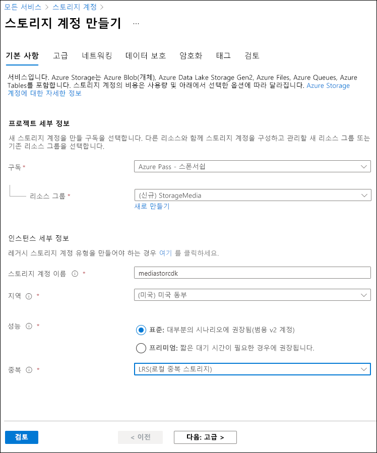

---
lab:
  az204Title: 'Lab 03: Retrieve Azure Storage resources and metadata by using the Azure Storage SDK for .NET'
  az020Title: 'Lab 03: Retrieve Azure Storage resources and metadata by using the Azure Storage SDK for .NET'
  az204Module: 'Module 03: Develop solutions that use blob storage'
  az020Module: 'Module 03: Develop solutions that use blob storage'
---

# <a name="lab-03-retrieve-azure-storage-resources-and-metadata-by-using-the-azure-storage-sdk-for-net"></a>랩 03: .NET용 Azure Storage SDK를 사용하여 Azure Storage 리소스 및 메타데이터 검색

## <a name="microsoft-azure-user-interface"></a>Microsoft Azure 사용자 인터페이스

Microsoft 클라우드 도구의 동적 특성을 감안할 때 이 교육 콘텐츠를 개발한 후 발생하는 Azure UI(사용자 인터페이스) 변경 내용 나타날 수 있습니다. 따라서 랩 지침 및 랩 단계가 올바르게 정렬되지 않을 수 있습니다.

Microsoft는 커뮤니티에서 변경해야 할 사항이 있음을 알려줄 때 이 학습 과정을 업데이트합니다. 그러나 클라우드 업데이트가 자주 이루어지기 때문에 이 학습 콘텐츠가 업데이트되기 전에 UI가 변경될 수 있습니다. **이 경우 변경 사항에 적응하고 필요에 따라 랩에서 작업합니다.**

## <a name="instructions"></a>Instructions

### <a name="before-you-start"></a>시작하기 전에

#### <a name="sign-in-to-the-lab-environment"></a>랩 환경에 로그인

다음 자격 증명을 사용하여 Windows 10 VM(가상 머신)에 로그인합니다.

-   사용자 이름: **Admin**

-   암호: **Pa55w.rd**

> **참고**: 강사가 가상 랩 환경 연결에 대한 지침을 제공합니다.

#### <a name="review-the-installed-applications"></a>설치된 애플리케이션 검토

Windows 10 데스크톱에서 작업 표시줄을 찾습니다. 작업 표시줄에는 다음을 포함하여 이 랩에서 사용할 애플리케이션에 대한 아이콘이 포함되어 있습니다.

-   Microsoft Edge

-   파일 탐색기

## <a name="architecture-diagram"></a>아키텍처 다이어그램


### <a name="exercise-1-create-azure-resources"></a>연습 1: Azure 리소스 만들기

#### <a name="task-1-open-the-azure-portal"></a>작업 1: Azure Portal 열기

1.  작업 표시줄에서 **Microsoft Edge** 아이콘을 선택합니다.

1. 브라우저 창에서 Azure Portal(<https://portal.azure.com>)로 이동한 다음, 이 랩에 사용할 계정으로 로그인합니다.

   > **참고**: Azure Portal에 처음 로그인하는 경우 포털 둘러보기가 제공됩니다. 둘러보기를 건너뛰고 포털 사용을 시작하려면 **시작하기**를 선택합니다.

#### <a name="task-2-create-a-storage-account"></a>작업 2: Storage 계정 만들기

1.  Azure Portal에서 **리소스, 서비스, 문서 검색** 텍스트 상자를 사용하여 **스토리지 계정**을 검색한 다음, 결과 목록에서 **스토리지 계정**을 선택합니다.

1.   **스토리지 계정** 블레이드에서 **+ 만들기**를 선택합니다.

1.  **스토리지 계정 만들기** 블레이드의 **기본 사항** 탭에서 다음 작업을 수행하고 **검토**를 선택합니다.

   | 설정 | 작업 |
   | -- | -- |
   | **구독** 드롭다운 목록 | 기본값을 유지합니다. |
   | **리소스 그룹** 섹션 | **새로 만들기**를 선택하고, **StorageMedia**를 입력한 다음, **확인**을 선택합니다. |
   | **스토리지 계정 이름** 텍스트 상자 | **mediastor** _[사용자 이름]_ 을 입력합니다. |
   | **지역** 드롭다운 목록 | **(미국) 미국 동부**를 선택합니다. |
   | **성능** 섹션 | **표준** 옵션을 선택합니다. |
   | **중복도** 드롭다운 목록 | **LRS(로컬 중복 스토리지)** 를 선택합니다. |

   다음 스크린샷은 **스토리지 계정 만들기 블레이드**에 구성된 설정을 표시합니다.
 
   
   
1.  **검토** 탭에서 이전 단계 중 선택한 옵션을 검토합니다.

1.  지정된 구성을 사용하여 스토리지 계정을 만들려면 **만들기**를 선택합니다.

    > **참고**: 이 랩을 진행하기 전에 만들기 작업이 완료될 때까지 기다립니다.

1.  **리소스로 이동**을 선택합니다.

1.   **스토리지 계정** 블레이드의 **설정** 섹션에서 **엔드포인트** 링크를 선택합니다.

1.  **엔드포인트** 섹션에서 **Blob Service** 텍스트 상자의 값을 클립보드에 복사합니다.

    > **참고**: 이 엔드포인트 값은 랩에서 나중에 사용합니다.

1.  메모장을 연 다음, 복사한 Blob service 값을 메모장에 붙여넣습니다.

1.  **스토리지 계정** 블레이드의 **보안 + 네트워킹** 섹션에서 **액세스 키**를 선택합니다.

1.  **스토리지 계정 이름** 값을 클립보드에 복사한 다음, 메모장에 붙여넣습니다.

1.  **액세스 키** 블레이드에서 **키 표시**를 선택합니다.

1.  키 중 하나를 검토한 다음, **키** 상자 중 하나의 값을 클립보드에 복사합니다.

    > **참고**: 이 랩에서 나중에 이러한 모든 값을 사용합니다.

#### <a name="review"></a>검토

이 연습에서는 랩의 나머지 부분에서 사용할 새 스토리지 계정을 만들었습니다.

### <a name="exercise-2-upload-a-blob-into-a-container"></a>연습 2: 컨테이너에 BLOB 업로드

#### <a name="task-1-create-storage-account-containers"></a>작업 1: 스토리지 계정 컨테이너 만들기

1. **스토리지 계정** 블레이드에서 **데이터 스토리지** 섹션에 있는 **컨테이너** 링크를 선택합니다.

1. **컨테이너** 섹션에서 **+ 컨테이너**를 선택합니다.

1. **새 컨테이너** 팝업 창에서 다음 작업을 수행하고 **만들기**를 선택합니다.

    | 설정 | 작업 |
    | -- | -- |
    | **이름** 텍스트 상자 | **raster-graphics**를 입력합니다. |
    | **공용 액세스 수준** 드롭다운 목록 | **프라이빗(익명 액세스 없음)** 을 선택합니다. |

1. **컨테이너** 섹션에서 **+ 컨테이너**를 선택합니다.

1. **새 컨테이너** 팝업 창에서 다음 작업을 수행한 다음, **만들기**를 선택합니다.

    | 설정 | 작업 |
    | -- | -- |
    | **이름** 텍스트 상자 | **compressed-audio**를 입력합니다. |
    | **공용 액세스 수준** 드롭다운 목록 | **프라이빗(익명 액세스 없음)** 을 선택합니다. |

1. **컨테이너** 섹션에서 업데이트된 컨테이너 목록을 확인합니다.

    다음 스크린샷은 **스토리지 계정 만들기 블레이드**에 구성된 설정을 표시합니다.

    

#### <a name="task-2-upload-a-storage-account-blob"></a>작업 2: 스토리지 계정 BLOB 업로드

1.  **컨테이너** 섹션에서 최근에 만든 **래스터 그래픽** 컨테이너를 선택합니다.

1.  **컨테이너** 블레이드에서 **업로드**를 선택합니다.

1.  **Blob 업로드** 창에서 다음 작업을 수행한 다음, **업로드**를 선택합니다.

   | 설정 | 작업 |
   | -- | -- |
   | **파일** 섹션 | **폴더** 아이콘을 선택합니다. |
   | **파일 탐색기** 창 | **Allfiles (F):\\Allfiles\\Labs\\03\\Starter\\Images**로 이동하고, **graph.jpg** 파일을 선택한 다음, **열기**를 선택합니다. |
   | **파일이 이미 있는 경우 덮어쓰기** 확인란 | 확인란이 선택되어 있는지 확인합니다. |
   
   > **참고**: 이 랩을 계속하기 전에 Blob이 업로드될 때까지 기다립니다.

#### <a name="review"></a>검토

이 연습에서는 스토리지 계정에 자리 표시자 컨테이너를 만든 다음, 컨테이너 중 하나를 Blob으로 채웠습니다.

### <a name="exercise-3-access-containers-by-using-the-net-sdk"></a>연습 3: .NET SDK를 사용하여 컨테이너에 액세스

#### <a name="task-1-create-net-project"></a>작업 1: .NET 프로젝트 만들기

1.  **시작** 화면에서 **Visual Studio Code** 타일을 선택합니다.

1.  **파일** 메뉴에서 **폴더 열기**를 선택하고, **Allfiles (F):\\Allfiles\\Labs\\03\\Starter\\BlobManager**로 이동한 다음, **폴더 선택**을 선택합니다.

1.  **Visual Studio Code** 창의 메뉴 모음에서 **터미널**을 선택한 다음, **새 터미널**을 선택합니다.

1.  터미널에서 다음 명령을 실행하여 현재 폴더에 **BlobManager**라는 새 .NET 프로젝트를 만듭니다.

    ```
    dotnet new console --framework net6.0 --name BlobManager --output .
    ```

    > **참고**: **dotnet new** 명령은 새 **콘솔** 프로젝트를 프로젝트와 이름이 같은 폴더에 만듭니다.

1.  터미널에서 다음 명령을 실행하여 NuGet에서 **Azure.Storage.Blobs** 버전 12.12.0을 가져옵니다.

    ```
    dotnet add package Azure.Storage.Blobs --version 12.12.0
    ```

    > **참고**: **dotnet 패키지 추가** 명령은 NuGet에서 **Azure.Storage.Blobs** 패키지를 추가합니다. 자세한 내용은 [Azure.Storage.Blobs](https://www.nuget.org/packages/Azure.Storage.Blobs/12.12.0)를 참조하세요.

1.  터미널에서 다음 명령을 실행하여 .NET 웹 애플리케이션을 빌드합니다.

    ```
    dotnet build
    ```

1.  **터미널 종료** 또는 **휴지통** 아이콘을 선택하여 현재 열려 있는 터미널 및 관련된 모든 작업을 종료합니다.

#### <a name="task-2-modify-the-program-class-to-access-storage"></a>작업 2: 프로그램 클래스를 수정하여 스토리지에 액세스

1.  **Visual Studio Code** 창의 **탐색기** 창에서 **Program.cs** 파일을 엽니다.

1.   **Program.cs** 파일의 코드 편집기 탭에서 기존 파일의 모든 코드를 삭제합니다.

1.  다음 코드 줄을 추가하여 NuGet에서 가져온 **Azure.Storage.Blobs** 패키지에서 **Azure.Storage**, **Azure.Storage.Blobs**와 **Azure.Storage.Blobs.Models** 네임스페이스를 가져옵니다.

    ```csharp
    using Azure.Storage;
    using Azure.Storage.Blobs;
    using Azure.Storage.Blobs.Models;
    ```
    
1.  다음 코드 줄을 추가하여 이 파일에 사용할 기본 제공 네임스페이스에 대해 **using** 지시문을 추가합니다.

    ```csharp
    using System;
    using System.Threading.Tasks;
    ```

1.  다음 코드를 입력하여 새 **Program** 클래스를 만듭니다.

    ```csharp
    public class Program
    {
    }
    ```

1.  **Program** 클래스 내에서 다음 코드 줄을 입력하여 **blobServiceEndpoint**라는 새 문자열 상수를 만듭니다.

    ```csharp
    private const string blobServiceEndpoint = "";
    ```

1.  이전에 이 랩에서 기록한 스토리지 계정의 **기본 Blob Service 엔드포인트**로 값을 설정하여 **blobServiceEndpoint** 문자열 상수를 업데이트합니다.

1.  **Program** 클래스 내에서 다음 코드 줄을 입력하여 **storageAccountName**이라는 새 문자열 상수를 만듭니다.

    ```csharp
    private const string storageAccountName = "";
    ```

1.  이전에 이 랩에서 기록한 스토리지 계정의 **스토리지 계정 이름**으로 값을 설정하여 **storageAccountName** 문자열 상수를 업데이트합니다.

1.  **Program** 클래스에서 다음 코드 줄을 입력하여 **storageAccountKey**이라는 새 문자열 상수를 만듭니다.

    ```csharp
    private const string storageAccountKey = "";
    ```

1.  이전에 이 랩에서 기록한 스토리지 계정의 **키**로 값을 설정하여 **storageAccountKey** 문자열 상수를 업데이트합니다.

1.  **Program** 클래스에서 다음 코드 줄을 입력하여 새 비동기 **Main** 메서드를 만듭니다.

    ```csharp
    public static async Task Main(string[] args)
    {
    }
    ```

1.  **Program.cs** 파일을 검토합니다. 이제 여기에는 다음이 포함되어야 합니다.

    ```csharp
    using Azure.Storage;
    using Azure.Storage.Blobs;
    using Azure.Storage.Blobs.Models;
    using System;
    using System.Threading.Tasks;    
    public class Program
    {
        private const string blobServiceEndpoint = "<primary-blob-service-endpoint>";
        private const string storageAccountName = "<storage-account-name>";
        private const string storageAccountKey = "<key>";    
        public static async Task Main(string[] args)
        {
        }
    }
    ```

#### <a name="task-3-connect-to-the-azure-storage-blob-service-endpoint"></a>작업 3: Azure Storage Blob 서비스 엔드포인트에 연결

1.  **Main** 메서드에서 다음 코드 줄을 추가하여 **storageAccountName** 및 **storageAccountKey** 상수를 생성자 매개 변수로 사용하여 **StorageSharedKeyCredential** 자격 증명 클래스의 새 인스턴스를 만듭니다.

    ```csharp
    StorageSharedKeyCredential accountCredentials = new StorageSharedKeyCredential(storageAccountName, storageAccountKey);
    ```

1.  **Main** 메서드에서 다음 코드 줄을 추가하여 **BlobServiceEndpoint** 상수 및 *accountCredentials* 변수를 생성자 매개 변수로 사용하여 **BlobServiceClient** 클래스의 새 인스턴스를 만듭니다.

    ```csharp
    BlobServiceClient serviceClient = new BlobServiceClient(new Uri(blobServiceEndpoint), accountCredentials);
    ```

1.  **Main** 메서드에서 다음 코드 줄을 추가하여 **BlobServiceClient** 클래스의 **GetAccountInfoAsync**메서드를 호출하여 서비스에서 계정 메타데이터를 검색합니다.

    ```csharp
    AccountInfo info = await serviceClient.GetAccountInfoAsync();
    ```
    
1.  **Main** 메서드 내에서 다음 코드 줄을 추가하여 콘솔에 소개 메시지를 렌더링합니다.

    ```csharp
    await Console.Out.WriteLineAsync($"Connected to Azure Storage Account");
    ```
    
1.  **Main** 메서드 내에서 다음 코드 줄을 추가하여 스토리지 계정 이름을 렌더링합니다.

    ```csharp
    await Console.Out.WriteLineAsync($"Account name:\t{storageAccountName}");
    ```
    
1.  **Main** 메서드 내에서 다음 코드 줄을 추가하여 스토리지 계정 형식을 렌더링합니다:

    ```csharp
    await Console.Out.WriteLineAsync($"Account kind:\t{info?.AccountKind}");
    ```
    
1.  **Main**메서드에서 다음 코드 줄을 추가하여 스토리지 계정에 대해 현재 선택된 SKU(Stock Keeping Unit)를 렌더링합니다.

    ```csharp
    await Console.Out.WriteLineAsync($"Account sku:\t{info?.SkuName}");
    ```

1.  **Main** 메서드를 검토합니다. 이제 메서드에 다음 코드가 포함되어 있어야 합니다.

    ```csharp
    public static async Task Main(string[] args)
    {
        StorageSharedKeyCredential accountCredentials = new StorageSharedKeyCredential(storageAccountName, storageAccountKey);
        BlobServiceClient serviceClient = new BlobServiceClient(new Uri(blobServiceEndpoint), accountCredentials);
        AccountInfo info = await serviceClient.GetAccountInfoAsync();
        await Console.Out.WriteLineAsync($"Connected to Azure Storage Account");
        await Console.Out.WriteLineAsync($"Account name:\t{storageAccountName}");
        await Console.Out.WriteLineAsync($"Account kind:\t{info?.AccountKind}");
        await Console.Out.WriteLineAsync($"Account sku:\t{info?.SkuName}");
    }
    ```

1.   **Program.cs** 파일을 저장합니다.

1.  **Visual Studio Code** 창의 메뉴 모음에서 **터미널**을 선택한 다음, **새 터미널**을 선택합니다.

1.  터미널에서 다음 명령을 실행하여 .NET 웹 애플리케이션을 실행합니다.

    ```
    dotnet run
    ```

    > **참고**: 빌드 오류가 있는 경우 **Program.cs** file in the **Allfiles (F):\\Allfiles\\Labs\\03\\Solution\\BlobManager** 폴더를 검토합니다.

1.  현재 실행 중인 콘솔 애플리케이션의 출력을 살펴봅니다. 출력에는 서비스에서 검색된 스토리지 계정에 대한 메타데이터가 포함되어 있습니다.

1.  **터미널 종료** 또는 **휴지통** 아이콘을 선택하여 현재 열려 있는 터미널 및 관련된 모든 작업을 종료합니다.

#### <a name="task-4-enumerate-the-existing-containers"></a>작업 4: 기존 컨테이너 열거

1.  **Program** 클래스에서 다음 코드를 입력하여 비동기이고 단일 **BlobServiceClient** 매개 변수 유형이 있는 **EnumerateContainersAsync**라는 새 **프라이빗 정적** 메서드를 만듭니다.

    ```csharp
    private static async Task EnumerateContainersAsync(BlobServiceClient client)
    {        
    }
    ```

1.  **EnumerateContainersAsyn** 메서드에서 다음 코드를 입력하여 **BlobServiceClient** 클래스의 **GetBlobContainersAsync** 메서드 호출 결과를 반복하는 비동기 **foreach** 루프를 만듭니다.

    ```csharp
    await foreach (BlobContainerItem container in client.GetBlobContainersAsync())
    {
    }
    ```

1.  **foreach** 루프 내에서 다음 코드를 입력하여 각 컨테이너의 이름을 인쇄합니다.

    ```csharp
    await Console.Out.WriteLineAsync($"Container:\t{container.Name}");
    ```

1.  **EnumerateContainersAsync** 메서드를 검토합니다. 이제 여기에는 다음이 포함되어야 합니다.

    ```csharp
    private static async Task EnumerateContainersAsync(BlobServiceClient client)
    {        
        await foreach (BlobContainerItem container in client.GetBlobContainersAsync())
        {
            await Console.Out.WriteLineAsync($"Container:\t{container.Name}");
        }
    }
    ```

1.  **Main** 메서드에서 다음 코드를 입력하여 **EnumerateContainersAsync** 메서드를 호출하고 *serviceClient* 변수를 매개 변수로 전달합니다.

    ```csharp
    await EnumerateContainersAsync(serviceClient);
    ```

1.  **Program.cs** 파일을 살펴봅니다. 이제 파일에 다음 코드가 포함되어 있어야 합니다.
    ```csharp
    using Azure.Storage;
    using Azure.Storage.Blobs;
    using Azure.Storage.Blobs.Models;
    using System;
    using System.Threading.Tasks;
    
    public class Program
    {
        private const string blobServiceEndpoint = "your blobServiceEndpoint";
        private const string storageAccountName = "your storageAccountName";
        private const string storageAccountKey = "your storageAccountKey";    
        public static async Task Main(string[] args)
        {
            StorageSharedKeyCredential accountCredentials = new StorageSharedKeyCredential(storageAccountName, storageAccountKey);
            BlobServiceClient serviceClient = new     BlobServiceClient(new Uri(blobServiceEndpoint), accountCredentials);
            AccountInfo info = await serviceClient.GetAccountInfoAsync();
            await Console.Out.WriteLineAsync($"Connected to Azure Storage Account");
            await Console.Out.WriteLineAsync($"Account name:\t{storageAccountName}");
            await Console.Out.WriteLineAsync($"Account kind:\t{info?.AccountKind}");
            await Console.Out.WriteLineAsync($"Account sku:\t{info?.SkuName}");
            await EnumerateContainersAsync(serviceClient);
        }        
        private static async Task EnumerateContainersAsync(BlobServiceClient client)
        {        
            await foreach (BlobContainerItem container in client.GetBlobContainersAsync())
            {
                await Console.Out.WriteLineAsync($"Container:\t{container.Name}");
            }
    }
    }
    ```

1.   **Program.cs** 파일을 저장합니다.

1.  **Visual Studio Code** 창의 메뉴 모음에서 **터미널**을 선택한 다음, **새 터미널**을 선택합니다.

1.  터미널에서 다음 명령을 실행하여 .NET 웹 애플리케이션을 실행합니다.

    ```
    dotnet run
    ```

    > **참고**: 빌드 오류가 있는 경우 **Program.cs** file in the **Allfiles (F):\\Allfiles\\Labs\\03\\Solution\\BlobManager** 폴더를 검토합니다.

1.  현재 실행 중인 콘솔 애플리케이션의 출력을 살펴봅니다. 업데이트된 출력에는 계정의 모든 기존 컨테이너 목록이 포함됩니다.

1.  **터미널 종료** 또는 **휴지통** 아이콘을 선택하여 현재 열려 있는 터미널 및 관련된 모든 작업을 종료합니다.

#### <a name="review"></a>검토

이 연습에서는 Azure Storage SDK를 사용하여 기존 컨테이너에 액세스했습니다.

### <a name="exercise-4-retrieve-blob-uniform-resource-identifiers-uris-by-using-the-net-sdk"></a>연습 4: .NET SDK를 사용하여 BLOB URI(Uniform Resource Identifier)를 검색합니다.

#### <a name="task-1-enumerate-the-blobs-in-an-existing-container-by-using-the-sdk"></a>작업 1: SDK를 사용하여 기존 컨테이너의 Blob을 열거합니다.

1.  **Program** 클래스에서 다음 코드를 입력하여 비동기이며 **BlobServiceClient**와 **문자열**이라는 두 개의 매개 변수 유형이 있는 **EnumerateBlobsAsync**라는 새 **개인 정적** 메서드를 만듭니다.

    ```csharp
    private static async Task EnumerateBlobsAsync(BlobServiceClient client, string containerName)
    {      
    }
    ```

1.  **EnumerateBlobsAsync** 메서드에서 다음 코드를 입력하여 **BlobServiceClient** 클래스의 **GetBlobContainerClient** 메서드를 사용해 **BlobContainerClient** 클래스의 새 인스턴스를 가져옵니다. 인스턴스를 가져오기 위해 전달하는 매개 변수는 **containerName**입니다.

    ```csharp
    BlobContainerClient container = client.GetBlobContainerClient(containerName);
    ```

1.  **EnumerateBlobsAsync** 메서드에서 다음 코드를 입력하여 열거될 컨테이너의 이름을 렌더링합니다.

    ```csharp
    await Console.Out.WriteLineAsync($"Searching:\t{container.Name}");
    ```

1.  **EnumerateBlobsAsync** 메서드에서 다음 코드를 입력하여 **BlobContainerClient**클래스의 **GetBlobsAsync** 메서드 호출 결과를 반복하는 비동기 **foreach** 루프를 만듭니다.

    ```csharp
    await foreach (BlobItem blob in container.GetBlobsAsync())
    {        
    }
    ```

1.  **foreach** 루프 내에서 다음 코드를 입력하여 각 Blob의 이름을 인쇄합니다.

    ```csharp
     await Console.Out.WriteLineAsync($"Existing Blob:\t{blob.Name}");
    ```

1.  **EnumerateBlobsAsync** 메서드를 검토합니다. 이제 여기에는 다음이 포함되어야 합니다.

    ```csharp
    private static async Task EnumerateBlobsAsync(BlobServiceClient client, string containerName)
    {      
        BlobContainerClient container = client.GetBlobContainerClient(containerName);
        await Console.Out.WriteLineAsync($"Searching:\t{container.Name}");
        await foreach (BlobItem blob in container.GetBlobsAsync())
        {        
             await Console.Out.WriteLineAsync($"Existing Blob:\t{blob.Name}");
        }
    }
    ```

1.  **Main** 메서드에서 메서드 끝에 다음 코드를 입력하여 **래스터 그래픽** 값을 가진 *existingContainerName*이라는 변수를 만듭니다.

    ```csharp
    string existingContainerName = "raster-graphics";
    ```

1.  **기본** 메서드에서 다음 코드를 입력하여 **EnumerateBlobsAsync**메서드를 호출하여 *serviceClient* 및 *existingContainerName*변수를 매개 변수로 전달합니다.

    ```csharp
    await EnumerateBlobsAsync(serviceClient, existingContainerName);
    ```

1.  **Program.cs** 파일을 살펴봅니다. 이제 파일에 다음 코드가 포함되어 있어야 합니다.
    ```csharp
    using Azure.Storage;
    using Azure.Storage.Blobs;
    using Azure.Storage.Blobs.Models;
    using System;
    using System.Threading.Tasks;    
    public class Program
    {
        private const string blobServiceEndpoint = "your blobServiceEndpoint";
        private const string storageAccountName = "your storageAccountName";
        private const string storageAccountKey = "your storageAccountKey";    
        public static async Task Main(string[] args)
        {
            StorageSharedKeyCredential accountCredentials = new StorageSharedKeyCredential(storageAccountName, storageAccountKey);
            BlobServiceClient serviceClient = new   BlobServiceClient(new Uri(blobServiceEndpoint), accountCredentials);
            AccountInfo info = await serviceClient.GetAccountInfoAsync();
            await Console.Out.WriteLineAsync($"Connected to Azure Storage Account");
            await Console.Out.WriteLineAsync($"Account name:\t{storageAccountName}");
            await Console.Out.WriteLineAsync($"Account kind:\t{info?.AccountKind}");
            await Console.Out.WriteLineAsync($"Account sku:\t{info?.SkuName}");
            await EnumerateContainersAsync(serviceClient);
            string existingContainerName = "raster-graphics";
            await EnumerateBlobsAsync(serviceClient, existingContainerName);
        }        
        private static async Task EnumerateContainersAsync(BlobServiceClient client)
        {        
            await foreach (BlobContainerItem container in client.GetBlobContainersAsync())
            {
                await Console.Out.WriteLineAsync($"Container:\t{container.Name}");
            }
        }        
        private static async Task EnumerateBlobsAsync(BlobServiceClient client, string containerName)
        {      
            BlobContainerClient container = client.GetBlobContainerClient(containerName);await Console.Out.WriteLineAsync($"Searching:\t{container.Name}");
            await foreach (BlobItem blob in container.GetBlobsAsync())
            {        
                await Console.Out.WriteLineAsync($"Existing Blob:\t{blob.Name}");
            }
        }
    }
    ```

1.   **Program.cs** 파일을 저장합니다.

1.  **Visual Studio Code** 창의 메뉴 모음에서 **터미널**을 선택한 다음, **새 터미널**을 선택합니다.

1.  터미널에서 다음 명령을 실행하여 .NET 웹 애플리케이션을 실행합니다.

    ```
    dotnet run
    ```

    > **참고**: 빌드 오류가 있는 경우 **Program.cs** file in the **Allfiles (F):\\Allfiles\\Labs\\03\\Solution\\BlobManager** 폴더를 검토합니다.

1.  현재 실행 중인 콘솔 애플리케이션의 출력을 검토합니다. 업데이트된 출력에는 기존 컨테이너 및 BLOB에 대한 메타데이터가 포함됩니다.

1.  **터미널 종료** 또는 **휴지통** 아이콘을 선택하여 현재 열려 있는 터미널 및 관련된 모든 작업을 종료합니다.

#### <a name="task-2-create-a-new-container-by-using-the-sdk"></a>작업 2: SDK를 사용하여 새 컨테이너 만들기

1.  **Program** 클래스에서 다음 코드를 입력하여 비동기인 **BlobServiceClient** 및 **string**이라는 두 개의 매개 변수 유형이 있는 **GetContainerAsync**라는 새 **private static** 메서드를 만듭니다:

    ```csharp
    private static async Task<BlobContainerClient> GetContainerAsync(BlobServiceClient client, string containerName)
    {      
    }
    ```

1.  **GetContainerAsync** 메서드에서 다음 코드를 입력하여 **BlobServiceClient**클래스의 **GetBlobContainerClient** 메서드를 사용하여 **BlobContainerClient** 클래스의 새 인스턴스를**containerName** 매개 변수에 전달합니다.

    ```csharp
    BlobContainerClient container = client.GetBlobContainerClient(containerName);
    ```

1.  **GetContainerAsync** 메서드에서 다음 코드를 입력하여 **BlobContainerClient** 클래스의 **CreateIfNotExistsAsync** 메서드를 호출합니다.

    ```csharp
    await container.CreateIfNotExistsAsync(PublicAccessType.Blob);
    ```

1.  **GetContainerAsync** 메서드에서 다음 코드를 입력하여 잠재적으로 만들어진 컨테이너의 이름을 렌더링합니다.

    ```csharp
    await Console.Out.WriteLineAsync($"New Container:\t{container.Name}");
    ```

1.  **GetContainerAsync** 메서드에서 다음 코드를 입력하여 **GetContainerAsync** 메서드의 결과로 **컨테이너**라는 **BlobContainerClient ** 클래스의 인스턴스를 반환합니다.

    ```csharp
    return container;
    ```

1.  **GetContainerAsync** 메서드를 검토합니다. 이제 여기에는 다음이 포함되어야 합니다.

    ```csharp
    private static async Task<BlobContainerClient> GetContainerAsync(BlobServiceClient client, string containerName)
    {      
        BlobContainerClient container = client.GetBlobContainerClient(containerName);
        await container.CreateIfNotExistsAsync(PublicAccessType.Blob);
        await Console.Out.WriteLineAsync($"New Container:\t{container.Name}");        
        return container;
    }
    ```

1.  **기본** 메서드에서 메서드 끝에 다음 코드를 입력하여 *벡터 그래픽 *값을 가진 **newContainerName**이라는 변수를 만듭니다.

    ```csharp
    string newContainerName = "vector-graphics";
    ```

1.  **Main** 메서드의 끝에 다음 코드를 입력하여 **GetContainerAsync** 메서드를 호출하고, *serviceClient* 및 *newContainerName* 변수를 매개 변수로 전달하고, **BlobContainerClient** 형식의 *containerClient*라는 변수에 결과를 저장합니다.

    ```csharp
    BlobContainerClient containerClient = await GetContainerAsync(serviceClient, newContainerName);
    ```

1.  **Program.cs** 파일을 검토합니다. 이제 여기에는 다음이 포함되어야 합니다.
    ```csharp
    using Azure.Storage;
    using Azure.Storage.Blobs;
    using Azure.Storage.Blobs.Models;
    using System;
    using System.Threading.Tasks;    
    public class Program
    {
        private const string blobServiceEndpoint = "your blobServiceEndpoint";
        private const string storageAccountName = "your storageAccountName";
        private const string storageAccountKey = "your storageAccountKey";
        public static async Task Main(string[] args)
        {
            StorageSharedKeyCredential accountCredentials = new StorageSharedKeyCredential(storageAccountName, storageAccountKey);
            BlobServiceClient serviceClient = new BlobServiceClient(new Uri(blobServiceEndpoint), accountCredentials);
            AccountInfo info = await serviceClient.GetAccountInfoAsync();
            await Console.Out.WriteLineAsync($"Connected to Azure Storage Account");
            await Console.Out.WriteLineAsync($"Account name:\t{storageAccountName}");
            await Console.Out.WriteLineAsync($"Account kind:\t{info?.AccountKind}");
            await Console.Out.WriteLineAsync($"Account sku:\t{info?.SkuName}");
            await EnumerateContainersAsync(serviceClient);
            string existingContainerName = "raster-graphics";
            await EnumerateBlobsAsync(serviceClient, existingContainerName);
            string newContainerName = "vector-graphics";
            BlobContainerClient containerClient = await GetContainerAsync(serviceClient, newContainerName);
        }        
        private static async Task EnumerateContainersAsync(BlobServiceClient client)
        {        
            await foreach (BlobContainerItem container in client.GetBlobContainersAsync())
            {
                await Console.Out.WriteLineAsync($"Container:\t{container.Name}");
            }
        }        
        private static async Task EnumerateBlobsAsync(BlobServiceClient client, string containerName)
        {      
            BlobContainerClient container = client.GetBlobContainerClient(containerName);await Console.Out.WriteLineAsync($"Searching:\t{container.Name}");
            await foreach (BlobItem blob in container.GetBlobsAsync())
            {        
                await Console.Out.WriteLineAsync($"Existing Blob:\t{blob.Name}");
            }
        }        
        private static async Task<BlobContainerClient> GetContainerAsync(BlobServiceClient client, string containerName)
        {      
            BlobContainerClient container = client.GetBlobContainerClient(containerName);
            await container.CreateIfNotExistsAsync(PublicAccessType.Blob);
            await Console.Out.WriteLineAsync($"New Container:\t{container.Name}");
            return container;
        }
    }
    ```

1.   **Program.cs** 파일을 저장합니다.

1.  **Visual Studio Code** 창의 메뉴 모음에서 **터미널**을 선택한 다음, **새 터미널**을 선택합니다.

1.  터미널에서 다음 명령을 실행하여 .NET 웹 애플리케이션을 실행합니다.

    ```
    dotnet run
    ```

    > **참고**: 빌드 오류가 있는 경우 **Program.cs** file in the **Allfiles (F):\\Allfiles\\Labs\\03\\Solution\\BlobManager** 폴더를 검토합니다.

1.  현재 실행 중인 콘솔 애플리케이션의 출력을 살펴봅니다. 업데이트된 출력에는 기존 컨테이너 및 BLOB에 대한 메타데이터가 포함됩니다.

1.  **터미널 종료** 또는 **휴지통** 아이콘을 선택하여 현재 열려 있는 터미널 및 관련된 모든 작업을 종료합니다.

#### <a name="task-3-upload-a-new-blob-by-using-the-portal"></a>작업 3: 포털을 사용하여 새 Blob 업로드하기

1.  Azure Portal의 **탐색** 창에서 **리소스 그룹** 링크를 선택합니다.

1.  **리소스 그룹** 블레이드에서 이전에 이 랩에서 만든 **StorageMedia** 리소스 그룹을 선택합니다.

1.  **StorageMedia** 블레이드에서 이전에 이 랩에서 만든 **mediastor** _[yourname]_ 스토리지 계정을 선택합니다.

1.  **스토리지 계정** 블레이드에서 **데이터 스토리지** 섹션에 있는 **컨테이너** 링크를 선택합니다.

1.  **컨테이너** 섹션에서 새로 만든 **벡터 그래픽** 컨테이너를 선택합니다. 새 컨테이너를 확인하려면 페이지를 새로 고쳐야 할 수 있습니다.

1.  **컨테이너** 블레이드에서 **업로드**를 선택합니다.

1.  **Blob 업로드** 창에서 다음 작업을 수행한 다음, **업로드**를 선택합니다.

    | 설정 | 작업 |
    | -- | -- |
    | **파일** 섹션   **폴더** 아이콘을 선택합니다. |
    | **파일 탐색기** 창 |  **Allfiles (F):\\Allfiles\\Labs\\03\\Starter\\Images**로 이동하고, **graph.svg** 파일을 선택한 다음, **열기**를 선택합니다. |
    | **파일이 이미 있는 경우 덮어쓰기** 확인란 | 확인란이 선택되어 있는지 확인합니다. |

    > **참고**: 이 랩을 계속하기 전에 Blob이 업로드될 때까지 기다립니다.

#### <a name="task-4-access-blob-uri-by-using-the-sdk"></a>작업 4: SDK를 사용하여 Blob URI에 액세스

1.  **Visual Studio Code** 창으로 전환합니다.

1.  **Program** 클래스에서 다음 코드를 입력하여 비동기이며 **BlobContainerClient** 및 **문자열**이라는 두 개의 매개 변수 유형이 있는 **GetBlobAsync**라는 새 **개인 정적** 메서드를 만듭니다.

    ```csharp
    private static async Task<BlobClient> GetBlobAsync(BlobContainerClient client, string blobName)
    {      
    }
    ```

1.  **GetBlobAsync** 메서드에서 다음 코드를 입력하여 **BlobContainerClient** 클래스의 **GetBlobClient** 메서드를 통해 **BlobClient** 클래스의 새 인스턴스를 가져오고 **blobName** 매개 변수를 전달합니다.

    ```csharp
    BlobClient blob = client.GetBlobClient(blobName);
    ```

1.  **GetBlobAsync** 메서드에서 참조된 Blob의 이름을 렌더링하려면 다음 코드를 입력합니다.

    ```csharp
    await Console.Out.WriteLineAsync($"Blob Found:\t{blob.Name}");
    ```

1.  **GetBlobAsync** 메서드에서 다음 코드를 입력하여 **GetBlobAsync** 메서드의 결과로 **Blob**이라는 **BlobClient** 클래스의 인스턴스를 반환합니다.

    ```csharp
    return blob;
    ```

1.  **GetBlobAsync** 메서드를 검토합니다. 이제 여기에는 다음이 포함되어야 합니다.

    ```csharp
    private static async Task<BlobClient> GetBlobAsync(BlobContainerClient client, string blobName)
    {      
        BlobClient blob = client.GetBlobClient(blobName);
        await Console.Out.WriteLineAsync($"Blob Found:\t{blob.Name}");
        return blob;
    }
    ```

1.  **Main** 메서드에서 메서드 끝에 다음 코드를 입력하여 **graph.svg** 값을 가진 *uploadedBlobName*라는 이름의 변수를 만듭니다.

    ```csharp
    string uploadedBlobName = "graph.svg";
    ```

1.  **Main** 메서드에서 다음 코드를 입력하여 **GetBlobAsync** 메서드를 호출하고 *containerClient* 및 *uploadedBlobName* 변수를 매개 변수로 전달하고 *BlobClient*형식이라는 **blobClient** 변수에 결과를 저장합니다.

    ```csharp
    BlobClient blobClient = await GetBlobAsync(containerClient, uploadedBlobName);
    ```

1.  **Main** 메서드에서 **blobClient**변수의*Uri* 속성을 렌더링하는 메서드의 끝에 다음 코드를 입력합니다.

    ```csharp
    await Console.Out.WriteLineAsync($"Blob Url:\t{blobClient.Uri}");
    ```

1.  **Program.cs** 파일을 살펴봅니다. 이제 파일에 다음 코드가 포함되어 있어야 합니다.
    ```csharp
    using Azure.Storage;
    using Azure.Storage.Blobs;
    using Azure.Storage.Blobs.Models;
    using System;
    using System.Threading.Tasks;    
    public class Program
    {
        private const string blobServiceEndpoint = "your blobServiceEndpoint";
        private const string storageAccountName = "your storageAccountName";
        private const string storageAccountKey = "your storageAccountKey";    
        public static async Task Main(string[] args)
        {
            StorageSharedKeyCredential accountCredentials = new StorageSharedKeyCredential(storageAccountName, storageAccountKey);
            BlobServiceClient serviceClient = new BlobServiceClient(new Uri(blobServiceEndpoint), accountCredentials);
            AccountInfo info = await serviceClient.GetAccountInfoAsync();
            await Console.Out.WriteLineAsync($"Connected to Azure Storage Account");
            await Console.Out.WriteLineAsync($"Account name:\t{storageAccountName}");
            await Console.Out.WriteLineAsync($"Account kind:\t{info?.AccountKind}");
            await Console.Out.WriteLineAsync($"Account sku:\t{info?.SkuName}");
            await EnumerateContainersAsync(serviceClient);
            string existingContainerName = "raster-graphics";
            await EnumerateBlobsAsync(serviceClient, existingContainerName);
            string newContainerName = "vector-graphics";
            BlobContainerClient containerClient = await GetContainerAsync(serviceClient, newContainerName);
            string uploadedBlobName = "graph.svg";
            BlobClient blobClient = await GetBlobAsync(containerClient, uploadedBlobName);
            await Console.Out.WriteLineAsync($"Blob Url:\t{blobClient.Uri}");
        }        
        private static async Task EnumerateContainersAsync(BlobServiceClient client)
        {        
            await foreach (BlobContainerItem container in client.GetBlobContainersAsync())
            {
                await Console.Out.WriteLineAsync($"Container:\t{container.Name}");
            }
        }        
        private static async Task EnumerateBlobsAsync(BlobServiceClient client, string containerName)
        {      
            BlobContainerClient container = client.GetBlobContainerClient(containerName);
            await Console.Out.WriteLineAsync($"Searching:\t{container.Name}");
            await foreach (BlobItem blob in container.GetBlobsAsync())
            {        
                await Console.Out.WriteLineAsync($"Existing Blob:\t{blob.Name}");
            }
        }        
        private static async Task<BlobContainerClient> GetContainerAsync(BlobServiceClient client, string containerName)
        {      
            BlobContainerClient container = client.GetBlobContainerClient(containerName);

            await container.CreateIfNotExistsAsync(PublicAccessType.Blob);
            await Console.Out.WriteLineAsync($"New Container:\t{container.Name}");
            return container;
        }        
        private static async Task<BlobClient> GetBlobAsync(BlobContainerClient client, string blobName)
        {      
            BlobClient blob = client.GetBlobClient(blobName);
            await Console.Out.WriteLineAsync($"Blob Found:\t{blob.Name}");
            return blob;
        }
    }
    ```

1.   **Program.cs** 파일을 저장합니다.

1.  **Visual Studio Code** 창에서 **탐색기** 창에 대한 바로 가기 메뉴를 활성화한 다음, **통합 터미널에서 열기**를 선택합니다.

1.  열린 명령 프롬프트에서 다음 명령을 실행하여 .NET 웹 애플리케이션을 실행합니다.

    ```
    dotnet run
    ```

    > **참고**: 빌드 오류가 있는 경우 **Program.cs** file in the **Allfiles (F):\\Allfiles\\Labs\\03\\Solution\\BlobManager** 폴더를 검토합니다.

1.  현재 실행 중인 콘솔 애플리케이션의 출력을 살펴봅니다. 업데이트된 출력에는 BLOB에 온라인으로 액세스할 수 있는 최종 URL이 포함됩니다. 이 URL의 값을 기록하여 이 랩의 후반부에서 사용합니다.

    > **참고**: URL은 문자열 `https://mediastor*[yourname]*.blob.core.windows.net/vector-graphics/graph.svg`와 유사할 수 있습니다.

1.  **터미널 종료** 또는 **휴지통** 아이콘을 선택하여 현재 열려 있는 터미널 및 관련된 모든 작업을 종료합니다.

#### <a name="task-5-test-the-uri-by-using-a-browser"></a>작업 5: 브라우저를 사용하여 URI 테스트

1.  작업 표시줄에서 **Microsoft Edge** 아이콘의 바로 가기 메뉴를 활성화한 다음, **새 창**을 선택합니다.

1.  새 브라우저 창에서 Blob에 대해 이전에 이 랩에서 복사한 URL을 참조합니다.

1.  이제 브라우저 창에서 SVG(확장성 있는 벡터 그래픽) 파일을 확인할 수 있습니다.

#### <a name="review"></a>검토

이 연습에서는 저장소 SDK를 사용하여 컨테이너및 관리 BLOB을 만들었습니다.

### <a name="exercise-5-clean-up-your-subscription"></a>연습5: 구독 정리

#### <a name="task-1-open-azure-cloud-shell"></a>작업 1: Azure Cloud Shell 열기

1.  Azure Portal에서 **Cloud Shell** 아이콘 을 선택하여 새 Bash 세션을 엽니다. Cloud Shell 기본값이 PowerShell 세션인 경우 **PowerShell**을 선택한 다음, 드롭다운 메뉴에서 **Bash**를 선택합니다.

    > **참고**: **Cloud Shell**을 처음 시작하는 경우 **Bash** 또는 **PowerShell**을 선택하라는 메시지가 표시되면 **PowerShell**을 선택합니다. **탑재된 스토리지가 없음** 메시지가 표시되면 이 랩에서 사용하는 구독을 선택하고 **스토리지 만들기**를 선택합니다.

#### <a name="task-2-delete-a-resource-group"></a>작업 2: 리소스 그룹 삭제

1.  **Cloud Shell** 창에서 다음 명령을 실행하여 **StorageMedia** 리소스 그룹을 삭제합니다.

    ```
    az group delete --name StorageMedia --no-wait --yes
    ```
     > **참고**: 이 명령은 *--no-wait* 매개 변수에서 알 수 있듯이 비동기로 실행되므로 동일한 Bash 세션 내에서 이 명령을 실행한 직후에 다른 Azure CLI 명령을 실행하는 것이 가능하지만 실제로 리소스 그룹이 제거되기까지는 몇 분 정도 걸립니다.

1.  포털에서 **Cloud Shell** 창을 닫습니다.

1.  Visual Studio Code를 닫습니다.

#### <a name="task-3-close-the-active-application"></a>작업 3: 활성 애플리케이션 닫기

- 현재 실행 중인 Microsoft Edge 애플리케이션을 닫습니다.

#### <a name="review"></a>검토

이 연습에서는 이 랩에 사용된 리소스 그룹을 제거하여 구독을 정리했습니다.
