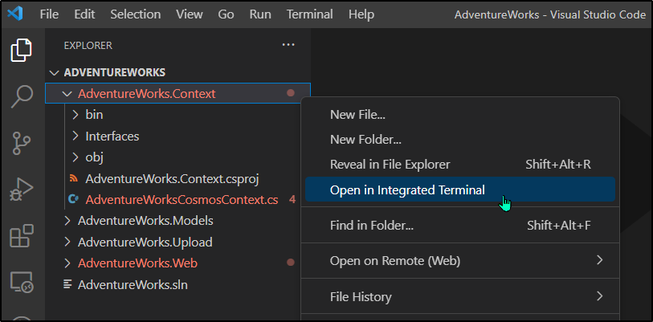

---
lab:
  az204Title: 'Lab 04: Construct a polyglot data solution'
  az204Module: 'Learning Path 04: Develop solutions that use Cosmos DB storage'
---

# 랩 04: 다중저장소 데이터 솔루션 구성

## Microsoft Azure 사용자 인터페이스

Microsoft 클라우드 도구의 동적 특성을 고려할 때 이 교육 콘텐츠를 개발한 후 발생하는 Azure UI 변경이 발생할 수 있습니다. 따라서 랩 지침 및 랩 단계가 올바르게 정렬되지 않을 수 있습니다.

Microsoft는 커뮤니티에서 변경해야 할 사항이 있음을 알려줄 때 이 학습 과정을 업데이트합니다. 그러나 클라우드 업데이트가 자주 이루어지기 때문에 이 학습 콘텐츠가 업데이트되기 전에 UI가 변경될 수 있습니다. **이 경우 변경 사항에 적응하고 필요에 따라 랩에서 작업합니다.**

## Instructions

### 시작하기 전에

#### 랩 환경에 로그인

다음 자격 증명을 사용하여 Windows 10 VM(가상 머신)에 로그인합니다.

- 사용자 이름: `Admin`
- 암호: `Pa55w.rd`

> **참고**: 강사가 가상 랩 환경 연결에 대한 지침을 제공합니다.

#### 설치된 애플리케이션 검토

Windows 10 데스크톱에서 작업 표시줄을 찾습니다. 작업 표시줄에는 다음을 포함하여 이 랩에서 사용할 애플리케이션에 대한 아이콘이 포함되어 있습니다.

- Microsoft Edge
- 파일 탐색기
- Visual Studio Code

## 랩 시나리오

이 랩에서는 Azure Cosmos DB 리소스 및 스토리지 계정 리소스를 만듭니다. C# 및 .NET을 사용하여 Cosmos DB 리소스에 액세스하고 데이터를 업로드합니다.

또한 Contoso는 사용자에게 친숙한 인터페이스를 통해 Cosmos DB의 데이터에 액세스하려고 할 수 있으므로 웹 브라우저에서 Cosmos DB의 데이터에 액세스하고 표시하는 .NET 솔루션을 구현합니다.

마지막으로 Cosmos DB 인스턴스에 대한 일관성 수준을 설정하고 변경 피드 알림에 대한 Azure 함수를 구현합니다.

## 아키텍처 다이어그램


### 연습 1: Azure에서 데이터 저장소 리소스 만들기

#### 작업 1: Azure Portal 열기

1. 작업 표시줄에서 **Microsoft Edge** 아이콘을 선택합니다.

1. 열린 브라우저 창에서 Azure Portal(`https://portal.azure.com`)로 이동한 다음, 이 랩에 사용할 계정으로 로그인합니다.

   > **참고**: Azure Portal에 처음 로그인하는 경우 포털 둘러보기가 제공됩니다. 둘러보기를 건너뛰고 포털 사용을 시작하려면 **시작하기**를 선택합니다.

#### 작업 2: Azure Cosmos DB 계정 리소스 만들기

1. Azure Portal에서 **리소스, 서비스 및 문서 검색** 텍스트 상자를 사용하여 **Azure Cosmos DB**를 검색하고 결과 목록에서 **Azure Cosmos DB**를 선택합니다.

1. **Azure Cosmos DB** 창에서 **+ 만들기**를 선택합니다.

1. API 선택 옵션 블레이드의 **Azure Cosmos DB for NoSQL** 상자에서 **만들기**를 선택합니다**.**

1. **Azure Cosmos DB 계정 만들기 - Azure Cosmos DB for NoSQL** 창의 **기본 사항** 탭에서 다음 작업을 수행한 다음 **검토 + 만들기**를 선택합니다.

   | 설정                     | 작업                                                                                                                   |
   | --------------------------- | ------------------------------------------------------------------------------------------------------------------------ |
   | **구독** 목록       | 기본값 유지                                                                                                          |
   | **리소스 그룹** 섹션  | **새로 만들기**를 선택합니다.                                                                                                    |
   | **이름** 텍스트 상자           | **Polyglotdata**를 입력하고 **확인**을 선택합니다.                                                                                 |
   | **AccountName** 텍스트 상자    | **polycosmos** _[사용자 이름]_ 을 입력합니다.                                                                                         |
   | **위치** 드롭다운 목록 | 랩 컴퓨터의 위치와 가장 가깝고 Cosmos DB 계정을 만들 수 있는 Azure 지역을 선택합니다. |
   | **용량 모드** 섹션   | **서버리스**를 선택합니다.                                                                                                    |

   다음 스크린샷은 **Azure Cosmos DB 계정 만들기 - Azure Cosmos DB for NoSQL** 창에 구성된 설정을 표시합니다.

   

1. **Azure Cosmos DB 계정 만들기 - Azure Cosmos DB for NoSQL** 창의 **검토 + 만들기** 탭에서 이전 과정에서 선택한 옵션들을 검토합니다.

1. **만들기**를 선택하여 지정한 구성으로 Azure Cosmos DB 계정을 만듭니다.

   > **참고**: 이 랩을 진행하기 전에 만들기 작업이 완료될 때까지 기다립니다.

1. **리소스로 이동**을 선택합니다.

1. **Azure Cosmos DB 계정** 창에서 **설정** 섹션을 찾은 후, **키** 링크를 선택합니다.

1. **키** 창의 **읽기/쓰기 키** 탭에서 **URI**, **기본 키** 및 **기본 연결 문자열** 텍스트 상자의 값을 기록합니다. 이 랩에서 나중에 이러한 값을 사용합니다.

#### 작업 3: Azure Storage 계정 리소스 만들기

1. Azure Portal에서 **리소스, 서비스 및 문서 검색** 텍스트 상자를 사용하여 **스토리지 계정**을 검색한 다음, 결과 목록에서 **스토리지 계정**을 선택합니다.

1. **스토리지 계정** 블레이드에서 **+ 만들기**를 선택합니다.

1. **스토리지 계정 만들기** 블레이드의 **기본 사항** 탭에서 다음 작업을 수행하고 **검토**를 선택합니다.

   | 설정                           | 작업                                                                                  |
   | --------------------------------- | --------------------------------------------------------------------------------------- |
   | **구독** 목록             | 기본값 유지                                                                         |
   | **리소스 그룹** 섹션        | **PolyglotData**를 선택합니다.                                                                 |
   | **스토리지 계정 이름** 텍스트 상자 | **polystor** _[사용자 이름]_ 을 입력합니다.                                                          |
   | **지역** 드롭다운 목록         | 이 연습의 앞부분에서 Cosmos DB 계정을 만든 동일한 지역을 선택합니다. |
   | **성능** 섹션           | **표준** 선택                                                                     |
   | **중복도** 드롭다운 목록     | **LRS(로컬 중복 스토리지)** 를 선택합니다.                                              |

   다음 스크린샷은 **스토리지 계정 만들기** 창에 구성된 설정을 보여 줍니다.

   

1. **스토리지 계정 만들기** 블레이드의 **검토** 탭에서 이전 단계 중 선택한 옵션을 검토합니다.

1. 지정된 구성을 사용하여 스토리지 계정을 만들려면 **만들기**를 선택합니다.

   > **참고**: 이 랩을 계속 진행하기 전에 만들기 작업이 완료될 때까지 기다립니다.

#### 검토

이 연습에서는 이 랩에서 구현할 다중저장소 데이터 솔루션에 필요한 Azure 리소스를 만들었습니다. 만든 Azure 리소스에는 Azure Cosmos DB 계정 및 Azure Storage 계정이 포함됩니다.

### 연습 2: 데이터 검토 및 업로드

#### 작업 1: Azure Blob Storage에 이미지 업로드

1. Azure Portal의 탐색 창에서 **Storage 계정** 창으로 다시 이동한 다음, 이 랩의 이전 연습에서 만든 **polystor**_[사용자 이름]_ 스토리지 계정을 선택합니다.

1. **polystor**_[사용자 이름]_ 스토리지 계정 창의 **데이터 스토리지** 섹션에서 **컨테이너** 링크를 선택합니다.

1. **컨테이너** 섹션에서 **+ 컨테이너**를 선택합니다.

1. **새 컨테이너** 팝업 창에서 다음 작업을 수행하고 **만들기**를 선택합니다.

   | 설정                                | 작업                                   |
   | -------------------------------------- | ---------------------------------------- |
   | **이름** 텍스트 상자                      | **images**를 입력합니다.                         |
   | **공용 액세스 수준** 드롭다운 목록 | **프라이빗(익명 액세스 없음)** 을 선택합니다. |

1. **컨테이너** 섹션으로 돌아가서 새로 만든 **images** 컨테이너를 선택합니다.

1. **컨테이너** 창에서 **설정** 섹션을 찾은 다음 **속성** 링크를 선택합니다.

1. **속성** 창에서 **URL** 텍스트 상자의 값을 기록합니다. 나중에 이 랩에서 이 값을 사용하게 됩니다.

1. **다음에 공유 액세스 토큰을** 클릭하고 SAS 토큰 및 URL** 생성을 **클릭하여 기본 설정으로 액세스 토큰을 생성합니다. 나중에 필요하므로 Blob SAS 토큰**의 **값을 확인합니다.

1. 창에서 **개요** 링크를 찾아 선택합니다.
1. 창에서 **업로드**를 선택합니다.

1. **Blob 업로드** 팝업 창에서 다음 작업을 수행합니다.

   a. **파일** 섹션에서 **파일 찾아보기**를 선택하거나 끌어서 놓기를 사용합니다.

   b. **파일 탐색기** 창에서 **Allfiles (F):\\Allfiles\\Labs\\04\\Starter\\Images**로 이동하고 42개의 모든 개별 **.jpg** 이미지 파일을 선택하고 **열기**를 선택합니다.

   c. **파일이 이미 있는 경우 덮어쓰기**가 선택되어 있는지 확인하고 **업로드**를 선택합니다.

   > **참고**: 이 랩으로 계속하기 전에 모든 Blob이 업로드할 때까지 기다립니다.

#### 작업 2: JSON 데이터 검토

1. 랩 컴퓨터에서 Visual Studio Code를 시작합니다.

1. **파일** 메뉴에서 **파일 열기**를 선택하고 **Allfiles (F):\\Allfiles\\Labs\\04\\Starter\\AdventureWorks\\AdventureWorks.Upload**를 찾아보고 **models.json**을 선택한 다음 **열기**를 선택합니다.

1. **models.json** 파일의 형식을 검토하고 **Products** 속성의 일부인 중첩된 개체 배열과 함께 JSON 개체 배열이 포함되어 있는지 확인합니다.

   > **참고**: 이에 따라 JSON 파일의 콘텐츠를 Cosmos DB 컬렉션에 업로드하기 전에 역직렬화하기 위해 정의할 클래스가 결정됩니다.

1. **models.json** 파일 내에서 속성 중 하나의 이름은 **Category**입니다.

   > **참고**: **Category** 속성을 사용하여 대상 Cosmos DB 컬렉션의 분할을 정의합니다.

1. Visual Studio Code를 닫습니다.

#### 작업 3: Cosmos DB 데이터베이스 및 컬렉션 만들기 및 JSON 데이터 업로드 수행

1. **시작** 화면에서 **Visual Studio Code** 타일을 선택합니다.

1. **파일** 메뉴에서 **폴더 열기**를 선택합니다.

1. 열리는 **파일 탐색기** 창에서 **Allfiles (F):\\Allfiles\\Labs\\04\\Starter\\AdventureWorks**로 이동한 후, **폴더 선택**을 선택합니다.

1. **Visual Studio Code** 창의 메뉴 모음에서 **터미널**을 선택한 다음 **새 터미널**을 선택합니다.

1. 터미널에서 현재 디렉터리가 **AdventureWorks**로 설정되어 있는지 확인하고(또는 그렇지 않은 경우 해당 디렉터리로 변경함) 다음 명령을 실행하여 터미널 컨텍스트를 **AdventureWorks.Upload** 폴더로 전환합니다.

   ```
   cd .\AdventureWorks.Upload\
   ```

   > **참고**: 다음 단계를 수행하기 전에 Windows 탐색기를 열고 **Allfiles (F):\\Allfiles\\Labs\\04\\Starter\\AdventureWorks\\AdventureWorks.Upload\\AdventureWorks.Upload.csproj** 파일에서 **읽기 전용** 특성을 제거합니다.

1. 터미널 프롬프트에서 다음 명령을 실행하여 Azure Cosmos DB .NET 클라이언트 라이브러리를 현재 열려 있는 프로젝트에 추가합니다.

   > **참고**: 다음 명령을 계속하기 전에 현재 이 경로**에 배치되어 있는지 확인하세요. (F):\\Allfiles\\Labs\\04\\Starter\\AdventureWorks AdventureWorks.Upload\\\\**

   ```
   dotnet add package Microsoft.Azure.Cosmos --version 3.28.0
   ```
   
   > **참고**: **dotnet add package** 명령은 **NuGet**에서 **Microsoft.Azure.Cosmos** 패키지를 추가합니다. 자세한 내용은 [Microsoft.Azure.Cosmos](https://www.nuget.org/packages/Microsoft.Azure.Cosmos)를 참조하세요.

1. 터미널에 출력된 빌드의 결과를 확인합니다. 오류나 경고 메시지 없이 빌드가 성공적으로 완료되어야 합니다.

1. **Visual Studio Code** 창의 **탐색기** 창에서 **AdventureWorks.Upload** 프로젝트를 확장합니다.

1. **Program.cs** 파일을 엽니다.

1. **Program.cs** 파일에서 **using** 지시문을 검토하고 **Microsoft.Azure.Cosmos**, **System.IO;**, **System.Text.Json**, **System.Threading.Tasks** 및 **System.Collections.Generic**을 포함하는지 확인합니다. 이렇게 하면 랩 컴퓨터의 로컬 파일에서 Cosmos DB 데이터베이스의 컬렉션으로 JSON 항목을 비동기식으로 업로드할 수 있습니다.

1. **Program.cs** 파일의 줄 14에서 빈 문자열을 이 랩의 앞부분에서 기록한 Cosmos DB 계정의 **URI** 속성으로 바꿔 **EndpointUrl**의 값을 설정합니다. 값이 큰따옴표로 묶여 있는지 확인합니다.

1. 줄 15에서 빈 문자열을 이 랩의 앞부분에서 기록한 **PRIMARY KEY** 속성으로 바꿔 **AuthorizationKey**의 값을 설정합니다. 값이 큰따옴표로 묶여 있는지 확인합니다.

1. 줄 18에서 빈 문자열을 **"/Category"** 로 바꿔 **PartitionKey**의 값을 설정합니다.

1. 줄 19에서 빈 문자열을 **"F:\\\\Allfiles\\\\Labs\\\\04\\\\Starter\\\\AdventureWorks\\\\AdventureWorks.Upload\\\\models.json"** 으로 바꿔 **JsonFilePath**의 값을 설정합니다.

1. try 블록 내에서 **CosmosClient** 클래스의 **CreateDatabaseIfNotExistsAsync** 메서드 호출을 확인합니다. 데이터베이스가 아직 없는 경우 데이터베이스를 만듭니다.

1. **Database** 클래스의 **DefineContainer** 메서드 호출을 확인합니다. JSON 항목을 호스트하는 컨테이너가 아직 없는 경우 이를 만듭니다.

   > **참고**: **DefineContainer** 메서드에는 모든 특성을 자동으로 인덱싱하는 기본 인덱싱 정책을 수정할 수 있는 비용 최소화 옵션이 포함되어 있습니다.

1. **StreamReader** 개체를 사용하여 텍스트 파일에서 JSON 항목을 읽고 **Program.cs** 파일에 추가로 정의된 **Model** 클래스의 개체로 역직렬화하는 **using** 문을 확인합니다.

1. 역직렬화된 개체의 컬렉션을 반복하고 각 개체를 대상 컬렉션에 비동기적으로 삽입하는 foreach 루프를 확인합니다.

1. 이 랩의 앞부분에서 검토한 JSON 형식 파일에 저장된 개체의 형식을 반영하는 **Model** 및 **Product** 클래스를 검토합니다.

1. Program.cs 파일을 저장하고 닫습니다****.

   > **참고**: 파일이 읽기 전용이라는 메시지가 표시되면 **덮어쓰기**를 선택합니다.

1. 터미널에서 다음 명령을 실행하여 누락된 NuGet 패키지를 복원하고 폴더에 프로젝트를 빌드합니다.

   ```
   dotnet build
   ```

   > **참고**: **dotnet build** 명령은 폴더의 모든 프로젝트를 빌드하기 전에 누락된 NuGet 패키지를 자동으로 복원합니다.

1. 터미널 프롬프트에서 다음 명령을 실행하여 .NET Core 콘솔 애플리케이션을 실행합니다.

   ```
   dotnet run
   ```

   > **참고**: **dotnet run** 명령은 프로젝트의 모든 변경 내용을 자동으로 빌드한 다음 디버거를 연결하지 않고 웹 애플리케이션을 시작합니다. 이 명령은 대상 컬렉션에 삽입된 항목 수와 삽입 작업의 기간을 포함하여 데이터 로드 진행률을 나타내는 메시지를 출력합니다.

1. 터미널에 인쇄된 명령의 실행 결과를 확인합니다. 실행이 성공적으로 완료되고 대상 Cosmos DB 컬렉션에 삽입된 항목이 119개라는 메시지가 표시됩니다.

1. **터미널 종료**(**휴지통** 아이콘)를 선택하여 터미널 창 및 관련된 모든 프로세스를 닫습니다.

#### 작업 4: JSON 데이터 업로드 유효성 검사

1. 랩 컴퓨터에서 Azure Portal이 표시된 **Microsoft Edge** 브라우저 창으로 전환합니다.

1. Azure Portal에서 **리소스, 서비스 및 문서 검색** 텍스트 상자를 선택하고 **최근 리소스** 목록에서 이 랩의 앞부분에서 만든 **polycosmos**_[사용자 이름]_ Azure Cosmos DB 계정을 선택합니다.

1. **Azure Cosmos DB 계정** 창에서 **데이터 탐색기** 링크를 찾아서 선택합니다.

1. **데이터 탐색기** 창에서 **Retail** 데이터베이스 노드를 확장합니다.

1. **Online** 컨테이너 노드를 확장하고 **새 SQL 쿼리**를 선택합니다.

   > **참고**: 이 옵션의 레이블은 숨겨져 있을 수 있습니다. **** 창의 아이콘 위로 마우스를 가져가면 레이블을 볼 수 있습니다.

1. 쿼리 탭에서 다음 텍스트를 입력합니다.

   ```sql
   SELECT * FROM models
   ```

1. **쿼리 실행**을 선택한 다음 쿼리가 반환하는 JSON 항목 목록을 살펴봅니다.

1. 쿼리 편집기로 돌아가서 기존 텍스트를 다음 텍스트로 바꿉니다.

   ```sql
   SELECT VALUE COUNT(1) FROM models
   ```

1. **쿼리 실행**을 선택한 다음 **COUNT** 집계 작업의 결과를 살펴봅니다.

1. **Visual Studio Code** 창으로 다시 전환합니다.

#### 검토

이 연습에서는 Azure Cosmos DB용 .NET SDK를 사용하여 Azure Cosmos DB에 데이터를 삽입했습니다. 다음에 구현하는 웹 애플리케이션은 이 데이터를 사용합니다.

### 연습 3: .NET 웹 애플리케이션 구성

#### 작업 1: 데이터 저장소에 대한 참조 업데이트 및 웹 애플리케이션 빌드

1. **Visual Studio Code** 창의 **탐색기** 창에서 **AdventureWorks.Web** 프로젝트를 확장합니다.

1. **appsettings.json** 파일을 엽니다.

1. 줄 3의 JSON 개체에서 **ConnectionStrings.AdventureWorksCosmosContext** 경로를 찾습니다. 현재 값이 비어 있는지 확인합니다.

   ```json
   "ConnectionStrings": {
       "AdventureWorksCosmosContext": "",
   },
   ```

1. 이 랩의 앞부분에서 기록한 Azure Cosmos DB 계정의 **기본 연결 문자열**로 값을 설정하여 **AdventureWorksCosmosContext** 속성 값을 업데이트합니다.

1. 줄 6의 JSON 개체에서 **Settings.BlobContainerUrl** 경로를 찾습니다. 현재 값이 비어 있는지 확인합니다.

   ```json
   "Settings": {
       "BlobContainerUrl": "",
       "BlobSASToken": "",
       ...
   }
   ```

1. BlobContainerUrl 및 BlobSASToken** 속성을 이미지라는** **Azure Storage Blob 컨테이너의 URL** 속성 및 이 랩의 앞부분에서 기록한 Blob SAS 토큰 값으로 설정**하여 업데이트합니다.**** ** 

1. **appsettings.json** 파일을 저장하고 닫습니다.

   > **참고**: 파일이 읽기 전용이라는 메시지가 표시되면 **덮어쓰기**를 선택합니다.

1. Visual Studio Code 창에서 **탐색기 창에서 **AdventureWorks.Context** 폴더를 마우스 오른쪽 단추로 클릭한 다음 통합 터미널**에서 열기를 선택합니다**.**

   

   > **참고**: 다음 단계를 수행하기 전에 **Allfiles (F):\Allfiles\Labs\04\Starter\AdventureWorks\AdventureWorks.Context\AdventureWorks.Context.csproj** 파일에서 읽기 전용 특성을 제거합니다.

1. 터미널 프롬프트에서 현재 디렉터리가 **AdventureWorks.Context**로 설정되어 있는지(또는 그렇지 않은 경우 해당 디렉터리로 변경) 확인하고 다음 명령을 실행하여 NuGet에서 **Microsoft.Azure.Cosmos**를 가져옵니다.

   > **참고**: 다음 명령을 계속하기 전에 현재 이 경로**에 배치되어 있는지 확인하세요. (F):\\Allfiles\\Labs\\04\\Starter\\AdventureWorks AdventureWorks.Context\\\\**

   ```
   dotnet add package Microsoft.Azure.Cosmos --version 3.28.0
   ```

1. 터미널 프롬프트에서 다음 명령을 실행하여 AdventureWorks.Context** 프로젝트를 빌드**합니다.

   ```
   dotnet build
   ```

1. 터미널에 출력된 빌드의 결과를 확인합니다. 오류나 경고 메시지 없이 빌드가 성공적으로 완료되어야 합니다.

#### 작업 2: Azure Cosmos DB에 연결 구성

1. **Visual Studio Code** 창의 **탐색기** 창에서 **AdventureWorks.Context** 프로젝트를 확장합니다.

1. **AdventureWorks.Context** 폴더 노드의 바로 가기 메뉴에서 **새 파일**을 선택합니다.

1. 새 파일 프롬프트에서 **AdventureWorksCosmosContext.cs**를 입력합니다.

1. AdventureWorksCosmosContext.cs** 파일의 **코드 편집기 탭에서 다음 코드를 추가합니다.

   ```csharp
   using AdventureWorks.Models;
   using Microsoft.Azure.Cosmos;
   using Microsoft.Azure.Cosmos.Linq;
   using System;
   using System.Collections.Generic;
   using System.Linq;
   using System.Threading.Tasks;

   namespace AdventureWorks.Context
   {
       /* AdventureWorksCosmosContext class will implement the
       IAdventureWorksProductContext interface */
      public class AdventureWorksCosmosContext : IAdventureWorksProductContext
      {
           /* Create a new read-only Container variable named _container */
           private readonly Container _container;

         public AdventureWorksCosmosContext(string connectionString, string database = "Retail", string container = "Online")
         {
           /* Create a new instance of the CosmosClient class, and then obtain
             both a Database and Container instance from the client */
           _container = new CosmosClient(connectionString)
           .GetDatabase(database)
           .GetContainer(container);
         }

         public async Task<Model> FindModelAsync(Guid id)
         {
           /* Create a LINQ query, transform it into an iterator, iterate over the result set,
              and then return the single item in the result set */
           var iterator = _container.GetItemLinqQueryable<Model>()
           .Where(m => m.id == id).ToFeedIterator<Model>();
           List<Model> matches = new List<Model>();
           while (iterator.HasMoreResults)
           {
               var next = await iterator.ReadNextAsync();
               matches.AddRange(next);
           }

           return matches.SingleOrDefault();
         }

         public async Task<List<Model>> GetModelsAsync()
         {
           /* Run an SQL query, get the query result iterator, iterate over the result set,
               and then return the union of all results */
           string query = $@"SELECT * FROM items";
           var iterator = _container.GetItemQueryIterator<Model>(query);
           List<Model> matches = new List<Model>();
           while (iterator.HasMoreResults)
           {
               var next = await iterator.ReadNextAsync();
               matches.AddRange(next);
           }

           return matches;
         }

         public async Task<Product> FindProductAsync(Guid id)
         {
           /* Run an SQL query, get the query result iterator, iterate over the result set,
              and then return the single item in the result set */
           string query = $@"SELECT VALUE products
                       FROM models
                       JOIN products in models.Products
                       WHERE products.id = '{id}'";
           var iterator = _container.GetItemQueryIterator<Product>(query);
           List<Product> matches = new List<Product>();
           while (iterator.HasMoreResults)
           {
               var next = await iterator.ReadNextAsync();
               matches.AddRange(next);
           }

           return matches.SingleOrDefault();
         }

      }
   }
   ```

1. **AdventureWorksCosmosContext.cs** 파일을 저장하고 닫습니다.
1. 터미널 프롬프트에서 현재 디렉터리가 **AdventureWorks.Context**로 설정된 상태에서 다음 명령을 실행하여 .NET 웹 애플리케이션을 빌드합니다.

   ```
   dotnet build
   ```

   > **참고**: 빌드 오류가 있는 경우 Allfiles >(F):\\Allfiles\\Labs\\04\\Solution\\AdventureWorks AdventureWorks.Context**** 폴더에서 **AdventureWorksCosmosContext.cs\\파일을 검토**합니다.

#### 작업 3: .NET 애플리케이션 시작 논리 검토

1. **Visual Studio Code** 창의 **탐색기** 창에서 **AdventureWorks.Web** 프로젝트를 확장합니다.

1. **Startup.cs** 파일을 엽니다.

1. **Startup** 클래스에서 기존 **ConfigureProductService** 메서드를 확인합니다.

   ```csharp
   public void ConfigureProductService(IServiceCollection services)
   {
       services.AddScoped<IAdventureWorksProductContext, AdventureWorksCosmosContext>(provider =>
           new AdventureWorksCosmosContext(
               _configuration.GetConnectionString(nameof(AdventureWorksCosmosContext))
           )
       );
   }
   ```

   > **참고**: 제품 서비스는 Cosmos DB를 데이터베이스로 사용합니다.

1. 수정하지 않고 **Startup.cs** 파일을 닫습니다.

#### 작업 4: .NET 애플리케이션이 데이터 저장소에 성공적으로 연결되었는지 확인

1. Visual Studio Code의 터미널 프롬프트에서 다음 명령을 실행하여 터미널 컨텍스트를 **AdventureWorks.Web** 폴더로 전환합니다.

   ```
   cd ..\AdventureWorks.Web\
   ```

1. 터미널 프롬프트에서 다음 명령을 실행하여 ASP.NET 웹 애플리케이션을 실행합니다.

   > **참고**: 다음 명령을 계속하기 전에 현재 이 경로**에 위치해야 합니다. (F):\\Allfiles\\Labs\\04\\Starter\\AdventureWorks AdventureWorks.Web\\\\**

   ```
   dotnet run
   ```

   > **참고**: **dotnet run** 명령은 프로젝트의 모든 변경 내용을 자동으로 빌드한 다음 디버거를 연결하지 않고 웹 애플리케이션을 시작합니다. 이 명령은 실행 중인 애플리케이션의 URL과 할당된 모든 포트를 출력합니다.

1. 작업 표시줄에서 **Microsoft Edge** 아이콘을 선택합니다.

1. 열린 브라우저 창에서 현재 실행 중인 웹 애플리케이션(<http://localhost:5000>)으로 이동합니다.

1. 웹 애플리케이션의 첫 페이지에 표시된 모델 목록을 살펴봅니다.

1. **Touring-1000** 모델을 찾아 세부 정보 보기**를 선택합니다**.

1. **Touring-1000** 제품 세부 정보 페이지에서 옵션 목록을 검토합니다.

1. 웹 애플리케이션을 표시한 브라우저 창을 닫습니다.

1. **Visual Studio Code** 창으로 전환한 후, **터미널 종료**(**휴지통** 아이콘)를 선택하여 현재 열려 있는 터미널 및 관련 프로세스를 닫습니다.

#### 검토

이 연습에서는 .NET SDK를 사용하여 Azure Cosmos DB 컬렉션을 쿼리하는 C# 코드를 작성했습니다.
