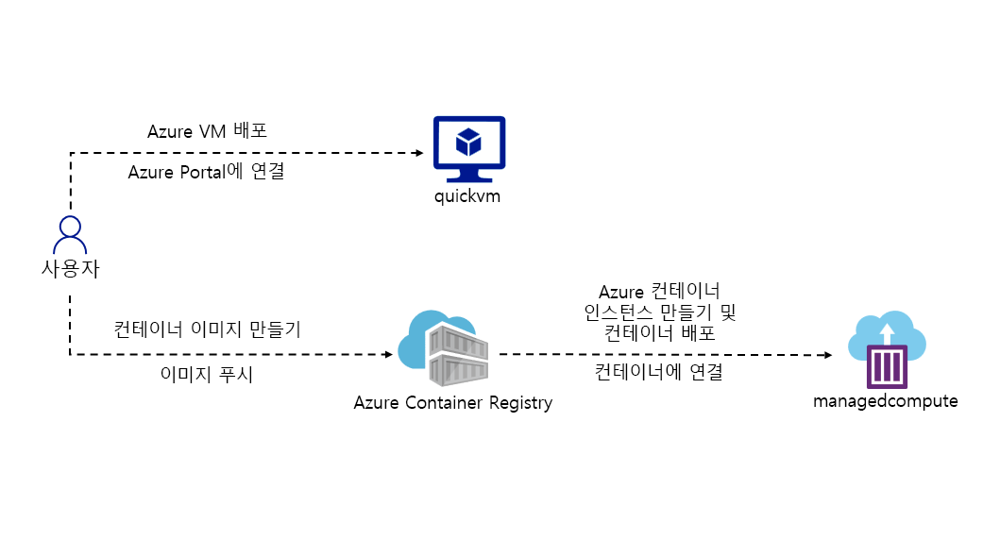
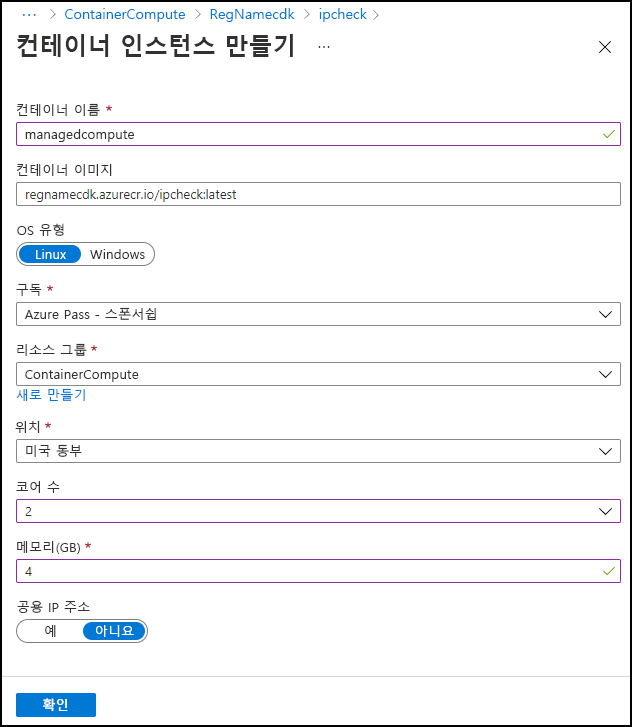

---
lab:
  az204Title: 'Lab 05: Deploy compute workloads by using images and containers'
  az204Module: 'Module 05: Implement IaaS solutions'
---

# <a name="lab-05-deploy-compute-workloads-by-using-images-and-containers"></a>랩 05: 이미지 및 컨테이너를 사용하여 컴퓨팅 워크로드 배포

## <a name="microsoft-azure-user-interface"></a>Microsoft Azure 사용자 인터페이스

Microsoft 클라우드 도구의 동적 특성을 감안할 때, 이 학습 콘텐츠를 개발한 후 Azure UI가 변경될 수 있습니다. 따라서 랩 지침 및 랩 단계가 올바르게 정렬되지 않을 수 있습니다.

Microsoft는 커뮤니티에서 변경해야 할 사항이 있음을 알려줄 때 이 학습 과정을 업데이트합니다. 그러나 클라우드 업데이트가 자주 이루어지기 때문에 이 학습 콘텐츠가 업데이트되기 전에 UI가 변경될 수 있습니다. **이 경우 변경 사항에 적응하고 필요에 따라 랩에서 작업합니다.**

## <a name="instructions"></a>Instructions

### <a name="before-you-start"></a>시작하기 전에

#### <a name="sign-in-to-the-lab-environment"></a>랩 환경에 로그인

다음 자격 증명을 사용하여 Windows 10 VM(가상 머신)에 로그인합니다.

-   사용자 이름: **Admin**

-   암호: **Pa55w.rd**

> **참고**: 강사가 가상 랩 환경 연결에 대한 지침을 제공합니다.

#### <a name="review-the-installed-applications"></a>설치된 애플리케이션 검토

Windows 10 데스크톱에서 작업 표시줄을 찾습니다. 작업 표시줄에는 다음을 포함하여 이 랩에서 사용할 애플리케이션에 대한 아이콘이 포함되어 있습니다.

-   Microsoft Edge

-   파일 탐색기

## <a name="architecture-diagram"></a>아키텍처 다이어그램



### <a name="exercise-1-create-a-vm-by-using-the-azure-command-line-interface-cli"></a>연습 1: AZURE CLI(명령줄 인터페이스)를 사용하여 VM 만들기

#### <a name="task-1-open-the-azure-portal"></a>작업 1: Azure Portal 열기

1.  작업 표시줄에서 **Microsoft Edge** 아이콘을 선택합니다.

1. 열린 브라우저 창에서 Azure Portal(<https://portal.azure.com>)로 이동한 다음, 이 랩에 사용할 계정으로 로그인합니다.

   > **참고**: Azure Portal에 처음 로그인하는 경우 포털 둘러보기가 제공됩니다. 둘러보기를 건너뛰고 Portal 사용을 시작하려면 **시작하기**를 선택합니다.

#### <a name="task-2-create-a-resource-group"></a>작업 2: 리소스 그룹 만들기

1.  Azure Portal 탐색 창에서 **리소스, 서비스 및 문서 검색** 텍스트 상자를 사용하여 **리소스 그룹**을 검색한 다음, 결과 목록에서 **리소스 그룹**을 선택합니다.

1.  **리소스 그룹** 창에서 **만들기**를 선택합니다.

1.  **리소스 그룹 만들기** 창의 **기본 사항** 탭에서 다음 작업을 수행하고 **검토 + 만들기**를 선택합니다.

    | 설정 | 작업 |
    | -- | -- |
    | **구독** 드롭다운 목록 | 기본값을 유지합니다.  |
    | **리소스 그룹** 텍스트 상자 | **ContainerCompute**를 입력합니다. |
    | **지역** 드롭다운 목록 | **(미국) 미국 동부**를 선택합니다. |

    다음 스크린샷은 **리소스 그룹 만들기** 창에 구성된 설정을 보여 줍니다.

    

1.  **검토 + 만들기** 탭에서 이전 단계에서 선택한 옵션을 검토합니다.

1.  지정된 구성을 사용하여 리소스 그룹을 만들려면 **만들기**를 선택합니다.  

    > **참고**: 이 랩을 진행하기 전에 만들기 작업이 완료될 때까지 기다립니다.

#### <a name="task-3-open-azure-cloud-shell"></a>작업 3: Azure Cloud Shell 열기

1.  Azure Portal에서 **Cloud Shell** 아이콘 을 선택하여 새 PowerShell 세션을 엽니다. Cloud Shell 기본값이 PowerShell 세션인 경우 **PowerShell**을 선택한 다음, 드롭다운 메뉴에서 **Bash**를 선택합니다.

    > **참고**: **Cloud Shell** 아이콘은 더 큼 기호(\>)와 밑줄 문자(\_)로 표시됩니다.

    > **참고**: **Cloud Shell**을 처음 시작하는 경우 **Bash** 또는 **PowerShell**을 선택하라는 메시지가 표시되면 **Bash**를 선택합니다. **탑재된 스토리지가 없음** 메시지가 표시되면 이 랩에서 사용하는 구독을 선택하고 **스토리지 만들기**를 선택합니다.

1.  포털의 **Cloud Shell** 명령 프롬프트에서 다음 명령을 실행하여 Azure CLI 도구의 버전을 가져옵니다.

    ```
    az --version
    ```

#### <a name="task-4-use-the-azure-cli-commands"></a>작업 4: Azure CLI 명령 사용

1.  다음 명령을 실행하여 CLI의 루트 수준에서 하위 그룹 및 명령 목록을 가져옵니다.

    ```
    az --help
    ```

1.  다음 명령을 실행하여 Azure Virtual Machines에 대한 하위 그룹 및 명령 목록을 가져옵니다.

    ```
    az vm --help
    ```

1.  다음 명령을 실행하여 **Virtual Machine 만들기** 명령에 대한 인수 및 예제 목록을 가져옵니다.

    ```
    az vm create --help
    ```

1.  다음 명령을 실행하여 아래와 같은 설정의 새 **가상 머신**을 만듭니다. 아래에서 만들도록 요청받은 암호를 기록해 두어야 합니다. 나중에 랩에서 가상 머신에 액세스하려면 이 암호를 사용해야 합니다.

    -   리소스 그룹: **ContainerCompute**

    -   이름: **quickvm**

    -   이미지: **Debian**

    -   관리 사용자 이름: **student**

    -   관리 암호: **\<CreateYourPassword\>**

    > **참고**: 아래 명령에서 **`<CreateYourPassword>`** 를 고유한 암호로 바꿉니다.

    ```
    az vm create --resource-group ContainerCompute --name quickvm --image Debian --admin-username student --admin-password <CreateYourPassword>
    ```

    > **참고**: VM이 만들어지는 동안 기다립니다. 프로세스가 완료되면 명령은 머신의 세부 정보가 포함된 JSON(JavaScript Object Notation) 파일을 반환합니다.

1.  다음 명령을 실행하여 새로 만든 VM에 대한 다양한 메타데이터가 포함된 보다 자세한 JSON 파일을 가져옵니다.

    ```
    az vm show --resource-group ContainerCompute --name quickvm
    ```

1.  다음 명령을 실행하여 VM과 연결된 모든 IP 주소를 나열합니다.

    ```
    az vm list-ip-addresses --resource-group ContainerCompute --name quickvm
    ```

1.  다음 명령을 실행하여 첫 번째 IP 주소 값만 반환되도록 출력을 필터링합니다.

    ```
    az vm list-ip-addresses --resource-group ContainerCompute --name quickvm --query '[].{ip:virtualMachine.network.publicIpAddresses[0].ipAddress}' --output tsv
    ```

1.  다음 명령을 실행하여 *ipAddress*라는 새 Bash 셸 변수에 이전 명령의 결과를 저장합니다.

    ```
    ipAddress=$(az vm list-ip-addresses --resource-group ContainerCompute --name quickvm --query '[].{ip:virtualMachine.network.publicIpAddresses[0].ipAddress}' --output tsv)
    ```

1.  다음 명령을 실행하여 Bash 셸 변수 *ipAddress*의 값을 렌더링합니다.

    ```
    echo $ipAddress
    ```

1.  다음 명령을 실행하여 Bash 셸 변수 *ipAddress*에 저장된 SSH(Secure Shell) 도구 및 IP 주소를 사용하여 이전에 이 랩에서 만든 VM에 연결합니다.

    ```
    ssh student@$ipAddress
    ```

1.  SSH 도구는 호스트의 신뢰성을 확인할 수 없음을 알려주고 연결을 계속할 것인지 묻습니다. **예**를 입력한 다음 Enter 키를 눌러 VM에 계속 연결합니다.

1.  그런 다음, SSH 도구에서 암호를 요청합니다. 이전에 만든 암호를 입력한 다음, Enter 키를 선택하여 VM으로 인증합니다.

1.  SSH를 사용하여 VM에 연결한 후 다음 명령을 실행하여 Linux VM을 설명하는 메타데이터를 가져옵니다.

    ```
    uname -a
    ```

1.  **종료** 명령을 사용하여 SSH 세션을 종료합니다.

    ```
    exit
    ```

1.  포털에서 **Cloud Shell** 창을 닫습니다.

#### <a name="review"></a>검토

이 연습에서는 Cloud Shell을 사용하여 VM을 자동화된 스크립트의 일부로 만들었습니다.

### <a name="exercise-2-create-a-docker-container-image-and-deploy-it-to-azure-container-registry"></a>연습 2: Docker 컨테이너 이미지를 만들고 Azure Container Registry에 배포합니다.

#### <a name="task-1-open-the-cloud-shell-and-editor"></a>작업 1: Cloud Shell 및 편집기 열기

1.  Azure Portal의 탐색 창에서 **Cloud Shell** 아이콘을 선택하여 새 셸 인스턴스를 엽니다.  

    > **참고**: 랩으로 이동하기 전에 Cloud Shell이 인스턴스에 연결을 마칠 때까지 기다립니다.

1.  포털의 **Cloud Shell** 명령 프롬프트에서 다음 명령을 실행하여 루트 디렉터리에서 **\~/clouddrive** 디렉터리로 이동합니다.

    ```
    cd ~/clouddrive
    ```

1.  다음 명령을 실행하여 **\~/clouddrive** 디렉터리에 **ipcheck**라는 새 디렉터리를 만듭니다.

    ```
    mkdir ipcheck
    ```

1.  다음 명령을 실행하여 활성 디렉터리를 **\~/clouddrive**에서 **\~/clouddrive/ipcheck**로 변경합니다.

    ```
    cd ~/clouddrive/ipcheck
    ```

1.  다음 명령을 실행하여 현재 디렉터리에 새 .NET 콘솔 애플리케이션을 만듭니다.

    ```
    dotnet new console --output . --name ipcheck --framework net6.0
    ```

1.  다음 명령을 실행하여 **\~/clouddrive/ipcheck** 디렉터리에 **Dockerfile**이라는 새 파일을 만듭니다.

    ```
    touch Dockerfile
    ```

1.  다음 명령을 실행하여 현재 디렉터리의 컨텍스트에서 포함된 그래픽 편집기를 엽니다.

    ```
    code .
    ```

#### <a name="task-2-create-and-test-a-net-application"></a>작업 2: .NET 애플리케이션 만들기 및 테스트

1.  그래픽 편집기의 **파일** 창에서 **Program.cs** 파일을 선택하여 편집기에서 해당 파일을 엽니다.

1.  **Program.cs** 파일의 전체 내용을 삭제합니다.

1.  다음 코드를 복사하여 **Program.cs** 파일에 붙여넣습니다.

    ```csharp
    public class Program
    {
        public static void Main(string[] args)
        {        
            // Check if network is available
            if (System.Net.NetworkInformation.NetworkInterface.GetIsNetworkAvailable())
            {
                System.Console.WriteLine("Current IP Addresses:");

                // Get host entry for current hostname
                string hostname = System.Net.Dns.GetHostName();
                System.Net.IPHostEntry host = System.Net.Dns.GetHostEntry(hostname);
                
                // Iterate over each IP address and render their values
                foreach(System.Net.IPAddress address in host.AddressList)
                {
                    System.Console.WriteLine($"\t{address}");
                }
            }
            else
            {
                System.Console.WriteLine("No Network Connection");
            }
        }
    }
    ```

1.  그래픽 편집기의 메뉴 또는 Ctrl+S 키보드 바로 가기 키를 사용하여 **Program.cs** 파일을 저장합니다.  그래픽 편집기는 닫지 마세요.

1.  명령 프롬프트로 돌아가서 다음 명령을 실행하여 애플리케이션을 실행합니다.

    ```
    dotnet run
    ```

1.  실행 결과를 검토합니다. Cloud Shell 인스턴스에 대해 하나 이상의 IP 주소가 나열되어야 합니다.

1.  그래픽 편집기에서 편집기의 **파일** 창에서 **Dockerfile** 파일을 선택하여 편집기에서 해당 파일을 엽니다.

1.  다음 코드를 복사하여 **Dockerfile** 파일에 복사하여 붙여넣습니다.

    ```
    # Start using the .NET 6 SDK container image
    FROM mcr.microsoft.com/dotnet/sdk:6.0-alpine AS build

    # Change current working directory
    WORKDIR /app

    # Copy existing files from host machine
    COPY . ./

    # Publish application to the "out" folder
    RUN dotnet publish --configuration Release --output out

    # Start container by running application DLL
    ENTRYPOINT ["dotnet", "out/ipcheck.dll"]
    ```

1. 그래픽 편집기의 메뉴 또는 Ctrl+S 키보드 바로 가기 키를 사용하여 **Dockerfile** 파일을 저장합니다.

1. 다음 작업을 위해 Cloud Shell을 열어 둡니다.

#### <a name="task-3-create-a-container-registry-resource"></a>작업 3: Container Registry 리소스 만들기

1. 포털의 **Cloud Shell** 명령 프롬프트에서 다음 명령을 실행하여 Container Registry 리소스에 대한 고유한 값으로 변수를 만듭니다. 

    ```bash
    registryName=conregistry$RANDOM
    ```

1. 포털의 **Cloud Shell** 명령 프롬프트에서 다음 명령을 실행하여 이전 단계에서 만든 이름을 사용할 수 있는지 확인합니다. 

    ```bash
    az acr check-name --name $registryName
    ```

    결과에 해당 이름을 사용할 수 있다고 표시되면 다음 단계를 계속 진행합니다. 이름을 사용할 수 없으면 이전 단계에서 명령을 다시 실행하고 사용 가능한지 다시 확인합니다.

1. 포털의 **Cloud Shell** 명령 프롬프트에서 다음 명령을 실행하여 Container Registry 리소스를 만듭니다. 

    ```bash
    az acr create --resource-group ContainerCompute --name $registryName --sku Basic
    ```

    > **참고**: 이 랩을 계속 진행하기 전에 만들기 작업이 완료될 때까지 기다립니다.

#### <a name="task-4-store-container-registry-metadata"></a>작업 4: Container Registry 메타데이터 저장

1.  포털의 **Cloud Shell** 명령 프롬프트에서 다음 명령을 실행하여 구독의 모든 컨테이너 레지스트리 목록을 가져옵니다.

    ```
    az acr list
    ```

1.  다음 명령을 실행하여 레지스트리 이름이 출력으로 표시되는지 확인합니다. '[]' 이외의 출력이 표시되지 않으면 잠시 기다렸다가 명령을 다시 실행해 보세요.

    ```
    az acr list --query "max_by([], &creationDate).name" --output tsv
    ```

1.  다음 명령을 실행합니다.

    ```
    acrName=$(az acr list --query "max_by([], &creationDate).name" --output tsv)
    ```

1.  다음 명령을 실행합니다.

    ```
    echo $acrName
    ```

#### <a name="task-5-deploy-a-docker-container-image-to-container-registry"></a>작업 5: 컨테이너 레지스트리에 Docker 컨테이너 이미지를 배포합니다.

1.  다음 명령을 실행하여 활성 디렉터리를 **\~/** 에서 **\~/clouddrive/ipcheck**로 변경합니다.

    ```
    cd ~/clouddrive/ipcheck
    ```

1.  다음 명령을 실행하여 현재 디렉터리의 내용을 가져옵니다.

    ```
    dir
    ```

1.  다음 명령을 실행하여 컨테이너 레지스트리에 소스 코드를 업로드하고 Container Registry 작업으로 컨테이너 이미지를 빌드합니다.

    ```
    az acr build --registry $acrName --image ipcheck:latest .
    ```

    > **참고**: 이 랩을 진행하기 전에 빌드 작업이 완료할 때까지 기다립니다.

1.  포털에서 **Cloud Shell** 창을 닫습니다.

#### <a name="task-6-validate-your-container-image-in-container-registry"></a>작업 6: 컨테이너 레지스트리의 컨테이너 이미지 유효성 검사

1.  Azure Portal의 **탐색** 창에서 **리소스 그룹** 링크를 선택합니다.

1.  **리소스 그룹** 창에서 이전에 이 랩에서 만든 **ContainerCompute** 리소스 그룹을 선택합니다.

1.  **ContainerCompute** 창에서 이전에 이 랩에서 만든 컨테이너 레지스트리를 선택합니다.

1.  **Container Registry** 창의 **서비스** 섹션에서 **리포지토리** 링크를 선택합니다.

1.  **리포지토리** 섹션에서 **ipcheck** 컨테이너 이미지 리포지토리를 선택한 다음, **latest** 태그를 선택합니다.

1.  **latest** 태그가 있는 컨테이너 이미지 버전에 대한 메타데이터를 검토합니다.

    > **참고**: **ID 실행** 링크를 선택하여 빌드 작업에 대한 메타데이터를 볼 수도 있습니다.

#### <a name="review"></a>검토

이 연습에서는 컴퓨터의 현재 IP 주소를 표시하는 .NET 콘솔 애플리케이션을 만들었습니다. 그 다음 Docker 컨테이너 이미지로 변환하기 위해 애플리케이션에 **Dockerfile** 파일을 추가했습니다. 마지막으로 컨테이너 레지스트리에 컨테이너 이미지를 배포했습니다.

### <a name="exercise-3-deploy-an-azure-container-instance"></a>연습 3: Azure Container Instances를 배포합니다.

#### <a name="task-1-enable-the-admin-user-in-container-registry"></a>작업 1: 컨테이너 레지스트리에서 관리 사용자 활성화

1.  Azure Portal의 **탐색** 창에서 **리소스 그룹** 링크를 선택합니다.

1.  **리소스 그룹** 창에서 이전에 이 랩에서 만든 **ContainerCompute** 리소스 그룹을 선택합니다.

1.  **ContainerCompute** 창에서 이전에 이 랩에서 만든 컨테이너 레지스트리를 선택한 다음, **업데이트**를 선택합니다.

1.  **컨테이너 레지스트리 업데이트** 창의 **관리 사용자** 섹션에서 **사용**을 선택합니다.

1.  **저장**을 선택하고 **컨테이너 레지스트리 업데이트** 창을 닫습니다.

#### <a name="task-2-automatically-deploy-a-container-image-to-an-azure-container-instance"></a>작업 2: Azure 컨테이너 인스턴스에 컨테이너 이미지를 자동 배포합니다.

1.  **Container Registry** 창의 **서비스** 섹션에서 **리포지토리** 링크를 선택합니다.

1.  **리포지토리** 섹션에서 **ipcheck** 컨테이너 이미지 리포지토리를 선택합니다.

1.  **리포지토리** 창에서 **latest** 태그 항목과 연결된 줄임표 메뉴를 선택한 다음, **인스턴스 실행**을 선택합니다.

1.  **컨테이너 인스턴스 만들기** 블레이드에서 다음 작업을 수행하고 **만들기**를 선택합니다.

    | 설정 | 작업 |
    | -- | -- |
    | **컨테이너 이름** 텍스트 상자 | **managedcompute**를 입력합니다. |
    | **컨테이너 이미지** 텍스트 상자 | 기본값을 유지합니다. |
    | **OS 유형** 섹션 | **Linux**를 선택합니다. |
    | **구독** 텍스트 상자 | 기본값을 유지합니다. |
    | **리소스 그룹** 드롭다운 목록 | **ContainerCompute**를 선택합니다. |
    | **위치** 드롭다운 목록 | **미국 동부**를 선택합니다. |
    | **코어 수** 드롭다운 목록 | **2**를 선택합니다. |
    | **메모리(GB)** 텍스트 상자 | **4**를 입력합니다. |
    | **공용 IP 주소** 섹션 | **아니요**를 선택합니다. |

    다음 스크린샷은 **컨테이너 인스턴스 만들기** 창에 구성된 설정을 보여 줍니다.

    

    > **참고**: 이 랩을 계속 진행하기 전에 컨테이너 인스턴스가 만들어질 때까지 기다립니다.

#### <a name="task-3-manually-deploy-a-container-image-to-container-instances"></a>작업 3: Container Instances에 컨테이너 이미지를 수동 배포

1.  Azure Portal의 **탐색** 창에서 **리소스 만들기** 링크를 선택합니다.

1.  **리소스 만들기** 창의 **검색 서비스 및 마켓플레이스** 텍스트 상자에 **컨테이너 인스턴스**를 입력한 다음, Enter 키를 선택합니다.

1.  **Marketplace** 검색 결과 창에서 **Container Instances** 결과를 선택합니다.

1.  **Container Instances** 창에서 **만들기**를 선택합니다.

1.  **컨테이너 인스턴스 만들기** 창의 **기본 사항** 탭에서 다음 작업을 수행하고 **검토 + 만들기**를 선택합니다.

       | 설정 | 작업 |
       | -- | -- |
       | **구독** 드롭다운 목록 | 기본값을 유지합니다. |
       | **리소스 그룹** 드롭다운 목록 | **ContainerCompute**를 선택합니다. |
       | **컨테이너 이름** 텍스트 상자 | **manualcompute**를 입력합니다. |
       | **지역** 드롭다운 목록 | **(미국) 미국 동부**를 선택합니다. |
       | **이미지 원본** 섹션 | **Azure Container Registry**를 선택합니다. |
       | **레지스트리** 드롭다운 목록 | 이 랩에서 이전에 만든 **Azure Container Registry** 리소스를 선택합니다. |
       | **이미지** 드롭다운 목록 | **ipcheck**를 선택합니다. |
       | **이미지 태그** 드롭다운 목록 | **latest**를 선택합니다. |

       다음 스크린샷은 **컨테이너 인스턴스 만들기** 창에 구성된 설정을 보여 줍니다.

       

1.  **검토 + 만들기** 탭에서 선택한 옵션을 검토합니다.

1.  지정된 구성을 사용하여 컨테이너 인스턴스를 만들려면 **만들기**를 선택합니다.  

    > **참고**: 이 랩을 계속 진행하기 전에 컨테이너 인스턴스가 만들어질 때까지 기다립니다.

#### <a name="task-4-validate-that-the-container-instance-ran-successfully"></a>작업 4: 컨테이너 인스턴스가 성공적으로 실행되었는지 확인

1.  Azure Portal의 탐색 창에서 **리소스 그룹** 링크를 선택합니다.

1.  **리소스 그룹** 창에서 이전에 이 랩에서 만든 **ContainerCompute** 리소스 그룹을 선택합니다.

1.  **ContainerCompute** 창에서 이전에 이 랩에서 만든 **manualcompute** 컨테이너 인스턴스를 선택합니다.

1.  **Container Instances** 창의 **설정** 섹션에서 **컨테이너** 링크를 선택합니다.

1.  **컨테이너** 섹션에서 **이벤트** 목록을 검토합니다.

1.  **로그** 탭을 선택하고 컨테이너 인스턴스에서 텍스트 로그를 검토합니다.

> **참고**: 필요에 따라 **이벤트** 및 **로그**를 **managedcompute** 컨테이너 인스턴스에서 볼 수도 있습니다.

> **참고**: 이 시점에는 **manualcompute** 및 **managedcompute**에 아무 이벤트도 포함되지 않을 수 있습니다.

> **참고**: 애플리케이션 실행이 완료되면 작업이 완료되었기 때문에 컨테이너가 종료됩니다. 수동으로 만든 컨테이너 인스턴스의 경우 성공적인 종료를 허용하도록 설정해두었기 때문에 컨테이너가 한 번 실행되었습니다. 자동으로 만든 인스턴스는 이 옵션을 제공하지 않으며, 컨테이너가 항상 실행되어야 한다고 가정하므로 컨테이너가 반복적으로 다시 시작하는 것을 볼 수 있습니다.

#### <a name="review"></a>검토

이 연습에서는 다양한 메서드를 사용하여 컨테이너 이미지를 Azure 컨테이너 인스턴스에 배포했습니다. 수동 메서드를 사용하면 배포를 추가 지정할 수 있으며 컨테이너 실행의 일부로 작업 기반 애플리케이션을 실행할 수 있습니다.

### <a name="exercise-4-clean-up-your-subscription"></a>연습 4: 구독 정리

#### <a name="task-1-open-azure-cloud-shell-and-list-resource-groups"></a>작업 1: Azure Cloud Shell 열기 및 리소스 그룹 나열

1.  Azure Portal에서 **Cloud Shell** 아이콘 을 선택하여 새 Bash 세션을 엽니다. Cloud Shell 기본값이 PowerShell 세션인 경우 **PowerShell**을 선택한 다음, 드롭다운 메뉴에서 **Bash**를 선택합니다.

    > **참고**: **Cloud Shell**을 처음 시작하는 경우 **Bash** 또는 **PowerShell**을 선택하라는 메시지가 표시되면 **PowerShell**을 선택합니다. **탑재된 스토리지가 없음** 메시지가 표시되면 이 랩에서 사용하는 구독을 선택하고 **스토리지 만들기**를 선택합니다.

#### <a name="task-2-delete-resource-groups"></a>작업 2: 리소스 그룹 삭제

1.  **Cloud Shell** 창에서 다음 명령을 실행하여 **ContainerCompute** 리소스 그룹을 삭제합니다.

    ```
    az group delete --name ContainerCompute --no-wait --yes
    ```

   > **참고**: 이 명령은 *--no-wait* 매개 변수에서 알 수 있듯이 비동기로 실행되므로 동일한 Bash 세션 내에서 이 명령을 실행한 직후에 다른 Azure CLI 명령을 실행하는 것이 가능하지만 실제로 리소스 그룹이 제거되기까지는 몇 분 정도 걸립니다.

1. 포털에서 **Cloud Shell** 창을 닫습니다.

#### <a name="task-3-close-the-active-applications"></a>작업 3: 활성 애플리케이션 닫기

-   현재 실행 중인 Microsoft Edge 애플리케이션을 닫습니다.

#### <a name="review"></a>검토

이 연습에서는 이 랩에 사용된 리소스 그룹을 제거하여 구독을 정리했습니다.
