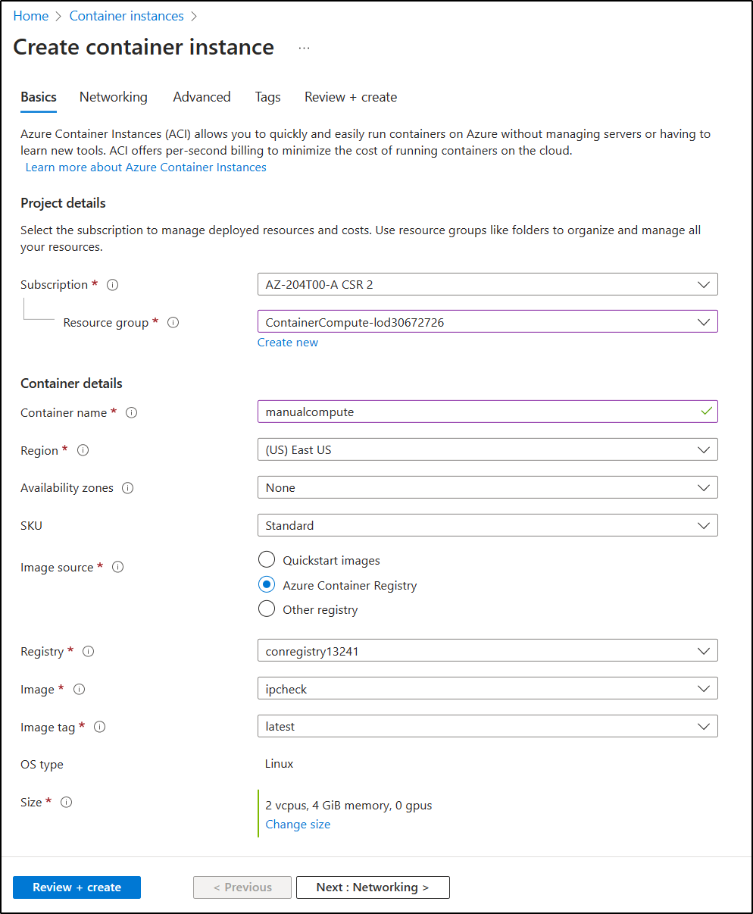

---
lab:
  az204Title: 'Lab 05: Deploy compute workloads by using images and containers'
  az204Module: 'Learning Path 05: Implement containerized solutions'
---

# 랩 05: 이미지 및 컨테이너를 사용하여 컴퓨팅 워크로드 배포

## Microsoft Azure 사용자 인터페이스

Microsoft 클라우드 도구의 동적 특성을 감안할 때, 이 학습 콘텐츠를 개발한 후 Azure UI가 변경될 수 있습니다. 따라서 랩 지침 및 랩 단계가 올바르게 정렬되지 않을 수 있습니다.

Microsoft는 커뮤니티에서 변경해야 할 사항이 있음을 알려줄 때 이 학습 과정을 업데이트합니다. 그러나 클라우드 업데이트가 자주 이루어지기 때문에 이 학습 콘텐츠가 업데이트되기 전에 UI가 변경될 수 있습니다. **이 경우 변경 사항에 적응하고 필요에 따라 랩에서 작업합니다.**

## Instructions

### 시작하기 전에

#### 랩 환경에 로그인

다음 자격 증명을 사용하여 Windows 10 VM(가상 머신)에 로그인합니다.

- 사용자 이름: `Admin`
- 암호: `Pa55w.rd`

> **참고**: 강사가 가상 랩 환경 연결에 대한 지침을 제공합니다.

#### 설치된 애플리케이션 검토

Windows 10 데스크톱에서 작업 표시줄을 찾습니다. 작업 표시줄에는 다음을 포함하여 이 랩에서 사용할 애플리케이션에 대한 아이콘이 포함되어 있습니다.

-   Microsoft Edge
-   파일 탐색기

## 랩 시나리오

이 랩에서는 .NET 애플리케이션 및 docker 파일을 사용하여 Azure Container Registry에 컨테이너를 만들고 배포하는 방법을 살펴봅니다. 또한 Azure Container Apps에 컨테이너화된 솔루션을 배포합니다.

## 아키텍처 다이어그램


### 연습 1: Docker 컨테이너 이미지를 만들고 Azure Container Registry에 배포합니다.

#### 작업 1: Azure Portal 열기

1. 작업 표시줄에서 **Microsoft Edge** 아이콘을 선택합니다.

1. 열린 브라우저 창에서 Azure Portal(`https://portal.azure.com`)로 이동한 다음, 이 랩에 사용할 계정으로 로그인합니다.

   > **참고**: Azure Portal에 처음 로그인하는 경우 포털 둘러보기가 제공됩니다. 둘러보기를 건너뛰고 Portal 사용을 시작하려면 **시작하기**를 선택합니다.

#### 작업 2: 리소스 그룹 만들기

1. Azure Portal 탐색 창에서 **리소스, 서비스 및 문서 검색** 텍스트 상자를 사용하여 **리소스 그룹**을 검색한 다음, 결과 목록에서 **리소스 그룹**을 선택합니다.

1. **리소스 그룹** 창에서 **만들기**를 선택합니다.

1. **리소스 그룹 만들기** 창의 **기본 사항** 탭에서 다음 작업을 수행하고 **검토 + 만들기**를 선택합니다.

    | 설정 | 작업 |
    | -- | -- |
    | **구독** 드롭다운 목록 | 기본값을 유지합니다.  |
    | **리소스 그룹** 텍스트 상자 | **ContainerCompute**를 입력합니다. |
    | **지역** 드롭다운 목록 | **(미국) 미국 동부**를 선택합니다. |

    다음 스크린샷은 **리소스 그룹 만들기** 창에 구성된 설정을 보여 줍니다.

    

1. **검토 + 만들기** 탭에서 이전 단계에서 선택한 옵션을 검토합니다.

1. 지정된 구성을 사용하여 리소스 그룹을 만들려면 **만들기**를 선택합니다.  

    > **참고**: 이 랩을 진행하기 전에 만들기 작업이 완료될 때까지 기다립니다.


#### 작업 3: Cloud Shell 및 편집기 열기

1. Azure Portal에서 **Cloud Shell** 아이콘 을 선택하여 새 PowerShell 세션을 엽니다. Cloud Shell 기본값이 PowerShell 세션인 경우 **PowerShell**을 선택한 다음, 드롭다운 메뉴에서 **Bash**를 선택합니다.

    > **참고**: **Cloud Shell** 아이콘은 더 큼 기호(\>)와 밑줄 문자(\_)로 표시됩니다.

    > **참고**: **Cloud Shell**을 처음 시작하는 경우 **Bash** 또는 **PowerShell**을 선택하라는 메시지가 표시되면 **Bash**를 선택합니다. **탑재된 스토리지가 없음** 메시지가 표시되면 이 랩에서 사용하는 구독을 선택하고 **스토리지 만들기**를 선택합니다.  

1. 포털의 **Cloud Shell** 명령 프롬프트에서 다음 명령을 실행하여 루트 디렉터리에서 **\~/clouddrive** 디렉터리로 이동합니다.

    ```
    cd ~/clouddrive
    ```

1. 다음 명령을 실행하여 **\~/clouddrive** 디렉터리에 **ipcheck**라는 새 디렉터리를 만듭니다.

    ```
    mkdir ipcheck
    ```

1. 다음 명령을 실행하여 활성 디렉터리를 **\~/clouddrive**에서 **\~/clouddrive/ipcheck**로 변경합니다.

    ```
    cd ~/clouddrive/ipcheck
    ```

1. 다음 명령을 실행하여 현재 디렉터리에 새 .NET 콘솔 애플리케이션을 만듭니다.

    ```
    dotnet new console --output . --name ipcheck --framework net7.0
    ```

1. 다음 명령을 실행하여 **\~/clouddrive/ipcheck** 디렉터리에 **Dockerfile**이라는 새 파일을 만듭니다.

    ```
    touch Dockerfile
    ```

1. 다음 명령을 실행하여 현재 디렉터리의 컨텍스트에서 포함된 그래픽 편집기를 엽니다.

    ```
    code .
    ```

#### 작업 4: .NET 애플리케이션 만들기 및 테스트

1. 그래픽 편집기의 **파일** 창에서 **Program.cs** 파일을 선택하여 편집기에서 해당 파일을 엽니다.

1. **Program.cs** 파일의 전체 내용을 삭제합니다.

1. 다음 코드를 복사하여 **Program.cs** 파일에 붙여넣습니다.

    ```csharp
    public class Program
    {
        public static void Main(string[] args)
        {        
            // Check if network is available
            if (System.Net.NetworkInformation.NetworkInterface.GetIsNetworkAvailable())
            {
                System.Console.WriteLine("Current IP Addresses:");

                // Get host entry for current hostname
                string hostname = System.Net.Dns.GetHostName();
                System.Net.IPHostEntry host = System.Net.Dns.GetHostEntry(hostname);
                
                // Iterate over each IP address and render their values
                foreach(System.Net.IPAddress address in host.AddressList)
                {
                    System.Console.WriteLine($"\t{address}");
                }
            }
            else
            {
                System.Console.WriteLine("No Network Connection");
            }
        }
    }
    ```

1. 그래픽 편집기의 메뉴 또는 Ctrl+S 키보드 바로 가기 키를 사용하여 **Program.cs** 파일을 저장합니다.  그래픽 편집기는 닫지 마세요.

1. 명령 프롬프트로 돌아가서 다음 명령을 실행하여 애플리케이션을 실행합니다.

    ```
    dotnet run
    ```

1. 실행 결과를 검토합니다. Cloud Shell 인스턴스에 대해 하나 이상의 IP 주소가 나열되어야 합니다.

1. 그래픽 편집기에서 편집기의 **파일** 창에서 **Dockerfile** 파일을 선택하여 편집기에서 해당 파일을 엽니다.

1. 다음 코드를 복사하여 **Dockerfile** 파일에 복사하여 붙여넣습니다.

    ```
    # Start using the .NET 6 SDK container image
    FROM mcr.microsoft.com/dotnet/sdk:7.0 AS build

    # Change current working directory
    WORKDIR /app

    # Copy existing files from host machine
    COPY . ./

    # Publish application to the "out" folder
    RUN dotnet publish --configuration Release --output out

    # Start container by running application DLL
    ENTRYPOINT ["dotnet", "out/ipcheck.dll"]
    ```

1. 그래픽 편집기의 메뉴 또는 Ctrl+S 키보드 바로 가기 키를 사용하여 **Dockerfile** 파일을 저장합니다.

1. 다음 작업을 위해 Cloud Shell을 열어 둡니다.

#### 작업 5: Container Registry 리소스 만들기

1. 포털의 **Cloud Shell** 명령 프롬프트에서 다음 명령을 실행하여 Container Registry 리소스에 대한 고유한 값으로 변수를 만듭니다. 

    ```bash
    registryName=conregistry$RANDOM
    ```

1. 포털의 **Cloud Shell** 명령 프롬프트에서 다음 명령을 실행하여 이전 단계에서 만든 이름을 사용할 수 있는지 확인합니다. 

    ```bash
    az acr check-name --name $registryName
    ```

    결과에 해당 이름을 사용할 수 있다고 표시되면 다음 단계를 계속 진행합니다. 이름을 사용할 수 없으면 이전 단계에서 명령을 다시 실행하고 사용 가능한지 다시 확인합니다.

1. 포털의 **Cloud Shell** 명령 프롬프트에서 다음 명령을 실행하여 Container Registry 리소스를 만듭니다. 

    ```bash
    az acr create --resource-group ContainerCompute --name $registryName --sku Basic
    ```

    > **참고**: 이 랩을 계속 진행하기 전에 만들기 작업이 완료될 때까지 기다립니다.

#### 작업 6: Container Registry 메타데이터 저장

1. 포털의 **Cloud Shell** 명령 프롬프트에서 다음 명령을 실행하여 구독의 모든 컨테이너 레지스트리 목록을 가져옵니다.

    ```
    az acr list
    ```

1. 다음 명령을 실행하여 레지스트리 이름이 출력으로 표시되는지 확인합니다. '[]' 이외의 출력이 표시되지 않으면 잠시 기다렸다가 명령을 다시 실행해 보세요.

    ```
    az acr list --query "max_by([], &creationDate).name" --output tsv
    ```

1. 다음 명령을 실행합니다.

    ```
    acrName=$(az acr list --query "max_by([], &creationDate).name" --output tsv)
    ```

1. 다음 명령을 실행합니다.

    ```
    echo $acrName
    ```

#### 작업 7: Container Registry에 Docker 컨테이너 이미지를 배포합니다.

1. 다음 명령을 실행하여 활성 디렉터리를 **\~/** 에서 **\~/clouddrive/ipcheck**로 변경합니다.

    ```
    cd ~/clouddrive/ipcheck
    ```

1. 다음 명령을 실행하여 현재 디렉터리의 내용을 가져옵니다.

    ```
    dir
    ```

1. 다음 명령을 실행하여 컨테이너 레지스트리에 소스 코드를 업로드하고 Container Registry 작업으로 컨테이너 이미지를 빌드합니다.

    ```
    az acr build --registry $acrName --image ipcheck:latest .
    ```

    > **참고**: 이 랩을 진행하기 전에 빌드 작업이 완료할 때까지 기다립니다.

1. 포털에서 **Cloud Shell** 창을 닫습니다.

#### 작업 8: Container Registry의 컨테이너 이미지 유효성 검사

1. Azure Portal의 **탐색** 창에서 **리소스 그룹** 링크를 선택합니다.

1. **리소스 그룹** 창에서 이전에 이 랩에서 만든 **ContainerCompute** 리소스 그룹을 선택합니다.

1. **ContainerCompute** 창에서 이전에 이 랩에서 만든 컨테이너 레지스트리를 선택합니다.

1. **Container Registry** 창의 **서비스** 섹션에서 **리포지토리** 링크를 선택합니다.

1. **리포지토리** 섹션에서 **ipcheck** 컨테이너 이미지 리포지토리를 선택한 다음, **latest** 태그를 선택합니다.

1. **latest** 태그가 있는 컨테이너 이미지 버전에 대한 메타데이터를 검토합니다.

    > **참고**: **ID 실행** 링크를 선택하여 빌드 작업에 대한 메타데이터를 볼 수도 있습니다.

#### 검토

이 연습에서는 컴퓨터의 현재 IP 주소를 표시하는 .NET 콘솔 애플리케이션을 만들었습니다. 그 다음 Docker 컨테이너 이미지로 변환하기 위해 애플리케이션에 **Dockerfile** 파일을 추가했습니다. 마지막으로 컨테이너 레지스트리에 컨테이너 이미지를 배포했습니다.

### 연습 2: Azure Container Instance 배포

#### 작업 1: 컨테이너 레지스트리에서 관리 사용자 활성화

1. **ContainerCompute** 리소스 그룹에서 이 랩에서 이전에 만든 컨테이너 레지스트리를 선택한 다음, 액세스 키** 블레이드를 **선택합니다.

1. 관리 사용자 섹션에서 스위치를 전환하여 이 컨테이너 레지스트리에 대한 관리자 사용자를 사용하도록 설정합니다.

#### 작업 2: Azure 컨테이너 인스턴스에 컨테이너 이미지를 자동 배포합니다.

1. **Container Registry** 창의 **서비스** 섹션에서 **리포지토리** 링크를 선택합니다.

1. **리포지토리** 섹션에서 **ipcheck** 컨테이너 이미지 리포지토리를 선택합니다.

1. **리포지토리** 창에서 **latest** 태그 항목과 연결된 줄임표 메뉴를 선택한 다음, **인스턴스 실행**을 선택합니다.

1. **컨테이너 인스턴스 만들기** 블레이드에서 다음 작업을 수행하고 **만들기**를 선택합니다.

    | 설정 | 작업 |
    | -- | -- |
    | **컨테이너 이름** 텍스트 상자 | **managedcompute**를 입력합니다. |
    | **컨테이너 이미지** 텍스트 상자 | 기본값을 유지합니다. |
    | **OS 유형** 섹션 | **Linux**를 선택합니다. |
    | **구독** 텍스트 상자 | 기본값을 유지합니다. |
    | **리소스 그룹** 드롭다운 목록 | **ContainerCompute**를 선택합니다. |
    | **위치** 드롭다운 목록 | **미국 동부**를 선택합니다. |
    | **코어 수** 드롭다운 목록 | **2**를 선택합니다. |
    | **메모리(GB)** 텍스트 상자 | **4**를 입력합니다. |
    | **공용 IP 주소** 섹션 | **아니요**를 선택합니다. |

    다음 스크린샷은 **컨테이너 인스턴스 만들기** 창에 구성된 설정을 보여 줍니다.

    

    > **참고**: 이 랩을 계속 진행하기 전에 컨테이너 인스턴스가 만들어질 때까지 기다립니다.

#### 작업 3: Container Instances에 컨테이너 이미지를 수동 배포

1. Azure Portal의 **탐색** 창에서 **리소스 만들기** 링크를 선택합니다.

1. **리소스 만들기** 창의 **검색 서비스 및 마켓플레이스** 텍스트 상자에 **컨테이너 인스턴스**를 입력한 다음, Enter 키를 선택합니다.

1. **Marketplace** 검색 결과 창에서 **Container Instances** 결과를 선택합니다.

1. **Container Instances** 창에서 **만들기**를 선택합니다.

1. **컨테이너 인스턴스 만들기** 창의 **기본 사항** 탭에서 다음 작업을 수행하고 **검토 + 만들기**를 선택합니다.

    | 설정 | 작업 |
    | -- | -- |
    | **구독** 드롭다운 목록 | 기본값을 유지합니다. |
    | **리소스 그룹** 드롭다운 목록 | **ContainerCompute**를 선택합니다. |
    | **컨테이너 이름** 텍스트 상자 | **manualcompute**를 입력합니다. |
    | **지역** 드롭다운 목록 | **(미국) 미국 동부**를 선택합니다. |
    | **이미지 원본** 섹션 | **Azure Container Registry**를 선택합니다. |
    | **레지스트리** 드롭다운 목록 | 이 랩에서 이전에 만든 **Azure Container Registry** 리소스를 선택합니다. |
    | **이미지** 드롭다운 목록 | **ipcheck**를 선택합니다. |
    | **이미지 태그** 드롭다운 목록 | **latest**를 선택합니다. |
    | **크기 : 코어**  | **2**를 입력합니다. |
    | **크기 : 메모리(GiB)** | **4**를 입력합니다. |

    다음 스크린샷은 **컨테이너 인스턴스 만들기** 창에 구성된 설정을 보여 줍니다.

    

1. **검토 + 만들기** 탭에서 선택한 옵션을 검토합니다.

1. 지정된 구성을 사용하여 컨테이너 인스턴스를 만들려면 **만들기**를 선택합니다.  

    > **참고**: 이 랩을 계속 진행하기 전에 컨테이너 인스턴스가 만들어질 때까지 기다립니다.


#### 작업 4: 컨테이너 인스턴스가 성공적으로 실행되었는지 확인

1. Azure Portal의 탐색 창에서 **리소스 그룹** 링크를 선택합니다.

1. **리소스 그룹** 창에서 이전에 이 랩에서 만든 **ContainerCompute** 리소스 그룹을 선택합니다.

1. **ContainerCompute** 창에서 이전에 이 랩에서 만든 **manualcompute** 컨테이너 인스턴스를 선택합니다.

1. **Container Instances** 창의 **설정** 섹션에서 **컨테이너** 링크를 선택합니다.

1. **컨테이너** 섹션에서 **이벤트** 목록을 검토합니다.

1. **로그** 탭을 선택하고 컨테이너 인스턴스에서 텍스트 로그를 검토합니다.

> **참고**: 필요에 따라 **이벤트** 및 **로그**를 **managedcompute** 컨테이너 인스턴스에서 볼 수도 있습니다.

> **참고**: 이 시점에는 **manualcompute** 및 **managedcompute**에 아무 이벤트도 포함되지 않을 수 있습니다.

> **참고**: 애플리케이션 실행이 완료되면 작업이 완료되었기 때문에 컨테이너가 종료됩니다. 수동으로 만든 컨테이너 인스턴스의 경우 성공적인 종료를 허용하도록 설정해두었기 때문에 컨테이너가 한 번 실행되었습니다. 자동으로 만든 인스턴스는 이 옵션을 제공하지 않으며, 컨테이너가 항상 실행되어야 한다고 가정하므로 컨테이너가 반복적으로 다시 시작하는 것을 볼 수 있습니다.

#### 검토

이 연습에서는 다양한 메서드를 사용하여 컨테이너 이미지를 Azure 컨테이너 인스턴스에 배포했습니다. 수동 메서드를 사용하면 배포를 추가 지정할 수 있으며 컨테이너 실행의 일부로 작업 기반 애플리케이션을 실행할 수 있습니다.


### 연습 3: 안전한 Container Apps 환경을 만들고 컨테이너 앱 배포.

#### 작업 1: 환경 준비

1. Azure Portal에 로그인합니다.

1. **Cloud Shell** 아이콘을 선택하고 **Bash** 환경을 선택합니다.

1. 포털의 **Cloud Shell** 명령 프롬프트에서 다음 명령을 실행하여 CLI용 Azure Container Apps 확장을 설치합니다. 

    ```bash
    az extension add --name containerapp --upgrade
    ```

1. 다음 명령을 실행하여 Microsoft.App 네임스페이스를 등록합니다. 

    ```bash
    az provider register --namespace Microsoft.App
    ```
   
   > **참고**: Azure Container Apps 리소스가 **Microsoft.Web** 네임스페이스에서 **Microsoft.App** 네임스페이스로 마이그레이션되었습니다.

1. **Microsoft.OperationalInsights** 공급자를 이전에 사용하지 않았다면 다음 명령을 실행하여 Azure Monitor Log Analytics 작업 영역에 등록합니다. 

    ```bash
    az provider register --namespace Microsoft.OperationalInsights
    ```

    > **참고**: **Microsoft.App** 네임스페이스 및 **Microsoft.OperationalInsights** 등록을 완료하는 데 각각 몇 분이 걸릴 수 있습니다.

1. 이번 연습에서 나중에 사용할 환경 변수를 설정합니다. 
   
   ```bash
     myRG=ContainerCompute
     myAppContEnv=az204-env-$RANDOM
    ```

CLI가 업그레이드되고 환경 변수가 생성되면 Container Apps 환경을 만들고 컨테이너 앱을 배포할 수 있습니다.

#### 작업 2: 환경 만들기

Azure Container Apps의 환경은 컨테이너 앱 그룹 주위에 보안 경계를 만듭니다. 동일한 환경에 배포된 컨테이너 앱은 동일한 가상 네트워크에 배포되고 동일한 Log Analytics 작업 영역에 로그를 씁니다.

1. 포털의 **Cloud Shell** 명령 프롬프트에서 `az containerapp env` create 명령을 사용하여 다음 명령을 실행하여 환경을 만듭니다. 

    ```bash
    az containerapp env create \
        --name $myAppContEnv \
        --resource-group $myRG \
        --location eastus
    ```

#### 작업 3: 컨테이너 앱 만들기

컨테이너 앱 환경의 배포가 완료되면 컨테이너 이미지를 Azure Container Apps에 배포합니다.

1. 포털의 **Cloud Shell** 명령 프롬프트에서 `az containerapp create` 명령을 사용하여 다음 명령을 실행하여 샘플 앱 컨테이너 이미지를 배포합니다. 

    ```bash
    az containerapp create \
        --name my-container-app \
        --resource-group $myRG \
        --environment $myAppContEnv \
        --image mcr.microsoft.com/azuredocs/containerapps-helloworld:latest \
        --target-port 80 \
        --ingress 'external' \
        --query properties.configuration.ingress.fqdn
    ```
`--ingress`를 `external`로 설정하면 컨테이너 앱에서 퍼블릭 요청을 사용할 수 있습니다. 명령이 앱에 액세스할 수 있는 링크를 반환합니다.

1. `az containerapp create` 명령으로 반환된 링크를 선택하여 컨테이너 앱이 실행 중인지 확인합니다.

