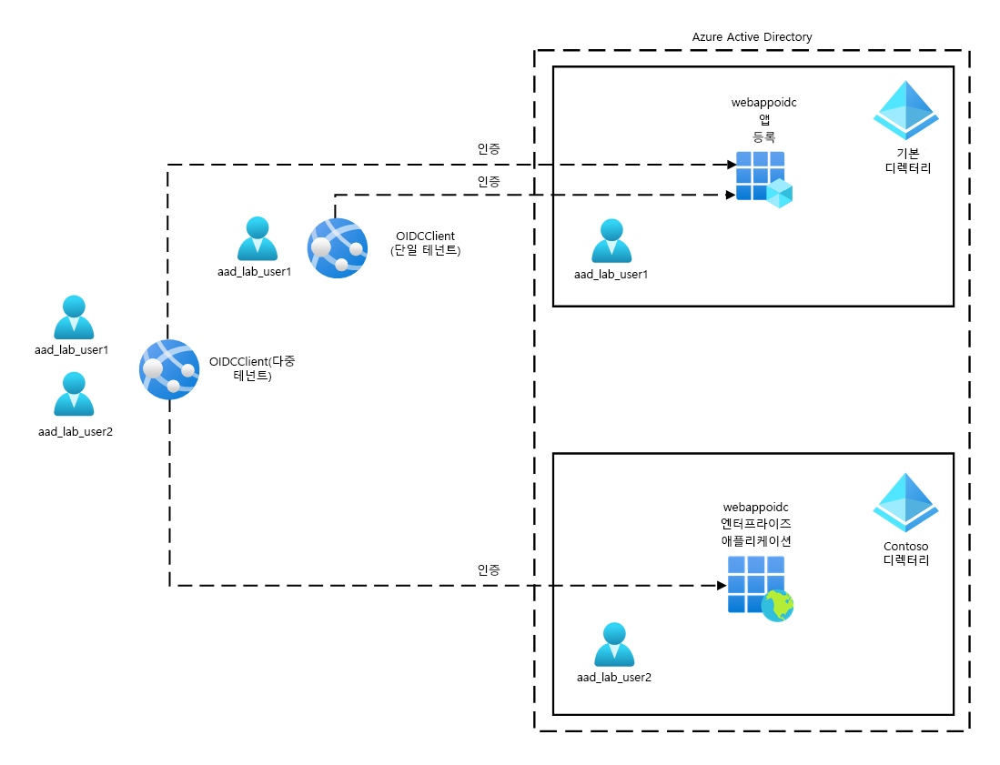
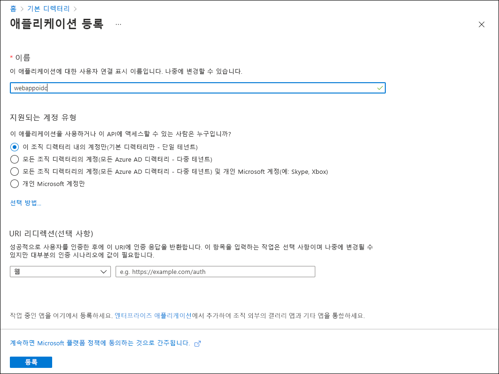
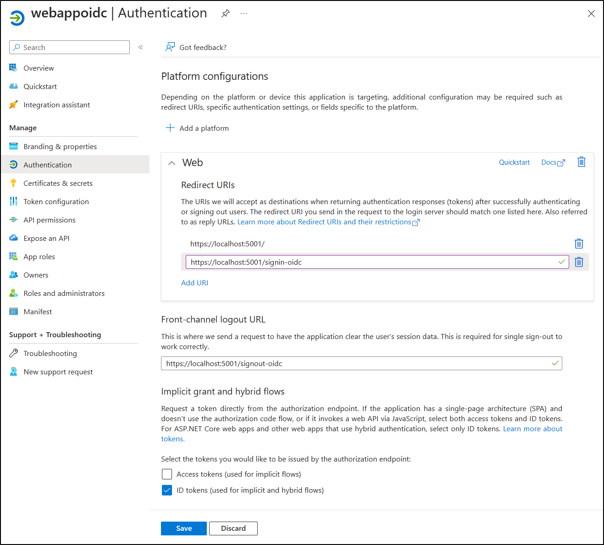

---
lab:
    az204Title: '랩 06: MSAL 및 .NET SDK를 사용하여 Microsoft Graph 인증 및 쿼리'
    az020Title: '랩 06: MSAL 및 .NET SDK를 사용하여 Microsoft Graph 인증 및 쿼리'
    az204Module: '모듈 06: 사용자 인증 및 권한 부여 구현'
    az020Module: '모듈 06: 사용자 인증 및 권한 부여 구현'
---

# 랩 06: OpenID Connect, MSAL 및 .NET SDK를 사용하여 인증

## Microsoft Azure 사용자 인터페이스

Microsoft 클라우드 도구의 동적 특성을 감안할 때, 이 교육 콘텐츠를 개발한 후 Azure UI가 변경될 수도 있습니다. 따라서 랩 지침 및 랩 단계가 정확히 일치하지는 않을 수 있습니다.

Microsoft는 커뮤니티에서 변경 사항이 필요하다는 것이 확인되면 이 학습 과정을 업데이트합니다. 그러나 클라우드 업데이트가 자주 이루어지기 때문에 이 교육 콘텐츠가 업데이트되기 전에 UI가 변경될 수 있습니다. **이 경우 변경 사항에 적응하고 필요에 따라 랩에서 작업합니다.**

## 지침

### 시작하기 전에

#### 랩 환경에 로그인

다음 자격 증명을 사용하여 Windows 10 VM(가상 머신)에 로그인합니다.
    
-   사용자 이름: **Admin**

-   암호: **Pa55w.rd**

> **참고**: 가상 랩 환경에 연결하기 위한 지침을 강사가 제공할 것입니다.

#### 설치된 애플리케이션 검토

Windows 10 데스크톱에서 작업 표시줄을 찾습니다. 작업 표시줄에는 다음과 같이 이 랩에서 사용할 애플리케이션에 대한 아이콘이 포함되어 있습니다.
    
-   Microsoft Edge

-   Visual Studio Code

## 아키텍처 다이어그램



### 연습 1: 단일 테넌트 Azure AD 환경 구성

#### 작업 1: Azure Portal 열기

1.  작업 표시줄에서 **Microsoft Edge** 아이콘을 선택합니다.

1.  열린 브라우저 창에서 Azure Portal([portal.azure.com](https://portal.azure.com))로 이동한 다음 이 랩에서 사용할 계정으로 로그인합니다.

    > **참고**: Azure Portal에 처음 로그인하는 경우 포털 둘러보기가 제공됩니다. 둘러보기를 건너뛰고 포털 사용을 시작하려면 **시작하기**를 선택합니다.

#### 작업 2: Azure AD에서 애플리케이션 등록

1.  Azure Portal에서 **리소스, 서비스 및 문서 검색** 텍스트 상자를 사용하여 **Azure Active Directory**를 검색한 다음 결과 목록에서 **Azure Active Directory**를 선택합니다.

    > **참고**: 그러면 브라우저 세션이 Azure 구독과 연결된 Azure Active Directory(Azure AD) 테넌트의 블레이드로 리디렉션됩니다.

1.  **Azure Active Directory** 블레이드의 **관리** 섹션에서 **앱 등록**을 선택합니다.

1.  **앱 등록** 섹션에서 **+ 새 등록**을 선택합니다.

1.  **애플리케이션 등록** 섹션에서 다음 작업을 수행하고 **등록**을 선택합니다.
    
    | 설정                          | 작업                                                       |
    | -------------------------------- | ------------------------------------------------------------ |
    | **이름** 텍스트 상자                | **webappoidc**를 입력합니다.                                         |
    | **지원되는 계정 유형** 목록 | **이 조직 디렉터리내의 계정만(기본 디렉터리만 - 단일 테넌트)** 을 선택합니다. |

   
    **애플리케이션 등록** 섹션에 구성된 설정이 다음 스크린샷에 나와 있습니다.
          
     
      
    
#### 작업 3: 고유 식별자 기록

1.  **webappoidc** 애플리케이션 등록 블레이드에서 **개요**를 선택합니다.

1.  **개요** 섹션에서 **애플리케이션(클라이언트) ID** 텍스트 상자의 값을 찾아 기록합니다. 이 값은 랩에서 나중에 사용합니다.

1.  **개요** 섹션에서 **디렉터리(테넌트) ID** 텍스트 상자의 값을 찾아 기록합니다. 이 값은 랩에서 나중에 사용합니다.

#### 작업 4: 애플리케이션 인증 설정 구성

1.  **webappoidc** 애플리케이션 등록 블레이드의 **관리** 섹션에서 **인증**을 선택합니다.

1.  **인증** 섹션에서 다음 작업을 수행하고 **구성**을 선택합니다.

    | 설정                     | 작업                                                       |
    | --------------------------- | ------------------------------------------------------------ |
    | **플랫폼 구성** 섹션      | **+ 플랫폼 추가**를 선택합니다.                    |
    | **플랫폼 구성** 블레이드  | **웹**을 선택합니다.                                    |
    | **리디렉션 URI** 텍스트 상자 | `https://localhost:44321/`을 입력합니다.                                      |
    | **프런트 채널 로그아웃 URL** 텍스트 상자   | `https://localhost:44321/signout-oidc`를 입력합니다.  |
        
1. **플랫폼 구성** 섹션으로 돌아와 **URI 추가**를 선택하고 `https://localhost:44321/signin-oidc`를 입력합니다.

1. **암시적 허용 및 하이브리드 흐름** 섹션에서 **ID 토큰(암시적 및 하이브리드 흐름에 사용됨)** 을 선택합니다. 

1. **저장**을 선택합니다.

    **인증** 블레이드에 구성된 설정이 다음 스크린샷에 나와 있습니다.
          
     
       

#### 작업 5: Azure AD 사용자 만들기

1.  Azure Portal에서 **Cloud Shell** 아이콘()을 선택하여 새 PowerShell 세션을 엽니다. Cloud Shell의 기본 세션이 Bash 세션이라면 **Bash**를 선택하고 드롭다운 메뉴에서 **PowerShell**을 선택합니다.

     > **참고**: **Cloud Shell**을 처음 시작하는 경우에는 **Bash** 또는 **PowerShell** 중에서 선택하라는 메시지가 나타날 때 **PowerShell**을 선택합니다. **탑재된 스토리지가 없음**이라는 메시지가 표시되면 이 랩에서 사용하는 구독을 선택하고 **스토리지 만들기**를 선택합니다.

1.  **Cloud Shell** 창에서 다음 명령을 실행하여 Azure 구독과 연결된 Azure AD 테넌트에 로그인합합니다.

      ```powershell
       Connect-AzureAD
      ```

1.  다음 명령을 실행하여 Azure AD 테넌트의 기본 DNS(Domain Name System) 도메인 이름을 검색해 표시합니다.

       ```powershell
       $aadDomainName = ((Get-AzureAdTenantDetail).VerifiedDomains)[0].Name
       $aadDomainName
       ```

    > **참고**: DNS 도메인 이름의 값을 적어 둡니다. 이 값은 랩에서 나중에 사용합니다.

1.  다음 명령을 실행하여 Azure AD 인증을 테스트하는 데 사용할 Azure AD 사용자를 만듭니다.

       ```powershell
       $passwordProfile = New-Object -TypeName Microsoft.Open.AzureAD.Model.PasswordProfile
       $passwordProfile.Password = 'Pa55w.rd1234'
       $passwordProfile.ForceChangePasswordNextLogin = $false
       New-AzureADUser -AccountEnabled $true -DisplayName 'aad_lab_user1' -PasswordProfile $passwordProfile -MailNickName 'aad_lab_user1' -UserPrincipalName "aad_lab_user1@$aadDomainName" 
       ```

1.  다음 명령을 실행하여 새로 만든 Azure AD 사용자의 UPN(사용자 계정 이름)을 식별합니다.

       ```powershell
       (Get-AzureADUser -Filter "MailNickName eq 'aad_lab_user1'").UserPrincipalName
       ```

    > **참고**: UPN을 적어 둡니다. 이 값은 랩에서 나중에 사용합니다.

1.  Cloud Shell 창을 닫습니다.

#### 복습

이 연습에서는 단일 테넌트 Azure AD 애플리케이션을 등록하고 Azure AD 사용자 계정을 만들었습니다.

### 연습 2: 단일 테넌트 ASP.NET Core 웹앱 만들기

#### 작업 1: ASP.NET Core 웹앱 프로젝트 만들기

1.  랩 컴퓨터에서 **명령 프롬프트**를 시작합니다.

1.  명령 프롬프트에서 다음 명령을 실행하여 **Allfiles (F):\\Allfiles\\Labs\\06\\Starter\\OIDCClientST** 디렉터리를 만든 후 작업 디렉터리로 설정합니다.

    ```powershell
    F:
    md "F:\Allfiles\Labs\06\Starter\OIDCClient"
    cd F:\Allfiles\Labs\06\Starter\OIDCClient
    ```

1.  다음 명령을 실행하여 MVC(Model View Controller) 템플릿을 기준으로 새 .NET Core 웹앱을 만듭니다(`<application_ID>`, `<tenant_ID>`, `<domain_Name>` 자리 표시자는 이 랩 앞부분에서 적어 둔 해당 값으로 바꿈).

    ```powershell
    dotnet new mvc --auth SingleOrg --client-id <application_ID> --tenant-id <tenant_ID> --domain <domain_Name>
    rmdir .\obj /S /Q
    ```

1.  랩 컴퓨터에서 Visual Studio Code를 시작합니다.

1.  **파일** 메뉴에서 **폴더 열기**를 선택합니다.

1.  **파일 탐색기** 창에서 **Allfiles (F):\\Allfiles\\Labs\\06\\Starter\\OIDCClient** 로 이동하여 **폴더 선택**을 선택합니다.

1.  Visual Studio Code **탐색기** 창에서 MVC 웹앱을 나타내는 자동 생성된 폴더 구조를 검토합니다.

1.  **Properties** 폴더로 이동해 **launchSettings.json** 파일을 열고 다음 변경 내용을 적용합니다.

    
    | 섹션         | 속성           | 값                                                   |
    | --------------- | ------------------ | ------------------------------------------------------- |
    | **iisSettings** | **sslPort**        | **44321**                                               |
    | **OIDCClient**  | **applicationUrl** | `https://localhost:44321` |
    

    > **참고**: 포트 번호는 Azure AD 앱 등록 작성 시에 지정했던 값과 일치해야 합니다.

1.  파일을 저장하고 닫습니다.

1.  Visual Studio Code **탐색기** 창에서 **OIDCClient.csproj**를 선택합니다.

1.  `<TargetFramework>` 요소의 값이 **netcoreapp3.1**로 설정되어 있는지 확인합니다.

1.  `Microsoft.AspNetCore.Authentication.JwtBearer` 및 `Microsoft.AspNetCore.Authentication.OpenIdConnect` NuGet 패키지의 버전을 **3.1.18**로 설정합니다.

1.  `Microsoft.Identity.Web` 및 `Microsoft.Identity.Web.UI` NuGet 패키지의 버전을 **0.3.1-preview**로 설정합니다.

1.  `<WebProject_DirectoryAccessLevelKey>0</WebProject_DirectoryAccessLevelKey>` 항목을 제거합니다.

1.  `<PackageReference Include="Microsoft.AspNetCore.Authentication.AzureAD.UI" Version="3.1.7" />` 항목을 제거합니다.

1.  **OIDCClient.csproj** 파일의 내용이 다음 목록과 비슷한지 확인하고(`UserSecretsId`의 값은 다름) 변경 내용을 저장합니다.

    ```csharp
    <Project Sdk="Microsoft.NET.Sdk.Web">
      <PropertyGroup>
        <TargetFramework>netcoreapp3.1</TargetFramework>
        <UserSecretsId>aspnet-OIDCClient-737DEB13-25D4-4C52-93C5-F485367E3C8C</UserSecretsId>
      </PropertyGroup>

      <ItemGroup>
        <PackageReference Include="Microsoft.AspNetCore.Authentication.JwtBearer" Version="3.1.18" NoWarn="NU1605" />
        <PackageReference Include="Microsoft.AspNetCore.Authentication.OpenIdConnect" Version="3.1.18" NoWarn="NU1605" />
        <PackageReference Include="Microsoft.Identity.Web" Version="0.3.1-preview" />
        <PackageReference Include="Microsoft.Identity.Web.UI" Version="0.3.1-preview" />
      </ItemGroup>

    </Project>
    ```

1.  **OIDCClient.csproj** 파일을 닫습니다.

1.  **Views\Shared** 폴더로 이동하여 **_LoginPartial.cshtml** 파일을 엽니다.

1.  다음 줄에서 `AzureAD`를 `MicrosoftIdentity`로 바꿉니다.

    ```csharp
    <a class="nav-link text-dark" asp-area="AzureAD" asp-controller="Account" asp-action="SignOut">Sign out</a>`
    ```

1.  다음 줄에서 `AzureAD`를 `MicrosoftIdentity`로 바꿉니다.

    ```csharp
    <a class="nav-link text-dark" asp-area="AzureAD" asp-controller="Account" asp-action="SignIn">Sign in</a>
    ```

1.  파일을 저장하고 닫습니다.

1.  **appsettings.json** 파일을 열어 다음 요소를 포함한 **AzureAd** 개체의 내용을 검토합니다.

    | 요소        | 값                                                        |
    | -------------- | ------------------------------------------------------------ |
    | `Instance`     | `https://login.microsoftonline.com/`                          |
    | `Domain`       | Azure 구독과 연결된 Azure AD 테넌트의 기본 DNS 도메인 |
    | `TenantId`     | Azure AD 테넌트의 GUID                                 |
    | `ClientId`     | Azure AD 테넌트에 등록한 애플리케이션의 애플리케이션(클라이언트) ID |
    | `CallbackPath` | `/signin-oidc`                                               |

1.  아무 항목도 변경하지 않고 파일을 닫습니다.

1.  Visual Studio Code **탐색기** 창에서 **Startup.cs**를 선택합니다.

1.  `using Microsoft.AspNetCore.Authentication.AzureAD.UI;` 지시문을 제거합니다.

1.  이전 단계에서 제거한 항목 바로 뒤에 다음 **using** 지시문을 추가합니다.

    ```csharp
    using Microsoft.AspNetCore.Authentication.OpenIdConnect;
    using Microsoft.Identity.Web;
    using Microsoft.Identity.Web.UI;
    ```

1.  다음 줄을 제거합니다.

    ```csharp
    services.AddAuthentication(AzureADDefaults.AuthenticationScheme)
      .AddAzureAD(options => Configuration.Bind("AzureAd", options));
    ```

1.  앞 단계에서 제거한 줄을 다음 줄로 바꿉니다.

    ```csharp
    services.AddAuthentication(OpenIdConnectDefaults.AuthenticationScheme)
      .AddMicrosoftIdentityWebApp(Configuration.GetSection("AzureAd"));
    ```

1.  다음 줄을 제거합니다.

    ```csharp
    services.AddRazorPages();
    ```

1.  앞 단계에서 제거한 줄을 다음 줄로 바꿉니다.

    ```csharp
    services.AddRazorPages()
      .AddMicrosoftIdentityUI();
    ```

1.  파일을 저장하고 닫습니다.

### 작업 2: 단일 테넌트 시나리오에서 단일 테넌트 웹앱 테스트

1.  **Visual Studio Code** 창에서 **탐색기** 창의 바로 가기 메뉴를 활성화한 다음 **통합 터미널에서 열기**를 선택합니다.

1.  다음 명령을 실행하여 .NET 웹앱을 빌드합니다.

    ```
    dotnet build
    ```

    > **참고**: 빌드 오류가 있는 경우 **Allfiles (F):\\Allfiles\\Labs\\06\\Solution\\OIDCClient** 폴더의 파일을 검토합니다.

1.  다음 명령을 실행하여 자체 서명된 인증서를 생성하고 로컬 컴퓨터가 해당 인증서를 신뢰하도록 구성합니다.

    ```
    dotnet dev-certs https --trust
    ```

1.  자동 생성된 인증서를 설치할지를 묻는 메시지가 표시되면 **예**를 선택합니다.

1.  터미널 프롬프트에서 다음 명령을 실행하여 .NET 웹앱을 실행합니다.

    ```
    dotnet run
    ```

1.  Microsoft Edge 브라우저를 **InPrivate** 모드로 실행한 다음 `https://localhost:44321` URL로 이동합니다.

1.  **연결이 비공개가 아님** 메시지가 표시되면 **고급**을 선택하고 **localhost로 계속 이동(안전하지 않음)** 링크를 선택합니다.

1.  열린 브라우저 창에서 메시지가 표시되면 이 랩 앞부분에서 만든 **aad_lab_user1** Azure AD 계정의 UPN을 사용하여 인증을 합니다. 암호로는 **Pa55w.rd1234**를 사용합니다.

1.  브라우저 창에서 **요청된 권한** 웹 페이지가 자동으로 열립니다.

1.  요청된 권한을 검토합니다. 해당 권한에는 **기본 프로필 보기** 및 **액세스 권한을 제공한 데이터에 대한 액세스 유지**가 포함됩니다.

1.  **수락**을 선택합니다.

1.  브라우저에 표시되는 대상 사이트의 **시작** 홈 페이지를 검토하여 브라우저 창에 **aad_user1** Azure AD 계정의 UPN이 표시되는지 확인합니다.

1.  **시작** 페이지에서 **로그아웃**을 선택합니다.

1.  로그아웃할 계정을 선택하라는 메시지가 표시되면 **aad_lab_user1** Azure AD 계정을 선택합니다. 그러면 **로그아웃됨** 페이지로 자동 리디렉션됩니다.

1.  **로그아웃됨** 페이지가 표시된 Microsoft Edge 브라우저를 열어 둡니다.

#### 복습 

이 연습에서는 단일 테넌트 웹앱을 구현한 후 단일 테넌트 Azure 환경에서 테스트했습니다.

### 연습 3: 다중 테넌트 Azure AD 환경 구성

#### 작업 1: Azure AD 테넌트 만들기

1.  Azure Portal이 표시되어 있는 Microsoft Edge 브라우저로 전환합니다.

1.  Azure Portal에서 **Azure Active Directory** 블레이드로 이동합니다

1.  **Azure Active Directory** 블레이드에서 **테넌트 관리**를 선택한 다음 **+ 만들기**를 선택합니다.

1.  **테넌트 만들기** 블레이드의 **기본** 탭에서 **Azure Active Directory** 옵션이 선택되어 있는지 확인하고 **다음: 구성 >** 을 선택합니다.

1.  **테넌트 만들기** 블레이드의 **구성** 탭에서 다음 설정을 지정합니다.

    | 설정 | 값 |
    | --- | --- |
    | 조직 이름 | **Contoso** |
    | 초기 도메인 이름 | 소문자와 숫자로 구성된 유효하며 문자로 시작하는 DNS 이름 |
    | 국가/지역 | 해당 국가 또는 지역의 이름 |

1.  **검토 + 만들기**를 선택한 다음 **만들기**를 선택합니다.

1.  메시지가 표시되면 제공된 코드를 **본인 인증이 필요합니다**.에 입력하고 **제출**을 선택합니다.

1.  프로비전이 완료될 때까지 기다렸다가 **Contoso** 링크를 선택하여 Contoso Azure AD 테넌트의 속성이 표시된 블레이드로 이동합니다.

1.  Azure AD 테넌트의 **개요** 블레이드에서 ***테넌트 ID** 속성의 값을 확인하여 적어 둡니다. 이 값은 랩에서 나중에 사용합니다.

#### 작업 2: Azure AD 사용자 만들기

1.  Azure Portal이 표시된 웹 브라우저 창에서 **디렉터리 + 구독** 도구 모음 아이콘을 선택합니다.

1.  **포털 설정 | 디렉터리 + 구독** 블레이드에서 구독과 연결된 Azure AD 테넌트를 나타내는 항목 옆의 **전환**을 선택합니다.

1.  Azure Portal에서 **Cloud Shell** 아이콘을 선택하여 새 PowerShell 세션을 엽니다. 

1.  **Cloud Shell** 창에서 다음 명령을 실행하여 Contoso Azure AD 테넌트에 로그인합니다. `<tenant_Id>` 자리 표시자는 이전 작업에서 확인한 테넌트 ID 속성의 값으로 바꿉니다.

       ```powershell
       Import-Module AzureAD.Standard.Preview
       AzureAD.Standard.Preview\Connect-AzureAD -TenantID '<tenant_ID>'
       ```
1.  Ctrl 키를 누른 상태로 경고 상자의 URL을 클릭하여 브라우저 창을 열고 표시되는 단계를 진행하여 인증을 합니다.  

1.  다음 명령을 실행하여 Azure AD 테넌트의 DNS 도메인 이름을 검색합니다.

       ```powershell
       $aadDomainName = ((Get-AzureAdTenantDetail).VerifiedDomains)[0].Name
       ```

1.  다음 명령을 실행하여 Azure AD 인증을 테스트하는 데 사용할 Azure AD 사용자를 만듭니다.

       ```powershell
       $passwordProfile = New-Object -TypeName Microsoft.Open.AzureAD.Model.PasswordProfile
       $passwordProfile.Password = 'Pa55w.rd1234'
       $passwordProfile.ForceChangePasswordNextLogin = $false
       New-AzureADUser -AccountEnabled $true -DisplayName 'aad_lab_user2' -PasswordProfile $passwordProfile -MailNickName 'aad_lab_user2' -UserPrincipalName "aad_lab_user2@$aadDomainName"
       ```

1.  다음 명령을 실행하여 새로 만든 Azure AD 사용자의 UPN을 식별합니다.

       ```powershell
       (Get-AzureADUser -Filter "MailNickName eq 'aad_lab_user2'").UserPrincipalName
       ```

    > **참고**: UPN을 적어 둡니다. 이 값은 랩에서 나중에 사용합니다.

1.  **Cloud Shell** 창을 닫습니다.

### 작업 3: 다중 테넌트 시나리오에서 단일 테넌트 웹앱 테스트

1.  **InPrivate** 모드에서 **로그아웃됨** 페이지가 표시된 Microsoft Edge 브라우저로 다시 전환해 **로그인**을 선택합니다.

1.  열린 브라우저 창에서 메시지가 표시되면 이 연습 앞부분에서 만든 **aad_lab_user2** Azure AD 계정의 UPN을 사용하여 인증을 합니다. 암호로는 **Pa55w.rd1234**를 사용합니다.

1.  **webappoidc** 웹앱이 등록된 테넌트에 로그인에 사용한 사용자 계정이 없다는 오류 메시지가 표시됩니다.

    > **참고**: 이 시나리오에서 로그인이 작동하려면 webappoidc 웹앱 등록을 호스트하는 테넌트에 이 계정을 외부 사용자로 먼저 추가해야 합니다.

1.  오류 메시지가 표시된 Microsoft Edge 브라우저를 닫고 **Visual Studio Code** 창으로 다시 전환합니다.

1.  **터미널** 창에서 **터미널 종료**(**휴지통** 아이콘)를 선택하여 현재 열려 있는 터미널 및 관련 프로세스를 닫습니다.

#### 복습

이 연습에서는 다중 테넌트 Azure 환경을 구성한 후 단일 테넌트 웹앱을 사용하여 해당 환경을 테스트했습니다.

### 연습 4: 다중 테넌트 ASP.NET Core 웹앱 구성

#### 작업 1: Azure AD에서 애플리케이션 등록 구성

1.  Azure Portal로 전환하여 **디렉터리 + 구독** 도구 모음 아이콘을 선택합니다.

1.  **포털 설정 | 디렉터리 + 구독** 블레이드에서 구독과 연결된 Azure AD 테넌트를 나타내는 항목 옆의 **전환**을 선택합니다.

1.  **Azure Active Directory** 블레이드의 **관리** 섹션에서 **앱 등록**을 선택합니다.

1.  앱 등록 목록에서 **webappoidc**를 선택합니다.

1.  **webappoidc** 애플리케이션 등록 블레이드의 **관리** 섹션에서 **인증**을 선택합니다.

1.  **지원되는 계정 유형** 섹션에서 **모든 조직 디렉터리의 계정(모든 Azure AD 디렉터리 - 다중 테넌트)** 을 선택합니다.

1.  **저장**을 선택합니다.

    **앱 등록** 블레이드에 구성된 설정이 다음 스크린샷에 나와 있습니다.
          
     

    
#### 작업 2: ASP.NET Core 웹앱의 다중 테넌트 지원 구성

1.  랩 컴퓨터에서 Visual Studio Code를 시작합니다.

1.  **appsettings.json** 파일을 엽니다.

1.  `TenantId` 요소가 포함된 줄을 다음 줄로 바꿉니다.

    ```
    "TenantId": "organizations", 
    ```

1.  파일을 저장하고 닫습니다.

### 작업 3: 다중 테넌트 시나리오에서 다중 테넌트 웹앱 테스트

1.  **Visual Studio Code** 창에서 **탐색기** 창의 바로 가기 메뉴를 활성화한 다음 **통합 터미널에서 열기**를 선택합니다.

1.  터미널 프롬프트에서 다음 명령을 실행하여 .NET 웹앱을 실행합니다.

    ```
    dotnet run
    ```

1.  Microsoft Edge 브라우저를 **InPrivate** 모드로 실행한 다음 `https://localhost:44321` URL로 이동합니다.

1.  **연결이 비공개가 아님** 메시지가 표시되면 **고급**을 선택하고 **localhost로 계속 이동(안전하지 않음)** 링크를 선택합니다.

1.  열린 브라우저 창에서 메시지가 표시되면 이 랩 앞부분에서 만든 **aad_lab_user1** Azure AD 계정의 UPN을 사용하여 인증을 합니다. 암호로는 **Pa55w.rd1234**를 사용합니다.

1.  브라우저에 표시되는 대상 사이트의 **시작** 홈 페이지를 검토하여 브라우저 창에 **aad_lab_user1** Azure AD 계정의 UPN이 표시되는지 확인합니다.

1.  **시작** 페이지에서 **로그아웃**을 선택합니다.

1.  로그아웃할 계정을 선택하라는 메시지가 표시되면 **aad_lab_user1** Azure AD 계정을 선택합니다. 그러면 **로그아웃**됨 페이지로 자동 리디렉션됩니다.

1.  **로그아웃됨** 페이지가 표시된 Microsoft Edge 브라우저에서 **로그인**을 선택합니다.

1.  열린 브라우저 창에서 메시지가 표시되면 이 연습 앞부분에서 만든 **aad_lab_user2** Azure AD 계정의 UPN을 사용하여 인증을 합니다. 암호로는 **Pa55w.rd1234**를 사용합니다.

1.  브라우저 창에서 **요청된 권한** 웹 페이지가 자동으로 열립니다.

1.  요청된 권한을 검토합니다. 해당 권한에는 **기본 프로필 보기** 및 **액세스 권한을 제공한 데이터에 대한 액세스 유지가 포함됩니다**.

1.  **수락**을 선택합니다.

    > **참고**: 애플리케이션은 확인되지 않음 상태로 표시됩니다. 이 랩에서 사용하는 샘플 앱의 게시자를 확인하지 않았으므로 이렇게 표시되는 것은 정상적인 현상입니다. 자세한 내용은 [게시자 확인](https://docs.microsoft.com/ko-kr/azure/active-directory/develop/publisher-verification-overview) 관련 설명이 나와 있는 Microsoft 설명서를 참조하세요.

1.  브라우저에 표시되는 대상 사이트의 **시작** 홈 페이지를 검토하여 브라우저 창에 **aad_lab_user2** Azure AD 계정의 UPN이 표시되는지 확인합니다.

1.  **시작** 페이지에서 **로그아웃**을 선택합니다.

1.  **InPrivate** 모드로 설정된 Microsoft Edge 브라우저를 닫고 **Visual Studio Code** 창으로 다시 전환합니다.

1.  **터미널** 창에서 **터미널 종료**(**휴지통** 아이콘)를 선택하여 현재 열려 있는 터미널 및 관련 프로세스를 닫습니다.

#### 복습

이 연습에서는 다중 테넌트 웹앱을 구현한 후 다중 테넌트 Azure 환경에서 테스트했습니다.

### 연습 5: 구독 정리

#### 작업 1: Azure AD에서 애플리케이션 등록 삭제

1.  Azure Portal이 표시되어 있는 Microsoft Edge 브라우저로 전환합니다.

1.  Azure Portal에서 Contoso Azure AD 테넌트의 블레이드로 이동합니다. 그러면 **Contoso \| 개요** 블레이드가 표시됩니다.

1.  **Azure Active Directory** 블레이드의 **관리** 섹션에서 **엔터프라이즈 애플리케이션**을 선택합니다.

1.  **엔터프라이즈 애플리케이션 \| 모든 애플리케이션** 블레이드에서 **webappoidc**를 선택합니다.

1.  **webappoidc \| 개요** 블레이드에서 **속성**을 선택합니다.

1.  **webappoidc \| 속성** 블레이드에서 **삭제**를 선택하고 작업을 확인하라는 메시지가 표시되면 **예**를 선택합니다.

1.  Contoso Azure AD 테넌트의 **사용자 \| 모든 사용자(미리 보기)** 블레이드로 이동합니다.

1.  사용자 목록에서 **aad_lab_user2**를 선택합니다.

1.  **aad_lab_user2 \| 프로필** 블레이드에서 **삭제**를 선택하고 작업을 확인하라는 메시지가 표시되면 **예**를 선택합니다.

1.  **Contoso \| 개요** 블레이드로 다시 이동하여 **테넌트 관리**를 선택합니다.

1.  테넌트 목록에서 **Contoso(기본값)** 항목 옆의 체크박스를 선택한 다음 **삭제**를 선택합니다.

1.  **'Contoso' 테넌트를 삭제하시겠습니까?** 블레이드에서 **삭제**를 선택합니다.

1.  필요한 경우 Azure AD 테넌트 **속성** 블레이드의 **Azure 리소스에 대한 액세스 관리**에서 **Azure 리소스 삭제 권한 받기**를 선택하고 **예**를 선택한 후에 **저장**을 선택합니다.

1.  **'Contoso' 테넌트를 삭제하시겠습니까?** 블레이드로 다시 이동해 브라우저 페이지를 새로 고치고 **삭제**를 선택한 다음 **예**를 선택하여 삭제를 확인합니다.

1.  Azure Portal에서 Azure 구독과 연결된 Azure AD 테넌트의 블레이드로 다시 이동합니다.

1.  **Azure Active Directory** 블레이드의 **관리** 섹션에서 **앱 등록**을 선택합니다.

1.  **앱 등록** 섹션에서 이 랩 앞부분에서 만든 **webappoidc** Azure AD 애플리케이션 등록을 선택합니다.

1.  **webappoidc** 섹션에서 다음 작업을 수행합니다.

    a.   **삭제**를 선택합니다.

    b.   **앱 등록 삭제** 블레이드에서 **앱 등록을 삭제할 때의 영향을 알고 있음**을 선택한 다음 **삭제**를 선택합니다.

1.  **사용자 \| 모든 사용자(미리 보기)** 블레이드로 이동합니다.

1.  사용자 목록에서 **aad_lab_user1**을 선택합니다.

1.  **aad_lab_user1 \| 프로필** 블레이드에서 **삭제**를 선택하고 작업을 확인하라는 메시지가 표시되면 **예**를 선택합니다.

#### 작업 2: 활성 애플리케이션 닫기

1.  열려 있는 Microsoft Edge 창을 엽니다.

1.  Visual Studio Code를 닫습니다.

#### 복습

이 연습에서는 이 랩에 사용된 애플리케이션 등록을 제거하여 구독을 정리했습니다.
