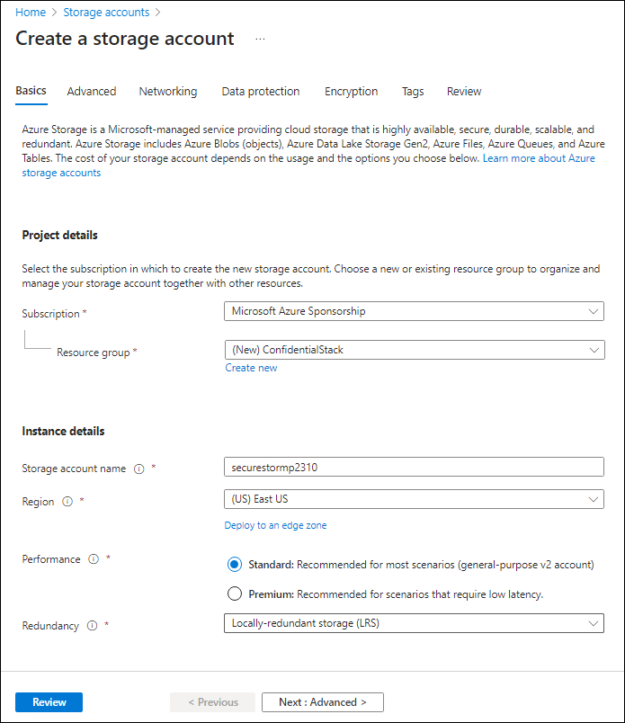

---
lab:
  az204Title: 'Lab 07: Access resource secrets more securely across services'
  az020Title: 'Lab 07: Access resource secrets more securely across services'
  az204Module: 'Module 07: Implement secure cloud solutions'
  az020Module: 'Module 07: Implement secure cloud solutions'
---

# <a name="lab-07-access-resource-secrets-more-securely-across-services"></a>랩 07: 서비스 전반에서 리소스 비밀에 안전하게 액세스

## <a name="microsoft-azure-user-interface"></a>Microsoft Azure 사용자 인터페이스

Given the dynamic nature of Microsoft cloud tools, you might experience Azure UI changes that occur after this training content's development. As a result, the lab instructions and lab steps might not align correctly.

Microsoft updates this training course when the community brings needed changes to our attention. However, because cloud updates occur frequently, you might encounter UI changes before this training content updates. <bpt id="p1">**</bpt>If this occurs, adapt to the changes, and then work through them in the labs as needed.<ept id="p1">**</ept>

## <a name="instructions"></a>Instructions

### <a name="before-you-start"></a>시작하기 전에

#### <a name="sign-in-to-the-lab-environment"></a>랩 환경에 로그인

다음 자격 증명을 사용하여 Windows 10 VM(가상 머신)에 로그인합니다.

- 사용자 이름: **Admin**
- 암호: **Pa55w.rd**

> **참고**: 강사가 가상 랩 환경 연결에 대한 지침을 제공합니다.

#### <a name="review-the-installed-applications"></a>설치된 애플리케이션 검토

Find the taskbar on your Windows 10 desktop. The taskbar contains the icons for the applications that you'll use in this lab, including:

- Microsoft Edge
- 파일 탐색기
- Windows 터미널
- Visual Studio Code

## <a name="architecture-diagram"></a>아키텍처 다이어그램


### <a name="exercise-1-create-azure-resources"></a>연습 1: Azure 리소스 만들기

#### <a name="task-1-open-the-azure-portal"></a>작업 1: Azure Portal 열기

1. 작업 표시줄에서 **Microsoft Edge** 아이콘을 선택합니다.

1. 열린 브라우저 창에서 Azure Portal(<https://portal.azure.com>)로 이동한 다음, 이 랩에 사용할 계정으로 로그인합니다.

    > Microsoft 클라우드 도구의 동적 특성을 감안할 때, 이 학습 콘텐츠를 개발한 후 Azure UI가 변경될 수 있습니다.

#### <a name="task-2-create-a-storage-account"></a>작업 2: Storage 계정 만들기

1. Azure Portal에서 **리소스, 서비스 및 문서 검색** 텍스트 상자를 사용하여 **스토리지 계정**을 검색한 다음, 결과 목록에서 **스토리지 계정**을 선택합니다.

1.  **스토리지 계정** 블레이드에서 **+ 만들기**를 선택합니다.

1. **스토리지 계정 만들기** 창의 **기본 사항** 탭에서 다음 작업을 수행하고 **검토 + 만들기**를 선택합니다.

   | 설정 | 작업 |
   | -- | -- |
   | **구독** 드롭다운 목록 | 기본값을 유지합니다. |
   | **리소스 그룹** 섹션 | **새로 만들기**를 선택하고 **ConfidentialStack**을 입력한 다음 **확인**을 선택합니다. |
   | **스토리지 계정 이름** 텍스트 상자 | **securestor** _[사용자 이름]_ 을 입력합니다. |
   | **지역** 드롭다운 목록 | **(미국) 미국 동부**를 선택합니다. |
   | **성능** 섹션 | **표준** 옵션을 선택합니다. |
   | **중복도** 드롭다운 목록 | **LRS(로컬 중복 스토리지)** 를 선택합니다. |

   다음 스크린샷은 **스토리지 계정 만들기** 창에 구성된 설정을 보여 줍니다.

   

1. **검토 + 만들기** 탭에서 이전 단계에서 선택한 옵션을 검토합니다.

1. 지정된 구성을 사용하여 스토리지 계정을 만들려면 **만들기**를 선택합니다.

    > **참고**: 이 랩을 진행하기 전에 만들기 작업이 완료될 때까지 기다립니다.

1. **배포 개요** 창에서 **리소스로 이동**을 선택합니다.

1.  **스토리지 계정** 블레이드의 **보안 + 네트워킹** 섹션에서 **액세스 키** 링크를 선택합니다.

1.  **액세스 키** 섹션에서 **키 표시**를 선택합니다.

1. 따라서 랩 지침 및 랩 단계가 올바르게 정렬되지 않을 수 있습니다.

    > <bpt id="p1">**</bpt>Note<ept id="p1">**</ept>: It doesn't matter which connection string you choose. They're interchangeable.

#### <a name="task-3-create-an-azure-key-vault"></a>작업 3: Azure Key Vault 만들기

1. Azure Portal에서 **리소스, 서비스 및 문서 검색** 텍스트 상자를 사용하여 **키 값**을 검색한 다음, 결과 목록에서 **키 값**을 선택합니다.

1. **키 자격 증명 모음** 창에서 **만들기**를 선택합니다.

1.  **키 자격 증명 모음 만들기** 창의 **기본 사항** 탭에서 다음 작업을 수행하고 **검토 + 만들기**를 선택합니다.

   | 설정 | 작업 |
   | -- | -- |
   | **구독** 드롭다운 목록 | 기본값을 유지합니다. |
   | **리소스 그룹** 드롭다운 목록 | 목록에서 **ConfidentialStack**을 선택합니다. |
   | **키 자격 증명 모음 이름** 텍스트 상자 | **securevault** _[사용자 이름]_ 을 입력합니다. |
   | **지역** 드롭다운 목록 | **미국 동부**를 선택합니다. |
   | **가격 책정 계층** 드롭다운 목록 | **표준** 선택 |

   다음 스크린샷은 **키 자격 증명 모음 만들기** 창에 구성된 설정을 보여 줍니다.

   

1. **검토 + 만들기** 탭에서 이전 단계에서 선택한 옵션을 검토합니다.

1. 지정된 구성을 사용하여 키 자격 증명 모음을 만들려면 **만들기**를 선택합니다.

    > **참고**: 이 랩을 진행하기 전에 만들기 작업이 완료될 때까지 기다립니다.

#### <a name="task-4-create-a-function-app"></a>작업 4: 함수 앱 만들기

1. Azure Portal에서 **리소스, 서비스 및 문서 검색** 텍스트 상자를 사용하여 **함수 앱**을 검색한 다음, 결과 목록에서 **함수 앱**을 선택합니다.

1. **함수 앱** 블레이드에서 **만들기**를 선택합니다.

1. **함수 앱 만들기** 창의 **기본 사항** 탭에서 다음 작업을 수행하고 **다음: 호스팅**을 선택합니다.

    | 설정 | 작업 |
    | -- | -- |
    | **구독** 드롭다운 목록 | 기본값을 유지합니다. |
    | **리소스 그룹** 드롭다운 목록 | **ConfidentialStack**을 선택합니다. |
    | **함수 앱 이름** 텍스트 상자 | **securefunc** _[사용자 이름]_ 을 입력합니다. |
    | **게시** 섹션 | **코드** 선택 |
    | **런타임 스택** 드롭다운 목록 | **.NET**을 선택합니다. |
    | **버전** 드롭다운 목록 | **6**을 선택합니다. |
    | **지역** 드롭다운 목록 | **미국 동부** 지역을 선택합니다. |
    | **운영 체제** 섹션 | **Linux**를 선택합니다. |
    | **계획 유형** 드롭다운 목록 | **사용량(서버리스)** 을 선택합니다. |

    다음 스크린샷은 **함수 앱 만들기** 창에 구성된 설정을 보여 줍니다.

    

1. **호스팅** 탭에서 다음 작업을 수행하고 **검토 + 만들기**를 선택합니다.

    | 설정 | 작업 |
    | -- | -- |
    | **스토리지 계정** 드롭다운 목록 | **securestor** _[사용자 이름]_ 스토리지 계정을 선택합니다. |

1. **검토 + 만들기** 탭에서 이전 단계에서 선택한 옵션을 검토합니다.

1. 지정된 구성을 사용하여 함수 앱을 만들려면 **만들기**를 선택합니다.

    > **참고**: 이 랩을 진행하기 전에 만들기 작업이 완료될 때까지 기다립니다.

#### <a name="review"></a>검토

이 연습에서는 이 랩에서 사용할 모든 리소스를 만들었습니다.

### <a name="exercise-2-configure-secrets-and-identities"></a>연습 2: 비밀 및 ID 구성

#### <a name="task-1-configure-a-system-assigned-managed-service-identity"></a>작업 1: 시스템 할당된 관리 서비스 ID 구성

1. Azure Portal의 탐색 창에서 **리소스 그룹** 링크를 선택합니다.

1. **리소스 그룹** 블레이드에서 **ConfidentialStack** 리소스 그룹을 선택합니다.

1. **ConfidentialStack** 창에서 **securefunc** _[사용자 이름]_ 함수 앱을 선택합니다.

    > Microsoft는 커뮤니티에서 주목해야 할 변경 사항이 있을 때 이 학습 과정을 업데이트합니다.

1. **함수 앱** 블레이드의 **설정** 섹션에서 **ID** 옵션을 선택합니다.

1. **ID** 창의 **시스템 할당** 탭에서 **상태**를 **켜기**로 설정한 다음 **저장**을 선택합니다.

1. **예**를 선택하여 설정을 확인합니다.

    > **참고**: 이 랩을 진행하기 전에 할당된 시스템에서 관리 ID가 만들어질 때까지 기다립니다.

#### <a name="task-2-create-a-key-vault-secret"></a>작업 2: Key Vault 비밀 만들기

1. Azure Portal의 **탐색** 창에서 **리소스 그룹** 링크를 선택합니다.

1. **리소스 그룹** 블레이드에서 **ConfidentialStack** 리소스 그룹을 선택합니다.

1. **ConfidentialStack** 창에서 **securevault** _[사용자 이름]_ 키 자격 증명 모음을 선택합니다.

1. **키 자격 증명 모음** 창에서 **설정** 섹션에 있는 **비밀** 링크를 선택합니다.

1. **비밀** 창에서 **+ 생성/가져오기**를 클릭합니다.

1. **비밀 만들기** 창에서 다음 작업을 수행한 후, **만들기**를 선택합니다.

    | 설정 | 작업 |
    | -- | -- |
    | **업로드 옵션** 드롭다운 목록 | **수동** 선택 |
    | **이름** 텍스트 상자 | **storagecredentials**를 입력합니다. |
    | **값** 텍스트 상자 | 이 랩에서 이전에 기록한 스토리지 계정 연결 문자열을 입력합니다. |
    | **콘텐츠 형식** 텍스트 상자 | 비워 둠 |
    | **활성화 날짜 설정** 확인란 | 선택되지 않음 |
    | **만료 날짜 설정** 확인란 | 선택되지 않음 |
    | **사용** 옵션 | **예**를 선택합니다. |

    다음 스크린샷은 **비밀 만들기** 창에 구성된 설정을 보여 줍니다.

    

    > **참고**: 이 랩을 진행하기 전에 비밀이 만들어질 때까지 기다립니다.

1. **비밀** 창으로 돌아가서 목록의 **storagecredentials** 항목을 선택합니다.

1. **버전** 창에서 **storagecredentials** 비밀의 최신 버전을 선택합니다.

1. **비밀 버전** 창에서 다음 작업을 수행합니다.

    1. 비밀 값을 보려면 **비밀 값 표시**를 선택합니다.

    1. 나중에 랩에서 이 값을 사용하기 때문에 **비밀 식별자** 텍스트 상자의 값을 기록합니다.

    > **참고**: **비밀 값** 텍스트 상자가 아닌 **비밀 식별자** 텍스트 상자의 값을 기록하고 있습니다.

#### <a name="task-3-configure-a-key-vault-access-policy"></a>작업 3: Key Vault 액세스 정책 구성

1. Azure Portal의 탐색 창에서 **리소스 그룹** 링크를 선택합니다.

1. **리소스 그룹** 블레이드에서 **ConfidentialStack** 리소스 그룹을 선택합니다.

1. **ConfidentialStack** 창에서 **securevault[사용자 이름]** 키 자격 증명 모음을 선택합니다.

1. **키 자격 증명 모음** 창의 **설정** 섹션에 있는 **액세스 정책** 링크를 선택합니다.

1. **액세스 정책** 창에서 **액세스 정책 추가**를 선택합니다.

1. **액세스 정책 추가** 창에서 다음 작업을 수행한 후, **추가**를 선택합니다.

    | 설정 | 작업 |
    | -- | -- |
    | **템플릿에서 구성** 드롭다운 목록 | 비워 둠 |
    | **키 권한** 드롭다운 목록 | 0개 선택됨 |
    | **비밀 권한** 드롭다운 목록 | **GET** 권한을 선택합니다. |
    | **인증서 권한** 드롭다운 목록 | 0개 선택됨 |
    | **보안 주체 선택** 링크 | 그러나 클라우드 업데이트가 자주 이루어지기 때문에 이 학습 콘텐츠가 업데이트되기 전에 UI가 변경될 수 있습니다. |
    | **승인된 애플리케이션** 링크 | 선택하지 않음 |

    다음 스크린샷은 **액세스 정책 추가** 창에 구성된 설정을 보여줍니다.

    

1. **액세스 정책** 창에서 **저장**을 선택합니다.

    > **참고**: 이 랩을 계속하기 전에 액세스 정책에 대한 변경 내용이 저장될 때까지 기다립니다.

#### <a name="task-4-create-a-key-vault-derived-application-setting"></a>작업 4: Key Vault 파생 애플리케이션 설정 만들기

1. Azure Portal의 탐색 창에서 **리소스 그룹** 링크를 선택합니다.

1. **리소스 그룹** 블레이드에서 **ConfidentialStack** 리소스 그룹을 선택합니다.

1. **ConfidentialStack** 창에서 **securefunc[사용자 이름]** 함수 앱을 선택합니다.

1. **함수 앱** 창의 **설정** 섹션에서 **구성** 옵션을 선택합니다.

1. **구성** 창의 **애플리케이션 설정** 탭에서 **새 애플리케이션 설정**을 선택합니다.

1. **애플리케이션 설정 추가/편집** 팝업 창의 **이름** 텍스트 상자에 **StorageConnectionString**을 입력합니다.

1. **값** 텍스트 상자에서 `@Microsoft.KeyVault(SecretUri=<Secret Identifier>)`사용하여 값을 생성합니다. 여기서 `<Secret Identifier>` 자리 표시자는 이 연습의 앞부분에서 기록한 비밀 식별자를 나타냅니다.

    > **참고**: 예를 들어, 비밀 식별자가 `https://securevaultstudent.vault.azure.net/secrets/storagecredentials/17b41386df3e4191b92f089f5efb4cbf`인 경우 결과 값은 `@Microsoft.KeyVault(SecretUri=https://securevaultstudent.vault.azure.net/secrets/storagecredentials/17b41386df3e4191b92f089f5efb4cbf)`가 됩니다.

1. **배포 슬롯 설정** 확인란을 기본값(선택되지 않음)으로 설정한 다음, **확인**을 선택하여 팝업 창을 닫고 **구성** 섹션으로 돌아갑니다.

1. **저장**을 선택하여 설정을 저장한 다음, **변경 내용 저장** 확인 팝업 대화 상자에서 **계속**을 선택합니다.

    > **참고**: 랩을 계속하기 전에 애플리케이션 설정이 저장될 때까지 기다립니다.

#### <a name="review"></a>검토

**이 경우 변경 사항에 적응하고 필요에 따라 랩에서 작업합니다.**

### <a name="exercise-3-build-an-azure-functions-app"></a>연습 3: Azure Functions 앱 빌드

#### <a name="task-1-initialize-a-function-project"></a>작업 1: 함수 프로젝트 초기화

1. 작업 표시줄에서 **Windows 터미널** 아이콘을 선택합니다.

1. 다음 명령을 실행하여 현재 디렉터리를 **Allfiles (F):\\Allfiles\\Labs\\07\\Starter\\func** 빈 디렉터리로 변경합니다.

    ```powershell
    cd F:\Allfiles\Labs\07\Starter\func
    ```

    > **참고**: Windows 탐색기에서 F:\Allfiles\Labs\07\Starter\func\.gitignore 파일에서 읽기 전용 특성을 제거합니다.

1. 다음 명령을 실행하여 **Azure Functions Core Tools**를 사용하여 **dotnet** 런타임을 통해 현재 디렉터리에 새 로컬 Functions 프로젝트를 만듭니다.

    ```powershell
    func init --worker-runtime dotnet --force
    ```

    > **참고**: 설명서의 내용을 검토하여 **Azure Functions Core Tools**를 사용한 [새 프로젝트 만들기][azure-functions-core-tools-new-project] 방법을 파악할 수 있습니다.

1. 다음 명령을 실행하여 .NET 6 프로젝트를 **빌드**합니다.

    ```powershell
    dotnet build
    ```

#### <a name="task-2-create-an-http-triggered-function"></a>작업 2: HTTP 트리거 함수 만들기

1. 다음 명령을 실행하여 **Azure Functions Core Tools**를 사용하여 **HTTP 트리거** 템플릿으로 **FileParser**라는 새 함수를 만듭니다.

    ```powershell
    func new --template "HTTP trigger" --name "FileParser"
    ```

    > **참고**: 설명서의 내용을 검토하여 **Azure Functions Core Tools**를 사용한 [새 함수 만들기][azure-functions-core-tools-new-function] 방법을 파악할 수 있습니다.

1. 현재 실행 중인 **Windows 터미널** 애플리케이션을 닫습니다.

#### <a name="task-3-configure-and-read-an-application-setting"></a>작업 3: 애플리케이션 설정 구성 및 읽기

1. **시작** 화면에서 **Visual Studio Code** 타일을 선택합니다.

1. **파일** 메뉴에서 **폴더 열기**를 선택합니다.

1. 열리는 **파일 탐색기** 창에서 **Allfiles (F):\\Allfiles\\Labs\\07\\Starter\\func**을 찾아본 후, **폴더 선택**을 선택합니다.

1. **Visual Studio Code** 창의 **탐색기** 창에서 **local.settings.json** 파일을 엽니다.

1. **Values** 개체의 현재 값을 기록해 둡니다.

    ```json
    "Values": {
        "AzureWebJobsStorage": "UseDevelopmentStorage=true",
        "FUNCTIONS_WORKER_RUNTIME": "dotnet"
    }
    ```

1. **StorageConnectionString**이라는 새 설정을 추가한 다음 여기에 **[TEST VALUE]** 의 문자열 값을 할당하여 **Values** 개체의 값을 업데이트합니다.

    ```json
    "Values": {
        "AzureWebJobsStorage": "UseDevelopmentStorage=true",
        "FUNCTIONS_WORKER_RUNTIME": "dotnet",
        "StorageConnectionString": "[TEST VALUE]"
    }
    ```

1. 이제 **local.settings.json** 파일에 다음 코드가 포함되어 있어야 합니다.

    ```json
    {
        "IsEncrypted": false,
        "Values": {
            "AzureWebJobsStorage": "UseDevelopmentStorage=true",
            "FUNCTIONS_WORKER_RUNTIME": "dotnet",
            "StorageConnectionString": "[TEST VALUE]"
        }
    }
    ```

1. **저장**을 선택하여 변경 내용을 **local.settings.json** 파일에 저장합니다.

1. **Visual Studio Code** 창의 **탐색기** 창에서 **FileParser.cs** 파일을 엽니다.

1. 코드 편집기에서 예제 구현을 검토합니다.

    ```csharp
    using System;
    using System.IO;
    using System.Threading.Tasks;
    using Microsoft.AspNetCore.Mvc;
    using Microsoft.Azure.WebJobs;
    using Microsoft.Azure.WebJobs.Extensions.Http;
    using Microsoft.AspNetCore.Http;
    using Microsoft.Extensions.Logging;
    using Newtonsoft.Json;
    namespace func
    {
        public static class FileParser
        {
            [FunctionName("FileParser")]
            public static async Task<IActionResult> Run(
                [HttpTrigger(AuthorizationLevel.Function, "get", "post", Route = null)] HttpRequest req,
                ILogger log)
            {
                log.LogInformation("C# HTTP trigger function processed a request.");
                string name = req.Query["name"];
                string requestBody = await new StreamReader(req.Body).ReadToEndAsync();
                dynamic data = JsonConvert.DeserializeObject(requestBody);
                name = name ?? data?.name;
                string responseMessage = string.IsNullOrEmpty(name)
                    ? "This HTTP triggered function executed successfully. Pass a name in the query string or in the request body for a personalized response."
                    : $"Hello, {name}. This HTTP triggered function executed successfully.";
                return new OkObjectResult(responseMessage);
            }
        }
    }
    ```

1. **FileParser.cs** 파일 내의 모든 내용을 삭제합니다.

1. 다음 코드 줄을 추가하여 **Microsoft.AspNetCore.Mvc**, **Microsoft.Azure.WebJobs**, **Microsoft.AspNetCore.Http**, **System** 및 **System.Threading.Tasks** 네임스페이스에 **using 지시문**을 추가합니다.

    ```csharp
    using Microsoft.AspNetCore.Mvc;
    using Microsoft.Azure.WebJobs;
    using Microsoft.AspNetCore.Http;
    using System;
    using System.Threading.Tasks;
    ```

1. 새 **public static** 클래스 **FileParser**를 만듭니다.

    ```csharp
    public static class FileParser
    { }
    ```

1. **FileParser.cs** 파일을 다시 살펴봅니다. 이제 파일에 다음 코드가 포함되어 있어야 합니다.

    ```csharp
    using Microsoft.AspNetCore.Mvc;
    using Microsoft.Azure.WebJobs;
    using Microsoft.AspNetCore.Http;
    using System;
    using System.Threading.Tasks;
    public static class FileParser
    { }
    ```

1. Within the <bpt id="p1">**</bpt>FileParser<ept id="p1">**</ept> class, add the following code block to create a new <bpt id="p2">**</bpt>public static<ept id="p2">**</ept> <bpt id="p3">*</bpt>asynchronous<ept id="p3">*</ept> method named <bpt id="p4">**</bpt>Run<ept id="p4">**</ept>. This method returns a variable of type <bpt id="p1">**</bpt>Task<ph id="ph1">\&lt;IActionResult\&gt;</ph><ept id="p1">**</ept> and also takes in a variable of type <bpt id="p2">**</bpt>HttpRequest<ept id="p2">**</ept> named <bpt id="p3">*</bpt>request<ept id="p3">*</ept>:

    ```csharp
    public static async Task<IActionResult> Run(
        HttpRequest request)
    { }
    ```

1. 다음 코드를 추가하여 **name** 매개 변수가 **FileParser** 값으로 설정된 **FunctionNameAttribute** 유형 특성을 **Run** 메서드에 추가합니다.

    ```csharp
    [FunctionName("FileParser")]
    public static async Task<IActionResult> Run(
        HttpRequest request)
    { }
    ```

1. 다음 코드를 추가하여 **methods** 매개 변수 배열이 단일 값 **GET**으로 설정된 **HttpTriggerAttribute** 유형 특성을 **request** 매개 변수에 추가합니다.

    ```csharp
    [FunctionName("FileParser")]
    public static async Task<IActionResult> Run(
        [HttpTrigger("GET")] HttpRequest request)
    { }
    ```

1. **FileParser.cs** 파일의 내용을 다시 검토합니다. 이제 파일에 다음 코드가 포함되어 있어야 합니다.

    ```csharp
    using Microsoft.AspNetCore.Mvc;
    using Microsoft.Azure.WebJobs;
    using Microsoft.AspNetCore.Http;
    using System;
    using System.Threading.Tasks;
    public static class FileParser
    {
        [FunctionName("FileParser")]
        public static async Task<IActionResult> Run(
            [HttpTrigger("GET")] HttpRequest request)
        { }
    }
    ```

1. **Run** 메서드에서 코드 다음 줄을 입력하여 **Environment.GetEnvironmentVariable** 메서드를 사용하여 **StorageConnectionString** 애플리케이션 설정 값을 검색하고 결과를 **connectionString**이라는 **string** 변수에 결과를 저장합니다.

    ```csharp
    string connectionString = Environment.GetEnvironmentVariable("StorageConnectionString");
    ```

1. **connectionString** 변수의 값을 HTTP 응답으로 반환하는 다음 코드 줄을 입력합니다.

    ```csharp
    return new OkObjectResult(connectionString);
    ```

1. **FileParser.cs** 파일의 내용을 다시 검토합니다. 이제 파일에 다음 코드가 포함되어 있어야 합니다.

    ```csharp
    using Microsoft.AspNetCore.Mvc;
    using Microsoft.Azure.WebJobs;
    using Microsoft.AspNetCore.Http;
    using System;
    using System.Threading.Tasks;
    public static class FileParser
    {
        [FunctionName("FileParser")]
        public static async Task<IActionResult> Run(
            [HttpTrigger("GET")] HttpRequest request)
        {
            string connectionString = Environment.GetEnvironmentVariable("StorageConnectionString");
            return new OkObjectResult(connectionString);
        }
    }
    ```

1. **저장**을 선택하여 **FileParser.cs** 파일의 변경 내용을 저장합니다.

#### <a name="task-4-validate-the-local-function"></a>작업 4: 로컬 함수 유효성 검사

1. 작업 표시줄에서 **Windows 터미널** 아이콘을 선택합니다.

1. 다음 명령을 실행하여 현재 디렉터리를 **Allfiles (F):\\Allfiles\\Labs\\07\\Starter\\func** 빈 디렉터리로 변경합니다.

    ```powershell
    cd F:\Allfiles\Labs\07\Starter\func
    ```

1. 다음 명령을 실행하여 함수 앱 프로젝트를 실행합니다.

    ```powershell
    func start --build
    ```

    > **참고**: 설명서의 내용을 검토하여 **Azure Functions Core Tools**를 사용한 [로컬에서 함수 앱 프로젝트 시작][azure-functions-core-tools-start-function] 방법을 파악할 수 있습니다.

1. On the taskbar, select the <bpt id="p1">**</bpt>Windows Terminal<ept id="p1">**</ept> icon again to open a new instance of the <bpt id="p2">**</bpt>Windows Terminal<ept id="p2">**</ept> application. Run the following command to change the current directory to the <bpt id="p1">**</bpt>Allfiles (F):<ph id="ph1">\\</ph>Allfiles<ph id="ph2">\\</ph>Labs<ph id="ph3">\\</ph>07<ph id="ph4">\\</ph>Starter<ph id="ph5">\\</ph>func<ept id="p1">**</ept> empty directory:

    ```powershell
    cd F:\Allfiles\Labs\07\Starter\func
    ```
    
1. 열려 있는 명령 프롬프트가 표시되면 다음 명령을 실행하여 **httprepl** 도구를 시작하여, 기본 URI(Uniform Resource Identifier)를 ``http://localhost:7071``로 설정합니다.

    ```powershell
    httprepl http://localhost:7071
    ```

    > <bpt id="p1">**</bpt>Note<ept id="p1">**</ept>: An error message is displayed by the <bpt id="p2">**</bpt>httprepl<ept id="p2">**</ept> tool. This message occurs because the tool is searching for a Swagger definition file to use to traverse the API. Because your function project doesn't produce a Swagger definition file, you'll need to traverse the API manually.
1. 도구 프롬프트가 표시되면 다음 명령을 실행하고 상대 **api** 디렉터리를 찾습니다.

    ```powershell
    cd api
    ```

1. 다음 명령을 실행하여 상대 **fileparser** 디렉터리를 찾습니다.

    ```powershell
    cd fileparser
    ```

1. 다음 명령을 실행하여 **get** 명령을 실행합니다.

    ```powershell
    get
    ```

1. HTTP 요청 결과로 반환되는 **StorageConnectionString**의 **[TEST VALUE]** 값을 살펴봅니다.

    ```powershell
    HTTP/1.1 200 OK
    Content-Type: text/plain; charset=utf-8
    Date: Tue, 01 Sep 2020 23:35:39 GMT
    Server: Kestrel
    Transfer-Encoding: chunked
    [TEST VALUE]
    ```

1. 다음 명령을 실행하여 **httprepl** 도구를 종료합니다.

    ```powershell
    exit
    ```

1. 현재 실행 중인 **Windows 터미널** 애플리케이션의 모든 인스턴스를 닫습니다.

#### <a name="task-5-deploy-the-function-using-the-azure-functions-core-tools"></a>작업 5: Azure Functions Core Tools를 사용하여 함수 배포

1. 작업 표시줄에서 **Windows 터미널** 아이콘을 선택합니다.

1. 다음 명령을 실행하여 현재 디렉터리를 **Allfiles (F):\\Allfiles\\Labs\\07\\Starter\\func** 빈 디렉터리로 변경합니다.

    ```powershell
    cd F:\Allfiles\Labs\07\Starter\func
    ```

1. 다음 명령을 실행하여 Azure CLI(Command-Line Interface)에 로그인합니다.

    ```powershell
    az login
    ```

1. **Microsoft Edge** 브라우저 창에서 Microsoft 계정의 메일 주소 및 암호를 입력한 후, **로그인**을 선택합니다.

1. Return to the currently open <bpt id="p1">**</bpt>Windows Terminal<ept id="p1">**</ept> window. Wait for the sign-in process to finish.

1. 다음 명령을 실행하여 함수 앱 프로젝트를 게시합니다(`<function-app-name>` 자리 표시자를 이 랩의 앞부분에서 만든 함수 앱의 이름으로 바꿈).

    ```powershell
    func azure functionapp publish <function-app-name>
    ```

    > <bpt id="p1">**</bpt>Note<ept id="p1">**</ept>: As an example, if your <bpt id="p2">**</bpt>Function App name<ept id="p2">**</ept> is <bpt id="p3">**</bpt>securefuncstudent<ept id="p3">**</ept>, your command would be <ph id="ph1">``func azure functionapp publish securefuncstudent``</ph>. You can review the documentation to [publish the local function app project][azure-functions-core-tools-publish-azure] using the <bpt id="p1">**</bpt>Azure Functions Core Tools<ept id="p1">**</ept>.

1. 랩을 진행하기 전에 배포가 마무리될 때까지 기다립니다.

1. 현재 실행 중인 **Windows 터미널** 애플리케이션을 닫습니다.

#### <a name="task-6-test-the-key-vault-derived-application-setting"></a>작업 6: 키 자격 증명 모음 파생 애플리케이션 설정 테스트

1. 작업 표시줄에서 **Microsoft Edge** 아이콘을 선택한 다음, Azure Portal(<https://portal.azure.com>)이 포함된 탭을 선택합니다.

1. Azure Portal의 탐색 창에서 **리소스 그룹** 링크를 선택합니다.

1. **리소스 그룹** 블레이드에서 **ConfidentialStack** 리소스 그룹을 선택합니다.

1. **ConfidentialStack** 창에서 **securefunc[사용자 이름]** 함수 앱을 선택합니다.

1. **함수 앱** 창의 **함수** 섹션에서 **함수** 옵션을 선택합니다.

1. **함수** 창에서 기존 **FileParser** 함수를 선택합니다.

1. **함수** 창의 **개발자** 섹션에서 **코드 + 테스트** 옵션을 선택합니다.

1. 함수 편집기에서 **테스트/실행을** 선택합니다.

1. 자동으로 표시되는 창의 **HTTP 메서드** 목록에서 **GET**을 선택합니다.

1. **실행**을 선택하여 함수를 테스트합니다.

1. Review the results of the test run. The result should be your Azure Storage connection string.

#### <a name="review"></a>검토

이 연습에서는 서비스 ID를 사용하여 Key Vault에 저장된 비밀의 값을 읽고 함수 앱의 결과로 해당 값을 반환했습니다.

### <a name="exercise-4-access-azure-blob-storage-data"></a>연습 4: Azure Blob Storage 데이터 액세스

#### <a name="task-1-upload-a-sample-storage-blob"></a>작업 1: 샘플 Storage Blob 업로드

1. Azure Portal의 탐색 창에서 **리소스 그룹** 링크를 선택합니다.

1. **리소스 그룹** 블레이드에서 **ConfidentialStack** 리소스 그룹을 선택합니다.

1. **ConfidentialStack** 창에서 **securestor** _[사용자 이름]_ 스토리지 계정을 선택합니다.

1. **스토리지 계정** 블레이드에서 **데이터 스토리지** 섹션에 있는 **컨테이너** 링크를 선택합니다.

1. **컨테이너** 섹션에서 **+ 컨테이너**를 선택합니다.

1. **새 컨테이너** 팝업 창에서 다음 작업을 수행하고 **만들기**를 선택합니다.

    | 설정 | 작업 |
    | -- | -- |
    | **이름** 텍스트 상자 | **드롭**을 입력합니다. |
    | **퍼블릭 액세스 수준** 드롭다운 목록 | **Blob(Blob에 대해서만 익명 읽기 액세스)** 을 선택합니다. |

1. **컨테이너** 섹션으로 돌아가서 새로 만든 **drop** 컨테이너를 선택합니다.

1. **컨테이너** 블레이드에서 **업로드**를 선택합니다.

1. **Blob 업로드** 창에서 다음 작업을 수행한 다음, **업로드**를 선택합니다.

    | 설정 | 작업 |
    | -- | -- |
    | **파일** 섹션 | **폴더** 아이콘을 선택합니다. |
    | **파일 탐색기** 창  | **Allfiles (F):\\Allfiles\\Labs\\07\\Starter**로 이동하여, **records.json** 파일을 선택한 다음 **열기**를 선택합니다. |
    | **파일이 이미 있는 경우 덮어쓰기** 확인란 | 이 확인란이 선택되어 있는지 확인합니다. |

    > **참고**: 이 랩을 계속하기 전에 Blob이 업로드될 때까지 기다립니다.

1. **컨테이너** 블레이드로 돌아가서 Blob 목록에서 **records.json** Blob을 선택합니다.

1. **Blob** 창에서 Blob 메타데이터를 찾은 다음 Blob의 URL을 복사합니다.

1. 작업 표시줄에서 **Microsoft Edge** 아이콘의 바로 가기 메뉴를 활성화한 다음, **새 창**을 선택합니다.

1. 새 브라우저 창에서 Blob에 대해 복사한 URL을 참조합니다.

1. The JavaScript Object Notation (JSON) contents of the blob should now display. Close the browser window with the JSON contents.

1. Azure Portal이 표시된 브라우저 창으로 돌아가서 **Blob** 블레이드를 닫습니다.

1. **컨테이너** 섹션으로 돌아가서 **액세스 수준 변경**을 선택합니다.

1. **액세스 수준 변경** 팝업 창에서 다음 작업을 수행합니다.

    1. **공용 액세스 수준** 드롭다운 목록에서 **비공개(익명 액세스 없음)** 를 선택합니다.
    1. **확인**을 선택합니다.

1. 작업 표시줄에서 **Microsoft Edge** 아이콘의 바로 가기 메뉴를 활성화한 다음, **새 창**을 선택합니다.

1. 새 브라우저 창에서 Blob에 대해 복사한 URL을 참조합니다.

1. 이제 리소스를 찾을 수 없다는 오류 메시지가 표시됩니다.

    > <bpt id="p1">**</bpt>Note<ept id="p1">**</ept>: If the error message doesn't display, your browser might have cached the file. Select Ctrl+F5 to refresh the page until the error message displays.

#### <a name="task-2-pull-and-configure-the-azure-sdk-for-net"></a>작업 2: .NET용 Azure SDK 끌어오기 및 구성

1. 작업 표시줄에서 **Windows 터미널** 아이콘을 선택합니다.

1. 다음 명령을 실행하여 현재 디렉터리를 **Allfiles (F):\\Allfiles\\Labs\\07\\Starter\\func** 빈 디렉터리로 변경합니다.

    ```powershell
    cd F:\Allfiles\Labs\07\Starter\func
    ```

1. 다음 명령을 실행하여 NuGet에서 **Azure.Storage.Blobs** 패키지의 **12.12.0** 버전을 추가합니다.

    ```powershell
    dotnet add package Azure.Storage.Blobs --version 12.12.0
    ```

    > **참고**: [Azure.Storage.Blobs](https://www.nuget.org/packages/Azure.Storage.Blobs) NuGet 패키지는 Azure Blob Storage용 코드를 작성하는 데 필요한 .NET용 Azure SDK의 하위 집합을 참조합니다.

1. 현재 실행 중인 **Windows 터미널** 애플리케이션을 닫습니다.

1. **시작** 화면에서 **Visual Studio Code** 타일을 선택합니다.

1. **파일** 메뉴에서 **폴더 열기**를 선택합니다.

1. 열리는 **파일 탐색기** 창에서 **Allfiles (F):\\Allfiles\\Labs\\07\\Starter\\func**을 찾아본 후, **폴더 선택**을 선택합니다.

1. **Visual Studio Code** 창의 **탐색기** 창에서 **FileParser.cs** 파일을 엽니다.

1. **Azure.Storage.Blobs** 네임스페이스에 **using 지시문**을 추가합니다.

    ```csharp
    using Azure.Storage.Blobs;
    ```

1. **FileParser.cs** 파일의 내용을 검토합니다. 이제 파일에 다음 코드가 포함되어 있어야 합니다.

    ```csharp
    using Azure.Storage.Blobs;
    using Microsoft.AspNetCore.Mvc;
    using Microsoft.Azure.WebJobs;
    using Microsoft.AspNetCore.Http;
    using System;
    using System.Threading.Tasks;   
    public static class FileParser
    {
        [FunctionName("FileParser")]
        public static async Task<IActionResult> Run(
            [HttpTrigger("GET")] HttpRequest request)
        {
            string connectionString = Environment.GetEnvironmentVariable("StorageConnectionString");
            return new OkObjectResult(connectionString);
        }
    }
    ```

#### <a name="task-3-write-azure-blob-storage-code-using-the-azure-sdk-for-net"></a>작업 3: .NET용 Azure SDK를 사용하여 Azure Blob Storage 코드 작성

1. **FileParser** 클래스의 **Run** 메서드 내에서 다음 코드 줄을 삭제합니다.

    ```csharp
    return new OkObjectResult(connectionString);
    ```

1. 계속해서 **Run** 메서드 내에서 다음 코드 블록을 추가하여 *connectionString* 변수, ``"drop"`` 문자열 값 및 ``"records.json"`` 문자열 값을 생성자에 전달하여 **BlobClient** 클래스의 새 인스턴스를 생성합니다.

    ```csharp
    BlobClient blob = new BlobClient(connectionString, "drop", "records.json");
    ```

1. 계속해서 **Run** 메서드 내에서 다음 코드 블록을 추가합니다. 이 코드 블록은 **BlobClient.DownloadAsync** 메서드를 사용하여 참조된 Blob의 내용을 비동기적으로 다운로드하고 결과를 *response* 함수 편집기에서 테스트/실행을 선택합니다 변수에 저장합니다.

    ```csharp
    var response = await blob.DownloadAsync();
    ```

1. 계속해서 **Run** 메서드 내에서 다음 코드 블록을 추가합니다. 이 코드 블록은 *FileStreamResult* 클래스 생성자를 사용하여 **content** 변수에 저장된 다양한 콘텐츠의 값을 반환합니다.

    ```csharp
    return new FileStreamResult(response?.Value?.Content, response?.Value?.ContentType);
    ```

1. **FileParser.cs** 파일의 내용을 다시 검토합니다. 이제 파일에 다음 코드가 포함되어 있어야 합니다.

    ```csharp
    using Azure.Storage.Blobs;
    using Microsoft.AspNetCore.Mvc;
    using Microsoft.Azure.WebJobs;
    using Microsoft.AspNetCore.Http;
    using System;
    using System.Threading.Tasks;
    public static class FileParser
    {
        [FunctionName("FileParser")]
        public static async Task<IActionResult> Run(
            [HttpTrigger("GET")] HttpRequest request)
        {
            string connectionString = Environment.GetEnvironmentVariable("StorageConnectionString");
            BlobClient blob = new BlobClient(connectionString, "drop", "records.json");
            var response = await blob.DownloadAsync();
            return new FileStreamResult(response?.Value?.Content, response?.Value?.ContentType);
        }
    }
    ```

1. **저장**을 선택하여 **FileParser.cs** 파일의 변경 내용을 저장합니다.

#### <a name="task-4-deploy-and-validate-the-azure-functions-app"></a>작업 4: Azure Functions 앱 배포 및 유효성 검사

1. 작업 표시줄에서 **Windows 터미널** 아이콘을 선택합니다.

1. 다음 명령을 실행하여 현재 디렉터리를 **Allfiles (F):\\Allfiles\\Labs\\07\\Starter\\func** 빈 디렉터리로 변경합니다.

    ```powershell
    cd F:\Allfiles\Labs\07\Starter\func
    ```

1. 다음 명령을 실행하여 Azure CLI에 로그인합니다.

    ```powershell
    az login
    ```

1. **Microsoft Edge** 브라우저 창에서 Microsoft 계정의 메일 주소 및 암호를 입력한 후, **로그인**을 선택합니다.

1. Return to the currently open <bpt id="p1">**</bpt>Windows Terminal<ept id="p1">**</ept> window. Wait for the sign-in process to finish.

1. 다음 명령을 실행하여 함수 앱 프로젝트를 다시 게시합니다(`<function-app-name>` 자리 표시자를 이 랩의 앞부분에서 사용한 함수 앱의 이름으로 바꿈).

    ```powershell
    func azure functionapp publish <function-app-name>
    ```

    > Windows 10 데스크톱에서 작업 표시줄을 찾습니다.

1. 랩을 진행하기 전에 배포가 마무리될 때까지 기다립니다.

1. 현재 실행 중인 **Windows 터미널** 애플리케이션을 닫습니다.

1. 작업 표시줄에서 **Microsoft Edge** 아이콘을 선택한 다음, Azure Portal(<https://portal.azure.com>)을 참조합니다.

1. Azure Portal의 탐색 창에서 **리소스 그룹** 링크를 선택합니다.

1. **리소스 그룹** 블레이드에서 **ConfidentialStack** 리소스 그룹을 선택합니다.

1. **ConfidentialStack** 창에서 **securefunc[사용자 이름]** 함수 앱을 선택합니다.

1. **App Service** 창의 **Functions** 섹션에서 **Functions** 옵션을 선택합니다.

1. **함수** 창에서 기존 **FileParser** 함수를 선택합니다.

1. **함수** 창의 **개발자** 섹션에서 **코드 + 테스트** 옵션을 선택합니다.

1. 함수 편집기에서 **테스트/실행을** 선택합니다.

1. 자동으로 표시되는 창의 **HTTP 메서드** 목록에서 **GET**을 선택합니다.

1. **실행**을 선택하여 함수를 테스트합니다.

1. 작업 표시줄에는 다음을 포함하여 이 랩에서 사용할 애플리케이션에 대한 아이콘이 포함되어 있습니다.

#### <a name="review"></a>검토

이 연습에서는 C\# 코드를 사용하여 스토리지 계정에 액세스한 다음 Blob의 내용을 다운로드했습니다.

### <a name="exercise-5-clean-up-your-subscription"></a>연습5: 구독 정리

#### <a name="task-1-open-azure-cloud-shell"></a>작업 1: Azure Cloud Shell 열기

1. In the Azure portal, select the <bpt id="p1">**</bpt>Cloud Shell<ept id="p1">**</ept> icon <ph id="ph1"></ph> to open a new Bash session. If Cloud Shell defaults to a PowerShell session, select <bpt id="p1">**</bpt>PowerShell<ept id="p1">**</ept>, and in the drop-down menu, select <bpt id="p2">**</bpt>Bash<ept id="p2">**</ept>.

    > <bpt id="p1">**</bpt>Note<ept id="p1">**</ept>: If this is the first time you're starting <bpt id="p2">**</bpt>Cloud Shell<ept id="p2">**</ept>, when prompted to select either <bpt id="p3">**</bpt>Bash<ept id="p3">**</ept> or <bpt id="p4">**</bpt>PowerShell<ept id="p4">**</ept>, select <bpt id="p5">**</bpt>PowerShell<ept id="p5">**</ept>. When you're presented with the <bpt id="p1">**</bpt>You have no storage mounted<ept id="p1">**</ept> message, select the subscription you're using in this lab, and then select <bpt id="p2">**</bpt>Create storage<ept id="p2">**</ept>.

#### <a name="task-2-delete-a-resource-group"></a>작업 2: 리소스 그룹 삭제

1. **Cloud Shell** 창에서 다음 명령을 실행하여 **ConfidentialStack** 리소스 그룹을 삭제합니다.

    ```bash
    az group delete --name ConfidentialStack --no-wait --yes
    ```

     > **참고**: 이 명령은 *--no-wait* 매개 변수에서 알 수 있듯이 비동기로 실행되므로 동일한 Bash 세션 내에서 이 명령을 실행한 직후에 다른 Azure CLI 명령을 실행하는 것이 가능하지만 실제로 리소스 그룹이 제거되기까지는 몇 분 정도 걸립니다.

1. 포털에서 **Cloud Shell** 창을 닫습니다.

#### <a name="task-3-close-the-active-application"></a>작업 3: 활성 애플리케이션 닫기

- 현재 실행 중인 Microsoft Edge 애플리케이션을 닫습니다.

#### <a name="review"></a>검토

이 연습에서는 이 랩에 사용된 리소스 그룹을 제거하여 구독을 정리했습니다.
