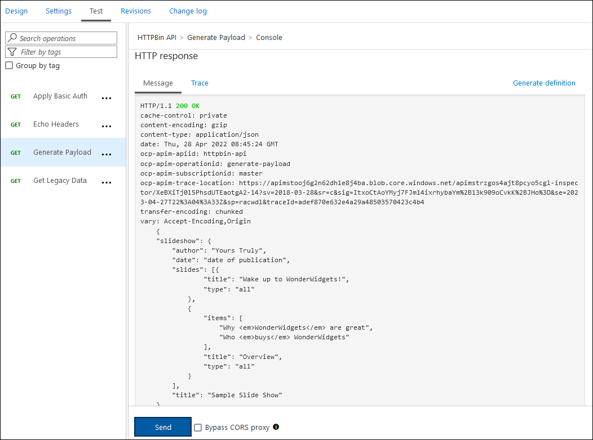

---
lab:
    az204Title: '랩 08: Azure 서비스를 사용하여 다중 계층 솔루션 만들기'
    az020Title: '랩 08: Azure 서비스를 사용하여 다중 계층 솔루션 만들기'
    az204Module: '모듈 08: API Management 구현'
    az020Module: '모듈 08: API Management 구현'
---

# 랩 08: Azure 서비스를 사용하여 다중 계층 솔루션 만들기

## Microsoft Azure 사용자 인터페이스

Microsoft 클라우드 도구의 동적 특성을 감안할 때, 이 교육 콘텐츠를 개발한 후 Azure UI가 변경될 수도 있습니다. 따라서 랩 지침 및 랩 단계가 정확히 일치하지는 않을 수 있습니다.

Microsoft는 커뮤니티에서 변경 사항이 필요하다는 것이 확인되면 이 학습 과정을 업데이트합니다. 그러나 클라우드 업데이트가 자주 이루어지기 때문에 이 교육 콘텐츠가 업데이트되기 전에 UI가 변경될 수 있습니다. **이 경우 변경 사항에 적응하고 필요에 따라 랩에서 작업합니다.**


## 지침

### 시작하기 전에

#### 랩 환경에 로그인

다음 자격 증명을 사용하여 Windows 10 VM(가상 머신)에 로그인합니다.
    
-   사용자 이름: **Admin**

-   암호: **Pa55w.rd**

> **참고**: 가상 랩 환경에 연결하기 위한 지침을 강사가 제공할 것입니다.

#### 설치된 애플리케이션 검토

Windows 10 데스크톱에서 작업 표시줄을 찾습니다. 작업 표시줄에는 이 랩에서 사용할 애플리케이션에 대한 아이콘이 포함되어 있습니다.
    
-   Microsoft Edge

## 아키텍처 다이어그램


### 연습 1: Docker 컨테이너 이미지를 사용하여 Azure App Service 리소스 만들기

#### 작업 1: Azure Portal 열기

1.  작업 표시줄에서 **Microsoft Edge** 아이콘을 선택합니다.

1.  브라우저 창이 열리면 Azure Portal([portal.azure.com](https://portal.azure.com))로 이동한 다음 이 랩에서 사용할 계정으로 로그인합니다.

    > **참고**: Azure Portal에 처음 로그인하는 경우 포털 둘러보기가 제공됩니다. 둘러보기를 건너뛰고 포털 사용을 시작하려면 **시작하기**를 선택합니다.

#### 작업 2: httpbin 컨테이너 이미지를 사용하여 Azure App Service 리소스를 통해 웹앱 만들기

1.  Azure Portal에서 **리소스, 서비스 및 문서 검색** 텍스트 상자를 사용하여 **App Services**를 검색한 다음 결과 목록에서 **App Services**를 선택합니다.

1.  **App Services** 블레이드에서 **+ 만들기**를 선택합니다.

1.  **웹앱 만들기** 블레이드의 **기본** 탭에서 다음 작업을 수행합니다.
    
    | 설정                         | 작업                                                       |
    | ------------------------------- | ------------------------------------------------------------ |
    | **구독** 드롭다운 목록 | 기본값을 유지합니다.                                    |
    | **리소스 그룹** 섹션      | **새로 만들기**를 선택하고 **ApiService**를 입력한 다음 **확인**을 선택합니다. |
    | **이름** 텍스트 상자               | **httpapi** *[yourname]* 을 입력합니다.                        |
    | **게시** 섹션             | **Docker 컨테이너**를 선택합니다.                                  |
    | **운영 체제** 섹션    | **Linux**를 선택합니다.                                             |
    | **지역** 드롭다운 목록      | Azure 웹앱을 배포할 수 있는 Azure 지역을 선택합니다.     |
    | **App Service 요금제** 섹션    | **새로 만들기**를 선택하고 **이름** 텍스트 상자에 값으로 **ApiPlan**을 입력한 다음 **확인**을 선택합니다. |
    | **SKU 및 크기** 섹션        | **크기 변경**을 선택하고 **사양 선택기** 블레이드에서 **추가 옵션 보기**를 선택한 후에 **S1**, **적용**을 차례로 선택합니다. |

1.  **다음: Docker >** 를 선택합니다.

1.  **Docker** 탭에서 다음 작업을 수행한 후에 **검토 + 만들기**를 선택합니다.

    | 설정                         | 작업                                     |
    | ------------------------------- | ------------------------------------------ |
    | **옵션** 드롭다운 목록      | **단일 컨테이너**를 선택합니다.           |
    | **이미지 소스** 드롭다운 목록 | **Docker Hub**를 선택합니다.                 |
    | **액세스 유형** 드롭다운 목록  | **공용**을 선택합니다.                  |
    | **이미지 및 태그** 텍스트 상자      | **kennethreitz/httpbin:latest**를 입력합니다. |

1.  **검토 + 만들기** 탭에서 이전 단계에서 선택한 옵션을 검토합니다.

1.  지정된 구성을 사용하여 웹앱을 만들려면 **만들기**를 선택합니다.

    > **참고**: 이 랩을 진행하기 전에 만들기 작업이 완료될 때까지 기다리세요.

#### 작업 3: httpbin 웹 애플리케이션 테스트

1.  Azure Portal에서 **리소스, 서비스 및 문서 검색** 텍스트 상자를 사용하여 **App Services**를 검색한 다음 결과 목록에서 **App Services**를 선택합니다.

1.  **App Services** 블레이드에서 새로 만든 웹앱을 선택합니다.

1.  새로 만든 앱 속성이 표시된 블레이드에서 **찾아보기**를 선택합니다.

1.  웹 애플리케이션 내에서 다음 작업을 수행합니다.

    a.  **응답 형식**을 선택합니다.

    b.  **GET /html**을 선택합니다.

    c.  **사용해 보기**를 선택합니다.

    다음 스크린샷에 웹 애플리케이션의 **사용해 보기** 섹션이 나와 있습니다.

    

    d.  **실행**을 선택합니다.

    e.  **응답 본문** 및 **응답 헤더** 텍스트 상자의 값을 검토합니다.

    f.  **요청 URL** 텍스트 상자의 값을 검토합니다.

1.  웹 애플리케이션 내에서 다음 작업을 수행합니다.

    a.  **동적 데이터**를 선택합니다.

    b.  **GET /bytes/{n}** 을 선택합니다.

    c.  **사용해 보기**를 선택합니다.

    d.  **n** 텍스트 상자에 **25**를 입력합니다.

    e.  **실행**을 선택합니다.

    f.  **응답 본문** 및 **응답 헤더** 텍스트 상자의 값을 검토합니다.

    g.  **파일 다운로드**를 선택한 후 파일이 다운로드되고 나면 메모장에서 파일을 열어 내용을 검토한 후에 파일을 닫습니다.

    > **참고**: 이 파일에는 무작위로 생성된 바이트 시퀀스가 포함되어 있습니다.

    다음 스크린샷에 웹 애플리케이션의 동적 데이터 섹션이 나와 있습니다.
  
    

1.  웹 애플리케이션 내에서 다음 작업을 수행합니다.

    a.  **상태 코드**를 선택합니다.

    b.  **GET /status/{codes}** 를 선택합니다.

    c.  **사용해 보기**를 선택합니다.

    d.  **코드** 텍스트 상자에 **404**를 입력합니다.

    e.  **실행**을 선택합니다.

    f.  **서버 응답**에 **Error: NOT FOUND** 항목이 포함되어 있는지 검토합니다.
     
1.  웹 애플리케이션이 표시된 브라우저 창을 닫습니다.

1.  **httpapi**_[yourname]_ 웹앱이 표시된 브라우저 창으로 다시 전환합니다.

1.  **설정** 섹션에서 **속성** 링크를 선택합니다.

1.  **속성** 섹션에서 **URL** 링크의 값을 기록합니다. 랩 뒷부분에서 해당 API로 요청을 전송할 때 이 값을 사용합니다.

#### 복습

이 연습에서는 Docker Hub에서 얻은 컨테이너 이미지를 사용하여 새 Azure 웹앱을 만들었습니다.

### 연습 2: Azure API Management를 사용하여 API 프록시 계층 빌드

#### 작업 1: API Management 리소스 만들기

1.  Azure Portal에서 **리소스, 서비스 및 문서 검색** 텍스트 상자를 사용하여 **API Management 서비스**를 검색한 다음 결과 목록에서 **API Management 서비스**를 선택합니다.

1.  **API Management 서비스** 블레이드에서 **+ 만들기**를 선택합니다.

1.  **API Management 만들기** 블레이드에서 다음 작업을 수행한 후에 **검토 + 만들기**를 선택합니다.

    
    | 설정                           | 작업                                                       |
    | --------------------------------- | ------------------------------------------------------------ |
    | **구독** 드롭다운 목록    | 기본값을 유지합니다.                                    |
    | **리소스 그룹** 섹션        | 랩 앞부분에서 만든 **ApiService** 그룹을 선택합니다. |
    | **리소스 이름** 텍스트 상자        | **proapi** *[yourname]* 을 입력합니다.                               |
    | **지역** 목록                   | 이전 연습에서 선택한 것과 같은 지역을 선택합니다.   |
    | **조직 이름** 텍스트 상자    | **Contoso**를 입력합니다.                                           |
    | **관리자 이메일** 텍스트 상자 | `admin@contoso.com`을 입력합니다.                                    |
    | **가격 책정 계층** 드롭다운 목록   | **소비(99.95% SLA)** 를 선택합니다.                                |

    웹 애플리케이션의 **API Management 만들기** 블레이드에 구성된 설정이 다음 스크린샷에 나와 있습니다.
    
    

1.  **검토 + 만들기** 탭에서 이전 단계에서 지정한 옵션을 검토하고 **만들기**를 선택합니다.

    > **참고**: 이 랩을 계속하기 전에 만들기 작업이 완료될 때까지 기다리세요.

#### 작업 2: 새 API 정의

1.  Azure Portal에서 **리소스, 서비스 및 문서 검색** 텍스트 상자를 사용하여 **API Management 서비스**를 검색한 다음 결과 목록에서 **API Management 서비스**를 선택합니다.

1.  **API Management 서비스** 블레이드에서 새로 만든 API Management 서비스를 선택합니다.

1.  **API Management 서비스** 블레이드의 **API** 섹션에서 **API**를 선택합니다.

1.  **새 API 정의** 섹션에서 **HTTP**를 선택합니다.

1.  **빈 API 만들기** 창에서 다음 작업을 수행하고 **만들기**를 선택합니다.
    
    | 설정                           | 작업                                                       |
    | --------------------------------- | ------------------------------------------------------------ |
    | **표시 이름** 텍스트 상자    | **HTTPBin API**를 입력합니다.                                    |
    | **이름** 텍스트 상자 | **httpbin-api**를 입력합니다. |
    | **웹 서비스 URL** 텍스트 상자        | 이 랩 앞부분에서 만든 웹앱의 URL을 입력합니다 **참고**: URL이 https:// 접두사로 시작하는지 확인합니다.                              |
    | **API URL 접미사** 텍스트 상자   | 비워 둡니다.  |
 
    웹 애플리케이션의 **빈 API 만들기** 창에 구성된 설정이 다음 스크린샷에 나와 있습니다.

    

    > **참고**: 새 API가 생성될 때까지 기다립니다.

1.  **디자인** 탭에서 **+ 작업 추가**를 선택합니다.

1.  **작업 추가** 섹션에서 다음 작업을 수행하고 **저장**을 선택합니다.


    | 설정                           | 작업                                                       |
    | --------------------------------- | ------------------------------------------------------------ |
    | **표시 이름** 텍스트 상자    | **Echo Headers**를 입력합니다.              |
    | **이름** 텍스트 상자 | 값이 **echo-headers**로 설정되어 있는지 확인합니다.|
    | **URL** 목록        | **GET**을 선택합니다.              |
    | **URL** 텍스트 상자   | **/** 를 입력합니다.  |

    **작업 추가** 섹션에 구성된 설정이 다음 스크린샷에 나와 있습니다.
    
    

    
1.  **디자인** 탭으로 돌아가 작업 목록에서 **Echo Headers**를 선택합니다.

1.  **디자인** 섹션의 **인바운드 처리** 타일에서 **+ 정책 추가**를 선택합니다.

1.  **인바운드 정책 추가** 섹션에서 **헤더 설정** 타일을 선택합니다.

1.  **헤더 설정** 섹션에서 다음 작업을 수행하고 **저장**을 선택합니다.
    
    | 설정                           | 작업                                                       |
    | --------------------------------- | ------------------------------------------------------------ |
    | **이름** 텍스트 상자    | **source**를 입력합니다.                          |
    | **값** 텍스트 상자 | 목록을 선택하고 **값 추가**를 선택한 후 **azure-api-mgmt**를 입력합니다. |
    | **작업** 목록        | **추가**를 선택합니다.              |

    **디자인** 섹션에 구성된 설정이 다음 스크린샷에 나와 있습니다.

    

1.  **디자인** 탭으로 돌아가 작업 목록에서 **Echo Headers**를 선택합니다.

1.  **Echo Headers**의 **디자인** 섹션 **백 엔드** 타일에서 연필 모양 아이콘을 선택합니다.

1.  **백 엔드** 섹션에서 다음 작업을 수행하고 **저장**을 선택합니다.

    | 설정                           | 작업                                                       |
    | --------------------------------- | ------------------------------------------------------------ |
    | **서비스 URL** 섹션    | **재정의** 체크박스를 선택합니다.|
    | **서비스 URL** 텍스트 상자 | 현재 값에 **/headers** 값을 추가합니다. **참고**: 예를 들어 현재 값이 `http://httpapi[yourname].azurewebsites.net`이라면 새 값은 `http://httpapi[yourname].azurewebsites.net/headers`가 됩니다.|
    
1.  **디자인** 탭으로 돌아가 작업 목록에서 **Echo Headers**를 선택하고 **테스트** 탭을 선택합니다.

1.  **Echo Header** 섹션에서 **보내기**를 선택합니다.

    **Echo Headers** 섹션에 구성된 설정이 다음 스크린샷에 나와 있습니다.

    
    
1.  API 요청의 결과를 검토합니다.

    > **참고**: 이 요청에서는 여러 헤더가 전송되어 응답 화면에 표시됩니다. 이러한 헤더에는 이 작업에서 만든 새 **Source** 헤더도 포함되어 있어야 합니다.
     
    **Echo Headers** 요청의 응답이 다음 스크린샷에 나와 있습니다.

    
     
1.  작업 목록으로 돌아가려면 **디자인** 탭을 선택합니다.

#### 작업 3: API 응답 조작

1.  **디자인** 탭에서 **+ 작업 추가**를 선택합니다.

1.  **작업 추가** 섹션에서 다음 작업을 수행하고 저장을 선택합니다.

    | 설정                           | 작업                                                       |
    | --------------------------------- | ------------------------------------------------------------ |
    | **표시 이름** 텍스트 상자    | **Get Legacy Data**를 입력합니다.|
    | **이름** 텍스트 상자 | 값이 **get-legacy-data**로 설정되어 있는지 확인합니다.|
    | **URL** 목록 | 값이 **GET**으로 설정되어 있는지 확인합니다.|
    | **URL** 텍스트 상자 | **/xml**을 입력합니다.|

1.  **디자인** 탭으로 돌아가 작업 목록에서 **Get Legacy Data**를 선택합니다.

1.  **테스트** 탭, **보내기**를 차례로 선택합니다.

1.  API 요청의 결과를 검토합니다.

    > **참고**: 이 시점에서 결과는 XML 형식이어야 합니다.

    API 요청의 결과가 다음 스크린샷에 나와 있습니다.
    
    

    
1.  **디자인** 탭과 **Get Legacy Data**를 차례로 선택합니다.

1.  **디자인** 창의 **아웃바운드 처리** 섹션에서 **정책 추가**를 선택합니다.
    
    다음 스크린샷에 **아웃바운드 처리** 섹션이 나와 있습니다.
    
    
    
1.  **아웃바운드 정책 추가** 섹션에서 **기타 정책** 타일을 선택합니다.

1.  정책 코드 편집기에서 XML 콘텐츠의 다음 블록을 찾습니다.

    ```
    <outbound>
        <base />
    </outbound>
    ```

1.  XML의 해당 블록을 다음 XML로 바꿉니다.

    ```
    <outbound>
        <base />
        <xml-to-json kind="direct" apply="always" consider-accept-header="false" />
    </outbound>
    ```

1.  정책 코드 편집기에서 **저장**을 선택합니다.

1.  **디자인** 탭으로 돌아가 작업 목록에서 **Get Legacy Data**를 선택하고 **테스트**를 선택합니다.

1.  **Get Legacy Data** 섹션에서 **보내기**를 선택합니다.

1.  API 요청의 결과를 검토합니다.

    > **참고**: 새 결과는 JSON(JavaScript Object Notation) 형식으로 표시됩니다.

1.  **HTTP 응답** 섹션 내에서 다음 작업을 수행합니다.

    1.  **추적**을 선택합니다.

    1.  **백 엔드** 및 **아웃바운드** 텍스트 상자의 내용을 검토하여 해당 API 작업 세부 정보와 소요 시간 정보가 포함되어 있는지 확인합니다.

1.  **디자인** 탭에서 **+ 작업 추가**를 선택합니다.

1.  **작업 추가** 섹션에서 다음 작업을 수행하고 저장을 선택합니다.

    | 설정                           | 작업                                                       |
    | --------------------------------- | ------------------------------------------------------------ |
    | **표시 이름** 텍스트 상자    | **Generate Payload**를 입력합니다.|
    | **이름** 텍스트 상자 | 값이 **generate-payload**로 설정되어 있는지 확인합니다.|
    | **URL** 목록 | **GET**을 선택합니다.|
    | **URL** 텍스트 상자 | **/bytes/{n}** 을 입력합니다.|
    | **템플릿 매개 변수** 섹션 | **유형** 텍스트 상자에 **int**를 입력합니다.|


1.  **디자인** 탭으로 돌아가 작업 목록에서 **Generate Payload**를 선택합니다.

1.  **디자인** 섹션의 **아웃바운드 처리** 타일에서 **+ 정책 추가**를 선택합니다.

1.  **아웃바운드 정책 추가** 섹션에서 **콘텐츠 유효성 검사** 타일을 선택합니다.

1.  **아웃바운드 처리** 섹션에서 다음 작업을 수행하고 **저장**을 선택합니다.
    
    | 설정                           | 작업                                                       |
    | --------------------------------- | ------------------------------------------------------------ |
    | **지정되지 않은 콘텐츠 형식 작업** 드롭다운 목록    | **무시**를 선택합니다.|
    | **최대 페이로드 크기(바이트)** 텍스트 상자 | **128**을 입력합니다.|
    | **크기 초과 시 작업** 드롭다운 목록| **차단**을 선택합니다.|
    | **오류 변수 이름** 텍스트 상자 | **validationErrors**를 입력합니다.|
    

1.  **디자인** 탭으로 돌아가 작업 목록에서 **Generate Payload**를 선택하고 **테스트** 탭을 선택합니다.

1.  **Generate Payload** 섹션의 **템플릿 매개 변수** 하위 섹션에 있는 **n** 매개 변수의 **값** 텍스트 상자에 **512**를 입력하고 **보내기**를 선택합니다.

1.  API 요청의 결과를 검토합니다.

    > **참고**: 페이로드 크기가 아웃바운드 정책이 정의하는 제한을 초과하므로 "HTTP/1.1 502 Response Not Allowed" 메시지가 표시되어야 합니다.

     
       

     
1.  **디자인** 탭과 **Generate Payload**를 차례로 선택합니다.

1.  **아웃바운드 처리** 타일에서 연필 모양 아이콘을 선택합니다.

1.  **최대 페이로드 크기(바이트)** 텍스트 상자의 값을 **128**에서 **1024**로 바꿉니다.

1.  **저장**을 선택합니다.

1.  **디자인** 탭으로 돌아가 작업 목록에서 **Generate Payload**를 선택하고 **테스트** 탭을 선택합니다.

1.  **Generate Payload** 섹션의 **템플릿 매개 변수** 하위 섹션에 있는 **n** 매개 변수의 **값** 텍스트 상자에 **512**를 입력하고 **보내기**를 선택합니다.

1.  API 요청의 결과를 검토합니다.

    > **참고**: 이제 페이로드 크기가 아웃바운드 정책이 정의하는 제한 범위 내에 포함되므로 HTTP/1.1 200 OK 응답 메시지가 표시되어야 합니다.

       

#### 작업 4: API 요청 조작

1.  **디자인** 탭에서 **+ 작업 추가**를 선택합니다.

1.  **작업 추가** 섹션에서 다음 작업을 수행하고 저장을 선택합니다.

    | 설정                           | 작업                                                       |
    | --------------------------------- | ------------------------------------------------------------ |
    | **표시 이름** 텍스트 상자    | **Modify Status Code**를 입력합니다.|
    | **이름** 텍스트 상자 | 값이 **modify-status-code**로 설정되어 있는지 확인합니다.|
    | **URL** 목록 | **GET**을 선택합니다.|
    | **URL** 텍스트 상자 | **/status/404**를 입력합니다.|

1.  **디자인** 탭으로 돌아가 작업 목록에서 **Modify Status Code**를 선택합니다.

1.  **디자인** 섹션의 **인바운드 처리** 타일에서 **+ 정책 추가**를 선택합니다.

1.  **인바운드 정책 추가** 섹션에서 **URL 다시 쓰기** 타일을 선택합니다.

1.  **URL 다시 쓰기** 섹션에서 다음 작업을 수행합니다.
       
    a.  **백 엔드** 텍스트 상자에 **/status/200**을 입력합니다.
    
    b.  **저장** 선택

1.  **디자인** 탭으로 돌아가 작업 목록에서 **Modify Status Code**를 선택하고 **테스트** 탭을 선택합니다.
    
1.  **Modify Status Code** 섹션에서 **보내기**를 선택합니다.

1.  API 요청의 결과를 검토합니다.

    > **참고**: 요청에서 **HTTP/1.1 200 OK** 응답이 반환되었는지 확인합니다.
   
#### 복습

이 연습에서는 App Service 리소스, 그리고 이 리소스의 API를 쿼리하려는 개발자 간의 프록시 계층을 빌드했습니다.

### 연습 3: 구독 정리

#### 작업 1: Azure Cloud Shell 열기

1.  Azure Portal에서 **Cloud Shell** 아이콘()을 선택하여 새 Bash 세션을 엽니다. Cloud Shell의 기본 세션이 PowerShell 세션이라면 **PowerShell**을 선택하고 드롭다운 메뉴에서 **Bash**를 선택합니다.

      > **참고**: **Cloud Shell**을 처음 시작하는 경우에는 **Bash** 또는 **PowerShell** 중에서 선택하라는 메시지가 나타날 때 **PowerShell**을 선택합니다. **탑재된 스토리지가 없음**이라는 메시지가 표시되면 이 랩에서 사용하는 구독을 선택하고 **스토리지 만들기**를 선택합니다.

#### 작업 2: 리소스 그룹 삭제

1.  **Cloud Shell** 창에서 다음 명령을 실행하여 **ApiService** 리소스 그룹을 삭제합니다.

    ```
    az group delete --name ApiService --no-wait --yes
    ```
    
     > **참고**: 명령은 비동기적으로 실행되므로(*--no-wait* 매개 변수에 의해 결정됨) 동일한 Bash 세션 내에서 즉시 다른 Azure CLI 명령을 실행할 수 있지만 리소스 그룹이 실제로 제거되기까지 몇 분 정도 걸립니다.
  
1.  포털에서 **Cloud Shell** 창을 닫습니다.

#### 작업 3: 활성 애플리케이션 닫기

1.  현재 실행 중인 Microsoft Edge 애플리케이션을 닫습니다.

#### 복습

이 연습에서는 이 랩에 사용된 리소스 그룹을 제거하여 구독을 정리했습니다.
