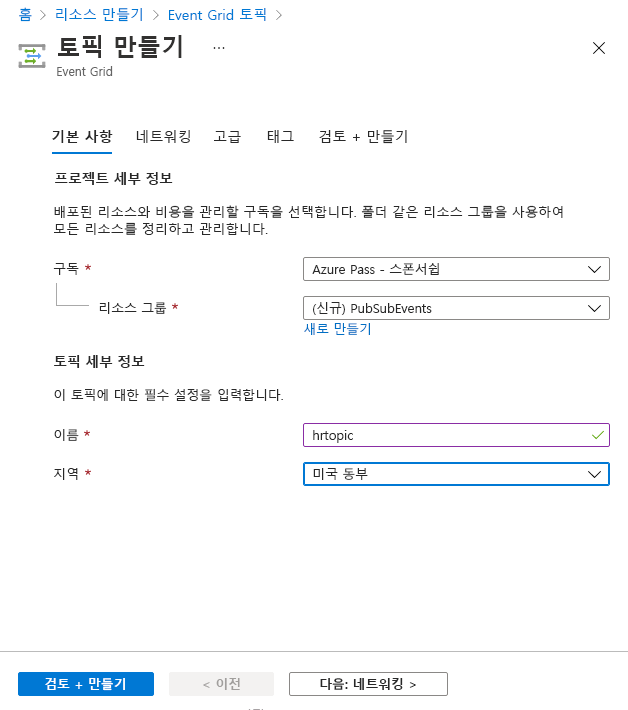

---
lab:
    az204Title: '랩 09: Event Grid 이벤트 게시 및 구독'
    az020Title: '랩 09: Event Grid 이벤트 게시 및 구독'
    az204Module: '모듈 09: 이벤트 기반 솔루션 개발'
    az020Module: '모듈 09: 이벤트 기반 솔루션 개발'
---

# 랩 09: Event Grid 이벤트에 게시 및 구독

## Microsoft Azure 사용자 인터페이스

Microsoft 클라우드 도구의 동적 특성을 감안할 때, 이 교육 콘텐츠를 개발한 후 Azure UI가 변경될 수도 있습니다. 따라서 랩 지침 및 랩 단계가 정확히 일치하지는 않을 수 있습니다.

Microsoft는 커뮤니티에서 변경 사항이 필요하다는 것을 알릴 때 이 학습 과정을 업데이트합니다. 그러나 클라우드 업데이트가 자주 이루어지기 때문에 이 학습 콘텐츠가 업데이트되기 전에 UI가 변경될 수 있습니다. **이 경우 변경 사항에 적응하고 필요에 따라 랩에서 작업합니다.**

## 지침

### 시작하기 전에

#### 랩 환경에 로그인

다음 자격 증명을 사용하여 Windows 10 VM(가상 머신)에 로그인합니다.

- 사용자 이름: **Admin**

- 암호: **Pa55w.rd**

> **참고**: 가상 랩 환경에 연결하기 위한 지침을 강사가 제공할 것입니다.

#### 설치된 애플리케이션 검토

Windows 10 데스크톱에서 작업 표시줄을 찾습니다. 작업 표시줄에는 다음과 같이 이 랩에서 사용할 애플리케이션에 대한 아이콘이 포함되어 있습니다.

- Microsoft Edge

- Microsoft Visual Studio Code

## 아키텍처 다이어그램


### 연습 1: Azure 리소스 만들기

#### 작업 1: Azure Portal 열기

1. 작업 표시줄에서 **Microsoft Edge** 아이콘을 선택합니다.

1. 열린 브라우저 창에서 Azure Portal(<https://portal.azure.com>)로 이동한 다음, 이 랩에 대해 사용할 계정으로 로그인합니다.

    > **참고**: Azure Portal에 처음 로그인하는 경우 포털 둘러보기가 제공됩니다. 둘러보기를 건너뛰고 포털 사용을 시작하려면 **시작하기**를 선택합니다.

#### 작업 2: Azure Cloud Shell 열기

1. Azure Portal에서 **Cloud Shell** 아이콘()을 선택하여 새 Bash 인스턴스를 엽니다. Cloud Shell이 기본적으로 PowerShell 세션인 경우 **PowerShell**을 선택하고 드롭다운 메뉴에서 **Bash**를 선택합니다.

    > **참고**: **Cloud Shell**을 처음 시작하는 경우에는 **Bash** 또는 **PowerShell** 중에서 선택하라는 메시지가 나타날 때 **Bash**를 선택합니다. **탑재된 스토리지가 없음** 메시지가 표시되면 이 랩에서 사용하는 구독을 선택한 후에 **스토리지 만들기**를 선택합니다.

1. Azure Portal에서 **Cloud Shell** 명령 프롬프트에 따라 다음 명령을 실행하여 Azure CLI(Azure 명령줄 인터페이스) 도구의 버전을 가져옵니다.

    ```bash
    az --version
    ```

#### 작업 3: Microsoft.EventGrid 공급자 등록 검토

1. Portal의 **Cloud Shell** 명령 프롬프트에서 다음 작업을 수행합니다.

    a. 다음 명령을 실행하여 Azure CLI의 루트 수준에서 하위 그룹 및 명령 목록을 가져옵니다.

    ```bash
    az --help
    ```

    b. 다음 명령을 실행하여 리소스 공급자가 사용할 수 있는 명령 목록을 가져옵니다.

    ```bash
    az provider --help
    ```

    c. 다음 명령을 실행하여 현재 등록된 공급자를 모두 나열합니다.

   ```bash
   az provider list
   ```

    d. 다음 명령을 실행하여 현재 등록된 공급자의 네임스페이스만 나열합니다.

   ```bash
   az provider list --query "[].namespace"
   ```

    e. 현재 등록된 공급자 목록을 검토합니다. **Microsoft.EventGrid** 공급자가 현재 공급자 목록에 포함되어 있습니다.

1. **Cloud Shell** 창을 닫습니다.

#### 작업 4: 사용자 지정 Event Grid 항목 만들기

1. Azure Portal 탐색 창에서 **리소스 만들기**를 선택합니다.

1. **리소스 만들기** 블레이드에 있는 **서비스 및 마켓플레이스 검색** 텍스트 상자에 **Event Grid 토픽**을 입력한 후에 Enter 키를 누릅니다.

1. **Marketplace** 검색 결과 블레이드에서 **Event Grid 토픽** 결과를 선택한 후에 **만들기**를 선택합니다.

1. **토픽 만들기** 블레이드의 **기초** 탭에서 다음 작업을 수행한 후에 **고급** 탭을 선택합니다.

    | 설정                           | 작업                                                       |
    | --------------------------------- | ------------------------------------------------------------ |
    | **구독** 드롭다운 목록   | 기본값을 유지합니다.                                    |
    | **리소스 그룹** 드롭다운 목록 | **새로 만들기**를 선택하고 **PubSubEvents**를 입력한 다음 **확인**을 선택합니다. |
    | **이름** 텍스트 상자                 | **hrtopic**_[사용자 이름]_을 입력합니다.                               |
    | **지역** 드롭다운 목록         | **미국 동부**를 입력합니다.                                          |

   다음 스크린샷은 **기본** 탭에 구성된 설정을 표시합니다.

   

1. **고급** 탭의 **이벤트 스키마** 드롭다운 목록에서 **Event Grid 스키마**를 선택한 후 **검토 + 만들기**를 선택합니다.

1. **검토 + 만들기** 탭에서 이전 단계에서 선택한 옵션을 검토합니다.

1. 지정된 구성을 사용하여 Event Grid 토픽을 만들려면 **만들기**를 선택합니다.
  
    > **참고**: 랩을 진행하기 전에 Azure가 토픽을 만들 때까지 기다립니다. 항목이 생성되면 알림을 받게 됩니다.

#### 작업 5: Azure Event Grid 뷰어를 웹앱에 배포하기

1. Azure Portal 탐색 창에서 **리소스 만들기**를 선택합니다.

1. **리소스 만들기** 블레이드에 있는 **서비스 및 마켓플레이스 검색** 텍스트 상자에 **웹앱**을 입력한 후에 Enter 키를 누릅니다.

1. **Marketplace** 검색 결과 블레이드에서 **웹앱** 결과를 선택한 후에 **만들기**를 선택합니다.

1. **웹앱 만들기** 블레이드의 **기초** 탭에서 다음 작업을 수행한 후에 **다음: Docker**를 선택합니다.

   | 설정                           | 작업                                                       |
   | --------------------------------- | ------------------------------------------------------------ |
   | **구독** 드롭다운 목록   | 기본값을 유지합니다.                                    |
   | **리소스 그룹** 드롭다운 목록 | 목록에서 **PubSubEvents**를 선택합니다.                         |
   | **이름** 텍스트 상자                 | **eventviewer**_[사용자 이름]_을 입력합니다.                           |
   | **게시** 섹션               | **Docker 컨테이너**를 선택합니다.                                 |
   | **운영 체제** 섹션      | **Linux**를 선택합니다.                                            |
   | **지역** 드롭다운 목록         | **미국 동부**를 입력합니다.                                          |
   | **Linux 계획(미국 동부)** 섹션  | **새로 만들기**를 선택하고, **이름** 텍스트 상자에 **EventPlan**을 입력한 후에 **확인**을 선택합니다. |
   | **SKU 및 크기** 섹션          | 기본값을 유지합니다.                                    |

   다음 스크린샷은 **웹앱 만들기** 블레이드에 구성된 설정을 표시합니다.

   

1. **Docker** 탭에서 다음 작업을 수행하고 **검토 + 만들기**를 선택합니다.

    | 설정                         | 작업                                                      |
    | ------------------------------- | ----------------------------------------------------------- |
    | **옵션** 드롭다운 목록      | **단일 컨테이너**를 선택합니다.                                |
    | **이미지 소스** 드롭다운 목록 | **Docker Hub**를 선택합니다.                                      |
    | **액세스 유형** 드롭다운 목록  | **공용**을 선택합니다.                                          |
    | **이미지 및 태그** 텍스트 상자      | **microsoftlearning/azure-event-grid-viewer:latest**를 입력합니다. |

   다음 스크린샷은 **Docker** 탭에 구성된 설정을 표시합니다.

   

1. **검토 + 만들기** 탭에서 이전 단계에서 선택한 옵션을 검토합니다.

1. 지정된 구성을 사용하여 웹앱을 만들려면 **만들기**를 선택합니다.
  
    > **참고**: 랩을 계속하기 전에 Azure에서 웹앱을 만들 때까지 기다립니다. 앱을 만들 때 알림을 받게 됩니다.

#### 복습

이 연습에서는 랩의 나머지 부분에서 사용할 Event Grid 토픽과 웹앱을 만들었습니다.

### 연습 2: Event Grid 구독 만들기

#### 작업 1: Event Grid 뷰어 웹 애플리케이션 액세스

1. Azure Portal의 탐색 창에서 **리소스 그룹**을 선택합니다.

1. **리소스 그룹** 블레이드에서 **PubSubEvents** 리소스 그룹을 선택합니다.

1. **PubSubEvents** 블레이드에서 **eventviewer**_[사용자 이름]_ 웹앱을 선택합니다.

1. **App Service** 블레이드의 **설정** 범주에서 **속성** 링크를 선택합니다.

1. **속성** 섹션에서 **URL** 링크의 값을 기록합니다. 이 값은 랩에서 나중에 사용합니다.

1. **개요**와 **찾아보기**를 차례로 선택합니다.

1. 현재 실행 중인 **Azure Event Grid 뷰어** 웹 애플리케이션을 관찰합니다. 이 웹 애플리케이션은 랩의 나머지 부분에서 실행되도록 둡니다.

    > **참고**: 이 웹 애플리케이션은 이벤트가 엔드포인트로 전송될 때 실시간으로 업데이트됩니다. 이 애플리케이션을 사용하여 랩 전반에서 이벤트를 모니터링합니다.

1. Azure Portal을 표시하며 현재 열려 있는 브라우저 창으로 돌아갑니다.

#### 작업 2: 새 구독 만들기

1. Azure Portal의 탐색 창에서 **리소스 그룹**을 선택합니다.

1. **리소스 그룹** 블레이드에서 이 랩의 앞부분에서 만든 **PubSubEvents** 리소스 그룹을 선택합니다.

1. **PubSubEvents** 블레이드에서 이 랩의 앞부분에서 **hrtopic**_[사용자 이름]_ Event Grid 토픽을 선택합니다.

1. **Event Grid 토픽** 블레이드에서 **+ 이벤트 구독**을 선택합니다.

1. **이벤트 구독 만들기** 블레이드에서 다음 작업을 수행한 후에 **만들기**를 선택합니다.

    | 설정                          | 작업                                                       |
    | -------------------------------- | ------------------------------------------------------------ |
    | **이름** 텍스트 상자                | **basicsub**를 입력합니다.                                          |
    | **이벤트 스키마** 드롭다운 목록  | **Event Grid 스키마**를 선택합니다.                                |
    | **엔드포인트 유형** 드롭다운 목록 | **웹 후크**를 선택합니다.                                         |
    | **엔드포인트**                     | **엔드포인트 선택**을 선택합니다. **구독자 엔드포인트** 텍스트 상자에 이전에 기록한 **웹앱 URL** 값을 입력하고, **https://** 접두사를 사용하는지 확인하고, **/api/updates** 접미사를 추가한 다음 **선택 확인**을 선택합니다. 예를 들어, **웹앱 URL** 값이 ``http://eventviewerstudent.azurewebsites.net/``인 경우 **구독자 엔드포인트**는 ``https://eventviewerstudent.azurewebsites.net/api/updates``가 되어야 합니다. |

   다음 스크린샷은 **이벤트 구독 만들기** 블레이드에 구성된 설정을 표시합니다.

   

    > **참고**: 랩을 계속하기 전에 Azure에서 구독을 만들 때까지 기다립니다. 구독이 생성되면 알림을 받게 됩니다.

#### 작업 3: 구독 유효성 검사 이벤트 관찰

1. **Azure Event Grid 뷰어** 웹 애플리케이션을 표시하는 브라우저 창으로 돌아갑니다.

1. 구독 만들기 작업의 일부로 만든 **Microsoft.EventGrid.SubscriptionValidationEvent** 이벤트를 검토합니다.

1. 이벤트를 선택하여 JSON 콘텐츠를 검토합니다.

1. Azure Portal을 통해 현재 열려 있는 브라우저 창으로 돌아갑니다.

#### 작업 4: 구독 자격 증명 기록

1. Azure Portal의 탐색 창에서 **리소스 그룹**을 선택합니다.

1. **리소스 그룹** 블레이드에서 이 랩의 앞부분에서 만든 **PubSubEvents** 리소스 그룹을 선택합니다.

1. **PubSubEvents** 블레이드에서 이 랩의 앞부분에서 **hrtopic**_[사용자 이름]_ Event Grid 토픽을 선택합니다.

1. **Event Grid 항목** 블레이드에서 **항목 엔드포인트** 필드의 값을 기록합니다. 이 값은 랩에서 나중에 사용합니다.

1. **설정** 카테고리에서 **액세스 키** 링크를 선택합니다.

1. **액세스 키** 섹션에서 **키 1** 텍스트 상자의 값을 기록합니다. 이 값은 랩에서 나중에 사용합니다.

#### 복습

이 연습에서는 새 구독을 만들고 등록의 유효성을 검사한 다음 토픽에 새 이벤트를 게시하는 데 필요한 자격 증명을 기록했습니다.

### 연습 3: .NET에서 Event Grid 이벤트 게시

#### 작업 1: .NET 프로젝트 만들기

1. **시작** 화면에서 **Visual Studio Code** 타일을 선택합니다.

1. **파일** 메뉴에서 **폴더 열기**를 선택합니다.

1. 열리는 **파일 탐색기** 창에서 **Allfiles (F):\\Allfiles\\Labs\\09\\Starter\\EventPublisher**로 이동한 후 **폴더 선택**을 선택합니다.

1. **Visual Studio Code** 창에서 **탐색기** 창의 바로 가기 메뉴를 활성화한 다음 **통합 터미널에서 열기**를 선택합니다.

1. 다음 명령을 실행하여 현재 폴더에서 **EventPublisher**라는 새 .NET 프로젝트를 만듭니다.

    ```powershell
    dotnet new console --name EventPublisher --output .
    ```

    > **참고**: **dotnet new** 명령은 새 **콘솔** 프로젝트를 프로젝트와 이름이 같은 폴더에 만듭니다.

1. 다음 명령을 실행하여 NuGet에서 **Azure.Messaging.EventGrid**의 버전 4.1.0을 가져옵니다.

    ```powershell
    dotnet add package Azure.Messaging.EventGrid --version 4.1.0
    ```

    > **참고**: **dotnet add package** 명령은 NuGet에서 **Microsoft.Azure.EventGrid** 패키지를 추가합니다. 더 자세한 내용은 [Azure.Messaging.EventGrid](https://www.nuget.org/packages/Azure.Messaging.EventGrid/4.1.0)를 참조하세요.

1. 다음 명령을 실행하여 .NET 웹 애플리케이션을 빌드합니다.

    ```powershell
    dotnet build
    ```

1. **터미널 종료** 또는 **휴지통** 아이콘을 선택하여 현재 열려 있는 터미널 및 관련된 모든 작업을 종료합니다.

#### 작업 2: Program 클래스를 수정하여 Event Grid에 연결

1. **Visual Studio Code** 창의 **탐색기** 창에서 **Program.cs** 파일을 엽니다.

1. **Program.cs** 파일의 코드 편집기 탭에서 기존 파일의 모든 코드를 삭제합니다.

1. 다음 코드 줄을 추가하여 NuGet에서 가져온 **Azure.Messaging.EventGrid** 패키지의 **Azure** 및 **Azure.Messaging.EventGrid** 네임스페이스를 가져옵니다.

    ```csharp
    using Azure;
    using Azure.Messaging.EventGrid;
    ```

1. 다음 코드 줄을 추가하여 이 파일에 사용할 기본 제공 네임스페이스에 대해 **using** 지시문을 추가합니다.

    ```csharp
    using System;
    using System.Threading.Tasks;
    ```

1. 다음 코드를 입력하여 새 **Program** 클래스를 만듭니다.

    ```csharp
    public class Program
    {
    }
    ```

1. **Program** 클래스에서 다음 코드 줄을 입력하여 **topicEndpoint**라는 이름의 새 문자열 상수를 만듭니다.

    ```csharp
    private const string topicEndpoint = "";
    ```

1. 이 랩의 앞부분에서 기록한 Event Grid 토픽의 **토픽 엔드포인트**에 값을 설정하여 **topicEndpoint** 문자열 상수를 업데이트합니다.

1. **프로그램** 클래스에서 다음 코드 줄을 입력하여 새 문자열 상수 **topicKey**를 만듭니다.

    ```csharp
    private const string topicKey = "";
    ```

1. 이 랩의 앞부분에서 기록한 Event Grid 토픽의 **키**에 값을 설정하여 **topicKey** 문자열 상수를 업데이트합니다.

1. **Program** 클래스에서 다음 코드 줄을 입력하여 새 비동기 **Main** 메서드를 만듭니다.

    ```csharp
    public static async Task Main(string[] args)
    {
    }
    ```

1. 이제 다음 코드 줄을 포함해야 하는 **Program.cs** 파일을 살펴봅니다.

    ```csharp
    using System;
    using System.Threading.Tasks;
    using Azure;
    using Azure.Messaging.EventGrid;
    
    public class Program
    {
        private const string topicEndpoint = "<topic-endpoint>";
        private const string topicKey = "<topic-key>";
        
        public static async Task Main(string[] args)
        {
        }
    }
    ```

#### 작업 3: 새 이벤트 게시

1. **Main** 메서드에서 다음 작업을 수행하여 이벤트 목록을 토픽 엔드포인트에 게시합니다.

    a. 다음 코드 줄을 추가하여 **Uri** 형식의 새 변수 **endpoint**를 만듭니다. 이때 생성자 매개 변수로는 **topicEndpoint** 문자열 상수를 사용합니다.

    ```csharp
    Uri endpoint = new Uri(topicEndpoint); 
    ```

    b. 다음 코드 줄을 추가하여 **topicKey** 문자열 상수를 생성자 매개 변수로 사용하여 **[[AzureKeyCredential](https://docs.microsoft.com/dotnet/api/azure.azurekeycredential)]** 형식의 **credential**이라는 새 변수를 만듭니다.

    ```csharp
    AzureKeyCredential credential = new AzureKeyCredential(topicKey);
    ```

    c. 다음 코드 줄을 추가하여 **[[EventGridPublisherClient](https://docs.microsoft.com/dotnet/api/azure.messaging.eventgrid.eventgridpublisherclient)]** 형식의 새 변수 **client**를 만듭니다. 이때 생성자 매개 변수로는 **endpoint** 및 **credential** 변수를 사용합니다.

    ```csharp
    EventGridPublisherClient client = new EventGridPublisherClient(endpoint, credential);
    ```

    d. 다음 코드 블록을 추가하여 **[[EventGridEvent](https://docs.microsoft.com/dotnet/api/azure.messaging.eventgrid.eventgridevent)]** 형식의 새 변수 **firstEvent**를 만든 다음 샘플 데이터로 변수를 채웁니다.

    ```csharp
    EventGridEvent firstEvent = new EventGridEvent(
        subject: $"New Employee: Alba Sutton",
        eventType: "Employees.Registration.New",
        dataVersion: "1.0",
        data: new
        {
            FullName = "Alba Sutton",
            Address = "4567 Pine Avenue, Edison, WA 97202"
         }
     );
     ```

    e. 다음 코드 블록을 추가하여 **[[EventGridEvent](https://docs.microsoft.com/dotnet/api/azure.messaging.eventgrid.eventgridevent)]** 형식의 새 변수 **secondEvent**를 만든 다음 샘플 데이터로 변수를 채웁니다.

     ```csharp
        EventGridEvent secondEvent = new EventGridEvent(
            subject: $"New Employee: Alexandre Doyon",
            eventType: "Employees.Registration.New",
            dataVersion: "1.0",
            data: new
            {
                FullName = "Alexandre Doyon",
                Address = "456 College Street, Bow, WA 98107"
            }
        );
     ```

    f. 다음 코드 줄을 추가하여 **firstEvent** 변수를 매개 변수로 사용하여 **[[EventGridPublisherClient.SendEventAsync](https://docs.microsoft.com/dotnet/api/azure.messaging.eventgrid.eventgridpublisherclient.sendeventasync)]** 메서드를 비동기식으로 호출합니다.

     ```csharp
     await client.SendEventAsync(firstEvent);
     ```

    g. 다음 코드 줄을 추가하여 **"First event published"** 메시지를 콘솔에 렌더링합니다.

     ```csharp
     Console.WriteLine("First event published");
     ```

    h. 다음 코드 줄을 추가하여 **secondEvent** 변수를 매개 변수로 사용하여 **[[EventGridPublisherClient.SendEventAsync](https://docs.microsoft.com/dotnet/api/azure.messaging.eventgrid.eventgridpublisherclient.sendeventasync)]** 메서드를 비동기식으로 호출합니다.

     ```csharp
     await client.SendEventAsync(secondEvent);
     ```

    i. 다음 코드 줄을 추가하여 **"Second event published"** 메시지를 콘솔에 렌더링합니다.

     ```csharp
     Console.WriteLine("Second event published");
     ```

1. 이제 다음이 포함된 **Main** 메서드를 검토합니다.

    ```csharp
    public static async Task Main(string[] args)
    {
        Uri endpoint = new Uri(topicEndpoint);
        AzureKeyCredential credential = new AzureKeyCredential(topicKey);
        EventGridPublisherClient client = new EventGridPublisherClient(endpoint, credential);
        
        EventGridEvent firstEvent = new EventGridEvent(
            subject: $"New Employee: Alba Sutton",
            eventType: "Employees.Registration.New",
            dataVersion: "1.0",
            data: new
            {
                FullName = "Alba Sutton",
                Address = "4567 Pine Avenue, Edison, WA 97202"
            }
        );

        EventGridEvent secondEvent = new EventGridEvent(
            subject: $"New Employee: Alexandre Doyon",
            eventType: "Employees.Registration.New",
            dataVersion: "1.0",
            data: new
            {
                FullName = "Alexandre Doyon",
                Address = "456 College Street, Bow, WA 98107"
            }
        );

        await client.SendEventAsync(firstEvent);
        Console.WriteLine("First event published");

        await client.SendEventAsync(secondEvent);
        Console.WriteLine("Second event published");
    }
    ```

1. **Program.cs** 파일을 저장합니다.

1. **Visual Studio Code** 창에서 **탐색기** 창의 바로 가기 메뉴를 활성화한 다음 **통합 터미널에서 열기**를 선택합니다.

1. 다음 명령을 실행하여 .NET 웹 애플리케이션을 실행합니다.

    ```powershell
    dotnet run
    ```

    > **참고**: 빌드 오류가 있는 경우 **Allfiles (F):\\Allfiles\\Labs\\09\\Solution\\EventPublisher** 폴더에 있는 **Program.cs** 파일을 검토합니다.

1. 현재 실행 중인 콘솔 애플리케이션의 성공 메시지 출력을 관찰합니다.

1. **터미널 종료** 또는 **휴지통** 아이콘을 선택하여 현재 열려 있는 터미널 및 관련된 모든 작업을 종료합니다.

#### 작업 4: 게시된 이벤트 살펴보기

1. **Azure Event Grid 뷰어** 웹 애플리케이션이 있는 브라우저 창으로 돌아갑니다.

1. 콘솔 애플리케이션으로 생성한 **Employees.Registration.New** 이벤트를 검토합니다.

1. 아무 이벤트나 선택하고 JSON 콘텐츠를 검토합니다.

1. Azure Portal로 돌아갑니다.

#### 복습

이 연습에서는 .NET 콘솔 애플리케이션을 사용하여 Event Grid 항목에 새 이벤트를 게시했습니다.

### 연습 4: 구독 정리

#### 작업 1: Azure Cloud Shell 열기

1. Azure Portal에서 **Cloud Shell** 아이콘()을 선택하여 새 Bash 인스턴스를 엽니다. Cloud Shell이 기본적으로 PowerShell 세션인 경우 **PowerShell**을 선택하고 드롭다운 메뉴에서 **Bash**를 선택합니다.

    > **참고**: **Cloud Shell**을 처음 시작하는 경우에는 **Bash** 또는 **PowerShell** 중에서 선택하라는 메시지가 나타날 때 **PowerShell**을 선택합니다. **탑재된 스토리지가 없음** 메시지가 표시되면 이 랩에서 사용하는 구독을 선택하고 **스토리지 만들기**를 선택합니다.

#### 작업 2: 리소스 그룹 삭제

1. **Cloud Shell** 창에서 다음 명령을 실행하여 **PubSubEvents** 리소스 그룹을 삭제합니다.

    ```bash
    az group delete --name PubSubEvents --no-wait --yes
    ```

     > **참고**: 명령은 비동기적으로 실행되므로(*[--no-wait]* 매개 변수에 의해 결정됨) 동일한 Bash 세션 내에서 즉시 다른 Azure CLI 명령을 실행할 수 있지만 리소스 그룹이 실제로 제거되기까지 몇 분 정도 걸립니다.

1. 포털에서 **Cloud Shell** 창을 닫습니다.

#### 작업 3: 활성 애플리케이션 닫기

1. 현재 실행 중인 Microsoft Edge 애플리케이션을 닫습니다.

1. 현재 실행 중인 Visual Studio Code 애플리케이션을 닫습니다.

#### 복습

이 연습에서는 이 랩에 사용된 리소스 그룹을 제거하여 구독을 정리했습니다.
