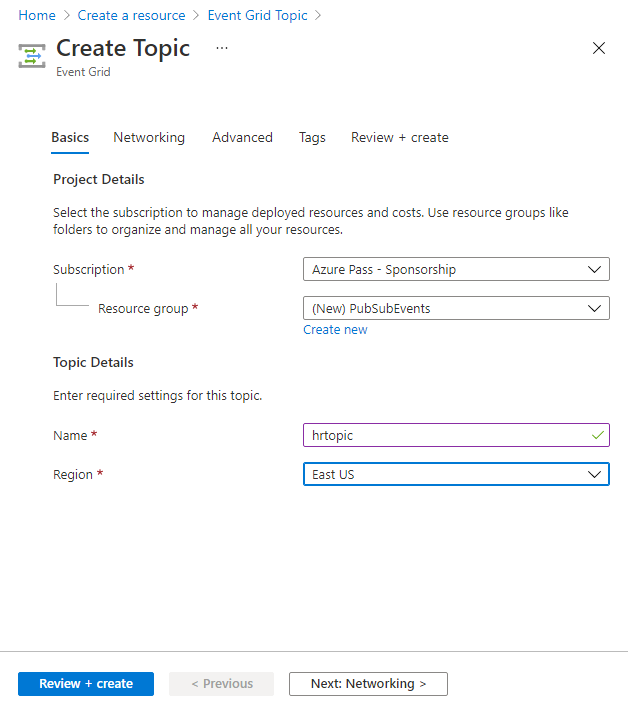

---
lab:
  az204Title: 'Lab 09: Publish and subscribe to Event Grid events'
  az020Title: 'Lab 09: Publish and subscribe to Event Grid events'
  az204Module: 'Module 09: Develop event-based solutions'
  az020Module: 'Module 09: Develop event-based solutions'
---

# <a name="lab-09-publish-and-subscribe-to-event-grid-events"></a>랩 09: Event Grid 이벤트 게시 및 구독

## <a name="microsoft-azure-user-interface"></a>Microsoft Azure 사용자 인터페이스

Given the dynamic nature of Microsoft cloud tools, you might experience Azure UI changes that occur after the development of this training content. As a result, the lab instructions and lab steps might not align correctly.

Microsoft updates this training course when the community alerts us to needed changes. However, cloud updates occur frequently, so you might encounter UI changes before this training content updates. <bpt id="p1">**</bpt>If this occurs, adapt to the changes, and then work through them in the labs as needed.<ept id="p1">**</ept>

## <a name="instructions"></a>Instructions

### <a name="before-you-start"></a>시작하기 전에

#### <a name="sign-in-to-the-lab-environment"></a>랩 환경에 로그인

다음 자격 증명을 사용하여 Windows 10 VM(가상 머신)에 로그인합니다.

- 사용자 이름: **Admin**

- 암호: **Pa55w.rd**

> **참고**: 강사가 가상 랩 환경에 연결하기 위한 지침을 제공합니다.

#### <a name="review-the-installed-applications"></a>설치된 애플리케이션 검토

Find the taskbar on your Windows 10 desktop. The taskbar contains the icons for the applications that you'll use in this lab, including:

- Microsoft Edge

- Microsoft Visual Studio Code

## <a name="architecture-diagram"></a>아키텍처 다이어그램


### <a name="exercise-1-create-azure-resources"></a>연습 1: Azure 리소스 만들기

#### <a name="task-1-open-the-azure-portal"></a>작업 1: Azure Portal 열기

1. 작업 표시줄에서 **Microsoft Edge** 아이콘을 선택합니다.

1. 열린 브라우저 창에서 Azure Portal(<https://portal.azure.com>)로 이동한 다음, 이 랩에 사용할 계정으로 로그인합니다.

    > Microsoft 클라우드 도구의 동적 특성을 고려할 때 이 교육 콘텐츠를 개발한 후 발생하는 Azure UI 변경이 발생할 수 있습니다.

#### <a name="task-2-open-azure-cloud-shell"></a>작업 2: Azure Cloud Shell 열기

1. 따라서 랩 지침 및 랩 단계가 올바르게 정렬되지 않을 수 있습니다.

    > <bpt id="p1">**</bpt>Note<ept id="p1">**</ept>: If this is the first time you are starting <bpt id="p2">**</bpt>Cloud Shell<ept id="p2">**</ept>, when prompted to select either <bpt id="p3">**</bpt>Bash<ept id="p3">**</ept> or <bpt id="p4">**</bpt>PowerShell<ept id="p4">**</ept>, select <bpt id="p5">**</bpt>Bash<ept id="p5">**</ept>. When you are presented with the <bpt id="p1">**</bpt>You have no storage mounted<ept id="p1">**</ept> message, select the subscription you are using in this lab, and then select <bpt id="p2">**</bpt>Create storage<ept id="p2">**</ept>.

1. Azure Portal의 **Cloud Shell** 명령 프롬프트에서 다음 명령을 실행하여 Azure CLI(Azure 명령줄 인터페이스) 도구의 버전을 가져옵니다.

    ```bash
    az --version
    ```

#### <a name="task-3-review-the-microsofteventgrid-provider-registration"></a>작업 3: Microsoft.EventGrid 공급자 등록 검토

1. **CLoud Shell 창**에서 다음 명령을 실행하여 Azure CLI의 루트 수준에서 하위 그룹 및 명령 목록을 가져옵니다.

    ```bash
    az --help
    ```

1. **CLoud Shell 창**에서 다음 명령을 실행하여 리소스 공급자가 사용할 수 있는 명령 목록을 가져옵니다.

    ```bash
    az provider --help
    ```

1. **CLoud Shell 창**에서 다음 명령을 실행하여 현재 등록된 모든 공급자를 나열합니다.

    ```bash
    az provider list
    ```

1. **CLoud Shell 창**에서 다음 명령을 실행하여 현재 등록된 공급자의 네임스페이스만 나열합니다.

    ```bash
    az provider list --query "[].namespace"
    ```

1. Microsoft는 커뮤니티에서 변경해야 할 사항이 있음을 알려줄 때 이 학습 과정을 업데이트합니다.

1. **Cloud Shell** 창을 닫습니다.

#### <a name="task-4-create-a-custom-event-grid-topic"></a>작업 4: 사용자 지정 Event Grid 항목 만들기

1. Azure Portal 탐색 창에서 **리소스 만들기**를 선택합니다.

1. **리소스 만들기** 창의 **검색 서비스 및 마켓플레이스** 텍스트 상자에 **Event Grid 토픽**을 입력한 다음, Enter 키를 선택합니다.

1. **Marketplace** 검색 결과 창에서 **Event Grid 토픽** 결과를 선택한 다음, **만들기**를 선택합니다.

1. **웹앱 만들기** 창의 **기본 사항** 탭에서 다음 작업을 수행하고 **다음**:

    | 설정 | 작업 |
    | -- | -- |
    | **구독** 드롭다운 목록  | 기본값을 유지합니다. |
    | **리소스 그룹** 드롭다운 목록 | **새로 만들기**를 선택하고 **PubSubEvents**를 입력한 다음 **확인**을 선택합니다. |
    | **이름** 텍스트 상자 | **hrtopic** _[사용자 이름]_ 을 입력합니다. |
    | **지역** 드롭다운 목록 | **미국 동부**를 선택합니다. |

   다음 스크린샷은 **Basics** 탭에 구성된 설정을 보여줍니다.

   

1. **고급** 탭의 **이벤트 스키마** 드롭다운 목록에서 **Event Grid 스키마**를 선택한 후 **검토 + 만들기**를 선택합니다.

1. **검토 + 만들기** 탭에서 이전 단계에서 선택한 옵션을 검토합니다.

1. 지정된 구성을 사용하여 Event Grid 토픽을 만들려면 **만들기**를 선택합니다.
  
    > 그러나 클라우드 업데이트가 자주 이루어지기 때문에 이 학습 콘텐츠가 업데이트되기 전에 UI가 변경될 수 있습니다.

#### <a name="task-5-deploy-the-azure-event-grid-viewer-to-a-web-app"></a>작업 5: Azure Event Grid 뷰어를 웹앱에 배포하기

1. Azure Portal 탐색 창에서 **리소스 만들기**를 선택합니다.

1. **리소스 만들기** 창의 **검색 서비스 및 마켓플레이스** 텍스트 상자에 **웹앱**을 입력한 다음, Enter 키를 선택합니다.

1. **마켓플레이스** 검색 결과 창에서 **웹앱** 결과를 선택한 다음, **만들기**를 선택합니다.

1. **웹앱 만들기** 창의 **기본 사항** 탭에서 다음 작업을 수행하고 **다음: Docker**를 선택합니다.

   | 설정 | 작업 |
   | -- | -- |
   | **구독** 드롭다운 목록 | 기본값을 유지합니다. |
   | **리소스 그룹** 드롭다운 목록 | 목록에서 **PubSubEvents**를 선택합니다. |
   | **이름** 텍스트 상자 | **eventviewer** _[사용자 이름]_ 을 입력합니다. |
   | **게시** 섹션 | **Docker 컨테이너**를 선택합니다. |
   | **운영 체제** 섹션 | **Linux**를 선택합니다. |
   | **지역** 드롭다운 목록 | 다음을 선택합니다. **East US |
   | **Linux 플랜(미국 동부)** 섹션 | **새로 만들기**를 선택하고, **이름** 텍스트 상자에 **EventPlan**을 입력한 다음, **확인**을 선택합니다. |
   | **SKU 및 크기** 섹션 | 기본값을 유지합니다. |

   다음 스크린샷은 **웹앱 만들기** 창에 구성된 설정을 보여 줍니다.

   

1. **Docker** 탭에서 다음 작업을 수행하고 **검토 + 만들기**를 선택합니다.

    | 설정 | 작업 |
    | -- | -- |
    | **옵션** 드롭다운 목록 | **단일 컨테이너**를 선택합니다. |
    | **이미지 원본** 드롭다운 목록 | **Docker 허브**를 선택합니다. |
    | **액세스 유형** 드롭다운 목록 | **Public**을 선택합니다. |
    | **이미지 및 태그** 텍스트 상자 | **microsoftlearning/azure-event-grid-viewer:latest**를 입력합니다. |

   다음 스크린샷은 **Docker** 탭에 구성된 설정을 보여 줍니다.

   

1. **검토 + 만들기** 탭에서 이전 단계에서 선택한 옵션을 검토합니다.

1. 지정된 구성을 사용하여 웹앱을 만들려면 **만들기**를 선택합니다.
  
    > **이 경우 변경 사항에 적응하고 필요에 따라 랩에서 작업합니다.**

#### <a name="review"></a>검토

이 연습에서는 랩의 나머지 부분에서 사용할 Event Grid 토픽과 웹앱을 만들었습니다.

### <a name="exercise-2-create-an-event-grid-subscription"></a>연습 2: Event Grid 구독 만들기

#### <a name="task-1-access-the-event-grid-viewer-web-application"></a>작업 1: Event Grid 뷰어 웹 애플리케이션 액세스

1. Azure Portal의 탐색 창에서 **리소스 그룹**을 선택합니다.

1. **리소스 그룹** 창에서 **PubSubEvents** 리소스 그룹을 선택합니다.

1. **PubSubEvents** 창에서 **eventviewer** _[사용자 이름]_ 웹앱을 선택합니다.

1. **App Service** 블레이드의 **설정** 범주에서 **속성** 링크를 선택합니다.

1. In the <bpt id="p1">**</bpt>Properties<ept id="p1">**</ept> section, record the value of the <bpt id="p2">**</bpt>URL<ept id="p2">**</ept> link. You'll use this value later in the lab.

1. **개요**를 선택한 다음 **찾아보기**를 선택합니다.

1. Observe the currently running <bpt id="p1">**</bpt>Azure Event Grid Viewer<ept id="p1">**</ept> web application. Leave this web application running for the remainder of the lab.

    > <bpt id="p1">**</bpt>Note<ept id="p1">**</ept>: This web application will update in real time as events are sent to its endpoint. You'll use this application to monitor events throughout the lab.

1. Azure Portal을 표시하고 있고 현재 열려 있는 브라우저 창으로 돌아갑니다.

#### <a name="task-2-create-a-new-subscription"></a>작업 2: 새 구독 만들기

1. Azure Portal의 탐색 창에서 **리소스 그룹**을 선택합니다.

1. **리소스 그룹** 창에서 이 랩의 앞부분에서 만든 **PubSubEvents** 리소스 그룹을 선택합니다.

1. **PubSubEvents** 창에서 이 랩의 앞부분에서 만든 **hrtopic** _[사용자 이름]_ Event Grid 토픽을 선택합니다.

1. **Event Grid 항목** 블레이드에서 **+ 이벤트 구독**을 선택합니다.

1. **이벤트 구독 만들기** 창에서 다음 작업을 수행한 후, **만들기**를 선택합니다.

    | 설정 | 작업 |
    | -- | -- |
    | **이름** 텍스트 상자 | **basicsub**를 입력합니다. |
    | **이벤트 스키마** 드롭다운 목록 | **Event Grid 스키마**를 선택합니다. |
    | **엔드포인트 유형** 드롭다운 목록 | **웹 후크**를 선택합니다. |
    | **엔드포인트** | Select <bpt id="p1">**</bpt>Select an endpoint<ept id="p1">**</ept>. In the <bpt id="p1">**</bpt>Subscriber Endpoint<ept id="p1">**</ept> text box, enter the <bpt id="p2">**</bpt>Web App URL<ept id="p2">**</ept> value that you recorded previously, ensure that it uses an <bpt id="p3">**</bpt>https://<ept id="p3">**</ept> prefix, add the suffix <bpt id="p4">**</bpt>/api/updates<ept id="p4">**</ept>, and then select <bpt id="p5">**</bpt>Confirm Selection<ept id="p5">**</ept>. For example, if your <bpt id="p1">**</bpt>Web App URL<ept id="p1">**</ept> value is <ph id="ph1">``http://eventviewerstudent.azurewebsites.net/``</ph>, then your <bpt id="p2">**</bpt>Subscriber Endpoint<ept id="p2">**</ept> would be <ph id="ph2">``https://eventviewerstudent.azurewebsites.net/api/updates``</ph> |

   다음 스크린샷은 **이벤트 구독 만들기** 창에 구성된 설정을 보여 줍니다.

   

    > <bpt id="p1">**</bpt>Note<ept id="p1">**</ept>: Wait for Azure to finish creating the subscription before you continue with the lab. You'll receive a notification when the subscription is created.

#### <a name="task-3-observe-the-subscription-validation-event"></a>작업 3: 구독 유효성 검사 이벤트 관찰

1. **Azure Event Grid 뷰어** 웹 애플리케이션을 표시하는 브라우저 창으로 돌아갑니다.

1. 구독 만들기 작업의 일부로 만든 **Microsoft.EventGrid.SubscriptionValidationEvent** 이벤트를 검토합니다.

1. 이벤트를 선택하여 JSON 콘텐츠를 검토합니다.

1. Azure Portal을 통해 현재 열려 있는 브라우저 창으로 돌아갑니다.

#### <a name="task-4-record-subscription-credentials"></a>작업 4: 구독 자격 증명 기록

1. Azure Portal의 탐색 창에서 **리소스 그룹**을 선택합니다.

1. **리소스 그룹** 창에서 이 랩의 앞부분에서 만든 **PubSubEvents** 리소스 그룹을 선택합니다.

1. **PubSubEvents** 창에서 이 랩의 앞부분에서 만든 **hrtopic** _[사용자 이름]_ Event Grid 토픽을 선택합니다.

1. On the <bpt id="p1">**</bpt>Event Grid Topic<ept id="p1">**</ept> blade, record the value of the <bpt id="p2">**</bpt>Topic Endpoint<ept id="p2">**</ept> field. You'll use this value later in the lab.

1. **설정** 범주에서 **액세스 키** 링크를 선택합니다.

1. In the <bpt id="p1">**</bpt>Access keys<ept id="p1">**</ept> section, record the value of the <bpt id="p2">**</bpt>Key 1<ept id="p2">**</ept> text box. You'll use this value later in the lab.

#### <a name="review"></a>검토

이 연습에서는 새 구독을 만들고 등록의 유효성을 검사한 다음 토픽에 새 이벤트를 게시하는 데 필요한 자격 증명을 기록했습니다.

### <a name="exercise-3-publish-event-grid-events-from-net"></a>연습 3: .NET에서 Event Grid 이벤트 게시

#### <a name="task-1-create-a-net-project"></a>작업 1: .NET 프로젝트 만들기

1. **시작** 화면에서 **Visual Studio Code** 타일을 선택합니다.

1. **파일** 메뉴에서 **폴더 열기**를 선택합니다.

1. 열리는 **파일 탐색기** 창에서 **Allfiles (F):\\Allfiles\\Labs\\09\\Starter\\EventPublisher**로 이동한 후 **폴더 선택**을 선택합니다.

1. **Visual Studio Code** 창에서 **탐색기** 창에 대한 바로 가기 메뉴를 활성화한 다음, **통합 터미널에서 열기**를 선택합니다.

1. 다음 명령을 실행하여 현재 폴더에 **EventPublisher**라는 새 .NET 프로젝트를 만듭니다.

    ```powershell
    dotnet new console --framework net6.0 --name EventPublisher --output . 
    ```

    > **참고**: **dotnet new** 명령은 새 **콘솔** 프로젝트를 프로젝트와 이름이 같은 폴더에 만듭니다.

1. 다음 명령을 실행하여 NuGet에서 **Azure.Messaging.EventGrid** 버전 4.10.0을 가져옵니다.

    ```powershell
    dotnet add package Azure.Messaging.EventGrid --version 4.10.0
    ```

    > <bpt id="p1">**</bpt>Note<ept id="p1">**</ept>: The <bpt id="p2">**</bpt>dotnet add package<ept id="p2">**</ept> command will add the <bpt id="p3">**</bpt>Microsoft.Azure.EventGrid<ept id="p3">**</ept> package from NuGet. For more information, go to <bpt id="p1">[</bpt>Azure.Messaging.EventGrid<ept id="p1">](https://www.nuget.org/packages/Azure.Messaging.EventGrid/4.10.0)</ept>.

1. 다음 명령을 실행하여 .NET 웹 애플리케이션을 빌드합니다.

    ```powershell
    dotnet build
    ```

1. **터미널 종료** 또는 **휴지통** 아이콘을 선택하여 현재 열려 있는 터미널 및 관련된 모든 작업을 종료합니다.

#### <a name="task-2-modify-the-program-class-to-connect-to-event-grid"></a>작업 2: Program 클래스를 수정하여 Event Grid에 연결

1. **Visual Studio Code** 창의 **탐색기** 창에서 **Program.cs** 파일을 엽니다.

1.  **Program.cs** 파일의 코드 편집기 탭에서 기존 파일의 모든 코드를 삭제합니다.

1. 다음 코드 줄을 추가하여 NuGet에서 가져온 **Azure.Messaging.EventGrid** 패키지의 **Azure** 및 **Azure.Messaging.EventGrid** 네임스페이스를 가져옵니다.

    ```csharp
    using Azure;
    using Azure.Messaging.EventGrid;
    ```

1. 다음 코드 줄을 추가하여 이 파일에 사용할 기본 제공 네임스페이스에 대해 **using** 지시문을 추가합니다.

    ```csharp
    using System;
    using System.Threading.Tasks;
    ```

1. 다음 코드를 입력하여 새 **Program** 클래스를 만듭니다.

    ```csharp
    public class Program
    {
    }
    ```

1. **Program** 클래스에서 다음 코드 줄을 입력하여 **topicEndpoint**라는 이름의 새 문자열 상수를 만듭니다.

    ```csharp
    private const string topicEndpoint = "";
    ```

1. 이 랩의 앞부분에서 기록한 Event Grid 토픽의 **토픽 엔드포인트**로 값을 설정하여 **topicEndpoint** 문자열 상수를 업데이트합니다.

1. **Program** 클래스에서 다음 코드 줄을 입력하여 **topicKey**라는 이름의 새 문자열 상수를 만듭니다.

    ```csharp
    private const string topicKey = "";
    ```

1. 이 랩의 앞부분에서 기록한 Event Grid 토픽의 **키**로 값을 설정하여 **topicKey** 문자열 상수를 업데이트합니다.

1. **Program** 클래스에서 다음 코드 줄을 입력하여 새 비동기 **Main** 메서드를 만듭니다.

    ```csharp
    public static async Task Main(string[] args)
    {
    }
    ```

1. **Program.cs** 파일을 살펴봅니다. 이제 파일에 다음 코드가 포함되어 있어야 합니다.

    ```csharp
    using Azure;
    using Azure.Messaging.EventGrid;
    using System;
    using System.Threading.Tasks;    
    public class Program
    {
        private const string topicEndpoint = "<topic-endpoint>";
        private const string topicKey = "<topic-key>";        
        public static async Task Main(string[] args)
        {
        }
    }
    ```

#### <a name="task-3-publish-new-events"></a>작업 3: 새 이벤트 게시

1. **Main** 메서드에서 다음 작업을 수행하여 이벤트 목록을 항목 엔드포인트에 게시합니다.

    a. Add the following line of code to create a new variable named <bpt id="p1">**</bpt>endpoint<ept id="p1">**</ept> of type <bpt id="p2">**</bpt>Uri<ept id="p2">**</ept>, using the <bpt id="p3">**</bpt>topicEndpoint<ept id="p3">**</ept> string constant as a constructor parameter:

    ```csharp
    Uri endpoint = new Uri(topicEndpoint); 
    ```

    Windows 10 데스크톱에서 작업 표시줄을 찾습니다.

    ```csharp
    AzureKeyCredential credential = new AzureKeyCredential(topicKey);
    ```

    작업 표시줄에는 다음을 포함하여 이 랩에서 사용할 애플리케이션에 대한 아이콘이 포함되어 있습니다.

    ```csharp
    EventGridPublisherClient client = new EventGridPublisherClient(endpoint, credential);
    ```

    d. Add the following block of code to create a new variable named <bpt id="p1">**</bpt>firstEvent<ept id="p1">**</ept> of type <bpt id="p2">**</bpt><bpt id="p3">[</bpt>EventGridEvent<ept id="p3">](https://docs.microsoft.com/dotnet/api/azure.messaging.eventgrid.eventgridevent)</ept><ept id="p2">**</ept> and populate that variable with sample data:

    ```csharp
    EventGridEvent firstEvent = new EventGridEvent(
        subject: $"New Employee: Alba Sutton",
        eventType: "Employees.Registration.New",
        dataVersion: "1.0",
        data: new
        {
            FullName = "Alba Sutton",
            Address = "4567 Pine Avenue, Edison, WA 97202"
         }
     );
     ```

    e. Add the following block of code to create a new variable named <bpt id="p1">**</bpt>secondEvent<ept id="p1">**</ept> of type <bpt id="p2">**</bpt><bpt id="p3">[</bpt>EventGridEvent<ept id="p3">](https://docs.microsoft.com/dotnet/api/azure.messaging.eventgrid.eventgridevent)</ept><ept id="p2">**</ept> and populate that variable with sample data:

     ```csharp
        EventGridEvent secondEvent = new EventGridEvent(
            subject: $"New Employee: Alexandre Doyon",
            eventType: "Employees.Registration.New",
            dataVersion: "1.0",
            data: new
            {
                FullName = "Alexandre Doyon",
                Address = "456 College Street, Bow, WA 98107"
            }
        );
     ```

    f. Add the following line of code to asynchronously invoke the <bpt id="p1">**</bpt><bpt id="p2">[</bpt>EventGridPublisherClient.SendEventAsync<ept id="p2">](https://docs.microsoft.com/dotnet/api/azure.messaging.eventgrid.eventgridpublisherclient.sendeventasync)</ept><ept id="p1">**</ept> method using the <bpt id="p3">**</bpt>firstEvent<ept id="p3">**</ept> variable as a parameter:

     ```csharp
     await client.SendEventAsync(firstEvent);
     ```

    g. Add the following line of code to render the <bpt id="p1">**</bpt>"First event published"<ept id="p1">**</ept> message to the console:

     ```csharp
     Console.WriteLine("First event published");
     ```

    h. Add the following line of code to asynchronously invoke the <bpt id="p1">**</bpt><bpt id="p2">[</bpt>EventGridPublisherClient.SendEventAsync<ept id="p2">](https://docs.microsoft.com/dotnet/api/azure.messaging.eventgrid.eventgridpublisherclient.sendeventasync)</ept><ept id="p1">**</ept> method using the <bpt id="p3">**</bpt>secondEvent<ept id="p3">**</ept> variable as a parameter:

     ```csharp
     await client.SendEventAsync(secondEvent);
     ```

    i. Add the following line of code to render the <bpt id="p1">**</bpt>"Second event published"<ept id="p1">**</ept> message to the console:

     ```csharp
     Console.WriteLine("Second event published");
     ```

1. **Main** 메서드를 검토합니다. 이제 메서드에 다음 코드가 포함되어 있어야 합니다.

    ```csharp
    public static async Task Main(string[] args)
    {
        Uri endpoint = new Uri(topicEndpoint);
        AzureKeyCredential credential = new AzureKeyCredential(topicKey);
        EventGridPublisherClient client = new EventGridPublisherClient(endpoint, credential);        
        EventGridEvent firstEvent = new EventGridEvent(
            subject: $"New Employee: Alba Sutton",
            eventType: "Employees.Registration.New",
            dataVersion: "1.0",
            data: new
            {
                FullName = "Alba Sutton",
                Address = "4567 Pine Avenue, Edison, WA 97202"
            }
        );
        EventGridEvent secondEvent = new EventGridEvent(
            subject: $"New Employee: Alexandre Doyon",
            eventType: "Employees.Registration.New",
            dataVersion: "1.0",
            data: new
            {
                FullName = "Alexandre Doyon",
                Address = "456 College Street, Bow, WA 98107"
            }
        );
        await client.SendEventAsync(firstEvent);
        Console.WriteLine("First event published");
        await client.SendEventAsync(secondEvent);
        Console.WriteLine("Second event published");
    }
    ```

1.  **Program.cs** 파일을 저장합니다.

1. **Visual Studio Code** 창에서 **탐색기** 창에 대한 바로 가기 메뉴를 활성화한 다음, **통합 터미널에서 열기**를 선택합니다.

1. 다음 명령을 실행하여 .NET 웹 애플리케이션을 실행합니다.

    ```powershell
    dotnet run
    ```

    > **참고**: 빌드 오류가 있는 경우, **Allfiles (F):\\Allfiles\\Labs\\09\\Solution\\EventPublisher** 폴더에 있는 **Program.cs** 파일을 검토하세요.

1. 현재 실행 중인 콘솔 애플리케이션의 성공 메시지 출력을 관찰합니다.

1. **터미널 종료** 또는 **휴지통** 아이콘을 선택하여 현재 열려 있는 터미널 및 관련된 모든 작업을 종료합니다.

#### <a name="task-4-observe-published-events"></a>작업 4: 게시된 이벤트 살펴보기

1. **Azure Event Grid 뷰어** 웹 애플리케이션이 있는 브라우저 창으로 돌아갑니다.

1. 콘솔 애플리케이션으로 생성한 **Employees.Registration.New** 이벤트를 검토합니다.

1. 아무 이벤트나 선택하고 JSON 콘텐츠를 검토합니다.

1. Azure Portal로 돌아갑니다.

#### <a name="review"></a>검토

이 연습에서는 .NET 콘솔 애플리케이션을 사용하여 Event Grid 토픽에 새 이벤트를 게시했습니다.

### <a name="exercise-4-clean-up-your-subscription"></a>연습 4: 구독 정리

#### <a name="task-1-open-azure-cloud-shell"></a>작업 1: Azure Cloud Shell 열기

1. In the Azure portal, select the <bpt id="p1">**</bpt>Cloud Shell<ept id="p1">**</ept> icon <ph id="ph1"></ph> to open a new Bash session. If Cloud Shell defaults to a PowerShell session, select <bpt id="p1">**</bpt>PowerShell<ept id="p1">**</ept> and, in the drop-down menu, select <bpt id="p2">**</bpt>Bash<ept id="p2">**</ept>.

    > <bpt id="p1">**</bpt>Note<ept id="p1">**</ept>: If this is the first time you are starting <bpt id="p2">**</bpt>Cloud Shell<ept id="p2">**</ept>, when prompted to select either <bpt id="p3">**</bpt>Bash<ept id="p3">**</ept> or <bpt id="p4">**</bpt>PowerShell<ept id="p4">**</ept>, select <bpt id="p5">**</bpt>PowerShell<ept id="p5">**</ept>. When you are presented with the <bpt id="p1">**</bpt>You have no storage mounted<ept id="p1">**</ept> message, select the subscription you are using in this lab, and select <bpt id="p2">**</bpt>Create storage<ept id="p2">**</ept>.

#### <a name="task-2-delete-a-resource-group"></a>작업 2: 리소스 그룹 삭제

1. **Cloud Shell** 창에서 다음 명령을 실행하여 **PubSubEvents** 리소스 그룹을 삭제합니다.

    ```bash
    az group delete --name PubSubEvents --no-wait --yes
    ```

     > **참고**: 이 명령은 *--no-wait* 매개 변수에서 알 수 있듯이 비동기로 실행되므로 동일한 Bash 세션 내에서 이 명령을 실행한 직후에 다른 Azure CLI 명령을 실행하는 것이 가능하지만 실제로 리소스 그룹이 제거되기까지는 몇 분 정도 걸립니다.

1. 포털에서 **Cloud Shell** 창을 닫습니다.

#### <a name="task-3-close-the-active-applications"></a>작업 3: 활성 애플리케이션 닫기

1. 현재 실행 중인 Microsoft Edge 애플리케이션을 닫습니다.

1. 현재 실행 중인 Visual Studio Code 애플리케이션을 닫습니다.

#### <a name="review"></a>검토

이 연습에서는 이 랩에 사용된 리소스 그룹을 제거하여 구독을 정리했습니다.
