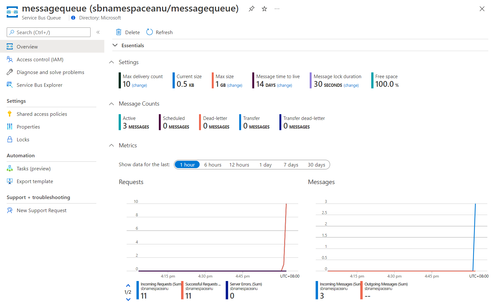

---
lab:
    az204Title: '랩 10: Azure Service Bus 큐를 사용하여 비동기적으로 메시지 처리'
    az020Title: '랩 10: Azure Service Bus 큐를 사용하여 비동기적으로 메시지 처리'
    az204Module: '모듈 10: 메시지 기반 솔루션 개발'
    az020Module: '모듈 10: 메시지 기반 솔루션 개발'
---

# 랩 10: Azure Service Bus 큐를 사용하여 비동기적으로 메시지 처리

## Microsoft Azure 사용자 인터페이스

Microsoft 클라우드 도구의 동적 특성을 감안할 때, 이 교육 콘텐츠를 개발한 후 Azure UI가 변경될 수도 있습니다. 따라서 랩 지침 및 랩 단계가 정확히 일치하지는 않을 수 있습니다.

Microsoft는 커뮤니티에서 변경 사항이 필요하다는 것이 확인되면 이 학습 과정을 업데이트합니다. 그러나 클라우드 업데이트가 자주 이루어지기 때문에 이 교육 콘텐츠가 업데이트되기 전에 UI가 변경될 수 있습니다. **이 경우 변경 사항에 적응하고 필요에 따라 랩에서 작업합니다.**

## 지침

### 시작하기 전에

#### 랩 환경에 로그인

다음 자격 증명을 사용하여 Windows 10 VM(가상 머신)에 로그인합니다.
    
-   사용자 이름: **Admin**

-   암호: **Pa55w.rd**

> **참고**: 가상 랩 환경에 연결하기 위한 지침을 강사가 제공할 것입니다.

#### 설치된 애플리케이션 검토

Windows 10 데스크톱에서 작업 표시줄을 찾습니다. 작업 표시줄에는 다음과 같이 이 랩에서 사용할 애플리케이션에 대한 아이콘이 포함되어 있습니다.
    
-   Microsoft Edge

-   Visual Studio Code

## 아키텍처 다이어그램


### 연습 1: Azure 리소스 만들기

#### 작업 1: Azure Portal 열기

1.  작업 표시줄에서 **Microsoft Edge** 아이콘을 선택합니다.

1.  브라우저 창에서 Azure Portal([portal.azure.com](https://portal.azure.com))로 이동한 다음 이 랩에서 사용할 계정으로 로그인합니다.

    > **참고**: Azure Portal에 처음 로그인하는 경우 포털 둘러보기가 제공됩니다. 둘러보기를 건너뛰고 포털 사용을 시작하려면 **시작하기**를 선택합니다.

#### 작업 2: Azure Service Bus 큐 만들기

1.  Azure Portal에서 **리소스, 서비스 및 문서 검색** 텍스트 상자를 사용하여 **Service Bus**를 검색한 다음, 결과 목록에서 **Service Bus**를 선택합니다.

1.  **Service Bus** 블레이드에서 **+ 만들기**를 선택합니다.

1.  **네임스페이스 만들기** 블레이드의 **기본** 탭에서 다음 작업을 수행하고 **검토 + 만들기**를 선택합니다.
        
    | 설정                           | 작업                                                       |
    | --------------------------------- | ------------------------------------------------------------ |
    | **구독** 드롭다운 목록    |기본값을 유지합니다. |
    | **리소스 그룹** 섹션 | **새로 만들기**를 선택하고 **AsyncProcessor**를 입력한 다음 **확인**을 선택합니다.|
    | **네임스페이스 이름** 텍스트 상자 | **sbnamespace**_[yourname]_ 을 입력합니다.|
    | **지역** 드롭다운 목록 |  Azure Service Bus를 배포할 수 있는 Azure 지역을 선택합니다.|
    | **가격 책정 계층** 드롭다운 목록 |  **기본**을 선택합니다.|

    다음 스크린샷은 **네임스페이스 만들기** 블레이드의 **기본** 탭에 구성된 설정을 표시합니다.
    
       
     
1.  **검토 + 만들기** 탭에서 이전 단계에서 선택한 옵션을 검토합니다.

1.  지정된 구성을 사용하여 **Service Bus** 네임스페이스를 만들려면 **만들기**를 선택합니다.

    > **참고**: 이 랩을 진행하기 전에 만들기 작업이 완료될 때까지 기다리세요.

1.  **배포** 블레이드에서 **리소스로 이동** 단추를 선택하여 새로 만든 **Service Bus** 네임스페이스의 블레이드로 이동합니다.

1.  **Service Bus** 네임스페이스 블레이드의 **설정** 섹션에서 **공유 액세스 정책**을 선택합니다.

1.  정책 목록에서 **RootManageSharedAccessKey**를 선택합니다.

1.  **SAS 정책: RootManageSharedAccessKey** 창에서 **기본 연결 문자열** 항목 옆에 있는 **클립보드에 복사** 단추를 선택하고 복사된 값을 기록합니다. 이 랩 뒷부분에서 사용하게 될 것입니다.

    > **참고**: 사용 가능한 두 키 중에서 무엇을 선택하든 상관없습니다. 서로 교환할 수 있습니다.

1.  **Service Bus** 네임스페이스 블레이드에 있는 **엔터티** 섹션에서 **큐**를 선택한 후에 **+ 큐**를 선택합니다.

1.  **큐 만들기** 블레이드에서 사용 가능한 설정을 검토하고, **이름** 텍스트 상자에 **messagequeue**를 입력한 후에 **만들기**를 선택합니다.

1.  **messagequeue**를 선택하여 **Service Bus** 큐의 속성을 표시합니다.

1.  브라우저 창은 열어 둡니다. 이 랩 뒷부분에서 다시 사용하게 될 것입니다.

#### 복습

이 연습에서는 랩의 나머지 부분에서 사용할 Azure **Service Bus** 네임스페이스 및 **Service Bus** 큐를 만들었습니다.

### 연습 2: 메시지를 Service Bus 큐에 게시하기 위한 .NET Core 프로젝트 만들기

#### 작업 1: .NET Core 프로젝트 만들기

1.  랩 컴퓨터에서 Visual Studio Code를 시작합니다.

1.  Visual Studio Code의 **파일** 메뉴에서 **폴더 열기**를 선택합니다.

1.  **폴더 열기** 창에서 **Allfiles (F):\\Allfiles\\Labs\\10\\Starter\\MessagePublisher**로 이동한 후 **폴더 선택**을 선택합니다.

1.  **Visual Studio Code** 창에서 바로 가기 메뉴를 활성화한 다음 **통합 터미널에서 열기**를 선택합니다.

1.  터미널 프롬프트에서 다음 명령을 실행하여 현재 폴더에서 **MessagePublisher**라는 새 .NET 프로젝트를 만듭니다.

    ```
    dotnet new console --name MessagePublisher --output .
    ```

    > **참고**: **dotnet new** 명령은 새 **콘솔** 프로젝트를 프로젝트와 이름이 같은 폴더에 만듭니다.

1.  다음 명령을 실행하여 NuGet에서 **Azure.Messaging.ServiceBus** 패키지의 버전 7.2.1을 가져옵니다.

    ```
    dotnet add package Azure.Messaging.ServiceBus --version 7.2.1
    ```

    > **참고**: **dotnet add package** 명령은 NuGet에서 **Azure.Messaging.ServiceBus** 패키지를 추가합니다. 자세한 내용은 [Azure.Messaging.ServiceBus](https://www.nuget.org/packages/Azure.Messaging.ServiceBus/)를 참조하세요.

1.  터미널 프롬프트에서 다음 명령을 실행하여 .NET Core 콘솔 애플리케이션을 빌드합니다.

    ```
    dotnet build
    ```

1.  **터미널 종료**(**휴지통** 아이콘)를 선택하여 터미널 창 및 관련 프로세스를 닫습니다.

#### 작업 2: Azure Service Bus 큐에 메시지 게시

1.  **Visual Studio Code** 창의 **탐색기** 창에서 **Program.cs** 파일을 엽니다.

1.  **Program.cs** 파일의 코드 편집기 탭에서 기존 파일의 모든 코드를 삭제합니다.

1.  이 파일에서 참조할 기본 제공 네임스페이스를 쉽게 사용할 수 있도록 다음 코드 줄을 추가합니다.

    ```csharp
    using System;
    using System.Threading.Tasks;
    ```

1.  다음 코드를 추가하여 NuGet에서 가져온 **Azure.Storage.Queues** 패키지에 포함된 **Azure.Messaging.ServiceBus** 네임스페이스를 가져옵니다.

    ```csharp
    using Azure.Messaging.ServiceBus;
    ```
    
1.  다음 코드를 입력하여 MessagePublisher 네임스페이스에서 새 **Program** 클래스를 만듭니다.

    ```csharp
    namespace MessagePublisher
    {
       public class Program
       {
       }
    }
    ```

1.  **Program** 클래스에 다음 코드를 입력하여 **storageConnectionString**이라는 문자열 상수를 만듭니다.

    ```csharp
    private const string storageConnectionString = "";
    ```

1.  이 랩의 앞부분에서 기록한 Service Bus 네임스페이스의 **기본 연결 문자열**로 값을 설정하여 **storageConnectionString** 문자열 상수를 업데이트합니다.

1.  다음 코드를 입력하여 **queueName**이라는 문자열 상수를 만듭니다. 이 상수의 값은 이 연습의 앞부분에서 만든 Service Bus 큐의 이름과 동일한 **messagequeue**입니다.

    ```csharp
    private const string queueName = "messagequeue";
    ```

1.  다음 코드를 입력하여 대상 큐에 보낼 메시지 수를 저장하는 정수 상수를 만듭니다.

    ```csharp
    private const int numOfMessages = 3;
    ```

1.  다음 코드를 입력하여 대상 큐에 대한 연결이 포함될 Service Bus 클라이언트를 만듭니다.

    ```csharp
    static ServiceBusClient client;
    ```

1.  다음 코드를 입력하여 대상 큐에 메시지를 게시하는 데 사용될 Service Bus sender를 만듭니다.

    ```csharp
    static ServiceBusSender sender;
    ```

1.  다음 코드를 입력하여 비동기 **Main** 메서드를 만듭니다.

    ```csharp
    public static async Task Main(string[] args)
    {
    }
    ```

1.  **Program.cs** 파일을 검토합니다. 이제 다음 코드가 포함되어 있을 것입니다. `<storage-connection-string>` 자리 표시자는 대상 Azure Service Bus 네임스페이스에 대한 연결 문자열을 나타냅니다.

    ```csharp
    using System;
    using System.Threading.Tasks;
    using Azure.Messaging.ServiceBus;

    namespace MessagePublisher
    {
        public class Program
        {
            private const string storageConnectionString = "<storage-connection-string>";
            private const string queueName = "messagequeue";
            private const int numOfMessages = 3;

            static ServiceBusClient client;
            static ServiceBusSender sender;

            public static async Task Main(string[] args)
            {
            }
        }
    }
    ```

1.  **Main** 메서드에서 다음 코드를 추가하여 Service Bus 네임스페이스에 연결을 제공할 **ServiceBusClient** 유형의 *client*와 메시지 전송을 책임지는 **sender**를 초기화합니다.

    ```csharp
    client = new ServiceBusClient(storageConnectionString);
    sender = client.CreateSender(queueName);  
    ```

    > **참고**: Service Bus 클라이언트는 캐싱하고 애플리케이션 수명 동안 단독 개체로 사용해도 안전합니다. 이것은 정기적으로 메시지를 게시하고 읽을 때의 모범 사례 중 하나로 간주됩니다.

1.  **Main** 메서드에서 다음 코드를 추가하여 **ServiceBusMessageBatch** 개체를 만듭니다. 이 개체를 만들면 **TryAddMessage** 메서드를 사용해 여러 메시지를 배치로 결합할 수 있습니다.

    ```csharp        
    using ServiceBusMessageBatch messageBatch = await sender.CreateMessageBatchAsync();
    ```

1.  **Main** 메서드에서 다음 코드 줄을 추가하여 배치에 메시지를 추가하고, 메시지 크기가 배치에서 지원하는 한계를 초과할 경우 예외를 내보냅니다.

    ```csharp        
    for (int i = 1; i <= numOfMessages; i++)
    {
        if (!messageBatch.TryAddMessage(new ServiceBusMessage($"Message {i}")))
        {
            throw new Exception($"The message {i} is too large to fit in the batch.");
        }
    }
    ```

1.  **Main** 메서드에서 다음 코드 줄을 추가하여 try 블록을 만들고, **sender**가 배치에 있는 메시지를 대상 큐에 비동기적으로 게시하도록 합니다.

    ```csharp        
    try
    {
        await sender.SendMessagesAsync(messageBatch);
        Console.WriteLine($"A batch of {numOfMessages} messages has been published to the queue.");
    }

1.  **Main** 메서드에서 다음 코드 줄을 추가하여 **sender** 및 **client** 개체를 비동기적으로 폐기하고 네트워크와 관리되지 않는 리소스를 해제하는 finally 블록을 만듭니다.

    ```csharp
    finally
    {
        await sender.DisposeAsync();
        await client.DisposeAsync();
    }
    ```

1.  이제 다음 코드로 구성되어 있어야 하는 **Main** 메서드를 검토합니다. 

    ```csharp
    public static async Task Main(string[] args)
    {
        client = new ServiceBusClient(storageConnectionString);
        sender = client.CreateSender(queueName);

        using ServiceBusMessageBatch messageBatch = await sender.CreateMessageBatchAsync();

        for (int i = 1; i <= numOfMessages; i++)
        {
            if (!messageBatch.TryAddMessage(new ServiceBusMessage($"Message {i}")))
            {
                throw new Exception($"The message {i} is too large to fit in the batch.");
            }
        }

        try
        {
            await sender.SendMessagesAsync(messageBatch);
            Console.WriteLine($"A batch of {numOfMessages} messages has been published to the queue.");
        }
        finally
        {
            await sender.DisposeAsync();
            await client.DisposeAsync();
        }
    }
    ```

1.  **Program.cs** 파일을 저장합니다.

1.  **Visual Studio Code** 창에서 바로 가기 메뉴를 활성화한 다음 **통합 터미널에서 열기**를 선택합니다.

1.  터미널 프롬프트에서 다음 명령을 실행하여 .NET Core 콘솔 앱을 시작합니다.

    ```
    dotnet run
    ```

    > **참고**: 오류가 발생하는 경우 **Allfiles (F):\\Allfiles\\Labs\\10\\Solution\\MessagePublisher** 폴더에 있는 **Program.cs** 파일을 검토합니다.

1.  터미널 프롬프트에 표시되는 콘솔 메시지에서 세 개의 메시지로 구성된 배치가 큐에 게시되었다고 나오는지 확인합니다.

1.  **터미널 종료**(**휴지통** 아이콘)를 선택하여 터미널 창 및 관련 프로세스를 닫습니다.

1.  Azure Portal에서 Service Bus 큐 **messagequeue**를 표시하는 Microsoft Edge 브라우저로 전환합니다.

1.  **필수** 창을 검토하고 큐에 세 개의 활성 메시지가 포함되어 있는지 확인합니다.

    다음 스크린샷은 Service Bus 큐 메트릭과 메시지 개수를 표시합니다.
     
       
     
1.  **설정** 섹션에서 **Service Bus 탐색기(미리 보기)** 를 선택합니다.

1.  **Service Bus 탐색기(미리 보기)** 블레이드에서 **피크** 탭 머리글을 선택하고, **피크** 탭에서 **피크** 단추를 선택합니다.

1.  큐에 세 개의 메시지가 포함되어 있는지 확인합니다.

1.  첫 번째 메시지를 선택하고 **메시지** 창에서 해당 내용을 검토합니다.

    다음 스크린샷은 첫 번째 메시지의 내용을 표시합니다.
         
       

     
1.  **메시지** 창을 닫습니다.

#### 복습

이 연습에서는 Azure Service Bus 큐에 메시지를 게시한 .NET 프로젝트를 구성했습니다.

### 연습 3: Service Bus 큐로부터 메시지를 읽기 위한 .NET Core 프로젝트 만들기

#### 작업 1: .NET 프로젝트 만들기

1.  랩 컴퓨터에서 Visual Studio Code를 시작합니다.

1.  Visual Studio Code의 **파일** 메뉴에서 **폴더 열기**를 선택합니다.

1.  **폴더 열기** 창에서 **Allfiles (F):\\Allfiles\\Labs\\10\\Starter\\MessageReader**로 이동한 후 **폴더 선택**을 선택합니다.

1.  **Visual Studio Code** 창에서 바로 가기 메뉴를 활성화한 다음 **통합 터미널에서 열기**를 선택합니다.

1.  터미널 프롬프트에서 다음 명령을 실행하여 현재 폴더에서 **MessageReader**라는 새 .NET 프로젝트를 만듭니다.

    ```
    dotnet new console --name MessageReader --output .
    ```

1.  다음 명령을 실행하여 NuGet에서 **Azure.Messaging.ServiceBus** 패키지의 버전 7.2.1을 가져옵니다.

    ```
    dotnet add package Azure.Messaging.ServiceBus --version 7.2.1
    ```

1.  터미널 프롬프트에서 다음 명령을 실행하여 .NET Core 콘솔 애플리케이션을 빌드합니다.

    ```
    dotnet build
    ```

1.  **터미널 종료**(**휴지통** 아이콘)를 선택하여 터미널 창 및 관련 프로세스를 닫습니다.

#### 작업 2: Azure Service Bus 큐로부터 메시지 읽기

1.  **Visual Studio Code** 창의 **탐색기** 창에서 **Program.cs** 파일을 엽니다.

1.  **Program.cs** 파일의 코드 편집기 탭에서 기존 파일의 모든 코드를 삭제합니다.

1.  Azure Service Bus 큐와의 상호 작용을 허용하기 위해 Program.cs 파일에 포함된 것과 동일한 코드를 추가하되, 네임스페이스를 **MessageReader**로 설정합니다.

    ```csharp
    using System;
    using System.Threading.Tasks;
    using Azure.Messaging.ServiceBus;
    
    namespace MessageReader
    {
       public class Program
       {
          private const string storageConnectionString = "";
          static string queueName = "messagequeue";
          static ServiceBusClient client;

       }
    }
    ```

1.  앞에서와 마찬가지로, 이 랩의 앞부분에서 기록한 **Service Bus** 네임스페이스의 **기본 연결 문자열**로 값을 설정하여 **storageConnectionString** 문자열 상수를 업데이트합니다.

1.  다음 코드를 입력하여 큐로부터 메시지를 게시하는 데 사용될 ServiceBusProcessor를 만듭니다.

    ```csharp
    static ServiceBusProcessor processor;
    ```

1.  다음 코드를 입력하여 정적 비동기 **MessageHandler** 작업을 만듭니다. 이 작업은 메시지가 처리되는 동안 큐에 메시지 본문을 표시하고, 처리가 완료되면 메시지를 삭제합니다.

    ```csharp
    static async Task MessageHandler(ProcessMessageEventArgs args)
    {
        string body = args.Message.Body.ToString();
        Console.WriteLine($"Received: {body}");
        await args.CompleteMessageAsync(args.Message);
    }
    ```

1.  다음 코드를 입력하여 메시지 처리 중에 발생하는 모든 예외를 관리하는 **ErrorHandler** 작업을 만듭니다.

    ```csharp
    static Task ErrorHandler(ProcessErrorEventArgs args)
    {
        Console.WriteLine(args.Exception.ToString());
        return Task.CompletedTask;
    }
    ```

1.  다음 코드를 입력하여 비동기 **Main** 메서드를 만듭니다.

    ```csharp
    public static async Task Main(string[] args)
    {
    }
    ```

1.  **Program.cs** 파일을 검토합니다. 이제 다음 코드가 포함되어 있을 것입니다. `<storage-connection-string>` 자리 표시자는 대상 Azure Service Bus 네임스페이스에 대한 연결 문자열을 나타냅니다.

    ```csharp
    using System;
    using System.Threading.Tasks;
    using Azure.Messaging.ServiceBus;

    namespace MessageReader
    {
        class Program
        {
            static string storageConnectionString = "";
            static string queueName = "messagequeue";
            static ServiceBusClient client;
            static ServiceBusProcessor processor;

            static async Task MessageHandler(ProcessMessageEventArgs args)
            {
                string body = args.Message.Body.ToString();
                Console.WriteLine($"Received: {body}");
                await args.CompleteMessageAsync(args.Message);
            }

            static Task ErrorHandler(ProcessErrorEventArgs args)
            {
                Console.WriteLine(args.Exception.ToString());
                return Task.CompletedTask;
            }

            static async Task Main()
            {
            }
        }
    }
    ```

1.  **Main** 메서드에서 다음 코드를 추가하여 Service Bus 네임스페이스에 연결을 제공할 **ServiceBusClient** 유형의 *client* 그리고 메시지를 처리하는 것을 책임질 **processor**를 초기화합니다.

    ```csharp
    client = new ServiceBusClient(storageConnectionString);
    processor = client.CreateProcessor(queueName, new ServiceBusProcessorOptions());
    ```

    > **참고**: 앞서 언급한 바와 같이, Service Bus 클라이언트는 캐싱하고 애플리케이션 수명 동안 단독 개체로 사용해도 안전합니다. 이것은 정기적으로 메시지를 게시하고 읽을 때의 모범 사례 중 하나로 간주됩니다.

1.  **Main** 메서드에서 다음 코드 줄을 추가하여 try 블록을 만듭니다. 이 블록은 먼저 메시 및 오류 처리기를 구현하고, 메시지 처리를 시작하며, 사용자 입력 후에 처리를 중지합니다.

    ```csharp        
    try
    {
        processor.ProcessMessageAsync += MessageHandler;
        processor.ProcessErrorAsync += ErrorHandler;

        await processor.StartProcessingAsync();
        Console.WriteLine("Wait for a minute and then press any key to end the processing");
        Console.ReadKey();

        Console.WriteLine("\nStopping the receiver...");
        await processor.StopProcessingAsync();
        Console.WriteLine("Stopped receiving messages");
    }

1.  **Main** 메서드에서 다음 코드 줄을 추가하여 **processor** 및 **client** 개체를 비동기적으로 폐기하고 네트워크와 관리되지 않는 리소스를 해제하는 finally 블록을 만듭니다.

    ```csharp
    finally
    {
        await processor.DisposeAsync();
        await client.DisposeAsync();
    }
    ```

1.  이제 다음 코드로 구성되어 있어야 하는 **Main** 메서드를 검토합니다.

    ```csharp
    static async Task Main()
    {
        client = new ServiceBusClient(storageConnectionString);
        processor = client.CreateProcessor(queueName, new ServiceBusProcessorOptions());

        try
        {
            processor.ProcessMessageAsync += MessageHandler;
            processor.ProcessErrorAsync += ErrorHandler;

            await processor.StartProcessingAsync();
            Console.WriteLine("Wait for a minute and then press any key to end the processing");
            Console.ReadKey();

            Console.WriteLine("\nStopping the receiver...");
            await processor.StopProcessingAsync();
            Console.WriteLine("Stopped receiving messages");
        }
        finally
        {
            await processor.DisposeAsync();
            await client.DisposeAsync();
        }
    }
    ```

1.  **Program.cs** 파일을 저장합니다.

1.  **Visual Studio Code** 창에서 바로 가기 메뉴를 활성화한 다음 **통합 터미널에서 열기**를 선택합니다.

1.  터미널 프롬프트에서 다음 명령을 실행하여 .NET Core 콘솔 앱을 시작합니다.

    ```
    dotnet run
    ```

    > **참고**: 오류가 발생하는 경우 **Allfiles (F):\\Allfiles\\Labs\\10\\Solution\\MessageReader** 폴더에 있는 **Program.cs** 파일을 검토합니다.

1.  터미널 프롬프트에 표시되는 콘솔 메시지에서 큐에 있는 세 개의 메시지 각각을 수신했다고 나오는지 확인합니다.

1.  터미널 프롬프트에서 아무 키나 눌러 수신기를 중지하고 앱 실행을 종료합니다.

1.  **터미널 종료**(**휴지통** 아이콘)를 선택하여 터미널 창 및 관련 프로세스를 닫습니다.

1.  Azure Portal에서 Service Bus 큐 **messagequeue**를 표시하는 Microsoft Edge 브라우저로 다시 전환합니다.

1.  **Service Bus 탐색기(미리 보기)** 블레이드에서 **새로 고침**을 선택하고, 큐에서 활성 메시지 수가 **0**으로 바뀌었음을 확인합니다.

#### 복습

이 연습에서는 .NET 라이브러리를 사용하여 Azure Service Bus 큐에서 메시지를 읽고 삭제했습니다.

### 연습 4: 구독 정리

#### 작업 1: Azure Cloud Shell 열기

1.  Azure Portal에서 **Cloud Shell** 아이콘()을 선택하여 새 Bash 세션을 엽니다. Cloud Shell이 기본적으로 PowerShell 세션인 경우 **PowerShell**을 선택하고 드롭다운 메뉴에서 **Bash**를 선택합니다.

    > **참고**: **Cloud Shell**을 처음 시작하는 경우에는 **Bash** 또는 **PowerShell** 중에서 선택하라는 메시지가 나타날 때 **PowerShell**을 선택합니다. **탑재된 스토리지가 없음**이라는 메시지가 표시되면 이 랩에서 사용하는 구독을 선택하고 **스토리지 만들기**를 선택합니다.

#### 작업 2: 리소스 그룹 삭제

1.  **Cloud Shell** 창에서 다음 명령을 실행하여 **AsyncProcessor** 리소스 그룹을 삭제합니다.

    ```
    az group delete --name AsyncProcessor --no-wait --yes
    ```
    
     > **참고**: 명령은 비동기적으로 실행되므로(*--no-wait* 매개 변수에 의해 결정됨) 동일한 Bash 세션 내에서 즉시 다른 Azure CLI 명령을 실행할 수 있지만 리소스 그룹이 실제로 제거되기까지 몇 분 정도 걸립니다.
  
1.  포털에서 **Cloud Shell** 창을 닫습니다.

#### 작업 3: 활성 애플리케이션 닫기

1.  현재 실행 중인 Microsoft Edge 애플리케이션을 닫습니다.

1.  현재 실행 중인 Visual Studio Code 애플리케이션을 닫습니다.

#### 복습

이 연습에서는 이 랩에 사용된 리소스 그룹을 제거하여 구독을 정리했습니다.
