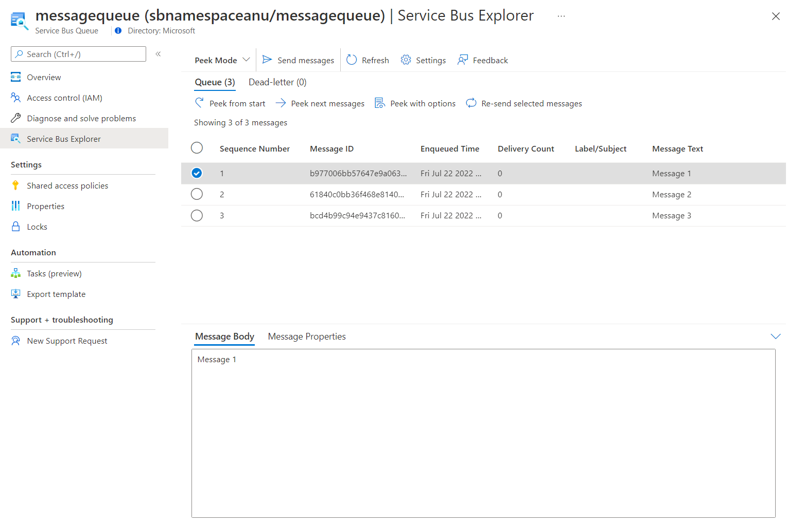

---
lab:
  az204Title: 'Lab 10: Asynchronously process messages by using Azure Service Bus Queues'
  az204Module: 'Learning Path 10: Develop message-based solutions'
---

# 랩 10: Azure Service Bus 큐를 사용하여 비동기적으로 메시지 처리

## Microsoft Azure 사용자 인터페이스

Microsoft 클라우드 도구의 동적 특성을 고려할 때 이 교육 콘텐츠를 개발한 후 발생하는 Azure UI 변경이 발생할 수 있습니다. 따라서 랩 지침 및 랩 단계가 올바르게 정렬되지 않을 수 있습니다.

Microsoft는 커뮤니티에서 변경해야 할 사항이 있음을 알려줄 때 이 학습 과정을 업데이트합니다. 그러나 클라우드 업데이트가 자주 이루어지기 때문에 이 학습 콘텐츠가 업데이트되기 전에 UI가 변경될 수 있습니다. **이 경우 변경 사항에 적응하고 필요에 따라 랩에서 작업합니다.**

## Instructions


### 시작하기 전에

#### 랩 환경에 로그인

다음 자격 증명을 사용하여 Windows 10 VM(가상 머신)에 로그인합니다.

- 사용자 이름: `Admin`
- 암호: `Pa55w.rd`

> **참고**: 강사가 가상 랩 환경 연결에 대한 지침을 제공합니다.

#### 설치된 애플리케이션 검토

Windows 10 데스크톱에서 작업 표시줄을 찾습니다. 작업 표시줄에는 다음을 포함하여 이 랩에서 사용할 애플리케이션에 대한 아이콘이 포함되어 있습니다.
    
-   Microsoft Edge
-   Visual Studio Code

## 랩 시나리오

이 랩에서는 Azure Service Bus 큐를 사용하여 이 시나리오에 대한 개념 증명을 만듭니다. 시스템이 작동하는 방법을 보여 주려면 시스템에 메시지를 게시하는 .NET Core 프로젝트와 큐에서 메시지를 읽을 두 번째 .NET Core 애플리케이션을 만듭니다. 첫 번째 앱은 센서에서 생성되는 데이터를 시뮬레이션하고, 두 번째 앱은 처리를 위해 큐에서 메시지를 읽는 시스템을 시뮬레이션합니다.

## 아키텍처 다이어그램


### 연습 1: Azure 리소스 만들기

#### 작업 1: Azure Portal 열기

1. 작업 표시줄에서 **Microsoft Edge** 아이콘을 선택합니다.

1. 브라우저 창에서 Azure Portal(`https://portal.azure.com`)로 이동하고 이 랩에 사용할 계정으로 로그인합니다.

    > **참고**: Azure Portal에 처음 로그인하는 경우 포털 둘러보기가 제공됩니다. 둘러보기를 건너뛰고 포털 사용을 시작하려면 **시작하기**를 선택합니다.

#### 작업 2: Azure Service Bus 큐 만들기

1. Azure Portal에서 **리소스, 서비스 및 문서 검색** 텍스트 상자를 사용하여 **Service Bus**를 검색한 다음, 결과 목록에서 **Service Bus**를 선택합니다.

1. **Service Bus** 창에서 **+ 만들기**를 선택합니다.

1. **네임스페이스 만들기** 창의 **기본 사항** 탭에서 다음 작업을 수행하고 **검토 + 만들기**를 선택합니다.
        
    | 설정 | 작업 |
    | -- | -- |
    | **구독** 드롭다운 목록 |기본값을 유지합니다. |
    | **리소스 그룹** 섹션 | **새로 만들기**를 선택하고 **AsyncProcessor**를 입력한 다음 **확인**을 선택합니다. |
    | **네임스페이스 이름** 텍스트 상자 | **sbnamespace** _[사용자 이름]_ 을 입력합니다. |
    | **지역** 드롭다운 목록 | Azure Service Bus를 배포할 수 있는 Azure 지역을 선택합니다. |
    | **가격 책정 계층** 드롭다운 목록 | **기본**을 선택합니다. |

    다음 스크린샷은 **네임스페이스 만들기** 창의 **기본 사항** 탭에 구성된 설정을 보여 줍니다.
    
    
     
1. **검토 + 만들기** 탭에서 이전 단계에서 선택한 옵션을 검토합니다.

1. **만들기**를 선택하여 지정한 구성으로 **Service Bus** 네임스페이스를 만듭니다.

    > **참고**: 이 랩을 계속 진행하기 전에 만들기 작업이 완료될 때까지 기다립니다.

1. **배포** 창에서 **리소스로 이동** 단추를 선택하여 새로 만든 **Service Bus** 네임스페이스의 창으로 이동합니다.

1.  **Service Bus** 네임스페이스의 **설정** 섹션에서 **공유 액세스 정책**을 선택합니다.

1. 정책 목록에서 **RootManageSharedAccessKey**를 선택합니다.

1. **SAS 정책: RootManageSharedAccessKey** 창에서 **기본 연결 문자열** 항목 옆에 있는 **클립보드에 복사** 단추를 선택하고 복사한 값을 기록합니다. 이 랩의 뒷부분에서 이것을 사용합니다.

    > **참고**: 선택한 두 개의 사용 가능한 키 중 어느 것을 선택하든 상관없습니다. 서로 교환하여 사용할 수 있습니다.

1.  **Service Bus** 네임스페이스 블레이드의 **엔터티** 섹션에서 **큐**를 선택한 다음, **+ 큐**를 선택합니다.

1. **큐 만들기** 창에서 **이름** 텍스트 상자의 사용 가능한 설정을 검토하고 **messagequeue**를 입력한 다음 **만들기**를 선택합니다.

1. **messagequeue**를 선택하여 **Service Bus** 큐의 속성을 표시합니다.

1. 브라우저 창은 열어 둡니다. 이것을 이 랩의 뒷부분에서 다시 사용합니다.

#### 검토

이 연습에서는 Azure **Service Bus** 네임스페이스와 랩의 나머지 부분에서 사용할 **Service Bus** 큐를 만들었습니다.

### 연습 2: .NET Core 프로젝트를 만들어 Service Bus 큐에 메시지 게시

#### 작업 1: .NET Core 프로젝트 만들기

1. 랩 컴퓨터에서 Visual Studio Code를 시작합니다.

1. Visual Studio Code의 **파일** 메뉴에서 **폴더 열기**를 선택합니다.

1. **폴더 열기** 창에서 **Allfiles (F):\\Allfiles\\Labs\\10\\Starter\\MessagePublisher**로 이동한 다음 **폴더 선택**을 선택합니다.

1. **Visual Studio Code** 창의 메뉴 모음에서 **터미널**을 선택한 다음, **새 터미널**을 선택합니다.

1. 터미널 프롬프트에서 다음 명령을 실행하여 현재 폴더에 **MessagePublisher**라는 새 .NET 프로젝트를 만듭니다.

    ```
    dotnet new console --framework net6.0 --name MessagePublisher --output .
    ```

    > **참고**: **dotnet new** 명령은 새 **콘솔** 프로젝트를 프로젝트와 이름이 같은 폴더에 만듭니다.

1. 다음 명령을 실행하여 NuGet에서 **Azure.Messaging.ServiceBus** 패키지의 버전 7.8.1을 가져옵니다.

    ```
    dotnet add package Azure.Messaging.ServiceBus --version 7.8.1
    ```

    > **참고**: **dotnet add package** 명령은 NuGet에서 **Azure.Messaging.ServiceBus** 패키지를 추가합니다. 자세한 내용은 [Azure.Messaging.ServiceBus](https://www.nuget.org/packages/Azure.Messaging.ServiceBus/)를 참조하세요.

1. 터미널 프롬프트에서 다음 명령을 실행하여 .NET Core 콘솔 애플리케이션을 빌드합니다.

    ```
    dotnet build
    ```

1. **터미널 종료**(**휴지통** 아이콘)를 선택하여 터미널 창 및 관련된 모든 프로세스를 닫습니다.

#### 작업 2: Azure Service Bus 큐에 메시지 게시

1. **Visual Studio Code** 창의 **탐색기** 창에서 **Program.cs** 파일을 엽니다.

1.  **Program.cs** 파일의 코드 편집기 탭에서 기존 파일의 모든 코드를 삭제합니다.

1. 다음 코드를 추가합니다.

    ```csharp
    using System;
    using System.Threading.Tasks;
    using Azure.Messaging.ServiceBus;
    namespace MessagePublisher
    {
        public class Program
        {
            /* The `<serviceBus-connection-string>` placeholder represents
               the connection string to the target Azure Service Bus namespace */
            private const string serviceBusConnectionString = "<serviceBus-connection-string>";

            /* To create a string constant named "queueName" with a value
               of "messagequeue", matching the name of the Service Bus queue.*/
            private const string queueName = "messagequeue";

            /* Stores the number of messages to be sent to the target queue */
            private const int numOfMessages = 3;

            /* To create a Service Bus client that will own the connection to the target queue */
            static ServiceBusClient client = default!;

            /* To create a Service Bus sender that will be 
               used to publish messages to the target queue */
            static ServiceBusSender sender = default!;

            public static async Task Main(string[] args)
            {   
                /* To initialize "client" of type "ServiceBusClient" that will 
                   provide connectivity to the Service Bus namespace and "sender"
                   that will be responsible for sending messages */
                client = new ServiceBusClient(serviceBusConnectionString);
                sender = client.CreateSender(queueName);

                /* To create a "ServiceBusMessageBatch" object that will allow you to combine
                   multiple messages into a batch by using the "TryAddMessage" method */
                using ServiceBusMessageBatch messageBatch = await sender.CreateMessageBatchAsync();

                /* To add messages to a batch and throw an exception if a message
                   size exceeds the limits supported by the batch */
                for (int i = 1; i <= numOfMessages; i++)
                {
                    if (!messageBatch.TryAddMessage(new ServiceBusMessage($"Message {i}")))
                    {
                        throw new Exception($"The message {i} is too large to fit in the batch.");
                    }
                }
                try
                {
                    /* To create a try block, with "sender" asynchronously 
                       publishing messages in the batch to the target queue */
                    await sender.SendMessagesAsync(messageBatch);
                    Console.WriteLine($"A batch of {numOfMessages} messages has been published to the queue.");
                }
                finally
                {
                    /* To create a finally block that asynchronously disposes of the "sender"
                       and "client" objects, releasing any network and unmanaged resources */
                    await sender.DisposeAsync();
                    await client.DisposeAsync();
                }
            }
        }
    }
    ```
    > **참고**: **serviceBusConnectionString** 문자열 상수의 값을 Service Bus 네임스페이스의 **기본 연결 문자열**로 설정하여 업데이트하고 **queueName**을 **messagequeue**의 값으로 업데이트하여, 이 연습의 앞부분에서 만든 Service Bus 큐의 이름과 일치시킵니다.

    > **참고**: Service Bus 클라이언트는 애플리케이션의 수명 동안 싱글톤으로 캐시하고 사용할 수 있습니다. 이는 정기적으로 메시지를 게시하고 읽을 때 모범 사례 중 하나로 간주됩니다.

1.  **Program.cs** 파일을 저장합니다.

1. 터미널 프롬프트에서 다음 명령을 실행하여 .NET Core 콘솔 앱을 시작합니다.

    ```
    dotnet run
    ```

    > **참고**: 오류가 발생하면 **Allfiles (F):\\Allfiles\\Labs\\10\\Solution\\MessagePublisher** 폴더에서 **Program.cs** 파일을 검토합니다.

1. 터미널 프롬프트에 표시되는 콘솔 메시지에 3개의 메시지 일괄 처리가 큐에 게시되었는지 확인합니다.

1. **터미널 종료**(**휴지통** 아이콘)를 선택하여 터미널 창 및 관련된 모든 프로세스를 닫습니다.

1. Azure Portal에서 Service Bus 큐 **messagequeue**를 표시하는 Microsoft Edge 브라우저로 전환합니다.

1. **Essentials** 창을 검토하고 큐에 세 개의 활성 메시지가 포함되어 있음을 확인합니다.

    다음 스크린샷은 Service Bus 큐 메트릭 및 메시지 수를 표시합니다.
     
    
     
1. **Service Bus Explorer** 블레이드를 선택합니다.

1. **피킹 모드** 탭 헤더의 **큐** 탭에서 **시작에서 피킹** 단추를 선택합니다.

1. 큐에 세 개의 메시지가 포함되어 있는지 확인합니다.

1. 첫 번째 메시지를 선택하고 **메시지** 창에서 해당 내용을 검토합니다.

    다음 스크린샷은 첫 번째 메시지의 내용을 표시합니다.
         
    

1. **메시지** 창을 닫습니다.

#### 검토

이 연습에서는 Azure Service Bus 큐에 메시지를 게시하는 .NET 프로젝트를 구성했습니다.

### 연습 3: .NET Core 프로젝트를 만들어 Service Bus 큐에서 메시지 읽기

#### 작업 1: .NET 프로젝트 만들기

1. 랩 컴퓨터에서 Visual Studio Code를 시작합니다.

1. Visual Studio Code의 **파일** 메뉴에서 **폴더 열기**를 선택합니다.

1. **폴더 열기** 창에서 **Allfiles (F):\\Allfiles\\Labs\\10\\Starter\\MessageReader**로 이동한 다음 **폴더 선택**을 선택합니다.

1. **Visual Studio Code** 창의 메뉴 모음에서 **터미널**을 선택한 다음, **새 터미널**을 선택합니다.

1. 터미널 프롬프트에서 다음 명령을 실행하여 현재 폴더에 **MessageReader**라는 새 .NET 프로젝트를 만듭니다.

    ```
    dotnet new console --framework net6.0 --name MessageReader --output .
    ```

1. 다음 명령을 실행하여 NuGet에서 **Azure.Messaging.ServiceBus** 패키지의 버전 7.8.1을 가져옵니다.

    ```
    dotnet add package Azure.Messaging.ServiceBus --version 7.8.1
    ```

1. 터미널 프롬프트에서 다음 명령을 실행하여 .NET Core 콘솔 애플리케이션을 빌드합니다.

    ```
    dotnet build
    ```

1. **터미널 종료**(**휴지통** 아이콘)를 선택하여 터미널 창 및 관련된 모든 프로세스를 닫습니다.

#### 작업 2: Azure Service Bus 큐에서 메시지 읽기

1. **Visual Studio Code** 창의 **탐색기** 창에서 **Program.cs** 파일을 엽니다.

1.  **Program.cs** 파일의 코드 편집기 탭에서 기존 파일의 모든 코드를 삭제합니다.

1. 다음 코드를 추가합니다.

    ```csharp
    using System;
    using System.Threading.Tasks;
    using Azure.Messaging.ServiceBus;
    namespace MessageReader
    {
        class Program
        {   
            /* The `<serviceBus-connection-string>` placeholder represents
               the connection string to the target Azure Service Bus namespace */
            static string serviceBusConnectionString = "<serviceBus-connection-string>";
            
            /* To create a string constant named "queueName" with a value
               of "messagequeue", matching the name of the Service Bus queue.*/
            static string queueName = "messagequeue";
            static ServiceBusClient client= default;

            /* Create a ServiceBusProcessor that will be used to process messages from the queue */
            static ServiceBusProcessor processor = default;


            static async Task MessageHandler(ProcessMessageEventArgs args)
            {   
                /* To create a static async "MessageHandler" task that displays 
                   the body of messages in the queue as they are being processed 
                   and deletes them after the processing completes */

                string body = args.Message.Body.ToString();
                Console.WriteLine($"Received: {body}");
                await args.CompleteMessageAsync(args.Message);
            }
            static Task ErrorHandler(ProcessErrorEventArgs args)
            {   
                /* To create a static async "ErrorHandler" task that manages 
                   any exceptions encountered during message processing */
                Console.WriteLine(args.Exception.ToString());
                return Task.CompletedTask;
            }

            static async Task Main()
            {   
                /* To initialize "client" of type "ServiceBusClient" that will provide 
                   connectivity to the Service Bus namespace and "processor" that will
                   be responsible for processing of messages */
                client = new ServiceBusClient(serviceBusConnectionString);
                processor = client.CreateProcessor(queueName, new ServiceBusProcessorOptions());
                try
                {   
                    /* To create a try block, which first implements a message and error
                        processing handler, initiates message processing, and stops
                        processing following a user input */
                    processor.ProcessMessageAsync += MessageHandler;
                    processor.ProcessErrorAsync += ErrorHandler;

                    await processor.StartProcessingAsync();
                    Console.WriteLine("Wait for a minute and then press any key to end the processing");
                    Console.ReadKey();

                    Console.WriteLine("\nStopping the receiver...");
                    await processor.StopProcessingAsync();
                    Console.WriteLine("Stopped receiving messages");
                }
                finally
                {
                   /* To create a finally block that asynchronously disposes of the "processor"
                       and "client" objects, releasing any network and unmanaged resources */
                    await processor.DisposeAsync();
                    await client.DisposeAsync();
                }
            }
        }
    }
    ```

    > **참고**:  이 랩의 앞부분에서 기록한 **Service Bus** 네임스페이스의 **기본 연결 문자열**로 값을 설정하여 **serviceBusConnectionString** 문자열 상수를 업데이트합니다.   

1.  **Program.cs** 파일을 저장합니다.

1. 터미널 프롬프트에서 다음 명령을 실행하여 .NET Core 콘솔 앱을 시작합니다.

    ```
    dotnet run
    ```

    > **참고**: 오류가 발생하면 **Allfiles (F):\\Allfiles\\Labs\\10\\Solution\\MessageReader** 폴더에서 **Program.cs** 파일을 검토합니다.

1. 터미널 프롬프트에 표시되는 콘솔 메시지에 큐에 있는 세 개의 메시지가 각각 수신되었는지 확인합니다.

1. 터미널 프롬프트에서 아무 키나 눌러 수신기를 중지하고 앱 실행을 종료합니다.

1. **터미널 종료**(**휴지통** 아이콘)를 선택하여 터미널 창 및 관련된 모든 프로세스를 닫습니다.

1. Azure Portal에서 Service Bus 큐 **messagequeue**를 표시하는 Microsoft Edge 브라우저로 다시 전환합니다.

1. **Service Bus Explorer(미리 보기)** 블레이드에서 **시작에서 피킹**을 선택하고 큐의 활성 메시지 수가 **0**으로 변경되었음을 확인합니다.

#### 검토

이 연습에서는 .NET 라이브러리를 사용하여 Azure Service Bus 큐에서 메시지를 읽고 삭제했습니다.
