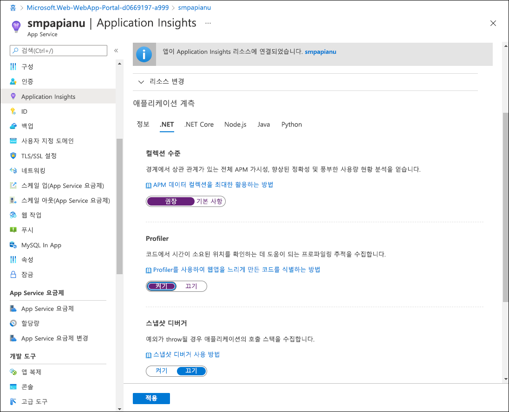
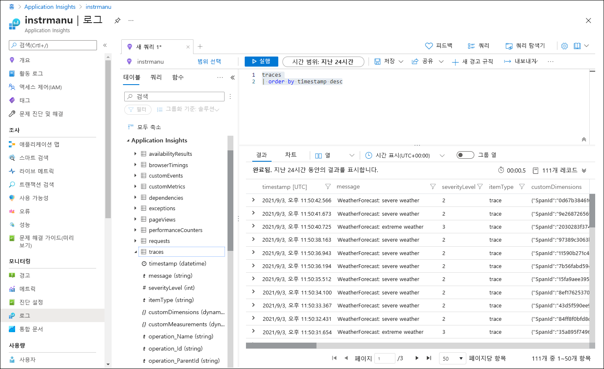

---
lab:
  az204Title: 'Lab 11: Monitor services that are deployed to Azure'
  az020Title: 'Lab 11: Monitor services that are deployed to Azure'
  az204Module: 'Module 11: Monitor and optimize Azure solutions'
  az020Module: 'Module 11: Monitor and optimize Azure solutions'
ms.openlocfilehash: 442177b32dbee3346b8b81216c61ca5337826fe1
ms.sourcegitcommit: 9abfe3b5a1c9ccd2f0610348052d04169573f81a
ms.translationtype: HT
ms.contentlocale: ko-KR
ms.lasthandoff: 06/01/2022
ms.locfileid: "145995046"
---
# <a name="lab-11-monitor-services-that-are-deployed-to-azure"></a>랩 11: Azure에 배포된 서비스 모니터링

## <a name="microsoft-azure-user-interface"></a>Microsoft Azure 사용자 인터페이스

Microsoft 클라우드 도구의 동적 특성을 고려할 때 이 교육 콘텐츠를 개발한 후 발생하는 Azure UI 변경이 발생할 수 있습니다. 따라서 랩 지침 및 랩 단계가 올바르게 정렬되지 않을 수 있습니다.

Microsoft는 커뮤니티에서 변경해야 할 사항이 있음을 알려줄 때 이 학습 과정을 업데이트합니다. 그러나 클라우드 업데이트가 자주 이루어지기 때문에 이 학습 콘텐츠가 업데이트되기 전에 UI가 변경될 수 있습니다. **이 경우 변경 사항에 적응하고 필요에 따라 랩에서 작업합니다.**

## <a name="instructions"></a>Instructions

### <a name="before-you-start"></a>시작하기 전에

#### <a name="sign-in-to-the-lab-environment"></a>랩 환경에 로그인

다음 자격 증명을 사용하여 Windows 10 VM(가상 머신)에 로그인합니다.
    
-   사용자 이름: **Admin**

-   암호: **Pa55w.rd**

> **참고**: 강사가 가상 랩 환경 연결에 대한 지침을 제공합니다.

#### <a name="review-the-installed-applications"></a>설치된 애플리케이션 검토

Windows 10 데스크톱에서 작업 표시줄을 찾습니다. 작업 표시줄에는 다음을 포함하여 이 랩에서 사용할 애플리케이션에 대한 아이콘이 포함되어 있습니다.
    
-   Microsoft Edge

-   파일 탐색기

-   Visual Studio Code

-   Azure PowerShell

## <a name="architecture-diagram"></a>아키텍처 다이어그램


### <a name="exercise-1-create-and-configure-azure-resources"></a>연습 1: Azure 리소스 만들기 및 구성

#### <a name="task-1-open-the-azure-portal"></a>작업 1: Azure Portal 열기

1.  작업 표시줄에서 **Microsoft Edge** 아이콘을 선택합니다.

1.  브라우저 창에서 Azure Portal([portal.azure.com](https://portal.azure.com))로 이동하고 이 랩에 사용할 계정으로 로그인합니다.

    > **참고**: Azure Portal에 처음 로그인하는 경우 포털 둘러보기가 제공됩니다. 둘러보기를 건너뛰고 포털 사용을 시작하려면 **시작하기** 를 선택합니다.

#### <a name="task-2-create-an-application-insights-resource"></a>작업 2: Application Insights 리소스 만들기

1.  Azure Portal에서 페이지 위쪽의 **검색 리소스, 서비스 및 문서** 텍스트 상자를 사용하여 **Application Insights** 를 검색한 다음, 결과 목록에서 **Application Insights** 를 선택합니다.

1.  **Application Insights** 블레이드에서 **+ 만들기** 를 선택합니다.

1.  **Application Insights** 블레이드의 **기본 사항** 탭에서 다음 작업을 수행하고 **검토 + 만들기** 를 선택합니다.
    
    | 설정                         | 작업                                                       |
    | ------------------------------- | ------------------------------------------------------------ |
    | **구독** 드롭다운 목록 | 기본값을 유지합니다.                                    |
    | **리소스 그룹** 섹션      | **새로 만들기** 를 선택하고, **MonitoredAssets** 를 입력한 다음, **확인** 을 선택합니다. |
    | **이름** 텍스트 상자     | **instrm** _[yourname]_ .                           |
    | **지역** 드롭다운 목록       | Azure Service Bus를 배포할 수 있는 Azure 지역을 선택합니다. |
    | **리소스 모드** 섹션 | **작업 영역 기반** 옵션을 선택합니다.|
    | **작업 영역 세부 정보** 섹션 | **구독** 및 **Log Analytics 작업 영역** 드롭다운 목록의 기본값을 유지합니다.|
    
    다음 스크린샷은 **Application Insights** 블레이드에 구성된 설정을 표시합니다.

       
     
1.  **검토 + 만들기** 탭에서 이전 단계에서 선택한 옵션을 검토합니다.

1.  지정된 구성을 사용하여 **Application Insights** 인스턴스를 만들려면 **만들기** 를 선택합니다.

    > **참고**: 이 랩을 계속 진행하기 전에 만들기 작업이 완료될 때까지 기다립니다.

1.  **Microsoft.AppInsights \| 개요** 블레이드에서 **리소스로 이동** 단추를 선택하여 새로 만든 **Application Insights** 리소스의 블레이드로 이동합니다.

1.  **Application Insights** 블레이드의 **구성** 섹션에서 **속성** 링크를 선택합니다.

1.  **속성** 블레이드의 **계측 키** 항목 옆에 있는 **클립보드로 복사** 단추를 선택한 다음, 복사된 값을 기록합니다. 이 값은 이 랩의 뒷부분에서 사용합니다.

    > **참고**: 이 키는 클라이언트 애플리케이션에서 특정 **Application Insights** 에 연결하는 데 사용합니다.

### <a name="task-3-create-an-azure-web-api-resource"></a>작업 3: Azure 웹 API 리소스 만들기

1.  Azure Portal에서 페이지 위쪽에 있는 **리소스, 서비스 및 문서 검색** 텍스트 상자를 사용하여 **App Services** 를 검색한 다음, 결과 목록에서 **App Services** 를 선택합니다.

1.  **App Services** 블레이드에서 **+ 만들기** 를 선택합니다.
    
1.  **웹앱 만들기** 블레이드의 **기본 사항** 탭에서 다음 작업을 수행하고 **다음: 배포** 를 선택합니다.

    | 설정                         | 작업                                                       |
    | ------------------------------- | ------------------------------------------------------------ |
    | **구독** 드롭다운 목록 | 기본값을 유지합니다.                                    |
    | **리소스 그룹** 드롭다운 목록      |**MonitoredAssets** 를 선택합니다. |
    | **이름** 텍스트 상자     | **smpapi** _[사용자 이름]_ 을 입력합니다. |
    | **게시** 섹션       | **코드** 를 선택합니다. |
    | **런타임 스택** 드롭다운 목록 | **.NET Core 3.1(LTS)** 을 선택합니다.|
    | **운영 체제** 섹션 |  **Windows** 를 선택합니다.|
    | **지역** 드롭다운 목록 |  **애플리케이션 인스턴스** 리소스의 위치로 선택한 동일한 지역을 선택합니다. |
    | **App Service 요금제** 섹션 |  **새로 만들기** 를 선택합니다. |
    | **이름** 텍스트 상자 |  **MonitoredPlan** 을 입력한 다음, **확인** 을 선택합니다.|
    |  **SKU 및 크기** 섹션 |  기본값을 유지합니다. |

1.  **배포** 탭에서 **다음: 네트워킹(미리 보기)** 을 선택하고 **다음: 모니터링** 을 선택합니다.

1.  **모니터링** 탭에서 다음 작업을 수행한 다음, **검토 + 만들기** 를 선택합니다.

    | 설정                         | 작업                                                       |
    | ------------------------------- | ------------------------------------------------------------ |
    | **Application Insights 사용** 섹션 | **예** 가 선택되어 있는지 확인합니다.                                    |
    | **Application Insights** 드롭다운 목록     | 이 랩에서 이전에 만든 **instrm** _[yourname]_ Application Insights 리소스를 선택합니다.|

1.  **검토 + 만들기** 탭에서 이전 단계에서 선택한 옵션을 검토합니다.

1.  지정된 구성을 사용하여 웹 API를 만들려면 **만들기** 를 선택합니다.

    > **참고**: 이 랩을 계속 진행하기 전에 만들기 작업이 완료될 때까지 기다립니다.

1.  배포 **개요** 블레이드에서 **리소스로 이동** 단추를 선택하여 새로 만든 Azure 웹 API의 블레이드로 이동합니다.

1.  **App Service** 블레이드의 **설정** 섹션에서 **구성** 링크를 선택합니다.

1.  **구성** 섹션에서 다음 작업을 수행합니다.

    a.  **애플리케이션 설정** 탭에서 **값 표시** 를 선택하여 웹 API와 연결된 비밀을 표시합니다.

    b.  **APPINSIGHTS\_INSTRUMENTATIONKEY** 키를 나타내는 값을 기록해 둡니다. 이 값은 웹 API 리소스를 빌드할 때 자동으로 설정되었습니다.

1.  **App Service** 블레이드의 **설정** 섹션에서 **속성** 링크를 선택합니다.

1.  **속성** 섹션에서 **URL** 링크의 값을 기록합니다. 나중에 랩에서 이 값을 사용하여 웹 API에 요청을 제출합니다.

#### <a name="task-4-configure-web-api-autoscale-options"></a>작업 4: 웹 API 자동 스케일링 옵션 구성

1.  **App Service** 블레이드의 **설정** 섹션에서 **스케일 아웃(App Service 요금제)** 링크를 선택합니다.

1.  **스케일 아웃** 섹션에서 다음 작업을 수행한 다음, **저장** 을 선택합니다.

    | 설정                         | 작업                                                       |
    | ------------------------------- | ------------------------------------------------------------ |
    | **스케일 아웃** 섹션 | **사용자 지정 자동 크기 조정** 을 선택합니다.|
    | **자동 스케일링 설정 이름** 텍스트 상자     | **ComputeScaler** 를 입력합니다.|
    | **리소스 그룹** 드롭다운 목록     |**MonitoredAssets** 를 선택합니다. |
    | **스케일링 모드** 섹션      | **메트릭에 따라 스케일링** 을 선택합니다. |
    | **인스턴스 제한** 섹션의 **최소** 텍스트 상자 | **2** 를 입력합니다.|
    | **인스턴스 제한** 섹션의 **최대** 텍스트 상자 | **8** 을 입력합니다.|
    | **인스턴스 제한** 섹션의 **기본** 텍스트 상자 | **3** 을 입력합니다. |

    다음 스크린샷은 **App Service** 블레이드의 **스케일 아웃** 섹션에 구성된 설정을 표시합니다.

    

    | 설정                         | 작업                                                       |
    | ------------------------------- | ------------------------------------------------------------ |
    | **규칙** 섹션 |  **규칙 추가** 를 선택합니다.|
    | **스케일링 규칙** 블레이드 | 모든 설정에 대한 기본값을 유지하고 **추가** 를 선택합니다.|

    다음 스크린샷은 **App Service** 블레이드의 **스케일 아웃** 섹션에 추가 설정을 표시합니다.

    

    > **참고**: 이 랩을 계속 진행하기 전에 저장 작업이 완료될 때까지 기다립니다.

#### <a name="review"></a>검토

이 연습에서는 랩의 나머지 부분에 사용할 Azure 리소스를 만들었습니다.

### <a name="exercise-2-monitor-a-local-web-api-by-using-application-insights"></a>연습 2: Application Insights를 사용하여 로컬 웹 API 모니터링

#### <a name="task-1-build-a-net-web-api-project"></a>작업 1: .NET 웹 API 프로젝트 빌드

1.  랩 컴퓨터에서 **Visual Studio Code** 를 시작합니다.

1.  Visual Studio Code의 **파일** 메뉴에서 **폴더 열기** 를 선택합니다.

1.  **폴더 열기** 창에서 **Allfiles (F):\\Allfiles\\Labs\\11\\Starter\\Api** 로 이동한 다음, **폴더 선택** 을 선택합니다.

1.  **Visual Studio Code** 창에서 바로 가기 메뉴를 활성화한 다음, **통합 터미널에서 열기** 를 선택합니다.

1.  터미널 프롬프트에서 다음 명령을 실행하여 현재 디렉터리에 **SimpleApi** 라는 새 .NET Web API 애플리케이션을 만듭니다.

    ```
    dotnet new webapi --output . --name SimpleApi
    ```

1.  다음 명령을 실행하여 NuGet에서 현재 프로젝트로 **Microsoft.ApplicationInsights** 버전 2.18.0을 가져옵니다.

    ```
    dotnet add package Microsoft.ApplicationInsights --version 2.18.0
    ```

    > **참고**: **dotnet add package** 명령은 NuGet에서 **Microsoft.ApplicationInsights** 패키지를 추가합니다. 자세한 내용은 [Microsoft.ApplicationInsights](https://www.nuget.org/packages/Microsoft.ApplicationInsights/)를 참조하세요.

1.  다음 명령을 실행하여 NuGet에서 **Microsoft.ApplicationInsights.AspNetCore** 버전 2.18.0을 가져옵니다.

    ```
    dotnet add package Microsoft.ApplicationInsights.AspNetCore --version 2.18.0
    ```

    > **참고**: **dotnet add package** 명령은 NuGet에서 **Microsoft.ApplicationInsights.AspNetCore** 패키지를 추가합니다. 자세한 내용은 [Microsoft.ApplicationInsights.AspNetCore](https://www.nuget.org/packages/Microsoft.ApplicationInsights.AspNetCore)를 참조하세요.

1.  터미널 프롬프트에서 다음 명령을 실행하여 NuGet에서 현재 프로젝트로 **Microsoft.ApplicationInsights.PerfCounterCollector** 버전 2.18.0을 가져옵니다.

    ```
    dotnet add package Microsoft.ApplicationInsights.PerfCounterCollector --version 2.18.0
    ```

    > **참고**: **dotnet add package** 명령은 NuGet에서 **Microsoft.ApplicationInsights.PerfCounterCollector** 패키지를 추가합니다. 자세한 내용은 [Microsoft.ApplicationInsights.PerfCounterCollector](https://www.nuget.org/packages/Microsoft.ApplicationInsights.PerfCounterCollector/)를 참조하세요.

1.  터미널 프롬프트에서 다음 명령을 실행하여 .NET Web API를 빌드합니다.

    ```
    dotnet build
    ```

#### <a name="task-2-update-app-code-to-disable-https-and-use-application-insights"></a>작업 2: HTTPS를 사용하지 않고 Application Insights를 사용하도록 앱 코드 업데이트

1.  **Visual Studio Code** 창의 **탐색기** 창에서 **Startup.cs** 파일을 선택하여 **편집기** 창에서 파일을 엽니다.

1.  **편집기** 창의 **Startup** 클래스에서 줄 39에 있는 다음 코드를 찾아서 삭제합니다.

    ```csharp
    app.UseHttpsRedirection();
    ```

    > **참고**: 이 코드 줄을 사용하면 웹 API가 HTTPS를 강제로 사용합니다. 이 랩에서는 필요가 없습니다.

1.  **Startup** 클래스 정의의 시작 부분에 **INSTRUMENTATION_KEY** 라는 새로운 정적 문자열 상수를 추가하고 이전 이 랩에서 기록한 Application Insights 리소스 계측 키로 값을 설정합니다.

    ```csharp
    private const string INSTRUMENTATION_KEY = "instrumentation_key";
    ```

    > **참고**: 예를 들어, 계측 키가 `d2bb0eed-1342-4394-9b0c-8a56d21aaa43`인 경우 해당 코드 줄은 `private const string INSTRUMENTATION_KEY = "d2bb0eed-1342-4394-9b0c-8a56d21aaa43";`입니다.

1.  **Startup** 클래스에서 **ConfigureServices** 메서드를 찾습니다.

    ```csharp
    public void ConfigureServices(IServiceCollection services)
    {
        services.AddControllers();
    }
    ```

1.  새 줄부터 **ConfigureServices** 메서드 끝에 다음 코드를 추가하여 제공된 계측 키를 통해 Application Insights를 구성합니다.

    ```csharp
    services.AddApplicationInsightsTelemetry(INSTRUMENTATION_KEY);
    ```

1.  이제 다음 코드를 포함해야 하는 **ConfigureServices** 메서드를 검토합니다.

    ```csharp
    public void ConfigureServices(IServiceCollection services)
    {
        services.AddControllers();
        services.AddApplicationInsightsTelemetry(INSTRUMENTATION_KEY);        
    }
    ```

1.  **Startup.cs** 파일을 저장합니다.

1.  터미널 프롬프트에서 다음 명령을 실행하여 .NET Web API를 빌드합니다.

    ```
    dotnet build
    ```

#### <a name="task-3-test-an-api-application-locally"></a>작업 3: API 애플리케이션 로컬 테스트

1.  터미널 프롬프트에서 다음 명령을 실행한 다음, **Enter** 키를 선택하여 인증서를 만듭니다. 프롬프트 옵션에서 **YES** 를 선택합니다.

    ```
    dotnet dev-certs https --trust
    ```

1.  터미널 프롬프트에서 다음 명령을 실행하여 .NET Web API를 시작합니다.

    ```
    dotnet run
    ```

1.  작업 표시줄에서 **Microsoft Edge** 아이콘의 상황에 맞는 메뉴를 연 다음, 새 브라우저 창을 엽니다.

1.  열리는 브라우저 창에서 URL에 웹 API의 **/weatherforecast** 상대 경로가 포함된 페이지로 이동합니다. 이때 웹 API는 포트 **5000** 의 **localhost** 에서 호스트됩니다.
    
    > **참고**: 전체 URL은 `http://localhost:5000/weatherforecast`입니다.

    > **참고**: 페이지에는 다음 형식의 출력이 포함되어야 합니다.

    ```
    [{"date":"2021-09-04T10:15:04.0969996-07:00","temperatureC":54,"temperatureF":129,"summary":"Sweltering"},{"date":"2021-09-05T10:15:04.0972401-07:00","temperatureC":44,"temperatureF":111,"summary":"Balmy"},{"date":"2021-09-06T10:15:04.0976549-07:00","temperatureC":41,"temperatureF":105,"summary":"Scorching"},{"date":"2021-09-07T10:15:04.0976613-07:00","temperatureC":-4,"temperatureF":25,"summary":"Freezing"},{"date":"2021-09-08T10:15:04.0976618-07:00","temperatureC":33,"temperatureF":91,"summary":"Balmy"}]
    ```

1.  `http://localhost:5000/weatherforecast`에서 생성한 페이지를 표시하는 브라우저 창을 닫습니다.

1.  Visual Studio Code에서 **터미널 종료**(**휴지통** 아이콘)를 선택하여 **터미널** 창과 모든 연결된 프로세스를 닫습니다.

#### <a name="task-4-review-metrics-in-application-insights"></a>작업 4: Application Insights에서 메트릭 검토

1.  랩 컴퓨터에서 Azure Portal을 표시하는 **Microsoft Edge** 브라우저 창으로 전환합니다.

1.  Azure Portal에서 이전에 이 랩에서 만든 **instrm** _[yourname]_ Application Insights 리소스의 블레이드로 다시 이동합니다.

1.  **Application Insights** 블레이드의 가운데에 있는 타일에서 표시된 메트릭을 찾습니다. 특히 발생한 서버 요청 수 및 평균 서버 응답 시간을 확인합니다.

    다음 스크린샷은 로컬 웹앱의 **Application Insights** 메트릭을 표시합니다.

    

    > **참고**: Application Insights 메트릭 차트에 요청이 표시되는 데 최대 5분이 걸릴 수 있습니다.

#### <a name="review"></a>검토

이 연습에서는 ASP.NET 사용하여 API 앱을 만들고 애플리케이션 메트릭을 Application Insights에 스트림하도록 구성했습니다. 그런 다음, Application Insights 대시보드를 사용하여 API에 관한 성능 세부 정보를 검토했습니다.

### <a name="exercise-3-monitor-a-web-api-using-application-insights"></a>연습 3: Application Insight를 사용하여 웹 API 모니터링

#### <a name="task-1-deploy-an-application-to-the-web-api"></a>작업 1: 웹 API에 애플리케이션 배포

1.  랩 컴퓨터에서 Visual Studio Code로 전환합니다.

1.  **Visual Studio Code** 창의 **탐색기** 창에서 **bin\Debug\netcoreapp3.1** 디렉터리로 이동합니다.

    > **참고**: **bin\Debug\netcoreapp3.1** 디렉터리에 있는지 확인하려면 Visual Studio Code의 파일 메뉴에서 폴더 열기를 선택하고 **Allfiles (F):\\Allfiles\\Labs\\11\\Starter\\Api\\bin\\Debug\\netcoreapp3.1** 로 이동한 다음, **폴더 선택** 을 선택합니다.

1.  디렉터리에 **web.config** 파일을 추가합니다.

1.  **web.config** 파일을 열고 다음 콘텐츠를 추가합니다.

    ```
    <?xml version="1.0" encoding="utf-8"?>
    <configuration>
      <location path="." inheritInChildApplications="false">
        <system.webServer>
          <handlers>
            <add name="aspNetCore" path="*" verb="*" modules="AspNetCoreModuleV2" resourceType="Unspecified" />
          </handlers>
          <aspNetCore processPath="dotnet" arguments=".\SimpleApi.dll" stdoutLogEnabled="false" stdoutLogFile=".\logs\stdout" hostingModel="inprocess" />
        </system.webServer>
      </location>
    </configuration>
    ```

1.  파일을 저장하고 닫습니다.

1.  **Visual Studio Code** 창에서 바로 가기 메뉴를 활성화한 다음, **통합 터미널에서 열기** 를 선택합니다.

1.  터미널 프롬프트에서 다음 명령을 실행하여 현재 디렉터리가 배포 파일이 있는 **Allfiles (F):\\Allfiles\\Labs\\11\\Starter\\Api\\bin\\Debug\\netcoreapp3.1** 로 설정되어 있는지 확인합니다.

    ```
    cd F:\Allfiles\Labs\11\Starter\Api\bin\Debug\netcoreapp3.1
    ```

1.  다음 명령을 실행하여 Azure 웹 API 옆에 배포할 시작 프로젝트가 포함된 zip 파일을 만듭니다.

    ```powershell
    Compress-Archive -Path * -DestinationPath api.zip
    ```

1.  터미널 프롬프트에서 다음 명령을 실행하여 Azure PowerShell을 통해 Azure 구독에 로그인합니다.

    ```powershell
    Connect-AzAccount
    ```

1.  Azure Portal을 표시하는 Microsoft Edge 브라우저로 전환하고, 브라우저 창에서 다른 탭을 열고, `https://microsoft.com/devicelogin`로 이동하고, 메시지가 표시되면 제공된 코드를 입력한 다음, 이 랩에 사용할 계정으로 로그인하여 터미널 프롬프트에 표시되는 지침을 따릅니다.

    > **참고**: 로그인 프로세스가 완료될 때까지 기다립니다.

1.  새로 열린 브라우저 탭을 닫고 Visual Studio Code 창에서 터미널 프롬프트로 다시 전환합니다.

1.  다음 명령을 실행하여 **MonitoredAssets** 리소스 그룹의 모든 웹앱 목록을 표시합니다.

    ```powershell
    Get-AzWebApp -ResourceGroupName MonitoredAssets
    ```

1.  다음 명령을 실행하여 이름이 **smpapi\*** 로 시작하는 웹앱 목록을 **MonitoredAssets** 리소스 그룹에 표시합니다.

    ```powershell
    Get-AzWebApp -ResourceGroupName MonitoredAssets | Where-Object {$_.Name -like 'smpapi*'}
    ```

1.  다음 명령을 실행하여 이전 단계에서 식별된 첫 번째 웹앱의 이름을 표시하고 **$webAppName** 이라는 변수에 저장합니다.

    ```powershell
    Get-AzWebApp -ResourceGroupName MonitoredAssets | Where-Object {$_.Name -like 'smpapi*'} | Select-Object -ExpandProperty Name
    $webAppName = (Get-AzWebApp -ResourceGroupName MonitoredAssets | Where-Object {$_.Name -like 'smpapi*'})[0] | Select-Object -ExpandProperty Name
    ```

1.  다음 명령을 실행하여 이전에 이 작업에서 만든 **api.zip** 파일을 이전 단계에서 이름을 식별한 웹 API에 배포합니다.

    ```powershell
    az webapp deployment source config-zip --resource-group MonitoredAssets --src api.zip --name $webAppName
    ```

    > **참고**: 인증하라는 메시지가 표시되면 `az login`을 실행하고 지침에 따라 로그인 프로세스를 완료합니다.

    > **참고**: 이 랩을 계속 진행하기 전에 배포가 완료될 때까지 기다립니다.

    > **참고**: 명령의 출력을 검토하고 `provisioningState`가 `Succeeded`로 설정되어 있는지 확인합니다. 명령 출력은 다음 형식이어야 합니다.

    ```
    Getting scm site credentials for zip deployment
    Starting zip deployment. This operation can take a while to complete ...
    Deployment endpoint responded with status code 202
    {
        "active": true,
        "author": "N/A",
        "author_email": "N/A",
        "complete": true,
        "deployer": "ZipDeploy",
        "end_time": "2021-09-03T17:02:18.124062Z",
        "id": "f5fb8ef6a11d4f8387f09dc47628007e",
        "is_readonly": true,
        "is_temp": false,
        "last_success_end_time": "2021-09-03T17:02:18.124062Z",
        "log_url": "https://smpapianu.scm.azurewebsites.net/api/deployments/latest/log",
        "message": "Created via a push deployment",
        "progress": "",
        "provisioningState": "Succeeded",
        "received_time": "2021-09-03T17:02:11.942626Z",
        "site_name": "smpapianu",
        "start_time": "2021-09-03T17:02:12.1613438Z",
        "status": 4,
        "status_text": "",
        "url": "https://smpapianu.scm.azurewebsites.net/api/deployments/latest"
    }
    ```

1.  랩 컴퓨터에서 또 다른 Microsoft Edge 브라우저 창을 시작합니다.

1.  브라우저 창에서 접미사 **/weatherforecast** 를 해당 URL(이전에 이 랩에서 기록함)에 추가하여 이전에 이 작업에서 API 앱을 배포한 Azure 웹 API 앱으로 이동합니다.

    > **참고**: 예를 들어, URL이 `https://smpapianu.azurewebsites.net`인 경우 새 URL은 `https://smpapianu.azurewebsites.net/weatherforecast`입니다.

1.  출력이 API 앱을 로컬로 실행할 때 생성된 출력과 유사한지 확인합니다.

    > **참고**: 출력에는 여러 값이 포함되지만 형식은 같아야 합니다.

    > **참고**: 예외가 발생하면 **web.config** 파일의 콘텐츠가 이 작업의 앞부분에 표시된 샘플과 일치하는지 확인합니다. 일치하지 않는 경우 필요한 내용을 변경하고, **api.zip** 파일을 다시 생성하고, 다시 배포합니다.

#### <a name="task-2-configure-in-depth-metric-collection-for-web-apps"></a>작업 2: Web Apps에 대한 심층 메트릭 컬렉션 구성

1.  랩 컴퓨터에서 Azure Portal을 표시하는 **Microsoft Edge** 브라우저 창으로 전환합니다.

1.  Azure Portal에서 이전에 이 랩에서 만든 **smpapi** _[yourname]_ 웹앱 리소스의 블레이드로 다시 이동합니다.

1.  **App Service** 블레이드에서 **Application Insights** 를 선택합니다.

1.  **Application Insights** 블레이드에서 다음 작업을 수행하고, **적용** 을 선택한 다음, 확인 대화 상자에서 **예** 를 선택합니다.

    | 설정                         | 작업                                                       |
    | ------------------------------- | ------------------------------------------------------------ |
    | **Application Insights** 슬라이더 | **사용** 으로 설정되어 있는지 확인합니다.|
    | **애플리케이션 계측** 섹션    | **.NET Core** 탭을 선택합니다.|
    | **컬렉션 수준** 섹션    | **권장** 을 선택합니다. |
    | **프로파일러** 섹션      | **켜기** 를 선택합니다.|
    | **스냅샷 디버거** 섹션 | **끄기** 를 선택합니다.|
    | **SQL 명령** 섹션 | **끄기** 를 선택합니다.|


    다음 스크린샷은 Azure 웹 API의 **Application Insights** 설정을 표시합니다.

    

1.  이전 작업에서 연 브라우저 탭으로 전환하여 대상 Azure API 앱(대상 URL의 **/weatherforecast** 상대 경로 포함)에 API 앱을 배포한 결과를 표시하고 브라우저 페이지를 여러 번 새로 고칩니다.

1.  API에서 생성된 JSON 형식 출력을 검토합니다.

1.  JSON 형식 출력에 액세스하는 데 사용한 URL을 기록합니다.

    > **참고**: **smpapianu** 가 이전에 만든 사이트 이름인 경우 URL은 `https://smpapianu.azurewebsites.net/weatherforecast` 형식이어야 합니다.

#### <a name="task-3-get-updated-metrics-in-application-insights"></a>작업 3: Application Insights에서 업데이트된 메트릭 가져오기

1.  Azure Portal에서 Azure 웹앱을 표시하는 브라우저 창으로 돌아갑니다.

1.  웹앱의 **Application Insights** 블레이드에서 **Application Insights 데이터 보기** 링크를 선택합니다.

1.  **Application Insights** 블레이드에서 발생한 서버 요청 수, 평균 서버 응답 시간 등을 포함하여 블레이드 가운데에 있는 타일에서 수집된 메트릭을 검토합니다.

    다음 스크린샷은 Azure Portal에서 Azure 웹앱의 **Application Insights** 메트릭을 표시합니다.

    

    > **참고**: 업데이트된 메트릭이 Application Insights 메트릭 차트에 표시되는 데 최대 5분이 걸릴 수 있습니다.

#### <a name="task-4-view-real-time-metrics-in-application-insights"></a>작업 4: Application Insights에서 실시간 메트릭 보기

1.  **Application Insights** 블레이드의 **조사** 섹션에서 **라이브 메트릭** 을 선택합니다.

1.  대상 Azure 웹앱에서 실행되는 대상 API 앱(대상 URL의 **/weatherforecast** 상대 경로를 대상으로 함)을 표시하는 브라우저 창으로 다시 전환한 다음, 브라우저 페이지를 여러 번 새로 고칩니다.

1.  **라이브 메트릭** 블레이드를 표시하는 브라우저 창으로 전환하고 해당 콘텐츠를 검토합니다.

    > **참고**: **들어오는 요청** 섹션은 몇 초 내에 업데이트되어 웹앱에 대한 요청을 표시합니다.

### <a name="exercise-4-application-insights-logging-with-net-core"></a>연습 4: .NET Core를 사용한 Application Insights 로깅

#### <a name="task-1-configure-logging-for-a-net-core-api-app"></a>작업 1: .NET Core API 앱에 대한 로깅 구성

1.  **Visual Studio Code** 창으로 전환합니다.

1.  터미널 프롬프트에서 다음 명령을 실행하여 현재 디렉터리를 배포 파일이 있는 **Allfiles (F):\\Allfiles\\Labs\\11\\Starter\\Api** 로 설정합니다.

    ```
    cd F:\Allfiles\Labs\11\Starter\Api
    ```

1.  다음 명령을 실행하여 NuGet에서 현재 프로젝트로 **Microsoft.Extensions.Logging.ApplicationInsights** 버전 2.18.0을 가져옵니다.

    ```
    dotnet add package Microsoft.Extensions.Logging.ApplicationInsights --version 2.18.0
    ```

    > **참고**: **dotnet add package** 명령은 NuGet에서 **Microsoft.ApplicationInsights** 패키지를 추가합니다. 자세한 내용은 [Microsoft.Extensions.Logging.ApplicationInsights](https://www.nuget.org/packages/Microsoft.Extensions.Logging.ApplicationInsights)를 참조하세요.

1.  **Visual Studio Code** 창의 **탐색기** 창에서 **컨트롤러** 디렉터리로 이동한 다음, **WeatherForecastController.cs** 파일을 엽니다.

1.  파일의 콘텐츠를 검토하고 제네릭 ILogger<WeatherForecastController> 인터페이스에 대한 `using Microsoft.Extensions.Logging` 지시문 및 생성자 삽입이 포함되어 있는지 확인합니다.

    ```csharp
    using System;
    using System.Collections.Generic;
    using System.Linq;
    using System.Threading.Tasks;
    using Microsoft.AspNetCore.Mvc;
    using Microsoft.Extensions.Logging;
    namespace SimpleApi.Controllers
    {
        [ApiController]
        [Route("[controller]")]
        public class WeatherForecastController : ControllerBase
        {
            private static readonly string[] Summaries = new[]
            {
                "Freezing", "Bracing", "Chilly", "Cool", "Mild", "Warm", "Balmy", "Hot", "Sweltering", "Scorching"
            };
            private readonly ILogger<WeatherForecastController> _logger;
            public WeatherForecastController(ILogger<WeatherForecastController> logger)
            {
                _logger = logger;
            }
            [HttpGet]
            public IEnumerable<WeatherForecast> Get()
            {
                var rng = new Random();
                return Enumerable.Range(1, 5).Select(index => new WeatherForecast
                {
                    Date = DateTime.Now.AddDays(index),
                    TemperatureC = rng.Next(-20, 55),
                    Summary = Summaries[rng.Next(Summaries.Length)]
                })
                .ToArray();
            }
        }
    }
    ```

    > **참고**: 이 구성을 활용하여 사용자 지정 로깅을 구현합니다. 현재 생성자는 임의로 생성된 5개 일기 예보의 그룹을 표시합니다. 한 번에 하나의 예측을 표시하도록 컨트롤러를 수정합니다. 각 예측에 대해 날씨 유형(온화, 심각 및 극한)을 나타내는 정보, 경고 또는 오류 로그 항목을 생성합니다. 해당 Log Analytics 작업 영역에서 Application Insights가 이러한 로그 항목을 기록하는 경우 각 항목에는 자동으로 할당된 심각도 수준 1, 2 또는 3이 포함됩니다. 

1.  **WeatherForecastController.cs** 파일의 `public IEnumerable<WeatherForecast> Get()` 메서드에서 `var rng = new Random();` 줄을 찾은 후 다음 줄부터 다음과 같은 코드를 추가합니다.

    ```csharp
            int temperatureC = rng.Next(-20, 55);
            var summaryId = rng.Next(Summaries.Length);
            switch (summaryId)
            {
                case 0: case 9:
                _logger.LogError("WeatherForecast: extreme weather");
                break;
                case 1: case 2: case 7: case 8:
                _logger.LogWarning("WeatherForecast: severe weather");
                break;
                default:
                _logger.LogInformation("WeatherForecast: mild weather");
                break;
            }
    ```

1.  다음 콘텐츠가 포함되도록 `return` 문을 수정합니다.

    ```csharp
            return Enumerable.Range(1, 1).Select(index => new WeatherForecast
            {
                Date = DateTime.Now.AddDays(index),
                TemperatureC = temperatureC,
                Summary = Summaries[summaryId]
            })
            .ToArray();
    ```

1.   파일을 저장하고 닫습니다.

1.  터미널 프롬프트에서 다음 명령을 실행하여 .NET Web API를 빌드합니다.

    ```
    dotnet build
    ```

#### <a name="task-2-test-logging-of-a-net-core-api-app"></a>작업 2: .NET Core API 앱의 로깅 테스트

1.  다음 명령을 실행하여 .NET Web API를 시작합니다.

    ```
    dotnet run
    ```

    > **참고**: 이 작업의 다음 단계를 수행할 때 웹 API를 계속 실행하고 Visual Studio Code **터미널** 창의 출력을 모니터링합니다.

1.  랩 컴퓨터의 작업 표시줄에서 **Microsoft Edge** 아이콘의 상황에 맞는 메뉴를 연 다음, 새 브라우저 창을 엽니다.

    > **참고**: Visual Studio Code **터미널** 창을 막지 않도록 브라우저 창을 배치합니다.

1.  열린 브라우저 창에서 `http://localhost:5000/weatherforecast`로 이동한 다음, 페이지를 여러 번 새로 고칩니다.

    > **참고**: 페이지를 새로 고칠 때마다 다음 형식의 다른 일기 예보가 표시됩니다.

    ```
    [{"date":"2021-09-04T14:35:29.0789168-07:00","temperatureC":2,"temperatureF":35,"summary":"Sweltering"}]
    ```

    > **참고**: 페이지를 새로 고칠 때마다 터미널 프롬프트에 다음 형식의 정보, 경고 또는 오류 메시지가 표시됩니다.

    ```
    warn: SimpleApi.Controllers.WeatherForecastController[0]
      WeatherForecast: severe weather
    ```

    > **참고**: 페이지를 여러 번 새로 고쳐서 각 유형의 메시지(**정보**, **경고**, **실패**)를 하나 이상 생성했는지 확인합니다.

1.  API 앱을 계속 실행합니다.

#### <a name="task-3-review-the-application-insights-logging"></a>작업 3: Application Insights 로깅 검토

1.  랩 컴퓨터에서 Azure Portal을 표시하는 **Microsoft Edge** 브라우저 창으로 전환합니다.

1.  Azure Portal에서 이전에 이 랩에서 만든 **instrm** _[yourname]_ Application Insights 리소스의 블레이드로 다시 이동합니다.

1.  **Application Insights** 블레이드의 **모니터링** 섹션에서 **로그** 를 선택합니다.

1.  필요한 경우 **Log Analytics 시작** 창과 **쿼리** 창을 닫습니다.

1.  **새 쿼리** 창에서 다음 쿼리를 입력하고 **실행** 을 선택합니다.

    ```
    traces
    | order by timestamp desc
    ```

1.  쿼리 결과를 검토합니다.

    > **참고**: 결과에는 .NET Core API 앱에서 생성된 경고 및 오류 메시지에 해당하는 로그 항목과 해당 심각도 수준(2 및 3)이 포함되어야 합니다.

    > **참고**: Application Insights 메트릭 차트에 요청이 표시되는 데 최대 5분이 걸릴 수 있습니다.

    다음 스크린샷은 **Application Insights 로그** 블레이드에 로그 쿼리 결과를 표시합니다.

    

    > **참고**: 업데이트된 API 앱을 Azure 웹앱에 배포하여 동일한 방식으로 Application Insights를 통해 로그를 수집할 수 있습니다.

    > **참고**: 다음 코드 목록에 설명된 대로 **appsettings.Development.json**(또는 **appsettings.json**) 파일을 수정하여 정보 이벤트를 포함하도록 Application Insights 로깅 수준을 확장합니다. 그러나 이로 인해 잠재적인 네트워크 성능 및 가격 책정에 영향을 주는 로그 볼륨이 상당히 증가한다는 점에 유의하세요.

    ```
    {
      "Logging": {
        "LogLevel": {
          "Default": "Information",
          "Microsoft": "Warning",
          "Microsoft.Hosting.Lifetime": "Information"
        },
        "ApplicationInsights": {
          "LogLevel": {
            "Microsoft": "Information"
          }
        }
      }
    }
    ```

1.  API 앱의 출력을 표시하는 브라우저 창을 닫습니다.

1.  **Visual Studio Code** 창으로 전환한 다음, **터미널 종료**(**휴지통** 아이콘)를 선택하여 **터미널** 창과 모든 연결된 프로세스를 닫습니다.

#### <a name="review"></a>검토

이 연습에서는 웹 API 앱의 Application Insights 로깅을 구성하고 테스트했습니다.

### <a name="exercise-5-clean-up-your-subscription"></a>연습5: 구독 정리

#### <a name="task-1-open-azure-cloud-shell"></a>작업 1: Azure Cloud Shell 열기

1.  Azure Portal에서 **Cloud Shell** 아이콘 을 선택하여 새 PowerShell 세션을 엽니다. Cloud Shell 기본값이 PowerShell 세션인 경우 **PowerShell** 을 선택하고 드롭다운 메뉴에서 **Bash** 를 선택합니다.

    > **참고**: **Cloud Shell** 을 처음 시작하는 경우 **Bash** 또는 **PowerShell** 을 선택하라는 메시지가 표시되면 **Bash** 를 선택합니다. **탑재된 스토리지가 없음** 메시지가 표시되면 이 랩에서 사용하는 구독을 선택하고 **스토리지 만들기** 를 선택합니다.

#### <a name="task-2-delete-resource-groups"></a>작업 2: 리소스 그룹 삭제

1.  **Cloud Shell** 창에서 다음 명령을 실행하여 **MonitoredAssets** 리소스 그룹을 삭제합니다.

    ```
    az group delete --name MonitoredAssets --no-wait --yes
    ```

    > **참고**: 이 명령은 *--no-wait* 매개 변수에서 알 수 있듯이 비동기로 실행되므로 동일한 Bash 세션 내에서 이 명령을 실행한 직후에 다른 Azure CLI 명령을 실행하는 것이 가능하지만 실제로 리소스 그룹이 제거되기까지는 몇 분 정도 걸립니다.

1.  포털에서 **Cloud Shell** 창을 닫습니다.

#### <a name="task-3-close-the-active-applications"></a>작업 3: 활성 애플리케이션 닫기

1.  현재 실행 중인 Microsoft Edge 애플리케이션을 닫습니다.

1.  현재 실행 중인 Visual Studio Code 애플리케이션을 닫습니다.

#### <a name="review"></a>검토

이 연습에서는 이 랩에 사용된 리소스 그룹을 제거하여 구독을 정리했습니다.
