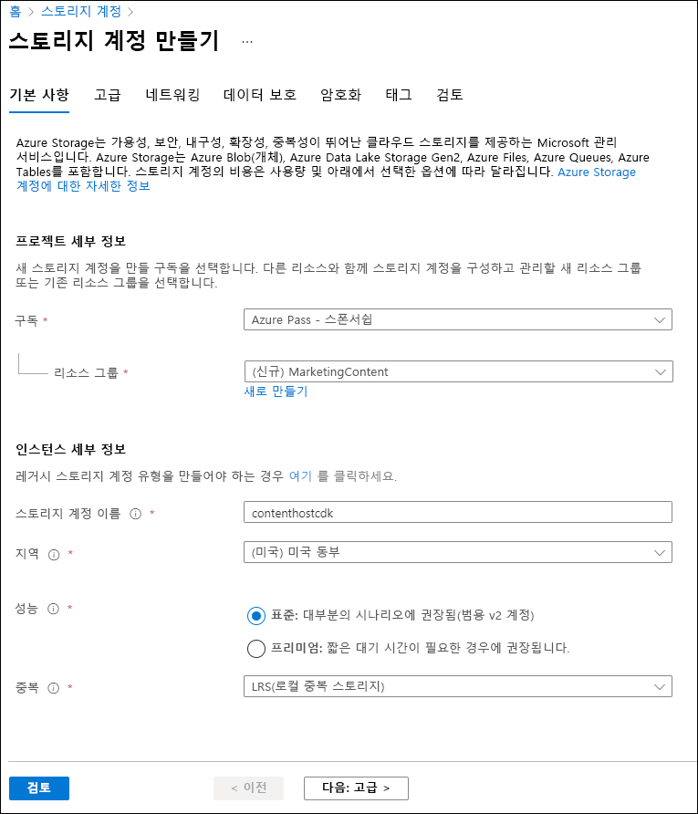
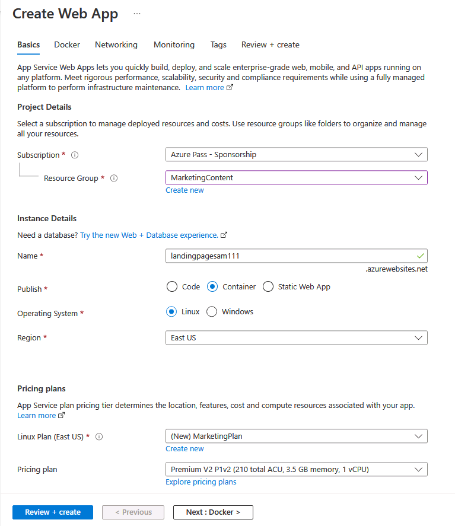
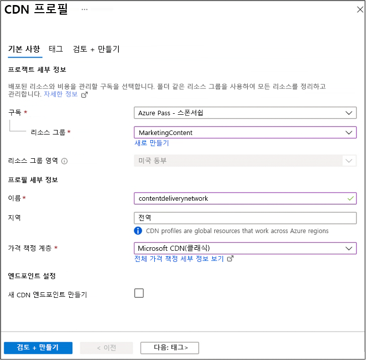
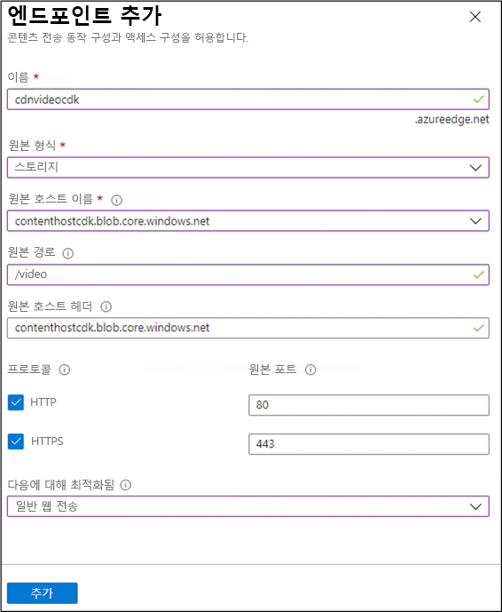

---
lab:
    az204Title: '랩 12: Azure Content Delivery Network를 사용하여 웹 애플리케이션 향상'
    az204Module: '모듈 12: 솔루션 내에서 캐싱 및 콘텐츠 배달 통합'
---

# 랩 12: Azure Content Delivery Network를 사용하여 웹 애플리케이션 향상

## Microsoft Azure 사용자 인터페이스

Microsoft 클라우드 도구의 동적 특성을 감안할 때, 이 교육 콘텐츠를 개발한 후 Azure UI가 변경될 수도 있습니다. 따라서 랩 지침 및 랩 단계가 정확히 일치하지는 않을 수 있습니다.

Microsoft는 커뮤니티에서 변경 사항이 필요하다는 것을 알릴 때 이 학습 과정을 업데이트합니다. 그러나 클라우드 업데이트가 자주 이루어지기 때문에 이 학습 콘텐츠가 업데이트되기 전에 UI가 변경될 수 있습니다. **이 경우 변경 사항에 적응하고 필요에 따라 랩에서 작업합니다.**

## 지침

### 시작하기 전에

#### 랩 환경에 로그인

다음 자격 증명을 사용하여 Windows 10 VM(가상 머신)에 로그인합니다.

- 사용자 이름: **Admin**

- 암호: **Pa55w.rd**

> **참고**: 가상 랩 환경에 연결하기 위한 지침을 강사가 제공할 것입니다.

#### 설치된 애플리케이션 검토

Windows 10 데스크톱에서 작업 표시줄을 찾습니다. 작업 표시줄에 이 랩에서 사용할 애플리케이션의 아이콘이 포함되어 있습니다.

- Microsoft Edge

## 아키텍처 다이어그램


### 연습 1: Azure 리소스 만들기

#### 작업 1: Azure Portal 열기

1. 작업 표시줄에서 **Microsoft Edge** 아이콘을 선택합니다.

1. 열린 브라우저 창에서 Azure Portal(<https://portal.azure.com>)로 이동한 다음, 이 랩에 대해 사용할 계정으로 로그인합니다.

   > **참고**: Azure Portal에 처음 로그인하는 경우 포털 둘러보기가 제공됩니다. 둘러보기를 건너뛰고 포털 사용을 시작하려면 **시작하기**를 선택합니다.

#### 작업 2: 스토리지 계정 만들기

1. Azure Portal에서 **검색 리소스, 서비스 및 문서** 텍스트 상자를 사용하여 **스토리지 계정**을 검색한 다음 결과 목록에서 **스토리지 계정**을 선택합니다.

1. **스토리지 계정** 블레이드에서 **+ 만들기**를 선택합니다.

1. **스토리지 계정 만들기** 블레이드의 **기초** 탭에서 다음 작업을 수행한 후에 **검토 + 만들기**를 선택합니다.

   | 설정                           | 작업                                                       |
   | --------------------------------- | ------------------------------------------------------------ |
   | **구독** 드롭다운 목록   | 기본값을 유지합니다.                                    |
   | **리소스 그룹** 섹션        | **새로 만들기**를 선택하고 **MarketingContent**를 입력한 다음 **확인**을 선택합니다. |
   | **스토리지 계정 이름** 텍스트 상자 | **contenthost**_[사용자 이름]_을 입력합니다.                           |
   | **지역** 드롭다운 목록         | **(미국) 미국 동부**를 선택합니다.                                     |
   | **성능** 섹션           | **표준** 옵션을 선택합니다.                              |
   | **중복성** 드롭다운 목록     | **LRS(로컬 중복 스토리지)** 를 선택합니다.                  |

    다음 스크린샷은 **스토리지 계정 만들기** 블레이드에 구성된 설정을 표시합니다.

    

1. **검토 + 만들기** 탭에서 이전 단계에서 선택한 옵션을 검토합니다.

1. 지정된 구성을 사용하여 스토리지 계정을 만들려면 **만들기**를 선택합니다.

    > **참고**: 이 랩을 진행하기 전에 만들기 작업이 완료될 때까지 기다립니다.

#### 작업 3: Azure App Service를 사용하여 웹앱 만들기

1. Azure Portal 탐색 창에서 **리소스 만들기**를 선택합니다.

1. **리소스 만들기** 블레이드에 있는 **서비스 및 마켓플레이스 검색** 텍스트 상자에 **웹앱**을 입력한 후에 Enter 키를 누릅니다.

1. 검색 결과 블레이드에서 **웹앱** 결과를 선택한 후에 **만들기**를 선택합니다.

1. **웹앱 만들기** 블레이드의 **기초** 탭에서 다음 작업을 수행한 후에 **다음: Docker**를 선택합니다.

   | 설정                           | 작업                                                       |
   | --------------------------------- | ------------------------------------------------------------ |
   | **구독** 드롭다운 목록   | 기본값을 유지합니다.                                    |
   | **리소스 그룹** 드롭다운 목록 | 목록에서 **MarketingContent**를 선택합니다.                     |
   | **이름** 텍스트 상자                 | **landingpage**_[사용자 이름]_을 입력합니다.                           |
   | **게시** 섹션               | **Docker 컨테이너**를 선택합니다.                                 |
   | **운영 체제** 섹션      | **Linux**를 선택합니다.                                            |
   | **지역** 드롭다운 목록         | **미국 동부**를 입력합니다.                                          |
   | **Linux 계획(미국 동부)** 섹션  | **새로 만들기**를 선택합니다. **이름** 텍스트 상자에 **MarketingPlan**을 입력한 다음 **확인**을 선택합니다. |
   | **SKU 및 크기** 섹션          | 기본값을 유지합니다.                                    |

   다음 스크린샷은 **웹앱 만들기** 블레이드에 구성된 설정을 표시합니다.

   

1. **Docker** 탭에서 다음 작업을 수행한 후에 **검토 + 만들기**를 선택합니다.

   | 설정                         | 작업                                                    |
   | ------------------------------- | --------------------------------------------------------- |
   | **옵션** 드롭다운 목록      | **단일 컨테이너**를 선택합니다.                              |
   | **이미지 소스** 드롭다운 목록 | **Docker Hub**를 선택합니다.                                    |
   | **액세스 유형** 드롭다운 목록  | **공용**을 선택합니다.                                        |
   | **이미지 및 태그** 텍스트 상자      | **microsoftlearning/edx-html-landing-page:latest**를 입력합니다. |

   다음 스크린샷은 **Docker** 탭에 구성된 설정을 표시합니다.

   

1. **검토 + 만들기** 탭에서 이전 단계에서 선택한 옵션을 검토합니다.

1. 지정된 구성을 사용하여 웹앱을 만들려면 **만들기**를 선택합니다.

    > **참고**: 이 랩을 진행하기 전에 만들기 작업이 완료될 때까지 기다립니다.

1. Azure Portal의 탐색 창에서 **리소스 그룹**을 선택합니다.

1. **리소스 그룹** 블레이드에서 이 랩의 앞부분에서 만든 **MarketingContent** 리소스 그룹을 선택합니다.

1. **MarketingContent** 블레이드에서 이 랩의 앞부분에서 만든 **landingpage**_[사용자 이름]_ 웹앱을 선택합니다.

1. **App Service** 블레이드의 **설정** 범주에서 **속성** 링크를 선택합니다.

1. **속성** 섹션에서 **URL** 링크의 값을 기록합니다. 이 값은 랩에서 나중에 사용합니다.

#### 복습

이 연습에서는 이 랩의 나중에 사용할 Azure Storage 계정과 Azure 웹앱을 만들었습니다.

### 연습 2: Content Delivery Network 및 엔드포인트 구성

#### 작업 1: Azure Cloud Shell 열기

1. Azure Portal에서 **Cloud Shell** 아이콘()을 선택하여 새 Bash 인스턴스를 엽니다. Cloud Shell이 기본적으로 PowerShell 세션인 경우 **PowerShell**을 선택하고 드롭다운 메뉴에서 **Bash**를 선택합니다.

    > **참고**: **Cloud Shell**을 처음 시작하는 경우에는 **Bash** 또는 **PowerShell** 중에서 선택하라는 메시지가 나타날 때 **Bash**를 선택합니다. **탑재된 스토리지가 없음** 메시지가 표시되면 이 랩에서 사용하는 구독을 선택하고 **스토리지 만들기**를 선택합니다.

1. Azure Portal에서 **Cloud Shell** 명령 프롬프트에 따라 다음 명령을 실행하여 Azure CLI(Azure 명령줄 인터페이스) 도구의 버전을 가져옵니다.

    ```bash
    az --version
    ```

#### 작업 2: Microsoft.CDN 공급자 등록

1. Portal의 **Cloud Shell** 명령 프롬프트에서 다음 작업을 수행합니다.

    a.  다음 명령을 입력하고 Enter 키를 눌러 Azure CLI의 루트 수준에서 하위 그룹 및 명령 목록을 가져옵니다.

    ```bash
    az --help
    ```

    b.  다음 명령을 입력한 다음 Enter 키를 선택하여 리소스 공급자가 사용할 수 있는 명령 목록을 가져옵니다.

    ```bash
    az provider --help
    ```

    c.  다음 명령을 입력한 다음 Enter 키를 선택하여 현재 등록된 모든 공급자를 나열합니다.

     ```bash
     az provider list
     ```

    d.  다음 명령을 입력한 다음 Enter 키를 선택하여 현재 등록된 공급자의 네임스페이스만 나열합니다.

     ```bash
     az provider list --query "[].namespace"
     ```

    e.  현재 등록된 공급자 목록을 살펴봅니다. **Microsoft.CDN** 공급자는 현재 공급자 목록에 있지 않습니다.

    f.  다음 명령을 입력한 다음 Enter 키를 선택하여 새 공급자를 등록하는 데 필요한 플래그를 가져옵니다.

     ```bash
     az provider register --help
     ```

    g.  다음 명령을 입력한 다음 Enter 키를 선택한 후 현재 구독에 **Microsoft.CDN** 네임스페이스를 등록합니다.

     ```bash
     az provider register --namespace Microsoft.CDN
     ```

1. 포털에서 **Cloud Shell** 창을 닫습니다.

#### 작업 3: Content Delivery Network 프로필 만들기

1. Azure Portal 탐색 창에서 **리소스 만들기**를 선택합니다.

1. **리소스 만들기** 블레이드에 있는 **서비스 및 마켓플레이스 검색** 텍스트 상자에 **CDN**을 입력한 후에 Enter 키를 누릅니다.

1. **Marketplace** 검색 결과 블레이드에서 **CDN** 결과를 선택한 후에 **만들기**를 선택합니다.

1. **CDN 프로필** 블레이드의 **기초** 탭에서 다음 작업을 수행한 후에 **검토 + 만들기**를 선택합니다.

   | 설정                                     | 작업                                   |
   | ------------------------------------------- | ---------------------------------------- |
   | **구독** 드롭다운 목록             | 기본값을 유지합니다.                |
   | **리소스 그룹** 드롭다운 목록           | 목록에서 **MarketingContent**를 선택합니다. |
   | **이름** 텍스트 상자                           | **contentdeliverynetwork**를 입력합니다.        |
   | **지역** 텍스트 상자                         | 기본값(전역)을 유지합니다.       |
   | **가격 책정 계층** 드롭다운 목록             | **표준 Akamai**를 선택합니다.              |
   | **지금 새 CDN 엔드포인트 만들기** 체크박스 | 선택되지 않음.                            |

   다음 스크린샷은 **CDN 프로필** 블레이드에 구성된 설정을 표시합니다.

   

1. **검토 + 만들기** 탭에서 이전 단계에서 선택한 옵션을 검토합니다.

1. 지정된 구성을 사용하여 CDN 프로필을 만들려면 **만들기**를 선택합니다.
  
    > **참고**: 랩을 진행하기 전에 Azure에서 CDN 프로필 만들기가 완료될 때까지 기다립니다. 앱을 만들 때 알림을 받게 됩니다.

#### 작업 4: 스토리지 컨테이너 구성

1. Azure Portal의 탐색 창에서 **리소스 그룹**을 선택합니다.

1. **리소스 그룹** 블레이드에서 이 랩의 앞부분에서 만든 **MarketingContent** 리소스 그룹을 선택합니다.

1. **MarketingContent** 블레이드에서 이 랩의 앞부분에서 만든 **contenthost**_[사용자 이름]_ 스토리지 계정을 선택합니다.

1. **스토리지 계정** 블레이드에서 **데이터 스토리지** 섹션에 있는 **컨테이너** 링크를 선택합니다.

1. **컨테이너** 섹션에서 **+ 컨테이너**를 선택합니다.

1. **새 컨테이너** 팝업 창에서 다음 작업을 수행한 후에 **만들기**를 선택합니다.

   | 설정                                | 작업                                                  |
   | -------------------------------------- | ------------------------------------------------------- |
   | **이름** 텍스트 상자                      | **media**를 입력합니다.                                        |
   | **공용 액세스 수준** 드롭다운 목록 | **Blob(Blob에 대해서만 익명 읽기 액세스)** 를 선택합니다. |

1. **컨테이너** 섹션에서 **+ 컨테이너**를 다시 선택합니다.

1. **새 컨테이너** 팝업 창에서 다음 작업을 수행한 후에 **만들기**를 선택합니다.

   | 설정                                | 작업                                                  |
   | -------------------------------------- | ------------------------------------------------------- |
   | **이름** 텍스트 상자                      | **video**를 입력합니다.                                        |
   | **공용 액세스 수준** 드롭다운 목록 | **Blob(Blob에 대해서만 익명 읽기 액세스)** 를 선택합니다. |

1. 업데이트된 컨테이너 목록을 관찰하고 **media** 및 **video** 컨테이너가 모두 나열되어 있는지 확인합니다.

#### 작업 5: Content Delivery Network 엔드포인트 만들기

1. Azure Portal의 탐색 창에서 **리소스 그룹** 링크를 선택합니다.

1. **리소스 그룹** 블레이드에서 이 랩의 앞부분에서 만든 **MarketingContent** 리소스 그룹을 선택합니다.

1. **MarketingContent** 블레이드에서 이 랩의 앞부분에서 만든 **contentdeliverynetwork** CDN 프로필을 선택합니다.

1. **CDN 프로필** 블레이드에서 **+ 엔드포인트**를 선택합니다.

1. **엔드포인트 추가** 팝업 대화 상자에서 다음 작업을 수행한 후에 **추가**를 선택합니다.

   | 설정                                   | 작업                                                       |
   | ----------------------------------------- | ------------------------------------------------------------ |
   | **이름** 텍스트 상자                         | **cdnmedia**_[사용자 이름]_을 입력합니다.                              |
   | **원본 유형** 드롭다운 목록            | **스토리지**를 선택합니다.                                          |
   | **원본 호스트 이름** 드롭다운 목록        | 이 랩의 앞부분에서 만든 스토리지 계정에 대해 **contenthost*[사용자 이름]*.blob.core.windows.net** 옵션을 선택합니다. |
   | **원본 경로** 텍스트 상자                  | **/media**를 입력합니다.                                            |
   | **원본 호스트 머리글** 텍스트 상자           | 기본값을 유지합니다.                                    |
   | **프로토콜** 및 **원본 포트** 섹션 | 기본값을 유지합니다.                                   |
   | **최적화 대상** 드롭다운 목록          | **일반 웹 배달**을 선택합니다.                             |

   다음 스크린샷은 **엔드포인트 추가** 대화 상자에 구성된 설정을 표시합니다.

   

1. **CDN 프로필** 블레이드에서 **+ 엔드포인트**를 다시 선택합니다.

1. **엔드포인트 추가** 팝업 대화 상자에서 다음 작업을 수행한 후에 **추가**를 선택합니다.

   | 설정                                   | 작업                                                       |
   | ----------------------------------------- | ------------------------------------------------------------ |
   | **이름** 텍스트 상자                         | **cdnvideo**_[사용자 이름]_을 입력합니다.                              |
   | **원본 유형** 드롭다운 목록            | **스토리지**를 선택합니다.                                          |
   | **원본 호스트 이름** 드롭다운 목록        | 이 랩의 앞부분에서 만든 스토리지 계정에 대해 **contenthost*[사용자 이름]*.blob.core.windows.net** 옵션을 선택합니다. |
   | **원본 경로** 텍스트 상자                  | **/video**를 입력합니다.                                            |
   | **원본 호스트 머리글** 텍스트 상자           | 기본값을 유지합니다.                                    |
   | **프로토콜** 및 **원본 포트** 섹션 | 기본값을 유지합니다.                                   |
   | **최적화 대상** 드롭다운 목록          | **주문형 비디오 미디어 스트리밍**을 선택합니다.                  |

   다음 스크린샷은 **엔드포인트 추가** 대화 상자에 구성된 설정을 표시합니다.

   

1. **CDN 프로필** 블레이드에서 **+ 엔드포인트**를 다시 선택합니다.

1. **엔드포인트 추가** 팝업 대화 상자에서 다음 작업을 수행한 후에 **추가**를 선택합니다.

   | 설정                                   | 작업                                                       |
   | ----------------------------------------- | ------------------------------------------------------------ |
   | **이름** 텍스트 상자                         | **cdnweb**_[사용자 이름]_을 입력합니다.                                |
   | **원본 유형** 드롭다운 목록            | **웹앱**을 선택합니다.                                          |
   | **원본 호스트 이름** 드롭다운 목록        | 이 랩의 앞부분에서 만든 웹앱에 대해 **landingpage*[사용자 이름]*.azurewebsites.net** 옵션을 선택합니다. |
   | **원본 경로** 텍스트 상자                  | 기본값을 유지합니다.                                    |
   | **원본 호스트 머리글** 텍스트 상자           | 기본값을 유지합니다.                                    |
   | **프로토콜** 및 **원본 포트** 섹션 | 기본값을 유지합니다.                                   |
   | **최적화 대상** 드롭다운 목록          | **일반 웹 배달**을 선택합니다.                             |

   다음 스크린샷은 **엔드포인트 추가** 대화 상자에 구성된 설정을 표시합니다.

   

#### 복습

이 연습에서는 CDN(Content Delivery Network)의 리소스 공급자를 등록하고 CDN 프로필과 엔드포인트 리소스를 모두 만드는 공급자를 사용했습니다.

### 연습 3: 정적 웹 콘텐츠 업로드 및 구성

#### 작업 1: 방문 페이지 살펴보기

1. Azure Portal의 탐색 창에서 **리소스 그룹**을 선택합니다.

1. **리소스 그룹** 블레이드에서 이 랩의 앞부분에서 만든 **MarketingContent** 리소스 그룹을 선택합니다.

1. **MarketingContent** 블레이드에서 이 랩의 앞부분에서 만든 **landingpage**_[사용자 이름]_ 웹앱을 선택합니다.

1. **웹 서비스** 블레이드에서 **찾아보기**를 선택합니다. 새 브라우저 탭이 열리고 현재 웹 사이트로 돌아갑니다. 화면에 표시되는 오류 메시지를 살펴봅니다. 멀티미디어 콘텐츠를 참조하는 특정 설정을 구성할 때까지 웹 사이트가 작동하지 않습니다.

1. Azure Portal을 표시하고 있고 현재 열려 있는 브라우저 창으로 돌아갑니다.

#### 작업 2: 저장소 Blob 업로드

1. Azure Portal의 탐색 창에서 **리소스 그룹**을 선택합니다.

1. **리소스 그룹** 블레이드에서 이 랩의 앞부분에서 만든 **MarketingContent** 리소스 그룹을 선택합니다.

1. **MarketingContent** 블레이드에서 이 랩의 앞부분에서 만든 **contenthost**_[사용자 이름]_ 스토리지 계정을 선택합니다.

1. **스토리지 계정** 블레이드에서 **데이터 스토리지** 섹션에 있는 **컨테이너** 링크를 선택합니다.

1. **컨테이너** 섹션에서 **media** 컨테이너를 선택한 후에 **업로드**를 선택합니다.

1. **Blob 업로드** 팝업 창에서 다음 작업을 수행합니다.

    a.  **파일** 섹션에서 **폴더** 아이콘을 선택합니다.

    b.  **파일 탐색기** 창에서 **Allfiles (F):\\Allfiles\\Labs\\12\\Starter**로 이동하여 다음 파일을 선택한 다음, **열기**를 선택합니다.

    - **campus.jpg**

    - **conference.jpg**

    - **poster.jpg**

    c.  **파일이 이미 있는 경우 덮어쓰기**가 선택되어 있는지 확인하고 **업로드**를 선택합니다.  

    > **참고**: 이 랩을 계속하기 전에 Blob이 업로드될 때까지 기다립니다.

1. **컨테이너** 블레이드에서 **설정** 섹션에 있는 **속성**을 선택합니다.

1. **URL** 텍스트 상자에 값을 기록합니다. 이 값은 랩에서 나중에 사용합니다.

1. **컨테이너** 블레이드를 닫습니다.

1. **컨테이너** 블레이드에서 **video** 컨테이너를 선택한 후에 **업로드**를 선택합니다.

1. **Blob 업로드** 팝업 창에서 다음 작업을 수행합니다.

    a.  **파일** 섹션에서 **폴더** 아이콘을 선택합니다.

    b.  **파일 탐색기** 창에서 **Allfiles (F):\\Allfiles\\Labs\\12\\Starter**로 이동하여**welcome.mp4** 파일을 선택하고 **열기**를 선택합니다.

    c.  **파일이 이미 있는 경우 덮어쓰기**가 선택되어 있는지 확인하고 **업로드**를 선택합니다.  

    > **참고**: 이 랩을 계속하기 전에 Blob이 업로드될 때까지 기다립니다.

1. **컨테이너** 블레이드에서 **설정** 섹션에 있는 **속성**을 선택합니다.

1. **URL** 텍스트 상자에 값을 기록합니다. 이 값은 랩에서 나중에 사용합니다.

#### 작업 3: 웹앱 설정 구성

1. Azure Portal의 탐색 창에서 **리소스 그룹**을 선택합니다.

1. **리소스 그룹** 블레이드에서 이 랩의 앞부분에서 만든 **MarketingContent** 리소스 그룹을 선택합니다.

1. **MarketingContent** 블레이드에서 이 랩의 앞부분에서 만든 **landingpage**_[사용자 이름]_ 웹앱을 선택합니다.

1. **앱 서비스** 블레이드의 **설정** 범주에서 **구성** 링크를 선택합니다.

1. **구성** 섹션에서 **애플리케이션 설정** 탭을 선택한 다음 **새 애플리케이션 설정**을 선택합니다.

1. **애플리케이션 설정 추가/편집** 팝업 창에서 다음 설정을 구성한 후에 **확인**을 선택합니다.

   | 설정                               | 작업                                                       |
   | ------------------------------------- | ------------------------------------------------------------ |
   | **이름** 텍스트 상자                     | **CDNMediaEndpoint**를 입력합니다.                                  |
   | **값** 텍스트 상자                    | 이 랩의 앞부분에서 기록한 **contenthost**_[사용자 이름]_ 스토리지 계정에 있는 **media** 컨테이너의 **URI** 값을 입력합니다. |
   | **배포 슬롯 설정** 체크박스 | 선택하지 않습니다.                                               |

1. **구성** 섹션으로 돌아가서 **새 애플리케이션 설정**을 선택합니다.

1. **애플리케이션 설정 추가/편집** 팝업 창에서 다음 설정을 구성한 후에 **확인**을 선택합니다.

   | 설정                               | 작업                                                       |
   | ------------------------------------- | ------------------------------------------------------------ |
   | **이름** 텍스트 상자                     | **CDNVideoEndpoint**를 입력합니다.                                  |
   | **값** 텍스트 상자                    | 이 랩의 앞부분에서 기록한 **contenthost**_[사용자 이름]_ 스토리지 계정에 있는 **video** 컨테이너의 **URI** 값을 입력합니다. |
   | **배포 슬롯 설정** 체크박스 | 선택하지 않습니다.                                               |

1. **구성** 섹션으로 돌아가서 **저장**을 선택합니다. **계속**을 선택하여 변경 내용을 확인합니다.

   > **참고**: 랩을 진행하기 전에 애플리케이션 설정이 유지될 때까지 기다립니다.

#### 작업 4: 수정된 방문 페이지의 유효성 검사

1. Azure Portal의 탐색 창에서 **리소스 그룹**을 선택합니다.

1. **리소스 그룹** 블레이드에서 이 랩의 앞부분에서 만든 **MarketingContent** 리소스 그룹을 선택합니다.

1. **MarketingContent** 블레이드에서 이 랩의 앞부분에서 만든 **landingpage**_[사용자 이름]_ 웹앱을 선택합니다.

1. **앱 서비스** 블레이드에서 **다시 시작**을 선택한 후에 **예**를 선택하여 앱 재시작 프로세스를 확인합니다.

   > **참고**: 이 랩을 진행하기 전에 다시 시작 작업이 완료될 때까지 기다립니다. 작업이 완료되면 알림을 받습니다.

1. **웹 서비스** 블레이드에서 **찾아보기**를 선택합니다. 새 브라우저 창 또는 탭이 열리고 현재 웹 사이트로 돌아갑니다. 다양한 유형의 멀티미디어 콘텐츠를 렌더링하는 업데이트된 웹 사이트를 살펴봅니다.

1. Azure Portal을 표시하고 있고 현재 열려 있는 브라우저 창으로 돌아갑니다.

#### 복습

이 연습에서는 멀티미디어 콘텐츠를 스토리지 컨테이너에 Blob으로 업로드한 후 웹앱을 업데이트하여 스토리지 Blob을 직접 가리켰습니다.

### 연습 4: Content Delivery Network 엔드포인트 사용

#### 작업 1: 엔드포인트 URI(Uniform Resource Identifier) 검색

1. Azure Portal의 탐색 창에서 **리소스 그룹** 링크를 선택합니다.

1. **리소스 그룹** 블레이드에서 이 랩의 앞부분에서 만든 **MarketingContent** 리소스 그룹을 선택합니다.

1. **MarketingContent** 블레이드에서 이 랩의 앞부분에서 만든 **contentdeliverynetwork** CDN 프로필을 선택합니다.

1. **CDN 프로필** 블레이드에서 **cdnmedia**_[사용자 이름]_ 엔드포인트를 선택합니다.

1. **엔드포인트** 블레이드에서 **엔드포인트 호스트 이름** 링크의 값을 복사합니다. 이 값은 랩에서 나중에 사용합니다.

1. **엔드포인트** 블레이드를 닫습니다.

1. **CDN 프로필** 블레이드에서 **cdnvideo**_[사용자 이름]_ 엔드포인트를 선택합니다.

1. **엔드포인트** 블레이드에서 **엔드포인트 호스트 이름** 링크의 값을 복사합니다. 이 값은 랩에서 나중에 사용합니다.

1. **엔드포인트** 블레이드를 닫습니다.

#### 작업 2: 멀티미디어 콘텐츠 테스트

1. 랩의 앞부분에서 복사한 **cdnmedia**_[사용자 이름]_ 엔드포인트에서 **엔드포인트 호스트 이름** URL을 **/campus.jpg**의 상대 경로와 결합하여 **campus.jpg** 리소스용 URL을 만듭니다.

    > **참고**: 예를 들어, **엔드포인트 호스트 이름** URL이 `https://cdnmediastudent.azureedge.net/`인 경우, 새로 만든 URL은 `https://cdnmediastudent.azureedge.net/campus.jpg`가 됩니다.

1. 랩의 앞부분에서 복사한 **cdnmedia**_[사용자 이름]_ 엔드포인트에서 **엔드포인트 호스트 이름** URL을 **/conference.jpg**의 상대 경로와 결합하여 **conference.jpg** 리소스용 URL을 만듭니다.

    > **참고**: 예를 들어, **엔드포인트 호스트 이름** URL이 `https://cdnmediastudent.azureedge.net/`인 경우, 새로 만든 URL은 `https://cdnmediastudent.azureedge.net/conference.jpg`가 됩니다.

1. 랩의 앞부분에서 복사한 **cdnmedia**_[사용자 이름]_ 엔드포인트에서 **엔드포인트 호스트 이름** URL을 **/poster.jpg**의 상대 경로와 결합하여 **poster.jpg** 리소스용 URL을 만듭니다.

    > **참고**: 예를 들어, **엔드포인트 호스트 이름** URL이 `https://cdnmediastudent.azureedge.net/`인 경우, 새로 만든 URL은 `https://cdnmediastudent.azureedge.net/poster.jpg`가 됩니다.

1. 랩의 앞부분에서 복사한 **cdnvideo**_[사용자 이름]_ 엔드포인트에서 **엔드포인트 호스트 이름** URL을 **/welcome.mp4**의 상대 경로와 결합하여**welcome.mp4** 리소스용 URL을 만듭니다.

    > **참고**: 예를 들어, **엔드포인트 호스트 이름** URL이 `https://cdnvideostudent.azureedge.net/`인 경우, 새로 만든 URL은 `https://cdnvideostudent.azureedge.net/welcome.mp4`가 됩니다.


1. 작업 표시줄에서 **Microsoft Edge** 아이콘의 바로 가기 메뉴를 열고 **새 창**을 선택합니다.

1. 새 브라우저 창에서 **campus.jpg** 미디어 리소스용으로 구성한 URL을 참조한 다음, 리소스를 성공적으로 찾았는지 확인합니다.

    > **참고**: 콘텐츠를 아직 사용할 수 없는 경우 CDN 엔드포인트가 계속 초기화되고 있습니다. 이 초기화 작업은 5~15분 정도 걸릴 수 있습니다.

1. **conference.jpg** 미디어 리소스용으로 만든 URL을 참조한 다음, 리소스를 성공적으로 찾았는지 확인합니다.

1. **poster.jpg** 미디어 리소스용으로 만든 URL을 참조한 다음, 리소스를 성공적으로 찾았는지 확인합니다.

1. **welcome.mp4** 비디오 리소스용으로 만든 URL을 참조한 다음, 리소스를 성공적으로 찾았는지 확인합니다.

1. 이 작업에서 생성했던 브라우저 창을 닫습니다.

#### 작업 3: 웹앱 설정 업데이트

1. Azure Portal의 탐색 창에서 **리소스 그룹**을 선택합니다.

1. **리소스 그룹** 블레이드에서 이 랩의 앞부분에서 만든 **MarketingContent** 리소스 그룹을 선택합니다.

1. **MarketingContent** 블레이드에서 이 랩의 앞부분에서 만든 **landingpage**_[사용자 이름]_ 웹앱을 선택합니다.

1. **앱 서비스** 블레이드의 **설정** 범주에서 **구성** 링크를 선택합니다.

1. **구성** 섹션에서 **애플리케이션 설정** 탭을 선택합니다.

1. 기존의 **CDNMediaEndpoint** 애플리케이션 설정을 선택합니다.

1. **애플리케이션 설정 추가/편집** 팝업 대화 상자에서 랩의 앞부분에서 복사한 **cdnmedia**_[사용자 이름]_ 엔드포인트에서 **엔드포인트 호스트 이름** URL을 입력하여 **값** 텍스트 상자를 업데이트한 후 **확인**을 선택합니다.

1. 기존의 **CDNVideoEndpoint** 애플리케이션 설정을 선택합니다.

1. **애플리케이션 설정 추가/편집** 팝업 대화 상자에서 랩의 앞부분에서 복사한 **cdnvideo**_[사용자 이름]_ 엔드포인트에서 **엔드포인트 호스트 이름** URL을 입력하여 **값** 텍스트 상자를 업데이트한 후 **확인**을 선택합니다.

1. **저장**을 선택한 후에 **계속**을 선택하여 변경 사항을 확인합니다.  

   > **참고**: 랩을 진행하기 전에 애플리케이션 설정이 유지될 때까지 기다립니다.

1. **구성** 섹션에서 **개요**를 선택합니다.

1. **개요** 섹션에서 **다시 시작**을 선택한 후에 **예**를 선택하여 앱 재시작 프로세스를 확인합니다.

   > **참고**: 이 랩을 계속하기 전에 다시 시작 작업이 완료될 때까지 기다립니다. 작업이 완료되면 알림을 받습니다.

#### 작업 4: 웹 콘텐츠를 테스트합니다.

1. Azure Portal의 탐색 창에서 **리소스 그룹** 링크를 선택합니다.

1. **리소스 그룹** 블레이드에서 이 랩의 앞부분에서 만든 **MarketingContent** 리소스 그룹을 선택합니다.

1. **MarketingContent** 블레이드에서 이 랩의 앞부분에서 만든 **contentdeliverynetwork** CDN 프로필을 선택합니다.

1. **CDN 프로필** 블레이드에서 **cdnweb**_[사용자 이름]_ 엔드포인트를 선택합니다.

1. **엔드포인트** 블레이드에서 **엔드포인트 호스트 이름** 링크의 값을 복사합니다.


1. 작업 표시줄에서 **Microsoft Edge** 아이콘의 바로 가기 메뉴를 열고 **새 창**을 선택합니다.


1. 새 브라우저 창에서 **cdnweb**_[사용자 이름]_ 엔드포인트용 **엔드포인트 호스트 이름** URL을 참조합니다.

1. Content Delivery Network를 사용하여 모두 제공되는 웹 사이트 및 멀티미디어 콘텐츠를 살펴봅니다.

#### 복습

이 연습에서는 Content Delivery Network를 사용하여 멀티미디어 콘텐츠를 제공하고 웹 애플리케이션 자체를 서비스하도록 웹앱을 업데이트했습니다.

### 연습 5: 구독 정리

#### 작업 1: Azure Cloud Shell 열기

1. Azure Portal에서 **Cloud Shell** 아이콘()을 선택하여 새 Bash 인스턴스를 엽니다. Cloud Shell이 기본적으로 PowerShell 세션인 경우 **PowerShell**을 선택한 후에 드롭다운 메뉴에서 **Bash**를 선택합니다.

    > **참고**: **Cloud Shell**을 처음 시작하는 경우에는 **Bash** 또는 **PowerShell** 중에서 선택하라는 메시지가 나타날 때 **PowerShell**을 선택합니다. **탑재된 스토리지가 없음** 메시지가 표시되면 이 랩에서 사용하는 구독을 선택하고 **스토리지 만들기**를 선택합니다.

#### 작업 2: 리소스 그룹 삭제

1. **Cloud Shell** 창에서 다음 명령을 실행하여 **MarketingContent** 리소스 그룹을 삭제합니다.

    ```bash
    az group delete --name MarketingContent --no-wait --yes
    ```

     > **참고**: 명령은 비동기적으로 실행되므로(*--no-wait* 매개 변수에 의해 결정됨) 동일한 Bash 세션 내에서 즉시 다른 Azure CLI 명령을 실행할 수 있지만 리소스 그룹이 실제로 제거되기까지 몇 분 정도 걸립니다.

1. 포털에서 **Cloud Shell** 창을 닫습니다.

#### 작업 3: 활성 애플리케이션 닫기

1. 현재 실행 중인 Microsoft Edge 애플리케이션을 닫습니다.

#### 복습

이 연습에서는이 랩에 사용된 리소스 그룹을 제거하여 구독을 정리했습니다.
