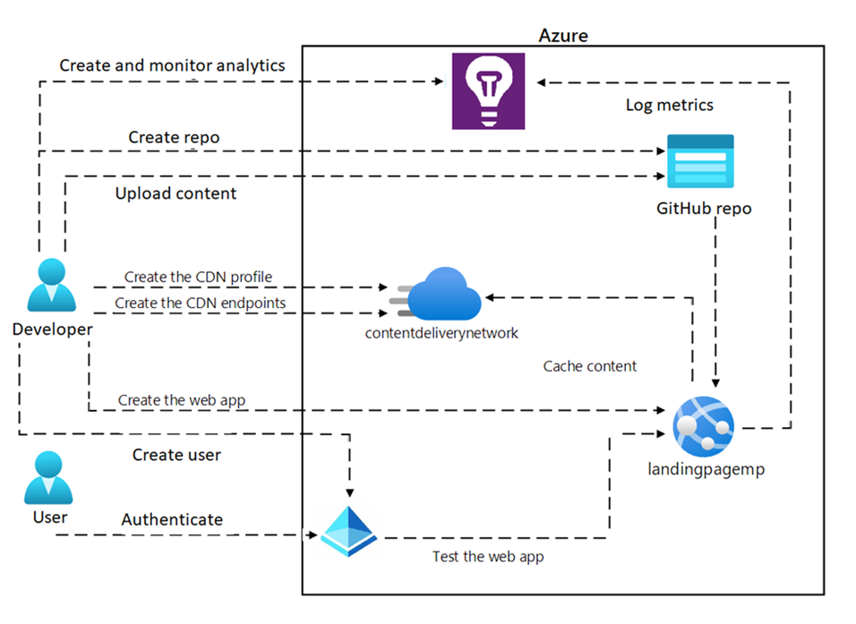

---
lab:
  az204Title: 'Lab 13 (Optional): Create and configure an Azure web app'
  az204Module: Optional lab
---

# 랩 13: Azure 웹앱 만들기 및 구성

## Microsoft Azure 사용자 인터페이스

Microsoft 클라우드 도구의 동적 특성을 고려할 때 이 교육 콘텐츠를 개발한 후 발생하는 Azure UI 변경이 발생할 수 있습니다. 따라서 랩 지침 및 랩 단계가 올바르게 정렬되지 않을 수 있습니다.

Microsoft는 커뮤니티에서 변경해야 할 사항이 있음을 알려줄 때 이 학습 과정을 업데이트합니다. 그러나 클라우드 업데이트가 자주 이루어지기 때문에 이 학습 콘텐츠가 업데이트되기 전에 UI가 변경될 수 있습니다. **이 경우 변경 사항에 적응하고 필요에 따라 랩에서 작업합니다.**

## Instructions

### 시작하기 전에

#### 랩 환경에 로그인

다음 자격 증명을 사용하여 Windows 11 VM(가상 머신)에 로그인합니다.

- 사용자 이름: `Admin`
- 암호: `Pa55w.rd`

> **참고**: 강사가 가상 랩 환경 연결에 대한 지침을 제공합니다.

#### 설치된 애플리케이션 검토

Windows 11 데스크톱에서 작업 표시줄을 찾습니다. 작업 표시줄에 이 랩에서 사용할 애플리케이션의 아이콘이 포함되어 있습니다.

- Microsoft Edge

## 랩 시나리오

이 랩에서는 GitHub와 통합되는 Azure 웹앱을 배포하고 구성합니다. 웹앱은 내부 직원만 액세스할 수 있는 단일 페이지 웹앱을 간단하게 구현한 것입니다. 이 웹 사이트는 회사 전략 및 부문 판매 목표와 관련된 콘텐츠를 호스팅합니다.

웹앱을 만들려면 Azure Portal을 사용하고 이를 GitHub 리포지토리에 연결합니다. 이를 위해서는 이 랩의 일부로 제공되는 샘플 웹 사이트 콘텐츠를 업로드할 무료 GitHub 계정이 필요합니다. 웹앱이 실행 중이면 콘텐츠를 변경하고 CI/CD 방법을 사용하여 GitHub 콘텐츠가 웹앱에 동기화되는 것을 살펴봅니다.

직원 전용 웹앱이므로 Azure AD에서 사용자를 만들고 사용자 인증을 통해 웹앱에 대한 보안을 구현하여 웹앱에 대한 액세스를 보호해야 합니다.


## 아키텍처 다이어그램



### 연습 1: Azure App Service 웹 앱 생성

#### 작업 1: GitHub 계정을 만들고 샘플 웹앱 코드를 리포지토리에 업로드합니다.

1. 작업 표시줄에서 **Microsoft Edge** 아이콘을 선택합니다.

1. 브라우저 창에서 GitHub 웹 사이트(`https://github.com/`)로 이동하고 아직 계정이 없으면 새 계정을 만듭니다.

1. 로그인한 후 기본 페이지에서 **새로 만들기** 단추를 클릭하여 새 리포지토리를 만듭니다.

1. 리포지토리에 이름과 설명을 지정하고 퍼블릭 또는 프라이빗 중 하나를 선택합니다.

1. **추가 정보 파일 추가** 섹션에서 **추가 정보 파일 추가**를 선택합니다.

1. 리포지토리를 만들려면 **리포지토리 만들기**를 선택합니다.

1. GitHub의 리포지토리 페이지에서 **파일 추가**를 선택하고 드롭다운 목록에서 **파일 업로드**를 선택합니다.

1. **파일 탐색기** 창을 열고, **Allfiles(F):\\Allfiles\\Labs\\13\\Starter\\webapp-sam-lab13**으로 이동하고, 모든 파일을 선택하고, 끌어서 놓기 기능을 사용하여 GitHub 리포지토리에 추가합니다.

1. 변경 내용을 설명하는 커밋 메시지를 추가합니다(예: "샘플 웹앱 코드의 초기 커밋").

1. 샘플 웹앱 코드를 리포지토리에 업로드하려면 **변경 내용 커밋**을 선택합니다.

#### 작업 2: Azure Portal에서 웹앱을 만들고 GitHub 계정에 연결합니다.

1. 작업 표시줄에서 **Microsoft Edge** 아이콘을 선택합니다.

1. 브라우저 창에서 Azure Portal(`https://portal.azure.com`)로 이동한 다음, 이 랩에 사용할 계정으로 로그인합니다.

1. Azure Portal 탐색 창의 왼쪽 메뉴에서 **리소스 만들기** 단추를 선택합니다.

1. 검색 창에 **웹앱**을 입력하고 옵션 목록에서 **웹앱**을 선택합니다.

1. **웹앱** 블레이드에서 **만들기**를 선택합니다.

1. **웹앱 만들기** 블레이드에서 **기본 사항** 탭을 선택하고 다음 작업을 수행합니다. 

    | 설정 | 작업 |
    | -- | -- |
    | **구독** 드롭다운 목록 | 기본값을 유지합니다. |
    | **리소스 그룹** | **새로 만들기**를 선택하고 **wProject-Sam-RG**를 입력한 다음 **확인**을 선택합니다. |
    | **이름**  | **webapp-sam**_[사용자 이름]_ 을 입력합니다. |
    | **게시**  | **코드** 선택 |
    | **런타임 스택**  | **.NET 8(LTS)** 을 선택합니다. |
    | **운영 체제**  | **Windows**를 선택합니다. |
    | **지역**  | **미국 동부** 지역을 선택합니다. |
    | **Windows 플랜(미국 동부)** | **새로 만들기**를 선택하고 **이름** 필드에 **ManagedPlan**을 입력한 다음 **확인**을 선택합니다. |
    | **요금제** | **표준 S1**을 선택합니다. |

1. **모니터링** 탭을 선택하고 **Application Insights 사용** 섹션에서 **예**를 선택합니다. 그런 다음, **검토 + 생성**를 선택합니다.

1. 이전 단계에서 선택한 옵션을 검토한 다음 **만들기**를 선택합니다.

   > **참고**: 이 랩을 계속 실행하기 전에 웹앱이 만들어질 때까지 기다립니다.

1. **개요** 블레이드에서 **리소스로 이동** 단추를 선택하여 새로 만들어진 웹앱으로 이동합니다.

#### 작업 3: GitHub에서 웹앱 배포 

<!-- Is step 1 needed since they should already be there if they selected "Go to resource" above? -->

1. Azure Portal을 열고 이전 작업에서 만든 웹앱으로 이동합니다.

1. **설정** 섹션의 왼쪽 메뉴에서 **구성**을 선택합니다.

1. **구성** 블레이드에서 **일반 설정**을 선택합니다.

1. **일반 설정** 탭에서 **기본 인증 게시 자격 증명**에 대해 **사용**을 선택하고 **저장**을 선택한 다음 **계속**을 선택합니다.

   > **참고**: 구성을 저장할 때까지 1분 동안 기다립니다.

1. **배포** 섹션의 왼쪽 메뉴에서 **배포 센터**를 선택합니다.

1. **설정** 탭의 드롭다운 목록에서 **원본**를 선택하고 **GitHub**를 선택합니다.

1. **GitHub** 섹션에서 아래로 스크롤하고 **권한 부여** 단추를 선택하여 Azure가 GitHub 계정에 액세스할 수 있도록 허용합니다.

1. GitHub 액세스 권한을 성공적으로 권한 부여한 후 다음 작업을 수행하고 **저장**을 선택합니다.
   
    | 설정 | 작업 |
    | -- | -- |
    | **조직** 드롭다운 목록 | GitHub 조직을 선택합니다. |
    | **리포지토리** 드롭다운 목록 | 작업 1에서 만든 리포지토리를 선택합니다. |
    | **분기** 드롭다운 목록 | 작업 1에서 만든 분기를 선택합니다. |

   > **참고**: 구성을 저장할 때까지 1분 동안 기다립니다.

1. 이전 작업에서 만든 GitHub 리포지토리를 열고 상단 메뉴에서 **작업**을 선택합니다.

1. **작업** 탭의 **모든 워크플로**에서 **Azure App Service 빌드 및 배포 워크플로 구성 추가 또는 업데이트**를 선택하여 빌드 및 배포 프로세스를 확인합니다.

1. 성공적으로 빌드하고 배포한 후 Azure Portal을 열고 **App Service**로 이동합니다.

1. **App Service** 블레이드에서 **개요**를 선택한 다음 **찾아보기**를 선택합니다.

1. 웹앱의 다양한 함수와 함수를 검토하고 테스트하여 의도한 대로 작동하는지 확인합니다.

   > **참고**: 웹앱 브라우저 창을 열어두세요. 나중에 필요합니다. 

#### 작업 4: GitHub에서 코드를 변경하고 변경 내용이 웹앱에 반영되는지 확인합니다.

1. 웹앱용 코드가 포함된 GitHub 리포지토리를 엽니다.

1. **Pages** 폴더에서 **Index.cshtml** 파일을 선택하고 코드 미리 보기에서 파일 편집을 위해 **연필 아이콘**을 선택합니다.

1.  **Index.cshtml** 파일의 코드 편집기 탭에서 기존 파일의 9행 코드를 삭제합니다.

    ```html
    <h1>My Gallery</h1>
    ```

1. 다음 코드를 추가합니다.

    ```html
    <h1>Portfolio Gallery</h1>
    <P>This is a simple .NET web project.</P>
    ```

1. **변경 내용 커밋**을 선택하고 **커밋 메시지** 및 **자세한 설명**을 작성한 다음  **Index.cshtml** 파일에 대해 **변경 내용 커밋**을 선택합니다.

   > **참고**: 변경 내용이 웹앱에 반영될 때까지 기다립니다. 배포 프로세스에 따라 몇 분에서 한 시간 정도 걸릴 수 있습니다.
 
<!-- Are they opening a new browser or just refreshing their already open browser? -->

1. 웹앱 브라우저 창을 열고 브라우저 창을 새로 고쳐 변경 내용을 확인합니다.

1. 변경 내용이 표시되는지 확인합니다.

<!-- The above step is the test of the changes, correct? -->

1. 변경 내용의 영향을 받는 기능을 테스트하여 모든 것이 예상대로 작동하는지 확인합니다.

1. 변경 내용이 웹앱에 반영되지 않으면 배포 로그를 확인하고 필요에 따라 문제를 해결합니다.

<!-- left off-->

1. 변경 내용이 여전히 표시되지 않으면 트레이너에게 도움을 요청합니다.  

   > **참고**: 변경 내용을 리포지토리에 커밋하고 웹앱에 배포하기 전에 항상 변경 내용을 테스트해야 합니다. 또한 GitHub에서 코드 작업을 할 때 버전 제어 및 협업에 대한 모범 사례를 따라야 합니다.

#### 검토

이 연습에서는 Azure Portal에서 웹앱을 만들고 이를 GitHub 리포지토리에 연결하는 방법에 대해 설명합니다.

### 연습 2: 웹앱에 자동 크기 조정 사용

#### 작업 1: 사용자 지정 크기 조정 사용

1. Azure Portal을 열고 **App Service**로 이동하여 이전 연습에서 만든 웹앱을 선택합니다.

1. **웹앱** 블레이드의 **설정** 섹션에서 **스케일 아웃(App Service 요금제)** 을 선택합니다.

1. **스케일 아웃(App Service 요금제)** 페이지의 **스케일 아웃 방법**에서 **규칙 기반**을 선택합니다.

1. 페이지 하단의 경고 메시지 후 *자동 크기 조정이 사용하도록 설정되면 규칙 기반 크기 조정이 무시됩니다.* **규칙 기반 크기 조정 관리** 링크를 선택합니다.

1. **자동 크기 조정 설정** 페이지에서 다음 정보를 입력한 후 **저장**을 선택합니다.
    
    | 설정 | 정보 |
    | -- | -- |
    | **구성**  | **사용자 지정 자동 크기 조정**을 선택합니다. |
    | **크기 조정 모드**  | **메트릭에 따라 스케일링**을 선택합니다. |
    | **규칙.**  | **크기 조정 규칙** 블레이드에서 **규칙 추가** 링크를 선택하고 모든 설정에 대해 기본값을 보존한 다음 **추가**를 선택합니다. |
    | **인스턴스 제한** 섹션의 **최소** 텍스트 상자 | **1** 입력 |
    | **인스턴스 제한** 섹션의 **최대** 텍스트 상자 | **4**를 입력합니다. |
    | **인스턴스 제한** 섹션의 **기본** 텍스트 상자 | **2**를 입력합니다. | 

    > **참고**: 이 랩을 계속 진행하기 전에 저장 작업이 완료될 때까지 기다립니다.

#### 작업 2: 인스턴스 수를 늘리기 위해 CPU 사용량을 기반으로 스케일 아웃 옵션을 구성합니다.

1. **자동 크기 조정 설정** 페이지에서 아래로 스크롤하여 **+ 규칙 추가**를 선택합니다.

1. **크기 조정 규칙** 페이지에서 다음 작업을 수행한 후 **추가**를 선택한 다음 **저장**을 선택합니다.
    
    | 설정 | 작업 |
    | -- | -- |
    | **메트릭 이름** 드롭다운 목록 | **CPU 비율** 선택 |
    | **연산자** 드롭다운 목록 | **보다 큼**을 선택합니다. |
    | **크기 조정 작업을 트리거하는 메트릭 임계값** 텍스트 상자 | **60** 입력 |
    | **기간(분)** 텍스트 상자 | **5** 입력 |
    | **작업** 드롭다운 목록 | **개수 증가 기준**을 선택합니다. | 
    | **대기 시간(분)** 텍스트 상자 | **5** 입력 | 
    | **인스턴스 수** 텍스트 상자 | **1** 입력 | 

1. 설정한 CPU 임계값에 도달하는 트래픽을 생성하여 규칙을 테스트합니다.

1.  Auto Scaling 그룹이 예상대로 크기 조정되는지 확인합니다.

    > **참고**: 유사한 단계에 따라 CPU 사용량을 기반으로 스케일 인 옵션을 구성하여 인스턴스 수를 줄일 수 있습니다.


#### 작업 3: 인스턴스 수를 줄이기 위해 CPU 사용량을 기반으로 스케일 인 옵션을 구성합니다.

1. **자동 크기 조정 설정** 페이지에서 아래로 스크롤하여 **+ 규칙 추가**를 선택합니다.

1. **크기 조정 규칙** 페이지에서 다음 작업을 수행하고 **추가**를 선택한 다음 **저장**을 선택합니다.
    
    | 설정 | 작업 |
    | -- | -- |
    | **메트릭 이름** 드롭다운 목록 | **CPU 비율** 선택 |
    | **연산자** 드롭다운 목록 | **보다 작음**을 선택합니다. |
    | **크기 조정 작업을 트리거하는 메트릭 임계값** 텍스트 상자 | **40** 입력 |
    | **기간(분)** 텍스트 상자 | **5** 입력 |
    | **작업** 드롭다운 목록 | **개수 감소 기준**을 선택합니다. | 
    | **대기 시간(분)** 텍스트 상자 | **3**을 입력합니다. | 
    | **인스턴스 수** 텍스트 상자 | **1** 입력 | 

1. 설정한 CPU 임계값에 도달하는 트래픽을 생성하여 규칙을 테스트합니다.

1. Auto Scaling 그룹이 예상대로 크기 조정되는지 확인합니다.

   > **참고**: 비슷한 단계에 따라 메모리 사용량이나 HTTP 큐 길이와 같은 다른 메트릭을 기반으로 스케일 아웃 옵션을 구성할 수 있습니다.


#### 작업 4: Azure Load Testing 만들기

1. Azure Portal에서 **리소스, 서비스 및 문서 검색** 텍스트 상자를 사용하여 **Azure Load Testing**을 검색한 다음 결과 목록에서 **Azure Load Testing**을 선택합니다.

1.  **Azure Load Testing** 블레이드에서 **+ 만들기**를 선택합니다.

1. **부하 테스트 리소스 만들기**  블레이드에서 다음 작업을 수행한 후 **검토 + 만들기**를 선택합니다.

    | 설정 | 작업 |
    | -- | -- |
    | **구독** 목록 | 기본값 유지 |
    | **리소스 그룹** 드롭다운 목록 | 목록에서 **WebProject-Sam-RG**를 선택합니다. |
    | **이름** 텍스트 상자 | **loadtest-sam**_[사용자 이름]_ 을 입력합니다. |
    | **지역** 드롭다운 목록 | 웹앱을 테스트하려는 Azure 지역을 선택합니다. |

1. **만들기**를 선택하여 Azure 부하 테스트를 만듭니다. 

   > **참고**: 이 랩을 계속하기 전에 Azure 부하 테스트가 만들어질 때까지 기다립니다.

1. **개요** 블레이드에서 **리소스로 이동** 단추를 선택하여 새로 만들어진 Azure 부하 테스트 블레이드로 이동합니다.    


#### 작업 5: 웹앱의 성능 메트릭을 빠르게 테스트하고 분석합니다.

1. 새로 만들어진 **Azure Load Testing** 블레이드의 **테스트** 섹션에서 **테스트**를 선택합니다.

1. **+ 만들기**를 선택하고 드롭다운 목록에서 **URL 기반 테스트 만들기**를 선택합니다.

1. **URL 기반 테스트 만들기**  블레이드에서 다음 작업을 수행한 후 **테스트 실행**을 선택합니다.

    | 설정 | 작업 |
    | -- | -- |
    | **테스트 URL** 텍스트 상자 | *이 랩에서 만든 웹앱 URL*을 입력합니다. |
    | **부하 지정** 섹션 | 목록에서 **가상 사용자**를 선택합니다. |
    | **가상 사용자 수** 텍스트 상자 | **100** 입력 |
    | **테스트 기간(분)** 텍스트 상자 | **3**을 입력합니다. |
    | **램프 업 시간(분)** 텍스트 상자 | **0** 입력 |

   > **참고**: Azure 부하 테스트를 완료할 때까지 3분 정도 기다립니다.

1. 부하 테스트가 완료되면 성능 메트릭을 분석하고 성능 병목 현상을 식별합니다.

1. **부하 테스트 결과**를 선택하고 웹앱의 **통계** 및 **클라이언트 쪽 메트릭**을 검토합니다.

1. **엔진 상태**를 선택하고 웹앱의 **로드 엔진 상태 메트릭**을 검토합니다.

1. 부하 테스트 결과를 다운로드하려면 드롭다운 목록에서 **다운로드**를 선택하고 **결과**를 선택합니다.

이 작업에서는 Azure Load Testing 웹앱을 만들고 대상 웹 애플리케이션에 대한 부하 테스트를 수행했습니다. 성능 병목 현상을 식별하기 위해 설정을 구성하고, 성능 메트릭을 모니터링하고, 결과를 분석했습니다.

#### 검토 

이 연습에서는 CPU 사용량을 기반으로 규칙을 구성하여 웹앱에 대한 사용자 지정 크기 조정을 사용하도록 설정하는 방법을 알아보았습니다. 또한 Azure Load Testing을 사용하여 부하 테스트를 수행하고 성능 메트릭을 분석하여 성능 병목 현상을 식별하고 해결했습니다. 이 연습에서는 확장성을 최적화하고 웹 애플리케이션의 최적 성능을 보장하는 실무 환경을 제공했습니다.

### 연습 3: 사용자 인증 및 권한 부여 구성

#### 작업 1: 웹앱에 대한 인증 구성

1. Azure Portal을 열고 인증을 위해 구성하려는 웹앱으로 이동합니다.

1. **설정** 섹션의 왼쪽 메뉴에서 **인증**을 선택합니다.

1. **인증** 창에서 **ID 공급자 추가**를 선택합니다.

1. **ID 공급자 추가** 페이지에서 다음 작업을 수행한 후 **추가**를 선택합니다.

    | 설정 | 작업 |
    | -- | -- |
    | **ID 공급자** 드롭다운 목록 | **Microsoft** 선택 |
    | **테넌트 형식** 섹션 | **인력** 선택 |
    | **앱 등록 유형** 섹션 | **새 앱 등록 만들기** 선택 |
    | **이름** 텍스트 상자 | *웹앱 이름* 입력 |
    | **지원되는 계정 유형** 섹션 | **현재 테넌트 - 단일 테넌트** 선택 | 
    | **액세스 제한** 섹션 | **인증 필요** 선택 |
    | **인증되지 않은 요청** 섹션 | **HTTP 302 발견 리디렉션: 웹 사이트에 권장** 선택 |

1. 인증 공급자를 구성한 후에는 웹 애플리케이션에 대한 특정 인증 설정을 구성할 수 있습니다. 여기에는 애플리케이션에 액세스할 수 있는 사용자 또는 그룹, 사용자를 인증하는 방법(예: 로그인 페이지 또는 팝업 창에서 인증), 적용해야 하는 액세스 제어 종류 등이 포함됩니다.

1. 웹앱 브라우저 창을 열고 브라우저 창을 새로 고칩니다. Microsoft 인증 공급자를 통해 로그인하라는 메시지가 표시되며, 로그인한 후에는 정상적으로 애플리케이션에 액세스할 수 있습니다.

정말 간단하죠. 이러한 단계를 통해 Azure 웹 애플리케이션에 대한 인증을 설정하고 권한 있는 사용자만 액세스할 수 있도록 할 수 있습니다.

#### 작업 2: 로그인 로그에서 작업 보기

1. Azure Portal을 열고 **Microsoft Entra ID**로 이동합니다.

1. **Microsoft Entra ID** 페이지의 왼쪽 메뉴에서 **엔터프라이즈 애플리케이션**을 선택합니다.

1. **엔터프라이즈 애플리케이션 | 모든 애플리케이션** 페이지에서 웹앱을 검색하고 선택합니다.

1. **작업** 섹션의 왼쪽 메뉴에서 **로그인 로그**를 선택합니다.

1. 사용자 이름, 액세스한 애플리케이션, 로그인 날짜 및 시간 등 특정 기준에 따라 로그인 로그를 필터링할 수 있습니다.

1. 추가 분석이나 보고를 위해 로그인 로그를 CSV 파일로 내보낼 수도 있습니다.

   > **참고**: 최근 로그인 로그를 보려면 몇 분 정도 기다립니다.

정말 간단하죠. 이러한 단계를 통해 Azure 웹 서비스에 대한 로그인 로그를 구성하고 애플리케이션이 안전하고 조직의 정책을 준수하는지 확인할 수 있습니다.

#### 검토 

이 연습에서는 웹앱에 대한 사용자 인증 및 로그인 로그를 구성하는 방법에 대해 설명합니다.

### 연습 4: 웹앱용 Application Insights

#### 작업 1: Application Insights를 통해 애플리케이션 성능 보기

1. Azure Portal을 열고 **App Service**로 이동하여 이전 연습에서 만든 웹앱을 선택합니다.

1. **웹앱** 블레이드의 **설정** 섹션에서 **Application Insights**를 선택합니다.

1. **Application Insights 데이터 보기**를 선택합니다.

1. 응답 시간, 서버 응답 시간, 페이지 조회수 등 애플리케이션에 대한 여러 성능 메트릭이 포함된 대시보드가 표시됩니다.

1. 특정 메트릭에 대한 자세한 정보를 보려면 해당 메트릭을 선택하여 해당 차트를 엽니다.

1. 여기에서 차트의 시간 범위와 세분성을 조정하여 관심 있는 데이터를 볼 수 있습니다.

1. 또한 **필터** 옵션을 사용하여 특정 기준에 따라 데이터 범위를 좁힐 수도 있습니다.

1. 성능 문제가 발견되면 **조사** 옵션을 사용하여 데이터를 자세히 살펴보고 문제의 근본 원인을 식별할 수 있습니다.

1. 또한 **경고** 기능을 사용하여 특정 성능 메트릭에 대한 경고를 설정할 수 있으므로 메트릭이 허용 가능한 범위를 벗어나는 경우 경고를 받을 수 있습니다.

축하합니다. Application Insights를 통해 애플리케이션 성능을 성공적으로 확인했습니다. 이제 작업 3에서 사용자 지정 원격 분석 구성으로 이동할 수 있습니다.

#### 작업 2: Log Analytics에서 웹 성능 메트릭 쿼리

1. **Application Insights** 블레이드의 **모니터링** 섹션에서 **로그**를 선택합니다.

1. 그러면 Application Insights 리소스에 대한 Log Analytics 작업 영역이 열립니다.

1. 쿼리 편집기에서 다음 쿼리를 입력하여 웹 성능 메트릭을 검색합니다.

```bash  
requests  
| where timestamp > ago(24h)  
| summarize count() by bin(timestamp, 1h), resultCode   
```

1. 이 쿼리는 지난 24시간 동안 매시간 요청 수와 HTTP 상태 코드를 검색합니다. 필요에 따라 쿼리의 시간 범위와 세분성을 수정할 수 있습니다.

1. **실행**을 선택하여 쿼리를 실행합니다. 결과는 쿼리 편집기 아래 테이블에 표시됩니다.

1. 쿼리 편집기에서 **차트** 단추를 클릭하여 쿼리 결과를 시각화할 수도 있습니다. 그러면 데이터를 보다 시각적인 형식으로 표시하는 차트가 열립니다.

1. 나중에 사용할 수 있도록 쿼리를 저장하려면 **저장** 단추를 선택하고 쿼리에 이름을 지정하고 설명을 입력합니다.

축하합니다. Log Analytics에서 웹 성능 메트릭을 성공적으로 쿼리했습니다. 이제 작업 4에서 사용자 지정 원격 분석 만들기로 이동할 수 있습니다.

#### 작업 3: Azure Web App에서 애플리케이션 맵 보기

1. **Application Insights** 블레이드의 **조사** 섹션에서 **애플리케이션 맵**을 선택합니다.

1. **애플리케이션 맵** 블레이드에서 애플리케이션 맵 페이지 중앙에 있는 원을 선택합니다.

1. 애플리케이션 맵에서 전반적인 상태, 성능, 다양한 구성 요소 간의 종속성과 같은 애플리케이션의 다양한 측면을 탐색할 수 있습니다.
   
1. 맵에서 특정 구성 요소를 클릭하여 드릴다운하여 개별 종속성과 성능 메트릭을 분석할 수 있습니다.

정말 간단하죠. Application Insights를 성공적으로 설정하고 Azure 웹앱용 애플리케이션 맵에 액세스했습니다.

#### 작업 4: 웹앱용 Application Insights에서 가용성 기능 설정

1. **Application Insights** 블레이드의 **조사** 섹션에서 **가용성**을 선택합니다.

1. **가용성** 블레이드에서 **표준 테스트 추가**를 선택하여 새 가용성 테스트를 만듭니다.

1. **표준 테스트 만들기** 페이지에서 다음 작업을 수행한 후 **만들기**를 선택합니다.
    
    | 설정 | 작업 |
    | -- | -- |
    | **테스트 이름** 텍스트 상자 | **standardTest**를 입력합니다. |
    | **URL** 텍스트 상자 | *웹앱 URL*을 입력합니다. |
    | **테스트 빈도** 드롭다운 목록 | **5분**을 선택합니다. |
    | **테스트 위치** 드롭다운 목록 | *테스트가 실행될 위치*를 선택합니다. |

1. 이제 가용성 테스트가 지정된 빈도에 따라 실행되며 Application Insights 리소스의 **가용성** 섹션에서 결과를 모니터링할 수 있습니다.

   > **참고**: 테스트 결과를 보려면 5~10분 정도 기다립니다.
 
1. **가용성** 섹션에서는 테스트 결과를 보고, 경고를 설정하고, 웹앱의 가용성과 성능을 분석할 수 있습니다.

정말 간단하죠. Azure의 웹앱에 대한 Application Insights의 가용성 기능을 성공적으로 설정했습니다.

#### 검토 

이 연습은 Azure에서 Application Insights 서비스를 사용하도록 설정하고 활용하여 웹앱의 문제를 모니터링하고 진단하는 방법에 관한 것입니다.

### 연습5: 웹앱에 대한 캐싱 사용

#### 작업 1: CDN 프로필 만들기

1. Azure Portal 탐색 창에서 **리소스 만들기**를 선택합니다.

1. **리소스 만들기** 창의 **검색 서비스 및 마켓플레이스** 텍스트 상자에 **CDN**을 입력한 다음, Enter 키를 선택합니다.

1. **Marketplace** 검색 결과 창에서 **Front Door 및 CDN 프로필** 결과를 선택한 다음, **만들기**를 선택합니다.

1. **제품 비교** 페이지에서 **기타 제품 살펴보기**를 선택하고 **Microsoft의 Azure CDN 표준(클래식)** 을 선택한 다음, **계속**을 선택합니다.

1. **CDN 프로필** 창의 **기본 사항** 탭에서 다음 작업을 수행하고 **검토 + 만들기**를 선택합니다.

   | 설정 | 작업 |
   | -- | -- |
   | **구독** 드롭다운 목록 | 기본값을 유지합니다. |
   | **리소스 그룹** 드롭다운 목록 | 목록에서 **wProject-Sam-RG** 선택 |
   | **이름** 텍스트 상자 | **contentdeliverynetwork**를 입력합니다. |
   | **지역** 텍스트 상자 | 기본값(글로벌)을 유지합니다. |
   | **가격 책정 계층** 드롭다운 목록 | **Microsoft CDN(클래식)** 을 선택합니다. |
   | **새 CDN 엔드포인트 만들기** 확인란 | 선택되지 않음 |

1. **검토 + 만들기** 탭에서 이전 단계에서 선택한 옵션을 검토합니다.

1. 지정된 구성을 사용하여 CDN 프로필을 만들려면 **만들기**를 선택합니다.
  
    > **참고**: 랩을 진행하기 전에 Azure에서 CDN 프로필 만들기가 완료될 때까지 기다립니다. 앱이 만들어지면 알림을 받게 됩니다.

1. **개요** 블레이드에서 **리소스로 이동** 단추를 선택하여 새로 만든 CDN 프로필의 블레이드로 이동합니다.

1. **CDN 프로필** 블레이드에서 **+ 엔드포인트**를 선택합니다.

1. **엔드포인트 추가** 팝업 대화 상자에서 다음 작업을 수행하고 **추가**를 선택합니다.

   | 설정 | 작업 |
   | -- | -- |
   | **이름** 텍스트 상자 | **cdn-web-sam**_[사용자 이름]_ 입력 |
   | **원본 형식** 드롭다운 목록 | **웹앱을** 선택합니다. |
   | **원본 호스트 이름** 드롭다운 목록 | 이전에 이 랩에서 만든 웹앱에 대해 **webapp-sam *[사용자 이름]*.azurewebsites.net** 옵션 선택 |
   | **원본 경로** 텍스트 상자 | 기본값을 유지합니다. |
   | **원본 호스트 헤더** 텍스트 상자 | 기본값을 유지합니다. |
   | **프로토콜** 및 **원본 포트** 섹션 | 기본값을 유지합니다. |
   | **최적화 대상** 드롭다운 목록 | **일반 웹 배달**을 선택합니다. |

축하합니다. CDN 프로필과 CDN 엔드포인트가 성공적으로 만들어졌습니다.

#### 작업 2: 웹앱 엔드포인트에서 캐싱 사용

1.  **Front Door 및 CDN 프로필**  블레이드에서 이전에 만든 **cdn-web-sam**_[사용자 이름]_** 엔드포인트를 선택합니다.

1.  **CDN 엔드포인트** 블레이드의 **설정** 섹션에서 **캐싱 규칙**을 선택합니다.

1. **캐싱 규칙** 블레이드에서 다음 작업을 수행합니다. 

   | 설정 | 작업 |
   | -- | -- |
   | **쿼리 문자열 캐싱 동작** 드롭다운 목록 | **모든 고유 URL 캐시**를 선택합니다. |

1. **저장** 단추를 선택합니다.

축하합니다. 웹앱 엔드포인트에서 캐싱을 성공적으로 사용하도록 설정했습니다. 이제 CDN을 통해 지정된 파일이나 경로를 캐시하여 웹앱의 성능과 확장성을 개선할 수 있습니다.

#### 검토

이 연습에서 Azure CDN을 사용하여 웹앱에 대한 캐싱을 사용하도록 설정하는 방법에 대해 자세히 알아봅니다.
작업을 완료하면 CDN 공급자 등록, CDN 프로필 만들기 및 캐싱 규칙 구성에 대한 실질적인 경험을 할 수 있습니다.
